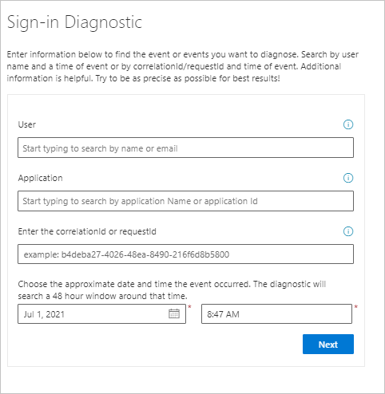
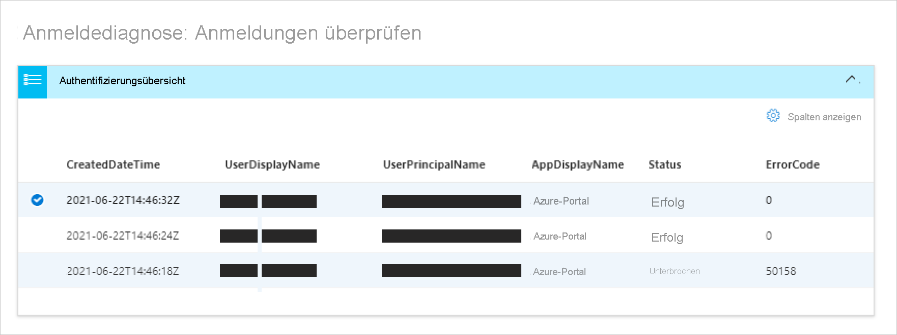
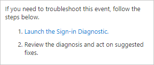

# Was ist die Anmeldediagnose für Azure AD?

Die Gründe für eine fehlgeschlagene Anmeldung zu ermitteln, kann zu einer großen Herausforderung werden. Sie müssen analysieren, was während des Anmeldeversuchs passiert ist, und anschließend die verfügbaren Empfehlungen untersuchen, um das Problem zu beheben. Im Idealfall können Sie das Problem beheben, ohne Dritte (z. B. den Microsoft-Support) hinzuzuziehen. In einer solchen Situation ist die Anmeldediagnose von Azure AD hilfreich. Hierbei handelt es sich um ein Tool, mit dem Sie Anmeldevorgänge in Azure AD überprüfen können. 

In diesem Artikel erhalten Sie eine Übersicht über die Anmeldediagnose und erfahren, wie Sie sie zur Problembehandlung von Anmeldefehlern verwenden können. 

## Funktionsweise  

Die Anmeldeversuche in Azure AD werden wie folgt gesteuert:

- **Wer:** Der Benutzer, der versucht sich anzumelden.
- **Wie:** Wie der Anmeldeversuch ausgeführt wurde.

Sie können z. B. Richtlinien für den bedingten Zugriff konfigurieren, die es Administratoren ermöglichen, alle Aspekte eines Mandanten zu konfigurieren, wenn sie sich über das Unternehmensnetzwerk anmelden. Derselbe Benutzer wird unter Umständen aber blockiert, wenn er sich bei demselben Konto über ein nicht vertrauenswürdiges Netzwerk anmeldet. 

Aufgrund der größeren Flexibilität des Systems, auf einen Anmeldeversuch zu reagieren, kann es zu Szenarien kommen, in denen Sie eine Problembehandlung für Anmeldungen durchführen müssen. Das Anmeldediagnose-Tool ermöglicht Ihnen eine Selbstdiagnose von Anmeldeproblemen, indem es:  

- Daten von Anmeldeereignissen analysiert.  

- Informationen darüber anzeigt, was passiert ist.  

- Empfehlungen zum Beheben von Problemen bereitstellt.  

Um den Diagnosevorgang zu starten und auszuführen, müssen Sie folgende Schritte befolgen:   

1. **Ereignis identifizieren:** Geben Sie Informationen über das Anmeldeereignis ein. 

2. **Ereignis auswählen:** Wählen Sie basierend auf den geteilten Informationen ein Ereignis aus. 

3. **Aktion ausführen:** Überprüfen Sie die Diagnoseergebnisse und führen Sie die empfohlenen Schritte aus.

### Ereignis identifizieren 

Um die richtigen Ereignisse zu identifizieren, können Sie diese auf Grundlage der folgenden Optionen filtern:

- Name des Benutzers
- Application 
- Korrelations-ID oder Anforderungs-ID 
- Datum und Uhrzeit

### Ereignis auswählen  

Anhand Ihrer Suchkriterien ruft Azure AD alle übereinstimmenden Anmeldeereignisse ab und zeigt sie in Listenform in einer Authentifizierungsübersicht an.  

Sie können den Spalteninhalt je nach Bedarf anpassen. Beispiele:

- Risikodetails
- Status des bedingten Zugriffs
- Standort
- Ressourcen-ID
- Benutzertyp
- Authentifizierungsdetails

### Ausführen einer Aktion

Für das ausgewählte Anmeldeereignis werden Ihnen Diagnoseergebnisse bereitgestellt. Lesen Sie sich die Ergebnisse durch, um Aktionen zu identifizieren, die Sie zum Beheben des Problems ergreifen können. In den Ergebnissen finden Sie weitere Informationen zu den nächsten Schritten sowie zu den zugehörigen Richtlinien, Anmeldedetails und der unterstützenden Dokumentation. Da es nicht immer möglich ist, Probleme ohne weitere Hilfe zu beheben, empfiehlt es sich, in einem weiteren Schritt ein Supportticket zu öffnen. 

## Zugreifen

Um das Diagnosetool verwenden zu können, müssen Sie beim Mandanten als globaler Administrator oder als globaler Leser angemeldet sein. Wenn Sie nicht über diese Zugriffsebene verfügen, nutzen Sie das [Privileged Identity Management (PIM)](../privileged-identity-management/pim-resource-roles-activate-your-roles.md), um sich innerhalb des Mandanten die Zugriffsrechte eines globalen Administrators/Lesers zu erteilen. Dadurch erhalten Sie temporären Zugriff auf das Diagnosetool.  

Mit der richtigen Zugriffsebene können Sie das Diagnosetool auf verschiedene Arten starten: 

**Option A**: Diagnose und Behandlung von Problemen 

1. Öffnen Sie **Azure Active Directory (AAD) oder den Bedingten Azure AD-Zugriff**. 

2. Klicken Sie im Hauptmenü auf **Diagnose & Lösen von Problemen**.  

3. Unter **Problembehandlung** befindet sich eine Kachel für die Anmeldediagnose. 

4. Klicken Sie auf die Schaltfläche **Problembehandlung**.  

 

 

**Option B**: Anmeldeereignisse 

1. Öffnen Sie Azure Active Directory. 

2. Wählen Sie im Hauptmenü im Abschnitt **Überwachung** die Option **Anmeldungen** aus. 

3. Wählen Sie aus der Anmeldungsliste eine Anmeldung mit dem Status **Fehler** aus. Sie können Ihre Liste nach Status filtern, um die Suche nach fehlerhaften Anmeldungen zu erleichtern. 

4. Für die ausgewählte Anmeldung wird die Registerkarte **Aktivitätsdetails: Anmeldungen** geöffnet. Klicken Sie auf das Symbol mit den Punkten, um weitere Menüsymbole anzeigen zu lassen. Wählen Sie die Registerkarte **Problembehandlung und Support** aus. 

5. Klicken Sie auf den Link, um die **Anmeldediagnose** zu starten. 

 

**Option C**: Supportanfrage 

Bei der Erstellung einer Supportanfrage besteht ebenfalls die Möglichkeit, das Diagnosetool aufzurufen. Auf diese Weise können Sie eine Selbstdiagnose durchführen, bevor Sie die Supportanfrage übermitteln. 

## Nächste Schritte

- [Anmeldediagnose für Azure AD-Szenarien](concept-sign-in-diagnostics-scenarios.md)
