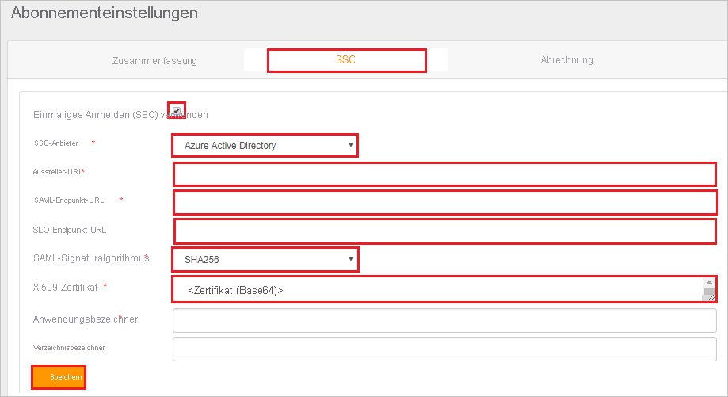
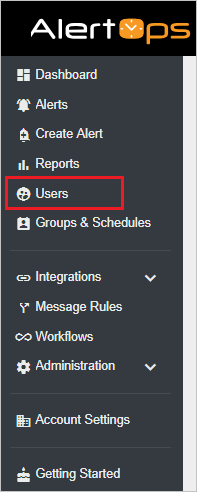
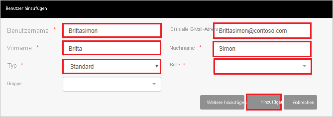

# Tutorial: Integrieren von AlertOps in Azure Active Directory

In diesem Tutorial erfahren Sie, wie Sie AlertOps in Azure Active Directory (Azure AD) integrieren. Bei der Integration von AlertOps in Azure AD haben Sie folgende Möglichkeiten:

* Steuern Sie in Azure AD, wer Zugriff auf AlertOps hat.
* Ermöglichen Sie Ihren Benutzern, sich mit ihren Azure AD-Konten automatisch bei AlertOps anzumelden.
* Verwalten Sie Ihre Konten zentral im Azure-Portal.

## Voraussetzungen

Für die ersten Schritte benötigen Sie Folgendes:

* Ein Azure AD-Abonnement Falls Sie über kein Abonnement verfügen, können Sie ein [kostenloses Azure-Konto](https://azure.microsoft.com/free/) verwenden.
* AlertOps-Abonnement, für das einmaliges Anmelden (SSO) aktiviert ist.

## Beschreibung des Szenarios

In diesem Tutorial konfigurieren und testen Sie das einmalige Anmelden von Azure AD in einer Testumgebung.

* AlertOps unterstützt **SP- und IDP**-initiiertes einmaliges Anmelden.

## Das Hinzufügen des AlertOps-Systems über den Katalog

Zum Konfigurieren der Integration von AlertOps in Azure AD müssen Sie AlertOps über den Katalog zur Liste mit den verwalteten SaaS-Apps hinzufügen.

1. Melden Sie sich mit einem Geschäfts-, Schul- oder Unikonto oder mit einem persönlichen Microsoft-Konto beim Azure-Portal an.
1. Wählen Sie im linken Navigationsbereich den Dienst **Azure Active Directory** aus.
1. Navigieren Sie zu **Unternehmensanwendungen**, und wählen Sie dann **Alle Anwendungen** aus.
1. Wählen Sie zum Hinzufügen einer neuen Anwendung **Neue Anwendung** aus.
1. Geben Sie im Abschnitt **Aus Katalog hinzufügen** den Suchbegriff **AlertOps** in das Suchfeld ein.
1. Wählen Sie **AlertOps** im Ergebnisbereich aus, und fügen Sie dann die App hinzu. Warten Sie einige Sekunden, während die App Ihrem Mandanten hinzugefügt wird.

## Konfigurieren und Testen Sie das einmaligen Anmelden von Azure AD für AlertOps

Konfigurieren und testen Sie das einmalige Anmelden von Azure AD bei AlertOps mithilfe eines Testbenutzers namens **B. Simon**. Damit einmaliges Anmelden funktioniert, muss eine Linkbeziehung zwischen einem Azure AD-Benutzer und dem entsprechenden Benutzer in AlertOps eingerichtet werden.

Führen Sie zum Konfigurieren und Testen des einmaligen Anmeldens von Azure AD bei AlertOps die folgenden Schritte aus:

1. **[Konfigurieren des einmaligen Anmeldens von Azure AD](#configure-azure-ad-sso)** , um Ihren Benutzern die Verwendung dieses Features zu ermöglichen.
    1. **[Erstellen eines Azure AD-Testbenutzers](#create-an-azure-ad-test-user)** , um das einmalige Anmelden von Azure AD mit dem Testbenutzer B. Simon zu testen.
    1. **[Zuweisen des Azure AD-Testbenutzers](#assign-the-azure-ad-test-user)** , um B. Simon die Verwendung des einmaligen Anmeldens von Azure AD zu ermöglichen.
1. **[Konfigurieren des einmaligen Anmeldens für AlertOps](#configure-alertops-sso)** , um die Einstellungen für einmaliges Anmelden auf der Anwendungsseite zu konfigurieren.
    1. **[Erstellen eines AlertOps-Testbenutzers](#create-alertops-test-user)** , um eine Entsprechung von B. Simon in AlertOps zu erhalten, die mit der Benutzerdarstellung in Azure AD verknüpft ist.
1. **[Testen des einmaligen Anmeldens](#test-sso)** , um zu überprüfen, ob die Konfiguration funktioniert

## Konfigurieren des einmaligen Anmeldens (Single Sign-On, SSO) von Azure AD

Gehen Sie wie folgt vor, um das einmalige Anmelden von Azure AD im Azure-Portal zu aktivieren.

1. Suchen Sie im Azure-Portal auf der **AlertOps** Anwendungsintegrationsseite den Abschnitt **Verwalten** und wählen Sie **Einmaliges Anmelden** aus.
1. Wählen Sie auf der Seite **SSO-Methode auswählen** die Methode **SAML** aus.
1. Klicken Sie auf der Seite **Einmaliges Anmelden (SSO) mit SAML einrichten** auf das Stiftsymbol für **Grundlegende SAML-Konfiguration**, um die Einstellungen zu bearbeiten.

   

1. Führen Sie im Abschnitt **Grundlegende SAML-Konfiguration** die folgenden Schritte aus, wenn Sie die Anwendung im **IDP-initiierten** Modus konfigurieren möchten:

    1. Geben Sie im Textfeld **Bezeichner** eine URL im folgenden Format ein: `https://<SUBDOMAIN>.alertops.com`

    1. Geben Sie im Textfeld **Antwort-URL** eine URL im folgenden Format ein: `https://<SUBDOMAIN>.alertops.com/login.aspx`

1. Klicken Sie auf **Zusätzliche URLs festlegen**, und führen Sie den folgenden Schritt aus, wenn Sie die Anwendung im **SP-initiierten Modus** konfigurieren möchten:

    Geben Sie im Textfeld **Anmelde-URL** eine URL im folgenden Format ein: `https://<SUBDOMAIN>.alertops.com/login.aspx`

    > [!NOTE]
    > Hierbei handelt es sich um Beispielwerte. Sie müssen diese Werte mit dem tatsächlichen Bezeichner, der Antwort-URL und der Anmelde-URL aktualisieren. Wenden Sie sich an das [Clientsupportteam von AlertOps](mailto:support@alertops.com), um diese Werte zu erhalten. Sie können sich auch die Muster im Abschnitt **Grundlegende SAML-Konfiguration** im Azure-Portal ansehen.

1. Suchen Sie auf der Seite **Einmaliges Anmelden (SSO) mit SAML einrichten** im Abschnitt **SAML-Signaturzertifikat** den Eintrag **Zertifikat (Base64)** . Klicken Sie auf **Herunterladen**, um das Zertifikat herunterzuladen, und speichern Sie es auf Ihrem Computer.

   

1. Kopieren Sie im Abschnitt **AlertOps einrichten** die entsprechenden URLs gemäß Ihren Anforderungen.

   

### Erstellen eines Azure AD-Testbenutzers

In diesem Abschnitt erstellen Sie im Azure-Portal eine Testbenutzerin mit dem Namen Britta Simon.

1. Wählen Sie im linken Bereich des Microsoft Azure-Portals **Azure Active Directory** > **Benutzer** > **Alle Benutzer** aus.
1. Wählen Sie oben im Bildschirm die Option **Neuer Benutzer** aus.
1. Führen Sie unter den Eigenschaften für **Benutzer** die folgenden Schritte aus:
   1. Geben Sie im Feld **Name** die Zeichenfolge `Britta Simon` ein.  
   1. Geben Sie im Feld **Benutzername** die Zeichenfolge username@companydomain.extension ein. Beispiel: `BrittaSimon@contoso.com`.
   1. Aktivieren Sie das Kontrollkästchen **Kennwort anzeigen**, und notieren Sie sich den Wert aus dem Feld **Kennwort**.
   1. Klicken Sie auf **Erstellen**.

### Zuweisen des Azure AD-Testbenutzers

In diesem Abschnitt ermöglichen Sie Britta Simon die Verwendung des einmaligen Anmeldens von Azure, indem Sie ihr Zugriff auf AlertOps gewähren.

1. Wählen Sie im Azure-Portal **Unternehmensanwendungen** > **Alle Anwendungen** aus.
1. Wählen Sie in der Anwendungsliste den Eintrag **AlertOps** aus.
1. Navigieren Sie auf der Übersichtsseite der App zum Abschnitt **Verwalten**, und wählen Sie **Benutzer und Gruppen** aus.
1. Wählen Sie **Benutzer hinzufügen** und anschließend im Dialogfeld **Zuweisung hinzufügen** die Option **Benutzer und Gruppen** aus.
1. Wählen Sie im Dialogfeld **Benutzer und Gruppen** in der Benutzerliste den Eintrag **Britta Simon** aus, und klicken Sie anschließend im unteren Bildschirmbereich auf die Schaltfläche **Auswählen**.
1. Wenn Sie einen beliebigen Rollenwert in der SAML-Assertion erwarten, wählen Sie im Dialogfeld **Rolle auswählen** die entsprechende Rolle für den Benutzer in der Liste aus, und klicken Sie dann im unteren Bildschirmbereich auf die Schaltfläche **Auswählen**.
1. Klicken Sie im Dialogfeld **Zuweisung hinzufügen** auf die Schaltfläche **Zuweisen**.

## Konfigurieren von SSO in AlertOps

1. Wenn Sie die Konfiguration in AlertOps automatisieren möchten, müssen Sie die **Browsererweiterung „Meine Apps“ für die sichere Anmeldung** installieren, indem Sie auf **Erweiterung installieren** klicken.

    

2. Klicken Sie nach dem Hinzufügen der Erweiterung zum Browser auf **AlertOps einrichten**, um zur Anwendung AlertOps weitergeleitet zu werden. Geben Sie dort die Administratoranmeldeinformationen ein, um sich bei AlertOps anzumelden. Die Browsererweiterung konfiguriert die Anwendung automatisch für Sie und automatisiert die Schritte 3 bis 5.

    

3. Wenn Sie AlertOps manuell einrichten möchten, öffnen Sie ein neues Webbrowserfenster, melden Sie sich bei der AlertOps-Unternehmenswebsite als Administrator an, und führen Sie die folgenden Schritte aus:

4. Klicken Sie im linken Navigationsbereich auf **Account settings** (Kontoeinstellungen).

    

5. Wählen Sie auf der Seite **Subscription Settings** (Abonnementeinstellungen) die Option **SSO** aus, und führen Sie die folgenden Schritte aus:

    

    a. Aktivieren Sie das Kontrollkästchen **Use Single Sign-On (SSO)** (Einmaliges Anmelden (SSO) verwenden).

    b. Wählen Sie als **SSO Provider** (SSO-Anbieter) in der Dropdownliste die Option **Azure Active Directory** aus.

    c. Verwenden Sie im Textfeld **Issuer URL** (Aussteller-URL) den Bezeichnerwert, den Sie im Azure-Portal im Abschnitt **Grundlegende SAML-Konfiguration** verwendet haben.

    d. Fügen Sie im Textfeld **SAML endpoint URL** (SAML-Endpunkt-URL) den Wert der **Anmelde-URL** ein, den Sie aus dem Azure-Portal kopiert haben.

    e. Fügen Sie im Textfeld **SLO endpoint URL** (SLO-Endpunkt-URL) den Wert der **Anmelde-URL** ein, den Sie aus dem Azure-Portal kopiert haben.

    f. Wählen Sie als **SAML-Signaturalgorithmus** in der Dropdownliste die Option **SHA256** aus.

    g. Öffnen Sie die heruntergeladene Zertifikatdatei (Base64) im Editor. Kopieren Sie den Inhalt in die Zwischenablage, und fügen Sie ihn in das Textfeld für das X.509-Zertifikat ein.

### Erstellen eines AlertOps-Testbenutzers

1. Melden Sie sich in einem anderen Browserfenster bei der AlertOps-Unternehmenswebsite als Administrator an.

2. Klicken Sie im linken Navigationsbereich auf **Users** (Benutzer).

    

3. Wählen Sie **Add User** (Benutzer hinzufügen) aus.

    

4. Führen Sie im Dialogfeld **Add User** die folgenden Schritte aus:

    

    a. Geben Sie im Textfeld **Login User Name** (Benutzername für die Anmeldung) den vollständigen Namen des Benutzers ein (beispielsweise **Brittasimon**).

    b. Geben Sie im Textfeld **Official Email** (Offizielle E-Mail-Adresse) die E-Mail-Adresse des Benutzers ein, z. B. **brittasimon\@contoso.com**.

    c. Geben Sie im Textfeld **Vorname** den Vornamen des Benutzers ein (beispielsweise **Britta**).

    d. Geben Sie im Textfeld **Last Name** (Nachname) den Nachnamen des Benutzers ein (beispielsweise **Simon**).

    e. Wählen Sie in der Dropdownliste **Type** (Typ) den passenden Wert für Ihre Organisation aus.

    f. Wählen Sie in der Dropdownliste **Role** (Rolle) die passende Benutzerrolle für Ihre Organisation aus.

    g. Wählen Sie **Hinzufügen**.

## Testen des einmaligen Anmeldens

In diesem Abschnitt testen Sie die Azure AD-Konfiguration für einmaliges Anmelden mit den folgenden Optionen: 

#### SP-initiiert:

* Klicken Sie im Azure-Portal auf **Diese Anwendung testen**. Dadurch werden Sie zur Anmelde-URL für AlertOps weitergeleitet, wo Sie den Anmeldeablauf initiieren können.  

* Rufen Sie direkt die Anmelde-URL für AlertOps auf, und initiieren Sie den Anmeldeablauf.

#### IDP-initiiert:

* Klicken Sie im Azure-Portal auf **Diese Anwendung testen**. Dadurch sollten Sie automatisch bei der AlertOps-Instanz angemeldet werden, für die Sie das einmalige Anmelden eingerichtet haben. 

Sie können auch den Microsoft-Bereich „Meine Apps“ verwenden, um die Anwendung in einem beliebigen Modus zu testen. Beim Klicken auf die Kachel „AlertOps“ in „Meine Apps“ geschieht Folgendes: Wenn Sie die Anwendung im SP-Modus konfiguriert haben, werden Sie zum Initiieren des Anmeldeablaufs zur Anmeldeseite der Anwendung weitergeleitet. Wenn Sie die Anwendung im IDP-Modus konfiguriert haben, sollten Sie automatisch bei der AlertOps-Instanz angemeldet werden, für die Sie das einmaliges Anmelden eingerichtet haben. Weitere Informationen zu „Meine Apps“ finden Sie in [dieser Einführung](https://support.microsoft.com/account-billing/sign-in-and-start-apps-from-the-my-apps-portal-2f3b1bae-0e5a-4a86-a33e-876fbd2a4510).

## Nächste Schritte

Nach dem Konfigurieren von AlertOps können Sie die Sitzungssteuerung erzwingen, die Ihre vertraulichen Unternehmensdaten in Echtzeit vor der Exfiltration und Infiltration schützt. Die Sitzungssteuerung basiert auf bedingtem Zugriff. [Hier](/cloud-app-security/proxy-deployment-aad) erfahren Sie, wie Sie die Sitzungssteuerung mit Microsoft Cloud App Security erzwingen.