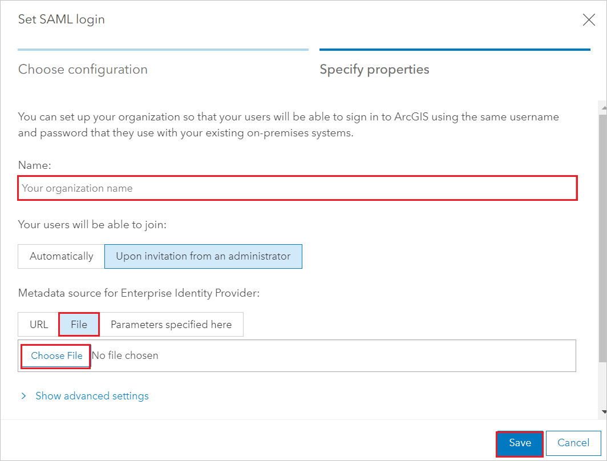
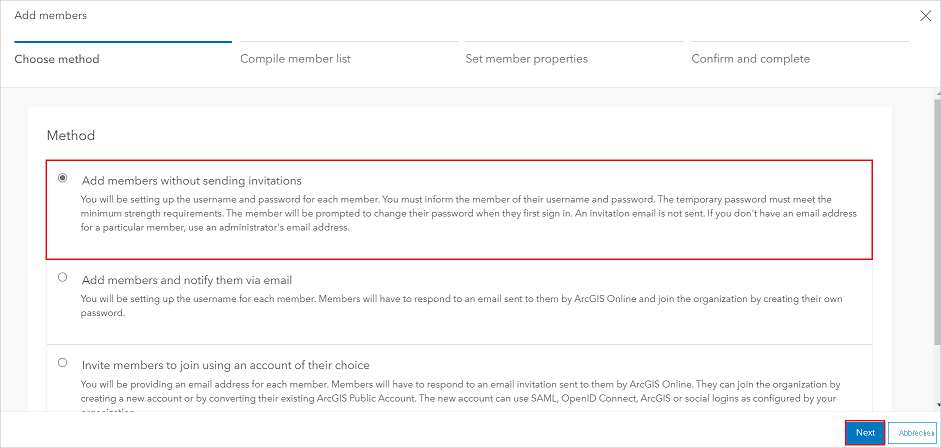

# Tutorial: Azure Active Directory-Integration in ArcGIS Online

In diesem Tutorial erfahren Sie, wie Sie Azure Active Directory (Azure AD) in ArcGIS Online integrieren. Die Integration von ArcGIS Online in Azure AD ermöglicht Folgendes:

* Steuern Sie in Azure AD, wer Zugriff auf ArcGIS Online hat.
* Ermöglichen Sie es Ihren Benutzern, sich mit ihren Azure AD-Konten automatisch bei ArcGIS Online anzumelden.
* Verwalten Sie Ihre Konten zentral im Azure-Portal.

## Voraussetzungen

Für die ersten Schritte benötigen Sie Folgendes:

* Ein Azure AD-Abonnement Falls Sie über kein Abonnement verfügen, können Sie ein [kostenloses Azure-Konto](https://azure.microsoft.com/free/) verwenden.
* Ein ArcGIS Online-Abonnement, für das einmaliges Anmelden (Single Sign-On, SSO) aktiviert ist

> [!NOTE]
> Diese Integration kann auch über die Azure AD-Umgebung für die US Government-Cloud verwendet werden. Sie finden diese Anwendung im Azure AD-Katalog für US Government-Cloudanwendungen und konfigurieren sie auf die gleiche Weise wie in der öffentlichen Cloud.

## Beschreibung des Szenarios

In diesem Tutorial konfigurieren und testen Sie das einmalige Anmelden von Azure AD in einer Testumgebung.

* ArcGIS Online unterstützt **SP**-initiiertes einmaliges Anmelden.

## Hinzufügen von ArcGIS Online aus dem Katalog

Zum Konfigurieren der Integration von Azure AD in ArcGIS Online müssen Sie Ihrer Liste der verwalteten SaaS-Apps ArcGIS Online aus dem Katalog hinzufügen.

1. Melden Sie sich mit einem Geschäfts-, Schul- oder Unikonto oder mit einem persönlichen Microsoft-Konto beim Azure-Portal an.
1. Wählen Sie im linken Navigationsbereich den Dienst **Azure Active Directory** aus.
1. Navigieren Sie zu **Unternehmensanwendungen**, und wählen Sie dann **Alle Anwendungen** aus.
1. Wählen Sie zum Hinzufügen einer neuen Anwendung **Neue Anwendung** aus.
1. Geben Sie im Abschnitt **Aus Katalog hinzufügen** den Suchbegriff **ArcGIS Online** in das Suchfeld ein.
1. Wählen Sie im Ergebnisbereich **ArcGIS Online** aus, und fügen Sie dann die App hinzu. Warten Sie einige Sekunden, während die App Ihrem Mandanten hinzugefügt wird.

## Konfigurieren und Testen des einmaligen Anmeldens von Azure AD für ArcGIS Online

Konfigurieren und testen Sie das einmalige Anmelden von Azure AD mit ArcGIS Online mithilfe eines Testbenutzers mit dem Namen **B. Simon**. Damit einmaliges Anmelden funktioniert, muss eine Linkbeziehung zwischen einem Azure AD-Benutzer und dem entsprechenden Benutzer in ArcGIS Online eingerichtet werden.

Führen Sie zum Konfigurieren und Testen des einmaligen Anmeldens von Azure AD mit ArcGIS Online die folgenden Schritte aus:

1. **[Konfigurieren des einmaligen Anmeldens von Azure AD](#configure-azure-ad-sso)** , um Ihren Benutzern die Verwendung dieses Features zu ermöglichen.
    1. **[Erstellen eines Azure AD-Testbenutzers](#create-an-azure-ad-test-user)** , um das einmalige Anmelden von Azure AD mit dem Testbenutzer B. Simon zu testen.
    1. **[Zuweisen des Azure AD-Testbenutzers](#assign-the-azure-ad-test-user)** , um B. Simon die Verwendung des einmaligen Anmeldens von Azure AD zu ermöglichen.
1. **[Konfigurieren des einmaligen Anmeldens für ArcGIS Online](#configure-arcgis-online-sso)** , um die Einstellungen für einmaliges Anmelden auf der Anwendungsseite zu konfigurieren
    1. **[Erstellen eines ArcGIS Online-Testbenutzers](#create-arcgis-online-test-user)** , um eine Entsprechung von B. Simon in ArcGIS Online zu erhalten, die mit ihrer Darstellung in Azure AD verknüpft ist
1. **[Testen des einmaligen Anmeldens](#test-sso)** , um zu überprüfen, ob die Konfiguration funktioniert

## Konfigurieren des einmaligen Anmeldens (Single Sign-On, SSO) von Azure AD

Gehen Sie wie folgt vor, um das einmalige Anmelden von Azure AD im Azure-Portal zu aktivieren.

1. Navigieren Sie im Azure-Portal auf der Anwendungsintegrationsseite für **ArcGIS Online** zum Abschnitt **Verwalten**, und wählen Sie **Einmaliges Anmelden** aus.
1. Wählen Sie auf der Seite **SSO-Methode auswählen** die Methode **SAML** aus.
1. Klicken Sie auf der Seite **Einmaliges Anmelden (SSO) mit SAML einrichten** auf das Stiftsymbol für **Grundlegende SAML-Konfiguration**, um die Einstellungen zu bearbeiten.

   

4. Führen Sie im Abschnitt **Grundlegende SAML-Konfiguration** die folgenden Schritte aus:

    a. Geben Sie im Textfeld **Anmelde-URL** eine URL im folgenden Format ein: `https://<companyname>.maps.arcgis.com`.

    b. Geben Sie im Textfeld **Bezeichner (Entitäts-ID)** eine URL im folgenden Format ein: `<companyname>.maps.arcgis.com`.

    > [!NOTE]
    > Hierbei handelt es sich um Beispielwerte. Ersetzen Sie diese Werte durch die tatsächliche Anmelde-URL und den tatsächlichen Bezeichner. Wenden Sie sich an das [Supportteam für den ArcGIS Online-Client](https://support.esri.com/en/), um diese Werte zu erhalten. Sie können sich auch die Muster im Abschnitt **Grundlegende SAML-Konfiguration** im Azure-Portal ansehen.

5. Klicken Sie auf der Seite **Einmaliges Anmelden (SSO) mit SAML einrichten** im Abschnitt **SAML-Signaturzertifikat** auf **Herunterladen**, um den Ihren Anforderungen entsprechenden **Verbundmetadaten-XML**-Code aus den verfügbaren Optionen herunterzuladen und auf Ihrem Computer zu speichern.

    

6. Wenn Sie die Konfiguration in **ArcGIS Online** automatisieren möchten, müssen Sie die **Browsererweiterung „Meine Apps“ für die sichere Anmeldung** installieren, indem Sie auf **Erweiterung installieren** klicken.

    

7. Klicken Sie nach dem Hinzufügen der Erweiterung zum Browser auf **ArcGIS Online einrichten**, um zur Anwendung ArcGIS Online weitergeleitet zu werden. Geben Sie dort die Administratoranmeldeinformationen ein, um sich bei ArcGIS Online anzumelden. Die Browsererweiterung führt die Konfiguration der Anwendung automatisch für Sie durch und automatisiert die Schritte im Abschnitt **Konfigurieren des einmaligen Anmeldens für ArcGIS Online**.

### Erstellen eines Azure AD-Testbenutzers 

In diesem Abschnitt erstellen Sie im Azure-Portal einen Testbenutzer mit dem Namen B. Simon.

1. Wählen Sie im linken Bereich des Microsoft Azure-Portals **Azure Active Directory** > **Benutzer** > **Alle Benutzer** aus.
1. Wählen Sie oben im Bildschirm die Option **Neuer Benutzer** aus.
1. Führen Sie unter den Eigenschaften für **Benutzer** die folgenden Schritte aus:
   1. Geben Sie im Feld **Name** die Zeichenfolge `B.Simon` ein.  
   1. Geben Sie im Feld **Benutzername** die Zeichenfolge username@companydomain.extension ein. Beispiel: `B.Simon@contoso.com`.
   1. Aktivieren Sie das Kontrollkästchen **Kennwort anzeigen**, und notieren Sie sich den Wert aus dem Feld **Kennwort**.
   1. Klicken Sie auf **Erstellen**.

### Zuweisen des Azure AD-Testbenutzers

In diesem Abschnitt ermöglichen Sie B. Simon die Verwendung des einmaligen Anmeldens von Azure, indem Sie ihr Zugriff auf ArcGIS Online gewähren.

1. Wählen Sie im Azure-Portal **Unternehmensanwendungen** > **Alle Anwendungen** aus.
1. Wählen Sie in der Anwendungsliste **ArcGIS Online** aus.
1. Navigieren Sie auf der Übersichtsseite der App zum Abschnitt **Verwalten**, und wählen Sie **Benutzer und Gruppen** aus.
1. Wählen Sie **Benutzer hinzufügen** und anschließend im Dialogfeld **Zuweisung hinzufügen** die Option **Benutzer und Gruppen** aus.
1. Wählen Sie im Dialogfeld **Benutzer und Gruppen** in der Liste „Benutzer“ den Eintrag **B. Simon** aus, und klicken Sie dann unten auf dem Bildschirm auf die Schaltfläche **Auswählen**.
1. Wenn den Benutzern eine Rolle zugewiesen werden soll, können Sie sie im Dropdownmenü **Rolle auswählen** auswählen. Wurde für diese App keine Rolle eingerichtet, ist die Rolle „Standardzugriff“ ausgewählt.
1. Klicken Sie im Dialogfeld **Zuweisung hinzufügen** auf die Schaltfläche **Zuweisen**.

## Konfigurieren des einmaligen Anmeldens für ArcGIS Online

1. Wenn Sie ArcGIS Online manuell einrichten möchten, öffnen Sie ein neues Webbrowserfenster, melden Sie sich bei der ArcGIS-Unternehmenswebsite als Administrator an, und führen Sie die folgenden Schritte aus:

2. Gehen Sie zu **Organization** -> **Settings** (Organisation > Einstellungen). 

    

3. Klicken Sie im linken Menü auf **Security** (Sicherheit) und wählen Sie auf der Registerkarte „Logins“ (Anmeldungen) die Option **New SAML login** (Neue SAML-Anmeldung) aus.

    

4. Wählen Sie im Fenster **Set SAML login** (SAML-Anmeldung festlegen) die Konfiguration **One identity provider** (Ein Identitätsanbieter) aus, und klicken Sie auf **Next** (Weiter).

    

5. Führen Sie auf der Registerkarte **Specify properties** (Eigenschaften festlegen) folgende Schritte aus:

    

    a. Geben Sie in das Textfeld **Name** den Namen Ihrer Organisation ein.

    b. Wählen Sie für **Metadata source for Enterprise Identity Provider** (Metadatenquelle für Unternehmensidentitätsanbieter) die Option **File** (Datei) aus.

    c. Klicken Sie auf **Choose file** (Datei auswählen), um die **Federation Metadata XML**-Datei (XML-Datei mit den Verbundmetadaten) hochzuladen, die Sie aus dem Azure-Portal heruntergeladen haben.

    d. Klicken Sie auf **Speichern**.

### Erstellen eines ArcGIS Online-Testbenutzers

Damit sich Azure AD-Benutzer bei ArcGIS Online anmelden können, müssen sie in ArcGIS Online bereitgestellt werden.  
Im Fall von ArcGIS Online ist die Bereitstellung eine manuelle Aufgabe.

**Führen Sie zum Bereitstellen eines Benutzerkontos die folgenden Schritte aus:**

1. Melden Sie sich bei Ihrem **ArcGIS** -Mandanten an.

2. Wechseln Sie zu **Organization** -> **Members** (Organisation > Mitglieder), und klicken Sie auf **Invite members** (Mitglieder einladen).

    

3. Wählen Sie die Methode **Add members without sending invitations** (Mitglieder ohne Einladungsmethode hinzufügen) aus, und klicken Sie dann auf **Next** (Weiter).

    

1. Wählen Sie unter **Compile member list** (Mitgliederliste zusammenstellen) die Option **New member** (Neues Mitglied) aus, und klicken Sie auf **Next** (Weiter).

4. Füllen Sie auf der folgenden Seite die erforderlichen Felder aus, und klicken Sie auf **Next** (Weiter).

    

5. Wählen Sie auf der nächsten Seite das Mitglied aus, das Sie hinzufügen möchten, und klicken Sie auf **Next** (Weiter). 

1. Legen Sie die erforderlichen Mitgliedereigenschaften auf der nächsten Seite fest, und klicken Sie auf **Next** (Weiter).

1. Klicken Sie auf der Registerkarte **Confirm and complete** (Bestätigen und Abschließen) auf **Add members** (Mitglieder hinzufügen).

    

    > [!NOTE]
    > Der Besitzer des Azure Active Directory-Kontos erhält eine E-Mail und folgt einem Link zur Bestätigung des Kontos, bevor es aktiv wird.

## Testen des einmaligen Anmeldens

In diesem Abschnitt testen Sie die Azure AD-Konfiguration für einmaliges Anmelden mit den folgenden Optionen: 

* Klicken Sie im Azure-Portal auf **Diese Anwendung testen**. Dadurch werden Sie zur Anmelde-URL für ArcGIS Online weitergeleitet, wo Sie den Anmeldeflow initiieren können. 

* Rufen Sie direkt die ArcGIS Online-Anmelde-URL auf, und initiieren Sie den Anmeldeflow.

* Sie können „Meine Apps“ von Microsoft verwenden. Wenn Sie in „Meine Apps“ auf die Kachel „ArcGIS Online“ klicken, werden Sie zur Anmelde-URL von ArcGIS Online weitergeleitet. Weitere Informationen zu „Meine Apps“ finden Sie in [dieser Einführung](https://support.microsoft.com/account-billing/sign-in-and-start-apps-from-the-my-apps-portal-2f3b1bae-0e5a-4a86-a33e-876fbd2a4510).

## Nächste Schritte

Nach dem Konfigurieren von ArcGIS Online können Sie die Sitzungssteuerung erzwingen, die in Echtzeit vor der Exfiltration und Infiltration vertraulicher Unternehmensdaten schützt. Die Sitzungssteuerung basiert auf bedingtem Zugriff. [Hier](/cloud-app-security/proxy-deployment-any-app) erfahren Sie, wie Sie die Sitzungssteuerung mit Microsoft Cloud App Security erzwingen.