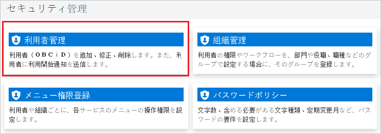
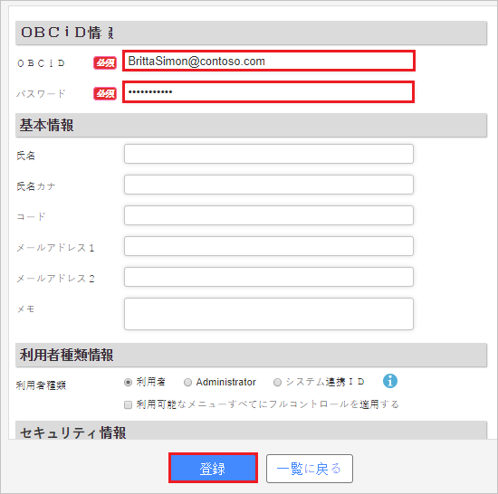

# Tutorial: Azure Active Directory-Integration mit Attendance Management Services

In diesem Tutorial erfahren Sie, wie Sie Attendance Management Services mit Azure Active Directory (Azure AD) integrieren. Wenn Sie Attendance Management Services mit Azure AD integrieren, haben Sie die folgenden Möglichkeiten:

* Sie können in Azure AD steuern, wer auf Attendance Management Services Zugriff hat.
* Sie können es Benutzern ermöglichen, sich mit ihren Azure AD-Konten automatisch bei Attendance Management Services anzumelden (Single Sign-On, SSO, einmaliges Anmelden).
* Verwalten Sie Ihre Konten zentral im Azure-Portal.

## Voraussetzungen

Um die Azure AD-Integration mit Attendance Management Services konfigurieren zu können, benötigen Sie Folgendes:

* Ein Azure AD-Abonnement Sollten Sie nicht über eine Azure AD-Umgebung verfügen, können Sie ein [kostenloses Konto](https://azure.microsoft.com/free/) verwenden.
* Ein Attendance Management Services-Abonnement, für das einmaliges Anmelden aktiviert ist

## Beschreibung des Szenarios

In diesem Tutorial konfigurieren und testen Sie das einmalige Anmelden von Azure AD in einer Testumgebung.

* Attendance Management Services unterstützt **SP-initiiertes** einmaliges Anmelden

## Hinzufügen von Attendance Management Services aus dem Katalog

Zum Konfigurieren der Integration von Attendance Management Services in Azure AD müssen Sie Attendance Management Services aus dem Katalog der Liste mit den verwalteten SaaS-Apps hinzufügen.

1. Melden Sie sich mit einem Geschäfts-, Schul- oder Unikonto oder mit einem persönlichen Microsoft-Konto beim Azure-Portal an.
1. Wählen Sie im linken Navigationsbereich den Dienst **Azure Active Directory** aus.
1. Navigieren Sie zu **Unternehmensanwendungen**, und wählen Sie dann **Alle Anwendungen** aus.
1. Wählen Sie zum Hinzufügen einer neuen Anwendung **Neue Anwendung** aus.
1. Geben Sie im Abschnitt **Aus Katalog hinzufügen** den Suchbegriff **Attendance Management Services** in das Suchfeld ein.
1. Wählen Sie aus dem Ergebnisbereich **Attendance Management Services** aus, und fügen Sie die App anschließend hinzu. Warten Sie einige Sekunden, während die App Ihrem Mandanten hinzugefügt wird.

## Konfigurieren und Testen des einmaligen Anmeldens von Azure AD für Attendance Management Services

Konfigurieren und testen Sie das einmalige Anmelden von Azure AD bei Attendance Management Services mithilfe eines Testbenutzers mit dem Namen **B. Simon**. Damit einmaliges Anmelden funktioniert, muss eine Verknüpfung zwischen einem Azure AD-Benutzer und dem entsprechenden Benutzer in Attendance Management Services eingerichtet werden.

Führen Sie die folgenden Schritte aus, um das einmalige Anmelden von Azure AD bei Attendance Management Services zu konfigurieren und zu testen:

1. **[Konfigurieren des einmaligen Anmeldens von Azure AD](#configure-azure-ad-sso)** , um Ihren Benutzern die Verwendung dieses Features zu ermöglichen.
    1. **[Erstellen eines Azure AD-Testbenutzers](#create-an-azure-ad-test-user)** , um das einmalige Anmelden von Azure AD mit dem Testbenutzer B. Simon zu testen.
    1. **[Zuweisen des Azure AD-Testbenutzers](#assign-the-azure-ad-test-user)** , um B. Simon die Verwendung des einmaligen Anmeldens von Azure AD zu ermöglichen.
1. **[Konfigurieren des einmaligen Anmeldens für Attendance Management Services](#configure-attendance-management-services-sso)** , um die Einstellungen für einmaliges Anmelden auf der Anwendungsseite zu konfigurieren
    1. **[Erstellen eines Attendance Management Services-Testbenutzers](#create-attendance-management-services-test-user)** , um eine Entsprechung von B. Simon in Attendance Management Services zu erhalten, die mit der Darstellung in Azure AD verknüpft ist.
1. **[Testen des einmaligen Anmeldens](#test-sso)** , um zu überprüfen, ob die Konfiguration funktioniert

## Konfigurieren des einmaligen Anmeldens (Single Sign-On, SSO) von Azure AD

Gehen Sie wie folgt vor, um das einmalige Anmelden von Azure AD im Azure-Portal zu aktivieren.

1. Navigieren Sie im Azure-Portal auf der Anwendungsintegrationsseite für **Attendance Management Services** zum Abschnitt **Verwalten**, und wählen Sie **Einmaliges Anmelden** aus.
1. Wählen Sie auf der Seite **SSO-Methode auswählen** die Methode **SAML** aus.
1. Klicken Sie auf der Seite **Einmaliges Anmelden (SSO) mit SAML einrichten** auf das Stiftsymbol für **Grundlegende SAML-Konfiguration**, um die Einstellungen zu bearbeiten.

   

4. Führen Sie im Abschnitt **Grundlegende SAML-Konfiguration** die folgenden Schritte aus:

    a. Geben Sie im Textfeld **Bezeichner (Entitäts-ID)** eine URL im folgenden Format ein: `https://id.obc.jp/<TENANT_INFORMATION>/`.

    b. Geben Sie im Textfeld **Anmelde-URL** eine URL im folgenden Format ein: `https://id.obc.jp/<TENANT_INFORMATION>/`.

    > [!NOTE]
    > Hierbei handelt es sich um Beispielwerte. Ersetzen Sie diese Werte durch den tatsächlichen Bezeichner und die tatsächliche Anmelde-URL. Wenden Sie sich an das [Supportteam von Attendance Management Services](https://www.obcnet.jp/), um diese Werte zu erhalten. Sie können sich auch die Muster im Abschnitt **Grundlegende SAML-Konfiguration** im Azure-Portal ansehen.

5. Klicken Sie auf der Seite **Einmaliges Anmelden (SSO) mit SAML einrichten** im Abschnitt **SAML-Signaturzertifikat** auf **Herunterladen**, um das Ihrer Anforderung entsprechende **Zertifikat (Base64)** aus den angegebenen Optionen herunterzuladen und auf Ihrem Computer zu speichern.

    

6. Kopieren Sie im Abschnitt **Attendance Management Services einrichten** die entsprechenden URLs gemäß Ihren Anforderungen.

    

### Erstellen eines Azure AD-Testbenutzers

In diesem Abschnitt erstellen Sie im Azure-Portal einen Testbenutzer mit dem Namen B. Simon.

1. Wählen Sie im linken Bereich des Microsoft Azure-Portals **Azure Active Directory** > **Benutzer** > **Alle Benutzer** aus.
1. Wählen Sie oben im Bildschirm die Option **Neuer Benutzer** aus.
1. Führen Sie unter den Eigenschaften für **Benutzer** die folgenden Schritte aus:
   1. Geben Sie im Feld **Name** die Zeichenfolge `B.Simon` ein.  
   1. Geben Sie im Feld **Benutzername** die Zeichenfolge username@companydomain.extension ein. Beispiel: `B.Simon@contoso.com`.
   1. Aktivieren Sie das Kontrollkästchen **Kennwort anzeigen**, und notieren Sie sich den Wert aus dem Feld **Kennwort**.
   1. Klicken Sie auf **Erstellen**.

### Zuweisen des Azure AD-Testbenutzers

In diesem Abschnitt ermöglichen Sie B. Simon die Verwendung des einmaligen Anmeldens von Azure, indem Sie Zugriff auf Attendance Management Services gewähren.

1. Wählen Sie im Azure-Portal **Unternehmensanwendungen** > **Alle Anwendungen** aus.
1. Wählen Sie in der Liste der Anwendungen **Attendance Management Services** aus.
1. Navigieren Sie auf der Übersichtsseite der App zum Abschnitt **Verwalten**, und wählen Sie **Benutzer und Gruppen** aus.
1. Wählen Sie **Benutzer hinzufügen** und anschließend im Dialogfeld **Zuweisung hinzufügen** die Option **Benutzer und Gruppen** aus.
1. Wählen Sie im Dialogfeld **Benutzer und Gruppen** in der Liste „Benutzer“ den Eintrag **B. Simon** aus, und klicken Sie dann unten auf dem Bildschirm auf die Schaltfläche **Auswählen**.
1. Wenn den Benutzern eine Rolle zugewiesen werden soll, können Sie sie im Dropdownmenü **Rolle auswählen** auswählen. Wurde für diese App keine Rolle eingerichtet, ist die Rolle „Standardzugriff“ ausgewählt.
1. Klicken Sie im Dialogfeld **Zuweisung hinzufügen** auf die Schaltfläche **Zuweisen**.

## Konfigurieren des einmaligen Anmeldens für Attendance Management Services

1. Melden Sie sich in einem anderen Browserfenster bei der Unternehmenswebsite von Attendance Management Services als Administrator an.

1. Klicken Sie auf **SAML-Authentifizierung** unter dem Abschnitt **Sicherheitsverwaltung**.

    

1. Führen Sie die folgenden Schritte aus:

    

    a. Wählen Sie **SAML-Authentifizierung verwenden** aus.

    b. Fügen Sie im Textfeld **Identifier** (Bezeichner) den Wert von **Azure AD-Bezeichner** ein, den Sie aus dem Azure-Portal kopiert haben.

    c. Fügen Sie im Textfeld **Authentication endpoint URL** (Authentifizierungsendpunkt-URL) den Wert der **Anmelde-URL** ein, den Sie aus dem Azure-Portal kopiert haben.

    d. Klicken Sie auf die Schaltfläche **Select a file** (Datei auswählen), um das aus Azure AD heruntergeladene Zertifikat hochzuladen.

    e. Wählen Sie **Disable password authentication** (Kennwortauthentifizierung deaktivieren) aus.

    f. Klicken Sie auf **Registrierung**.

### Erstellen eines Attendance Management Services-Testbenutzers

Um Azure AD-Benutzern die Anmeldung bei Attendance Management Services zu ermöglichen, müssen sie in Attendance Management Services bereitgestellt werden. Bei Attendance Management Services erfolgt die Bereitstellung manuell.

**Führen Sie zum Bereitstellen eines Benutzerkontos die folgenden Schritte aus:**

1. Melden Sie sich bei der Unternehmenswebsite von Attendance Management Services als Administrator an.

1. Klicken Sie auf **Benutzerverwaltung** unter dem Abschnitt **Sicherheitsverwaltung**.

    

1. Klicken Sie auf **New rules login** (Neue Regelanmeldung).

    

1. Führen Sie im Abschnitt **OBCiD information** (OBCiD-Informationen) die folgenden Schritte aus:

    

    a. Geben Sie im Textfeld **OBCiD** die E-Mail-Adresse des Benutzers ein, z. B. `BrittaSimon@contoso.com`.

    b. Geben Sie im Textfeld **Kennwort** das Kennwort des Benutzers ein.

    c. Klicken Sie auf **Registrierung**.

## Testen des einmaligen Anmeldens

In diesem Abschnitt testen Sie die Azure AD-Konfiguration für einmaliges Anmelden mit den folgenden Optionen: 

* Klicken Sie im Azure-Portal auf **Diese Anwendung testen**. Dadurch werden Sie zur Anmelde-URL für Attendance Management Services umgeleitet, wo Sie den Anmeldeflow initiieren können. 

* Rufen Sie direkt die Anmelde-URL für Attendance Management Services auf, und initiieren Sie den Anmeldeflow.

* Sie können „Meine Apps“ von Microsoft verwenden. Wenn Sie im Bereich „Meine Apps“ auf die Kachel „Attendance Management Services“ klicken, werden Sie zur Anmelde-URL für Attendance Management Services weitergeleitet. Weitere Informationen zu „Meine Apps“ finden Sie in [dieser Einführung](../user-help/my-apps-portal-end-user-access.md).

## Nächste Schritte

Nach dem Konfigurieren von Attendance Management Services können Sie die Sitzungssteuerung erzwingen, die in Echtzeit vor der Exfiltration und Infiltration vertraulicher Unternehmensdaten schützt. Die Sitzungssteuerung basiert auf bedingtem Zugriff. [Hier](/cloud-app-security/proxy-deployment-aad) erfahren Sie, wie Sie die Sitzungssteuerung mit Microsoft Cloud App Security erzwingen.
