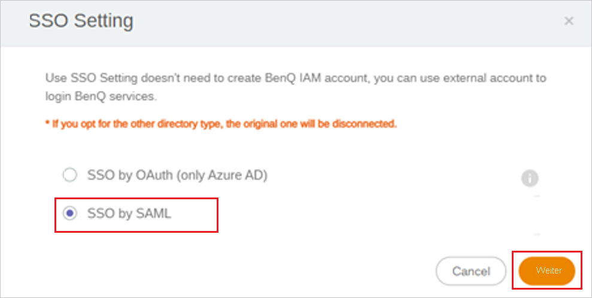
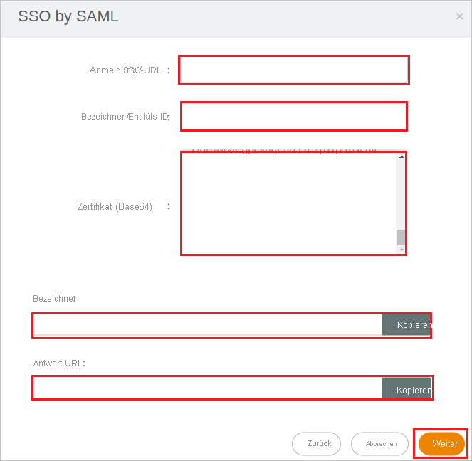

# Tutorial: Integration des einmaligen Anmeldens (Single Sign-On, SSO) von Azure AD mit BenQ IAM

In diesem Tutorial erfahren Sie, wie Sie BenQ IAM in Azure Active Directory (Azure AD) integrieren. Die Integration von BenQ IAM in Azure AD ermöglicht Folgendes:

* Steuern Sie in Azure AD, wer Zugriff auf BenQ IAM besitzt.
* Ermöglichen Sie Ihren Benutzern, sich mit ihren Azure AD-Konten automatisch bei BenQ IAM anzumelden.
* Verwalten Sie Ihre Konten zentral im Azure-Portal.

## Voraussetzungen

Für die ersten Schritte benötigen Sie Folgendes:

* Ein Azure AD-Abonnement Falls Sie über kein Abonnement verfügen, können Sie ein [kostenloses Azure-Konto](https://azure.microsoft.com/free/) verwenden.
* BenQ IAM-Abonnement, für das einmaliges Anmelden (Single Sign-On, SSO) aktiviert ist.

## Beschreibung des Szenarios

In diesem Tutorial konfigurieren und testen Sie das einmalige Anmelden von Azure AD in einer Testumgebung.

* BenQ IAM unterstützt **SP- und IDP-initiiertes** einmaliges Anmelden.

## Hinzufügen von BenQ IAM aus dem Katalog

Zum Konfigurieren der Integration von BenQ IAM in Azure AD müssen Sie BenQ IAM aus dem Katalog zur Liste der verwalteten SaaS-Apps hinzufügen.

1. Melden Sie sich mit einem Geschäfts-, Schul- oder Unikonto oder mit einem persönlichen Microsoft-Konto beim Azure-Portal an.
1. Wählen Sie im linken Navigationsbereich den Dienst **Azure Active Directory** aus.
1. Navigieren Sie zu **Unternehmensanwendungen**, und wählen Sie dann **Alle Anwendungen** aus.
1. Wählen Sie zum Hinzufügen einer neuen Anwendung **Neue Anwendung** aus.
1. Geben Sie im Abschnitt **Aus Katalog hinzufügen** den Suchbegriff **BenQ IAM** in das Suchfeld ein.
1. Wählen Sie im Ergebnisbereich **BenQ IAM** aus, und fügen Sie dann die App hinzu. Warten Sie einige Sekunden, während die App Ihrem Mandanten hinzugefügt wird.

## Konfigurieren und Testen des einmaligen Anmeldens von Azure AD für BenQ IAM

Konfigurieren und testen Sie das einmalige Anmelden von Azure AD mit BenQ IAM mithilfe eines Testbenutzers mit dem Namen **B. Simon**. Damit einmaliges Anmelden funktioniert, muss eine Linkbeziehung zwischen einem Azure AD-Benutzer und dem entsprechenden Benutzer in BenQ IAM eingerichtet werden.

Führen Sie die folgenden Schritte aus, um das einmalige Anmelden von Azure AD mit BenQ IAM zu konfigurieren und zu testen:

1. **[Konfigurieren des einmaligen Anmeldens von Azure AD](#configure-azure-ad-sso)** , um Ihren Benutzern die Verwendung dieses Features zu ermöglichen.
    1. **[Erstellen eines Azure AD-Testbenutzers](#create-an-azure-ad-test-user)** , um das einmalige Anmelden von Azure AD mit dem Testbenutzer B. Simon zu testen.
    1. **[Zuweisen des Azure AD-Testbenutzers](#assign-the-azure-ad-test-user)** , um B. Simon die Verwendung des einmaligen Anmeldens von Azure AD zu ermöglichen.
1. **[Konfigurieren des einmaligen Anmeldens für BenQ IAM](#configure-benq-iam-sso)** , um die Einstellungen für einmaliges Anmelden auf der Anwendungsseite zu konfigurieren.
    1. **[Erstellen eines BenQ IAM-Testbenutzers](#create-benq-iam-test-user)** , um in BenQ IAM eine Entsprechung von B. Simon zu erhalten, die mit der Benutzerdarstellung in Azure AD verknüpft ist.
1. **[Testen des einmaligen Anmeldens](#test-sso)** , um zu überprüfen, ob die Konfiguration funktioniert

## Konfigurieren des einmaligen Anmeldens (Single Sign-On, SSO) von Azure AD

Gehen Sie wie folgt vor, um das einmalige Anmelden von Azure AD im Azure-Portal zu aktivieren.

1. Navigieren Sie im Azure-Portal auf der Anwendungsintegrationsseite für **BenQ IAM** zum Abschnitt **Verwalten**, und wählen Sie **Einmaliges Anmelden** aus.
1. Wählen Sie auf der Seite **SSO-Methode auswählen** die Methode **SAML** aus.
1. Klicken Sie auf der Seite **Einmaliges Anmelden (SSO) mit SAML einrichten** auf das Stiftsymbol für **Grundlegende SAML-Konfiguration**, um die Einstellungen zu bearbeiten.

   

1. Führen Sie im Abschnitt **Grundlegende SAML-Konfiguration** die folgenden Schritte aus, wenn Sie die Anwendung im **IDP-initiierten** Modus konfigurieren möchten:

    a. Geben Sie im Textfeld **Bezeichner** eine URL im folgenden Format ein: `https://service-portal.benq.com/saml/init/<ID>`

    b. Geben Sie im Textfeld **Antwort-URL** eine URL im folgenden Format ein: `https://service-portal.benq.com/saml/consume/<ID>`

1. Klicken Sie auf **Zusätzliche URLs festlegen**, und führen Sie den folgenden Schritt aus, wenn Sie die Anwendung im **SP-initiierten Modus** konfigurieren möchten:

    Geben Sie im Textfeld **Anmelde-URL** die URL ein: `https://service-portal.benq.com/login`.

    > [!NOTE]
    > Hierbei handelt es sich um Beispielwerte. Aktualisieren Sie diese Werte mit dem eigentlichen Bezeichner und der Antwort-URL. Diese Werte erhalten Sie vom [Supportteam für den BenQ IAM-Client](mailto:benqcare.us@benq.com). Sie können sich auch die Muster im Abschnitt **Grundlegende SAML-Konfiguration** im Azure-Portal ansehen.

1. Die BenQ IAM-Anwendung erwartet die SAML-Assertionen in einem bestimmten Format. Daher müssen Sie Ihrer Konfiguration der SAML-Tokenattribute benutzerdefinierte Attributzuordnungen hinzufügen. Der folgende Screenshot zeigt die Liste der Standardattribute.

    

1. Darüber hinaus wird von der BenQ IAM-Anwendung erwartet, dass in der SAML-Antwort noch einige weitere Attribute zurückgegeben werden (siehe unten). Diese Attribute werden ebenfalls vorab aufgefüllt, Sie können sie jedoch nach Bedarf überprüfen.
    
    | Name | Quellattribut |
    | ------| --------- |
    | displayName | user.displayname |
    | externalId | user.objectid |

1. Navigieren Sie auf der Seite **Einmaliges Anmelden (SSO) mit SAML einrichten** im Abschnitt **SAML-Signaturzertifikat** zum Eintrag **Zertifikat (Base64)** . Wählen Sie **Herunterladen** aus, um das Zertifikat herunterzuladen, und speichern Sie es auf Ihrem Computer.

    

1. Kopieren Sie im Abschnitt **BenQ IAM einrichten** die entsprechenden URLs gemäß Ihren Anforderungen.

    

### Erstellen eines Azure AD-Testbenutzers

In diesem Abschnitt erstellen Sie im Azure-Portal einen Testbenutzer mit dem Namen B. Simon.

1. Wählen Sie im linken Bereich des Microsoft Azure-Portals **Azure Active Directory** > **Benutzer** > **Alle Benutzer** aus.
1. Wählen Sie oben im Bildschirm die Option **Neuer Benutzer** aus.
1. Führen Sie unter den Eigenschaften für **Benutzer** die folgenden Schritte aus:
   1. Geben Sie im Feld **Name** die Zeichenfolge `B.Simon` ein.  
   1. Geben Sie im Feld **Benutzername** die Zeichenfolge username@companydomain.extension ein. Beispiel: `B.Simon@contoso.com`.
   1. Aktivieren Sie das Kontrollkästchen **Kennwort anzeigen**, und notieren Sie sich den Wert aus dem Feld **Kennwort**.
   1. Klicken Sie auf **Erstellen**.

### Zuweisen des Azure AD-Testbenutzers

In diesem Abschnitt ermöglichen Sie B. Simon die Verwendung des einmaligen Anmeldens von Azure, indem Sie Zugriff auf BenQ IAM gewähren.

1. Wählen Sie im Azure-Portal **Unternehmensanwendungen** > **Alle Anwendungen** aus.
1. Wählen Sie in der Anwendungsliste **BenQ IAM** aus.
1. Navigieren Sie auf der Übersichtsseite der App zum Abschnitt **Verwalten**, und wählen Sie **Benutzer und Gruppen** aus.
1. Wählen Sie **Benutzer hinzufügen** und anschließend im Dialogfeld **Zuweisung hinzufügen** die Option **Benutzer und Gruppen** aus.
1. Wählen Sie im Dialogfeld **Benutzer und Gruppen** in der Liste „Benutzer“ den Eintrag **B. Simon** aus, und klicken Sie dann unten auf dem Bildschirm auf die Schaltfläche **Auswählen**.
1. Wenn den Benutzern eine Rolle zugewiesen werden soll, können Sie sie im Dropdownmenü **Rolle auswählen** auswählen. Wurde für diese App keine Rolle eingerichtet, ist die Rolle „Standardzugriff“ ausgewählt.
1. Klicken Sie im Dialogfeld **Zuweisung hinzufügen** auf die Schaltfläche **Zuweisen**.

## Konfigurieren des einmaligen Anmeldens für BenQ IAM

1. Melden Sie sich bei BenQ IAM mit dem BenQ-Administratorkonto an, und klicken Sie im Abschnitt „Kontoverwaltung“ auf **SSO-Einstellung**.

    

1. Wählen Sie im Popupfenster **SSO by SAML** als SSO-Einstellung aus, und klicken Sie auf **Weiter**.

    

1. Führen Sie auf der Seite **SSO-Einstellu8ng** die folgenden Schritte aus.

    

    a. Fügen Sie im Textfeld **Anmelde-/SSO-URL** den Wert der **Anmelde-URL** ein, den Sie aus dem Azure-Portal kopiert haben.

    b. Fügen Sie im Textfeld **Bzeichner/Entitäts-ID** den Wert für den **Bezeichner** ein, den Sie aus dem Azure-Portal kopiert haben.

    c. Öffnen Sie das aus dem Azure-Portal heruntergeladene **Zertifikat (Base64)** im Editor, und fügen Sie den Inhalt in das Textfeld **Certificate(Base64)** ein.

    d. Kopieren Sie den Wert im Feld **Bezeichner**, und fügen Sie diesen Wert im Azure-Portal im Abschnitt **Grundlegende SAML-Konfiguration** im Textfeld **Bezeichner** ein.

    e. Kopieren Sie den Wert für **Reply URL** (Antwort-URL), und fügen Sie diesen Wert im Azure-Portal im Abschnitt **Grundlegende SAML-Konfiguration** in das Textfeld **Antwort-URL** ein.

    f. Klicken Sie auf **Weiter**.

### Erstellen eines BenQ IAM-Testbenutzers

In diesem Abschnitt erstellen Sie in BenQ IAM eine Benutzerin namens Britta Simon. Wenden Sie sich an das [Supportteam von BenQ IAM](mailto:benqcare.us@benq.com), um die Benutzer auf der BenQ IAM-Plattform hinzuzufügen. Benutzer müssen erstellt und aktiviert werden, damit Sie einmaliges Anmelden verwenden können.

## Testen des einmaligen Anmeldens

In diesem Abschnitt testen Sie die Azure AD-Konfiguration für einmaliges Anmelden mit den folgenden Optionen: 

#### SP-initiiert:

* Klicken Sie im Azure-Portal auf **Diese Anwendung testen**. Dadurch werden Sie zur Anmelde-URL für BenQ IAM weitergeleitet, wo Sie den Anmeldeflow initiieren können.  

* Rufen Sie die Anmelde-URL für BenQ IAM direkt auf, und initiieren Sie den Anmeldeflow.

#### IDP-initiiert:

* Klicken Sie im Azure-Portal auf **Diese Anwendung testen**. Dadurch sollten Sie automatisch bei der BenQ IAM-Instanz angemeldet werden, für die Sie einmaliges Anmelden eingerichtet haben. 

Sie können auch den Microsoft-Bereich „Meine Apps“ verwenden, um die Anwendung in einem beliebigen Modus zu testen. Beim Klicken auf die Kachel „BenQ IAM“ in „Meine Apps“ geschieht Folgendes: Wenn Sie die Anwendung im SP-Modus konfiguriert haben, werden Sie zum Initiieren des Anmeldeflows zur Anmeldeseite der Anwendung weitergeleitet. Wenn Sie die Anwendung im IDP-Modus konfiguriert haben, sollten Sie automatisch bei der BenQ IAM-Instanz angemeldet werden, für die Sie einmaliges Anmelden eingerichtet haben. Weitere Informationen zu „Meine Apps“ finden Sie in [dieser Einführung](https://support.microsoft.com/account-billing/sign-in-and-start-apps-from-the-my-apps-portal-2f3b1bae-0e5a-4a86-a33e-876fbd2a4510).

## Nächste Schritte

Nach dem Konfigurieren von BenQ IAM können Sie die Sitzungssteuerung erzwingen, die in Echtzeit vor der Exfiltration und Infiltration vertraulicher Unternehmensdaten schützt. Die Sitzungssteuerung basiert auf bedingtem Zugriff. [Hier](/cloud-app-security/proxy-deployment-aad) erfahren Sie, wie Sie die Sitzungssteuerung mit Microsoft Cloud App Security erzwingen.
