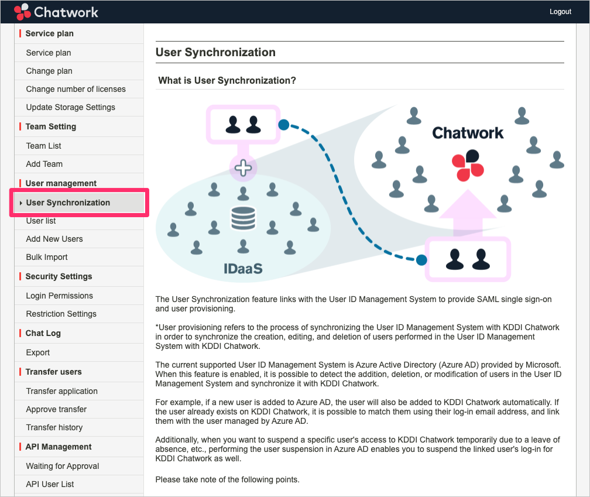
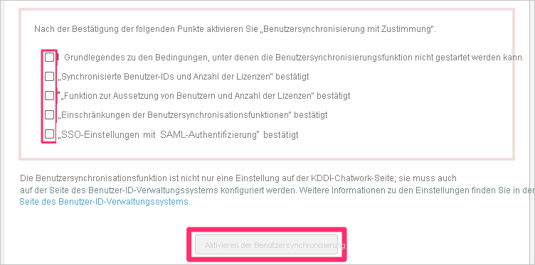

# Tutorial: Konfigurieren von Chatwork für die automatische Benutzerbereitstellung

In diesem Tutorial werden die Schritte beschrieben, die Sie sowohl in Chatwork als auch in Azure Active Directory (Azure AD) ausführen müssen, um die automatische Benutzerbereitstellung zu konfigurieren. Nach der Konfiguration stellt Azure AD mithilfe des Azure AD-Bereitstellungsdiensts automatisch Benutzer und Gruppen für [Chatwork](https://corp.chatwork.com/) bereit bzw. hebt deren Bereitstellung auf. Wichtige Details zum Zweck und zur Funktionsweise dieses Diensts sowie häufig gestellte Fragen finden Sie unter [Automatisieren der Bereitstellung und Bereitstellungsaufhebung von Benutzern für SaaS-Anwendungen mit Azure Active Directory](../app-provisioning/user-provisioning.md). 

## Unterstützte Funktionen
> [!div class="checklist"]
> * Erstellen von Benutzern in Chatwork
> * Entfernen von Benutzern aus Chatwork, wenn diese keinen Zugriff mehr benötigen
> * Synchronisieren von Benutzerattributen zwischen Azure AD und Chatwork
> * [Einmaliges Anmelden](chatwork-tutorial.md) bei Chatwork (erforderlich)

## Voraussetzungen

Das diesem Tutorial zu Grunde liegende Szenario setzt voraus, dass Sie bereits über die folgenden Voraussetzungen verfügen:

* [Einen Azure AD-Mandanten](../develop/quickstart-create-new-tenant.md) 
* Ein Benutzerkonto in Azure AD mit der [Berechtigung](../roles/permissions-reference.md) für die Konfiguration von Bereitstellungen (z. B. Anwendungsadministrator, Cloudanwendungsadministrator, Anwendungsbesitzer oder Globaler Administrator). 
* Ein [Chatwork](https://corp.chatwork.com/)-Mandant.
* Ein Benutzerkonto in Chatwork mit Administratorberechtigungen.
* Organisationen mit einem Chatwork Enterprise Plan- oder KDDI Chatwork-Vertrag.

## Schritt 1: Planen der Bereitstellung
1. Erfahren Sie, [wie der Bereitstellungsdienst funktioniert](../app-provisioning/user-provisioning.md).
1. Bestimmen Sie, wer [in den Bereitstellungsbereich](../app-provisioning/define-conditional-rules-for-provisioning-user-accounts.md) einbezogen werden soll.
1. Legen Sie fest, welche Daten [zwischen Azure AD und Chatwork zugeordnet werden sollen](../app-provisioning/customize-application-attributes.md). 

## Schritt 2: Konfigurieren von Chatwork für die Unterstützung der Bereitstellung mit Azure AD

### 1. Öffnen von **User Synchronization** (Benutzersynchronisierung) über die Chatwork-Administratorseite

Greifen Sie als Benutzer mit Administratorrechten auf das Chatwork-Verwaltungsportal zu. Wenn Sie über Administratorrechte verfügen, können Sie auf die Seite **User Synchronization** (Benutzersynchronisierung) zugreifen. 

Die Seite **User Synchronization** (Benutzersynchronisierung) enthält Hinweise und Informationen zu Einschränkungen für die Verwendung der Benutzerbereitstellungsfunktion. Überprüfen Sie alle Elemente.

### 2. Konfigurieren der SAML-Anmeldeeinstellungen

Melden Sie sich mit Ihrer Azure AD-ID bei Chatwork an, wenn Sie Azure AD und die Benutzerbereitstellung verwenden. 

### 3. Aktivieren der Kontrollkästchen, nachdem Sie die verschiedenen Elemente akzeptiert haben

Aktivieren Sie die Kontrollkästchen, nachdem Sie die Vorsichtshinweise und Einschränkungen für die Verwendung der Benutzerbereitstellungsfunktion akzeptiert haben.

Klicken Sie auf die Schaltfläche **Enable user synchronization** (Benutzersynchronisierung aktivieren), wenn alle Elemente ausgewählt wurden.

Wenn die Benutzerbereitstellungsfunktion aktiviert ist, wird oben auf der Seite eine Meldung mit dem Hinweis angezeigt, dass sie aktiviert wurde.

## Schritt 3: Hinzufügen von Chatwork aus dem Azure AD-Anwendungskatalog

Fügen Sie Chatwork aus dem Azure AD-Anwendungskatalog hinzu, um mit dem Verwalten der Bereitstellung in Chatwork zu beginnen. Wenn Sie Chatwork zuvor für das einmalige Anmelden (Single Sign-On, SSO) eingerichtet haben, können Sie dieselbe Anwendung verwenden. Es ist jedoch empfehlenswert, beim erstmaligen Testen der Integration eine separate App zu erstellen. [Hier](../manage-apps/add-application-portal.md) erfahren Sie mehr über das Hinzufügen einer Anwendung aus dem Katalog.

## Schritt 4. Definieren der Benutzer für den Bereitstellungsbereich 

Mit dem Azure AD-Bereitstellungsdienst können Sie anhand der Zuweisung zur Anwendung oder aufgrund von Attributen für den Benutzer/die Gruppe festlegen, wer in die Bereitstellung einbezogen werden soll. Wenn Sie sich dafür entscheiden, anhand der Zuweisung festzulegen, wer für Ihre App bereitgestellt werden soll, können Sie der Anwendung mithilfe der folgenden [Schritte](../manage-apps/assign-user-or-group-access-portal.md) Benutzer und Gruppen zuweisen. Wenn Sie allein anhand der Attribute des Benutzers oder der Gruppe auswählen möchten, wer bereitgestellt wird, können Sie einen [hier](../app-provisioning/define-conditional-rules-for-provisioning-user-accounts.md) beschriebenen Bereichsfilter verwenden. 

* Beim Zuweisen von Benutzern und Gruppen zu Chatwork müssen Sie eine andere Rolle als **Standardzugriff** auswählen. Benutzer mit der Rolle „Standardzugriff“ werden von der Bereitstellung ausgeschlossen und in den Bereitstellungsprotokollen als „nicht effektiv berechtigt“ gekennzeichnet. Wenn für die Anwendung nur die Rolle „Standardzugriff“ verfügbar ist, können Sie das [Anwendungsmanifest aktualisieren](../develop/howto-add-app-roles-in-azure-ad-apps.md) und weitere Rollen hinzufügen. 

* Fangen Sie klein an. Testen Sie die Bereitstellung mit einer kleinen Gruppe von Benutzern und Gruppen, bevor Sie sie für alle freigeben. Wenn der Bereitstellungsbereich auf zugewiesene Benutzer und Gruppen festgelegt ist, können Sie dies durch Zuweisen von einem oder zwei Benutzern oder Gruppen zur App kontrollieren. Ist der Bereich auf alle Benutzer und Gruppen festgelegt, können Sie einen [attributbasierten Bereichsfilter](../app-provisioning/define-conditional-rules-for-provisioning-user-accounts.md) angeben. 

## Schritt 5: Konfigurieren der automatischen Benutzerbereitstellung für Chatwork 

In diesem Abschnitt werden die Schritte zum Konfigurieren des Azure AD-Bereitstellungsdiensts zum Erstellen, Aktualisieren und Deaktivieren von Benutzern und/oder Gruppen in Chatwork auf der Grundlage von Benutzer- oder Gruppenzuweisungen in Azure AD erläutert.

### So konfigurieren Sie die automatische Benutzerbereitstellung für Chatwork in Azure AD:

1. Melden Sie sich beim [Azure-Portal](https://portal.azure.com) an. Wählen Sie **Unternehmensanwendungen** und dann **Alle Anwendungen**.

    

1. Wählen Sie in der Anwendungsliste **Chatwork** aus.

    

1. Wählen Sie die Registerkarte **Bereitstellung**.

    

1. Legen Sie den **Bereitstellungsmodus** auf **Automatisch** fest.

    

1. Klicken Sie im Abschnitt **Administratoranmeldeinformationen** auf „Autorisieren“, und achten Sie darauf, dass Sie die Administratoranmeldeinformationen Ihres Chatwork-Kontos eingeben. Klicken Sie auf **Verbindung testen**, um sicherzustellen, dass Azure AD eine Verbindung mit Chatwork herstellen kann. Vergewissern Sie sich bei einem Verbindungsfehler, dass Ihr Chatwork-Konto über Administratorberechtigungen verfügt, und wiederholen Sie den Vorgang.

   
1. Geben Sie im Feld **Benachrichtigungs-E-Mail** die E-Mail-Adresse einer Person oder Gruppe ein, die Benachrichtigungen zu Bereitstellungsfehlern erhalten soll, und aktivieren Sie das Kontrollkästchen **Bei Fehler E-Mail-Benachrichtigung senden**.

    

1. Wählen Sie **Speichern** aus.

1. Wählen Sie im Abschnitt **Zuordnungen** die Option **Azure Active Directory-Benutzer mit Chatwork synchronisieren** aus.

1. Überprüfen Sie im Abschnitt **Attributzuordnung** die Benutzerattribute, die aus Azure AD mit Chatwork synchronisiert werden. Die als **übereinstimmende** Eigenschaften ausgewählten Attribute werden für den Abgleich der Benutzerkonten in Chatwork für Updatevorgänge verwendet. Wenn Sie das [übereinstimmende Zielattribut](../app-provisioning/customize-application-attributes.md) ändern möchten, müssen Sie sicherstellen, dass die Chatwork-API das Filtern von Benutzern nach diesem Attribut unterstützt. Wählen Sie die Schaltfläche **Speichern**, um alle Änderungen zu übernehmen.

   |attribute|Typ|Unterstützung für das Filtern|
   |---|---|---|
   |userName|String|&check;
   |aktiv|Boolean|   
   |title|String|
   |externalId|String|
   |urn:ietf:params:scim:schemas:extension:enterprise:2.0:User:department|String|
   |urn:ietf:params:scim:schemas:extension:enterprise:2.0:User:organization|String|

1. Wenn Sie Bereichsfilter konfigurieren möchten, lesen Sie die Anweisungen unter [Attributbasierte Anwendungsbereitstellung mit Bereichsfiltern](../app-provisioning/define-conditional-rules-for-provisioning-user-accounts.md).

1. Um den Azure AD-Bereitstellungsdienst für Chatwork zu aktivieren, ändern Sie im Abschnitt **Einstellungen** den **Bereitstellungsstatus** in **Ein**.

    

1. Legen Sie die Benutzer und/oder Gruppen fest, die in Chatwork bereitgestellt werden sollen, indem Sie im Abschnitt **Einstellungen** unter **Bereich** die gewünschten Werte auswählen.

    

1. Wenn Sie fertig sind, klicken Sie auf **Speichern**.

    

Durch diesen Vorgang wird der erstmalige Synchronisierungszyklus für alle Benutzer und Gruppen gestartet, die im Abschnitt **Einstellungen** unter **Bereich** definiert wurden. Der erste Zyklus dauert länger als nachfolgende Zyklen, die ungefähr alle 40 Minuten erfolgen, solange der Azure AD-Bereitstellungsdienst ausgeführt wird. 

## Schritt 6: Überwachen der Bereitstellung
Nachdem Sie die Bereitstellung konfiguriert haben, können Sie mit den folgenden Ressourcen die Bereitstellung überwachen:

* Mithilfe der [Bereitstellungsprotokolle](../reports-monitoring/concept-provisioning-logs.md) können Sie ermitteln, welche Benutzer erfolgreich bzw. nicht erfolgreich bereitgestellt wurden.
* Anhand der [Fortschrittsleiste](../app-provisioning/application-provisioning-when-will-provisioning-finish-specific-user.md) können Sie den Status des Bereitstellungszyklus überprüfen und den Fortschritt der Bereitstellung verfolgen.
* Wenn sich die Bereitstellungskonfiguration in einem fehlerhaften Zustand zu befinden scheint, wird die Anwendung unter Quarantäne gestellt. Weitere Informationen zu den verschiedenen Quarantänestatus finden Sie [hier](../app-provisioning/application-provisioning-quarantine-status.md).  

## Weitere Ressourcen

* [Verwalten der Benutzerkontobereitstellung für Unternehmens-Apps](../app-provisioning/configure-automatic-user-provisioning-portal.md)
* [Was bedeuten Anwendungszugriff und einmaliges Anmelden mit Azure Active Directory?](../manage-apps/what-is-single-sign-on.md)

## Nächste Schritte

* [Erfahren Sie, wie Sie Protokolle überprüfen und Berichte zu Bereitstellungsaktivitäten abrufen.](../app-provisioning/check-status-user-account-provisioning.md)