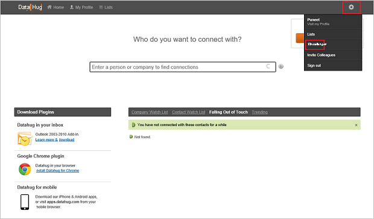
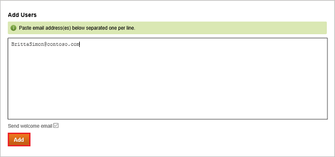

# Tutorial: Azure Active Directory-Integration mit Datahug

In diesem Tutorial erfahren Sie, wie Sie Datahug in Azure Active Directory (Azure AD) integrieren. Die Integration von Datahug in Azure AD ermöglicht Folgendes:

* Steuern Sie in Azure AD, wer Zugriff auf Datahug hat.
* Ermöglichen Sie es Ihren Benutzern, sich mit ihren Azure AD-Konten automatisch bei Datahug anzumelden.
* Verwalten Sie Ihre Konten zentral im Azure-Portal.

## Voraussetzungen

Für die ersten Schritte benötigen Sie Folgendes:

* Ein Azure AD-Abonnement Falls Sie über kein Abonnement verfügen, können Sie ein [kostenloses Azure-Konto](https://azure.microsoft.com/free/) verwenden.
* Datahug-Abonnement, für das einmaliges Anmelden (Single Sign-On, SSO) aktiviert ist

## Beschreibung des Szenarios

In diesem Tutorial konfigurieren und testen Sie das einmalige Anmelden von Azure AD in einer Testumgebung.

* Datahug unterstützt **SP**- und **IDP**-initiiertes einmaliges Anmelden.

## Hinzufügen von Datahug über den Katalog

Zum Konfigurieren der Integration von Datahug in Azure AD müssen Sie Datahug aus dem Katalog der Liste der verwalteten SaaS-Apps hinzufügen.

1. Melden Sie sich mit einem Geschäfts-, Schul- oder Unikonto oder mit einem persönlichen Microsoft-Konto beim Azure-Portal an.
1. Wählen Sie im linken Navigationsbereich den Dienst **Azure Active Directory** aus.
1. Navigieren Sie zu **Unternehmensanwendungen**, und wählen Sie dann **Alle Anwendungen** aus.
1. Wählen Sie zum Hinzufügen einer neuen Anwendung **Neue Anwendung** aus.
1. Geben Sie im Abschnitt **Aus Katalog hinzufügen** den Suchbegriff **Datahug** in das Suchfeld ein.
1. Wählen Sie im Ergebnisbereich **Datahug** aus, und fügen Sie dann die App hinzu. Warten Sie einige Sekunden, während die App Ihrem Mandanten hinzugefügt wird.

## Konfigurieren und Testen des einmaligen Anmeldens von Azure AD für Datahug

Konfigurieren und testen Sie das einmalige Anmelden von Azure AD mit Datahug mithilfe eines Testbenutzers mit dem Namen **B. Simon**. Damit einmaliges Anmelden funktioniert, muss eine Linkbeziehung zwischen einem Azure AD-Benutzer und dem entsprechenden Benutzer in Datahug eingerichtet werden.

Führen Sie zum Konfigurieren und Testen des einmaligen Anmeldens von Azure AD mit Datahug die folgenden Schritte aus:

1. **[Konfigurieren des einmaligen Anmeldens von Azure AD](#configure-azure-ad-sso)** , um Ihren Benutzern die Verwendung dieses Features zu ermöglichen.
    1. **[Erstellen eines Azure AD-Testbenutzers](#create-an-azure-ad-test-user)** , um das einmalige Anmelden von Azure AD mit dem Testbenutzer B. Simon zu testen.
    1. **[Zuweisen des Azure AD-Testbenutzers](#assign-the-azure-ad-test-user)** , um B. Simon die Verwendung des einmaligen Anmeldens von Azure AD zu ermöglichen.
1. **[Konfigurieren des einmaligen Anmeldens für Datahug](#configure-datahug-sso)** , um die Einstellungen für einmaliges Anmelden auf der Anwendungsseite zu konfigurieren
    1. **[Erstellen eines Datahug-Testbenutzers](#create-datahug-test-user)** , um eine Entsprechung von B. Simon in Datahug zu erhalten, die mit ihrer Darstellung in Azure AD verknüpft ist
1. **[Testen des einmaligen Anmeldens](#test-sso)** , um zu überprüfen, ob die Konfiguration funktioniert

## Konfigurieren des einmaligen Anmeldens (Single Sign-On, SSO) von Azure AD

Gehen Sie wie folgt vor, um das einmalige Anmelden von Azure AD im Azure-Portal zu aktivieren.

1. Navigieren Sie im Azure-Portal auf der Anwendungsintegrationsseite für **Datahug** zum Abschnitt **Verwalten**, und wählen Sie **Einmaliges Anmelden** aus.
1. Wählen Sie auf der Seite **SSO-Methode auswählen** die Methode **SAML** aus.
1. Klicken Sie auf der Seite **Einmaliges Anmelden (SSO) mit SAML einrichten** auf das Stiftsymbol für **Grundlegende SAML-Konfiguration**, um die Einstellungen zu bearbeiten.

   

4. Führen Sie im Abschnitt **Grundlegende SAML-Konfiguration** die folgenden Schritte aus, wenn Sie die Anwendung im **IDP**-initiierten Modus konfigurieren möchten:

    a. Geben Sie im Textfeld **Bezeichner** eine URL im folgenden Format ein: `https://apps.datahug.com/identity/<uniqueID>`

    b. Geben Sie im Textfeld **Antwort-URL** eine URL im folgenden Format ein: `https://apps.datahug.com/identity/<uniqueID>/acs`

5. Klicken Sie auf **Zusätzliche URLs festlegen**, und führen Sie den folgenden Schritt aus, wenn Sie die Anwendung im **SP-initiierten Modus** konfigurieren möchten:

    Geben Sie im Textfeld **Anmelde-URL** die URL ein: `https://apps.datahug.com/`.

    > [!NOTE]
    > Hierbei handelt es sich um Beispielwerte. Aktualisieren Sie diese Werte mit dem eigentlichen Bezeichner und der Antwort-URL. Wenden Sie sich an das [Supportteam von Datahug](https://www.sap.com/corporate/en/company/office-locations.html), um diese Werte zu erhalten. Sie können sich auch die Muster im Abschnitt **Grundlegende SAML-Konfiguration** im Azure-Portal ansehen.

6. Klicken Sie auf der Seite **Einmaliges Anmelden (SSO) mit SAML einrichten** im Abschnitt **SAML-Signaturzertifikat** auf **Herunterladen**, um den Ihren Anforderungen entsprechenden **Verbundmetadaten-XML**-Code aus den verfügbaren Optionen herunterzuladen und auf Ihrem Computer zu speichern.

    

7. Klicken Sie im Abschnitt **SAML-Signaturzertifikat** auf die Schaltfläche **Bearbeiten**, um das Dialogfeld **SAML-Signaturzertifikat** zu öffnen. Führen Sie anschließend die folgenden Schritte aus:

    

    a. Wählen Sie unter **Signaturoption** die Option **SAML-Assertion signieren** aus.

    b. Wählen Sie unter **Signaturalgorithmus** die Option **SHA-1** aus.
    
    c. Klicken Sie auf **Speichern**.

8. Kopieren Sie im Abschnitt **Datahug einrichten** die entsprechenden URLs gemäß Ihren Anforderungen.

    

### Erstellen eines Azure AD-Testbenutzers 

In diesem Abschnitt erstellen Sie im Azure-Portal einen Testbenutzer mit dem Namen B. Simon.

1. Wählen Sie im linken Bereich des Microsoft Azure-Portals **Azure Active Directory** > **Benutzer** > **Alle Benutzer** aus.
1. Wählen Sie oben im Bildschirm die Option **Neuer Benutzer** aus.
1. Führen Sie unter den Eigenschaften für **Benutzer** die folgenden Schritte aus:
   1. Geben Sie im Feld **Name** die Zeichenfolge `B.Simon` ein.  
   1. Geben Sie im Feld **Benutzername** die Zeichenfolge username@companydomain.extension ein. Beispiel: `B.Simon@contoso.com`.
   1. Aktivieren Sie das Kontrollkästchen **Kennwort anzeigen**, und notieren Sie sich den Wert aus dem Feld **Kennwort**.
   1. Klicken Sie auf **Erstellen**.

### Zuweisen des Azure AD-Testbenutzers

In diesem Abschnitt ermöglichen Sie B. Simon die Verwendung des einmaligen Anmeldens von Azure, indem Sie ihr Zugriff auf Datahug gewähren.

1. Wählen Sie im Azure-Portal **Unternehmensanwendungen** > **Alle Anwendungen** aus.
1. Wählen Sie in der Anwendungsliste **Datahug** aus.
1. Navigieren Sie auf der Übersichtsseite der App zum Abschnitt **Verwalten**, und wählen Sie **Benutzer und Gruppen** aus.
1. Wählen Sie **Benutzer hinzufügen** und anschließend im Dialogfeld **Zuweisung hinzufügen** die Option **Benutzer und Gruppen** aus.
1. Wählen Sie im Dialogfeld **Benutzer und Gruppen** in der Liste „Benutzer“ den Eintrag **B. Simon** aus, und klicken Sie dann unten auf dem Bildschirm auf die Schaltfläche **Auswählen**.
1. Wenn den Benutzern eine Rolle zugewiesen werden soll, können Sie sie im Dropdownmenü **Rolle auswählen** auswählen. Wurde für diese App keine Rolle eingerichtet, ist die Rolle „Standardzugriff“ ausgewählt.
1. Klicken Sie im Dialogfeld **Zuweisung hinzufügen** auf die Schaltfläche **Zuweisen**.

## Konfigurieren des einmaligen Anmeldens für Datahug

Zum Konfigurieren des einmaligen Anmeldens aufseiten von **Datahug** müssen Sie die heruntergeladene **Verbundmetadaten-XML** und die kopierten URLs aus dem Azure-Portal an das [Supportteam von Datahug](https://www.sap.com/corporate/en/company/office-locations.html) senden. Es führt die Einrichtung durch, damit die SAML-SSO-Verbindung auf beiden Seiten richtig festgelegt ist.

### Erstellen eines Datahug-Testbenutzers

Damit sich Azure AD-Benutzer bei Datahug anmelden können, müssen sie in Datahug bereitgestellt werden.  
Bei Datahug ist die Bereitstellung eine manuelle Aufgabe.

**Führen Sie zum Bereitstellen eines Benutzerkontos die folgenden Schritte aus:**

1. Melden Sie sich bei der Datahug-Unternehmenswebsite als Administrator an.

2. Zeigen Sie auf das **Zahnrad** in der rechten oberen Ecke, und klicken Sie auf **Settings** (Einstellungen).
   
    

3. Wählen Sie **People** (Personen) aus, und klicken Sie auf die Registerkarte **Add Users** (Benutzer hinzufügen).

    

4. Geben Sie die E-Mail-Adresse der Person ein, für die Sie ein Konto erstellen möchten, und klicken Sie auf **Hinzufügen**.

    

    > [!NOTE] 
    > Sie können eine Registrierungs-E-Mail an den Benutzer senden, indem Sie das Kontrollkästchen zum **Senden einer Begrüßungs-E-Mail** aktivieren.  
    > Wenn Sie ein Konto für Salesforce erstellen, senden Sie keine Begrüßungs-E-Mail.

## Testen des einmaligen Anmeldens

In diesem Abschnitt testen Sie die Azure AD-Konfiguration für einmaliges Anmelden mit den folgenden Optionen: 

#### SP-initiiert:

* Klicken Sie im Azure-Portal auf **Diese Anwendung testen**. Dadurch werden Sie zur Anmelde-URL für Datahug weitergeleitet, wo Sie den Anmeldeflow initiieren können.  

* Rufen Sie direkt die Datahug-Anmelde-URL auf, und initiieren Sie den Anmeldeflow.

#### IDP-initiiert:

* Klicken Sie im Azure-Portal auf **Diese Anwendung testen**. Dadurch sollten Sie automatisch bei der Datahug-Instanz angemeldet werden, für die Sie einmaliges Anmelden eingerichtet haben. 

Sie können auch den Microsoft-Bereich „Meine Apps“ verwenden, um die Anwendung in einem beliebigen Modus zu testen. Beim Klicken auf die Kachel „Datahug“ in „Meine Apps“ geschieht Folgendes: Wenn Sie die Anwendung im SP-Modus konfiguriert haben, werden Sie zum Initiieren des Anmeldeflows zur Anmeldeseite der Anwendung weitergeleitet. Wenn Sie die Anwendung im IDP-Modus konfiguriert haben, sollten Sie automatisch bei der Datahug-Instanz angemeldet werden, für die Sie einmaliges Anmelden eingerichtet haben. Weitere Informationen zu „Meine Apps“ finden Sie in [dieser Einführung](../user-help/my-apps-portal-end-user-access.md).

## Nächste Schritte

Nach dem Konfigurieren von Datahug können Sie die Sitzungssteuerung erzwingen, die in Echtzeit vor der Exfiltration und Infiltration vertraulicher Unternehmensdaten schützt. Die Sitzungssteuerung basiert auf bedingtem Zugriff. [Hier](/cloud-app-security/proxy-deployment-aad) erfahren Sie, wie Sie die Sitzungssteuerung mit Microsoft Cloud App Security erzwingen.