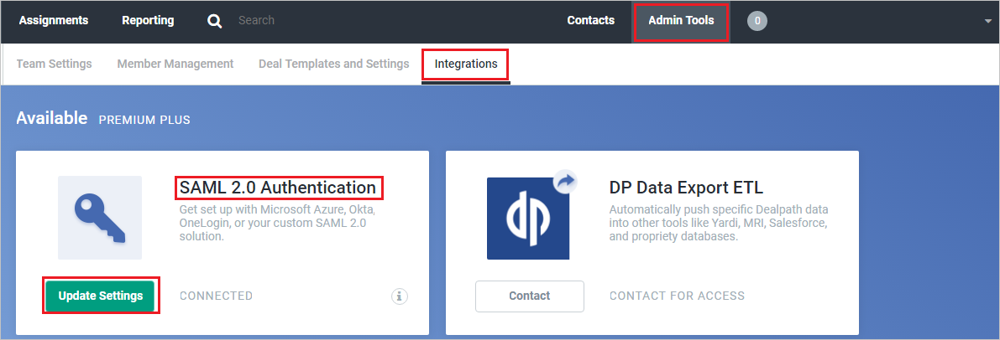
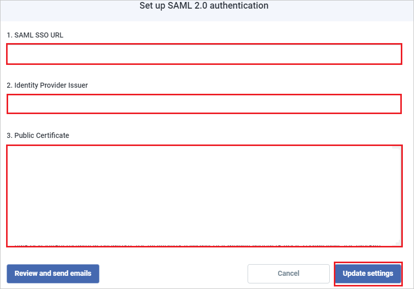

# Tutorial: Integration des einmaligen Anmeldens (Single Sign-On, SSO) von Azure AD mit Dealpath

In diesem Tutorial erfahren Sie, wie Sie Dealpath in Azure Active Directory (Azure AD) integrieren. Die Integration von Dealpath in Azure AD ermöglicht Folgendes:

* Steuern Sie in Azure AD, wer Zugriff auf Dealpath hat.
* Ermöglichen Sie es Ihren Benutzern, sich mit ihren Azure AD-Konten automatisch bei Dealpath anzumelden.
* Verwalten Sie Ihre Konten zentral im Azure-Portal.

## Voraussetzungen

Für die ersten Schritte benötigen Sie Folgendes:

* Ein Azure AD-Abonnement Falls Sie über kein Abonnement verfügen, können Sie ein [kostenloses Azure-Konto](https://azure.microsoft.com/free/) verwenden.
* Dealpath-Abonnement, für das einmaliges Anmelden (Single Sign-On, SSO) aktiviert ist

## Beschreibung des Szenarios

In diesem Tutorial konfigurieren und testen Sie das einmalige Anmelden von Azure AD in einer Testumgebung.

* Dealpath unterstützt **SP-initiiertes** einmaliges Anmelden.

## Hinzufügen von Dealpath aus dem Katalog

Zum Konfigurieren der Integration von Dealpath in Azure AD müssen Sie Dealpath aus dem Katalog der Liste mit den verwalteten SaaS-Apps hinzufügen.

1. Melden Sie sich mit einem Geschäfts-, Schul- oder Unikonto oder mit einem persönlichen Microsoft-Konto beim Azure-Portal an.
1. Wählen Sie im linken Navigationsbereich den Dienst **Azure Active Directory** aus.
1. Navigieren Sie zu **Unternehmensanwendungen**, und wählen Sie dann **Alle Anwendungen** aus.
1. Wählen Sie zum Hinzufügen einer neuen Anwendung **Neue Anwendung** aus.
1. Geben Sie im Abschnitt **Aus Katalog hinzufügen** den Suchbegriff **Dealpath** in das Suchfeld ein.
1. Wählen Sie im Ergebnisbereich **Dealpath** aus, und fügen Sie dann die App hinzu. Warten Sie einige Sekunden, während die App Ihrem Mandanten hinzugefügt wird.

## Konfigurieren und Testen des einmaligen Anmeldens von Azure AD für Dealpath

Konfigurieren und testen Sie das einmalige Anmelden von Azure AD mit Dealpath mithilfe eines Testbenutzers mit dem Namen **B. Simon**. Damit einmaliges Anmelden funktioniert, muss eine Linkbeziehung zwischen einem Azure AD-Benutzer und dem entsprechenden Benutzer in Dealpath eingerichtet werden.

Führen Sie zum Konfigurieren und Testen des einmaligen Anmeldens von Azure AD mit Dealpath die folgenden Schritte aus:

1. **[Konfigurieren des einmaligen Anmeldens von Azure AD](#configure-azure-ad-sso)** , um Ihren Benutzern die Verwendung dieses Features zu ermöglichen.
    1. **[Erstellen eines Azure AD-Testbenutzers](#create-an-azure-ad-test-user)** , um das einmalige Anmelden von Azure AD mit dem Testbenutzer B. Simon zu testen.
    1. **[Zuweisen des Azure AD-Testbenutzers](#assign-the-azure-ad-test-user)** , um B. Simon die Verwendung des einmaligen Anmeldens von Azure AD zu ermöglichen.
1. **[Konfigurieren des einmaligen Anmeldens für Dealpath](#configure-dealpath-sso)** , um die Einstellungen für einmaliges Anmelden auf der Anwendungsseite zu konfigurieren
    1. **[Erstellen eines Dealpath-Testbenutzers](#create-dealpath-test-user)** , um eine Entsprechung von B. Simon in Dealpath zu erhalten, die mit ihrer Darstellung in Azure AD verknüpft ist
1. **[Testen des einmaligen Anmeldens](#test-sso)** , um zu überprüfen, ob die Konfiguration funktioniert

## Konfigurieren des einmaligen Anmeldens (Single Sign-On, SSO) von Azure AD

Gehen Sie wie folgt vor, um das einmalige Anmelden von Azure AD im Azure-Portal zu aktivieren.

1. Navigieren Sie im Azure-Portal auf der Anwendungsintegrationsseite für **Dealpath** zum Abschnitt **Verwalten**, und wählen Sie **Einmaliges Anmelden** aus.
1. Wählen Sie auf der Seite **SSO-Methode auswählen** die Methode **SAML** aus.
1. Klicken Sie auf der Seite **Einmaliges Anmelden (SSO) mit SAML einrichten** auf das Stiftsymbol für **Grundlegende SAML-Konfiguration**, um die Einstellungen zu bearbeiten.

   

4. Führen Sie im Abschnitt **Grundlegende SAML-Konfiguration** die folgenden Schritte aus:

    a. Geben Sie im Textfeld **Anmelde-URL** die URL ein: `https://app.dealpath.com/account/login`.

    b. Geben Sie im Textfeld **Bezeichner (Entitäts-ID)** eine URL im folgenden Format ein: `https://api.dealpath.com/saml/metadata/<ID>`.

    > [!NOTE]
    > Der ID-Wert ist nicht der tatsächliche Wert. Aktualisieren Sie den Wert mit dem tatsächlichen Bezeichner. Wenden Sie sich an das [Supportteam für den Dealpath-Client](mailto:kenter@dealpath.com), um diese Werte zu erhalten. Sie können sich auch die Muster im Abschnitt **Grundlegende SAML-Konfiguration** im Azure-Portal ansehen.

4. Klicken Sie auf der Seite **Einmaliges Anmelden (SSO) mit SAML einrichten** im Abschnitt **SAML-Signaturzertifikat** auf **Herunterladen**, um das Ihrer Anforderung entsprechende **Zertifikat (Base64)** aus den angegebenen Optionen herunterzuladen und auf Ihrem Computer zu speichern.

    

6. Kopieren Sie im Abschnitt **Dealpath einrichten** die entsprechenden URLs gemäß Ihren Anforderungen.

    

### Erstellen eines Azure AD-Testbenutzers 

In diesem Abschnitt erstellen Sie im Azure-Portal einen Testbenutzer mit dem Namen B. Simon.

1. Wählen Sie im linken Bereich des Microsoft Azure-Portals **Azure Active Directory** > **Benutzer** > **Alle Benutzer** aus.
1. Wählen Sie oben im Bildschirm die Option **Neuer Benutzer** aus.
1. Führen Sie unter den Eigenschaften für **Benutzer** die folgenden Schritte aus:
   1. Geben Sie im Feld **Name** die Zeichenfolge `B.Simon` ein.  
   1. Geben Sie im Feld **Benutzername** die Zeichenfolge username@companydomain.extension ein. Beispiel: `B.Simon@contoso.com`.
   1. Aktivieren Sie das Kontrollkästchen **Kennwort anzeigen**, und notieren Sie sich den Wert aus dem Feld **Kennwort**.
   1. Klicken Sie auf **Erstellen**.

### Zuweisen des Azure AD-Testbenutzers

In diesem Abschnitt ermöglichen Sie B. Simon die Verwendung des einmaligen Anmeldens von Azure, indem Sie ihr Zugriff auf Dealpath gewähren.

1. Wählen Sie im Azure-Portal **Unternehmensanwendungen** > **Alle Anwendungen** aus.
1. Wählen Sie in der Anwendungsliste die Option **Dealpath**.
1. Navigieren Sie auf der Übersichtsseite der App zum Abschnitt **Verwalten**, und wählen Sie **Benutzer und Gruppen** aus.
1. Wählen Sie **Benutzer hinzufügen** und anschließend im Dialogfeld **Zuweisung hinzufügen** die Option **Benutzer und Gruppen** aus.
1. Wählen Sie im Dialogfeld **Benutzer und Gruppen** in der Liste „Benutzer“ den Eintrag **B. Simon** aus, und klicken Sie dann unten auf dem Bildschirm auf die Schaltfläche **Auswählen**.
1. Wenn den Benutzern eine Rolle zugewiesen werden soll, können Sie sie im Dropdownmenü **Rolle auswählen** auswählen. Wurde für diese App keine Rolle eingerichtet, ist die Rolle „Standardzugriff“ ausgewählt.
1. Klicken Sie im Dialogfeld **Zuweisung hinzufügen** auf die Schaltfläche **Zuweisen**.

## Konfigurieren des einmaligen Anmeldens für Dealpath

1. Melden Sie sich in einem anderen Webbrowserfenster als Administrator bei Dealpath an.

2. Klicken Sie oben rechts auf **Verwaltungstools**, navigieren Sie zu **Integrationen**, und klicken Sie dann im Abschnitt **SAML 2.0 Authentication** (SAML 2.0-Authentifizierung) auf **Einstellungen aktualisieren**:

    

3. Führen Sie auf der Seite **Set up SAML 2.0 authentication** (SAML 2.0-Authentifizierung einrichten) die folgenden Schritte aus:

     

    a. Fügen Sie in das Textfeld **SAML SSO URL** (SAML-SSO-URL) den Wert der **Anmelde-URL** ein, den Sie aus dem Azure-Portal kopiert haben.

    b. Fügen Sie in das Textfeld **Identity Provider Issuer** (Aussteller des Identitätsanbieters) den Wert für **Azure AD-Bezeichner** ein, den Sie aus dem Azure-Portal kopiert haben.

    c. Kopieren Sie den Inhalt der heruntergeladenen Datei **certificate(Base64)** in den Editor, und fügen Sie ihn dann in das Textfeld **Öffentliches Zertifikat** ein.

    d. Klicken Sie auf **Einstellungen aktualisieren**.

### Erstellen eines Dealpath-Testbenutzers

In diesem Abschnitt erstellen Sie in Dealpath einen Benutzer mit dem Namen „Britta Simon“. Arbeiten Sie mit dem [Clientsupportteam von Dealpath](mailto:kenter@dealpath.com) zusammen, um die Benutzer der Dealpath-Plattform hinzuzufügen. Benutzer müssen erstellt und aktiviert werden, damit Sie einmaliges Anmelden verwenden können.

## Testen des einmaligen Anmeldens 

In diesem Abschnitt testen Sie die Azure AD-Konfiguration für einmaliges Anmelden mit den folgenden Optionen: 

* Klicken Sie im Azure-Portal auf **Diese Anwendung testen**. Dadurch werden Sie zur Anmelde-URL für Dealpath weitergeleitet, wo Sie den Anmeldeflow initiieren können. 

* Rufen Sie direkt die Dealpath-Anmelde-URL auf, und initiieren Sie den Anmeldeflow.

* Sie können „Meine Apps“ von Microsoft verwenden. Wenn Sie unter „Meine Apps“ auf die Kachel „Dealpath“ klicken, werden Sie zur Anmelde-URL für Dealpath weitergeleitet. Weitere Informationen zu „Meine Apps“ finden Sie in [dieser Einführung](../user-help/my-apps-portal-end-user-access.md).

## Nächste Schritte

Nach dem Konfigurieren von Dealpath können Sie die Sitzungssteuerung erzwingen, die in Echtzeit vor der Exfiltration und Infiltration vertraulicher Unternehmensdaten schützt. Die Sitzungssteuerung basiert auf bedingtem Zugriff. [Hier](/cloud-app-security/proxy-deployment-aad) erfahren Sie, wie Sie die Sitzungssteuerung mit Microsoft Cloud App Security erzwingen.