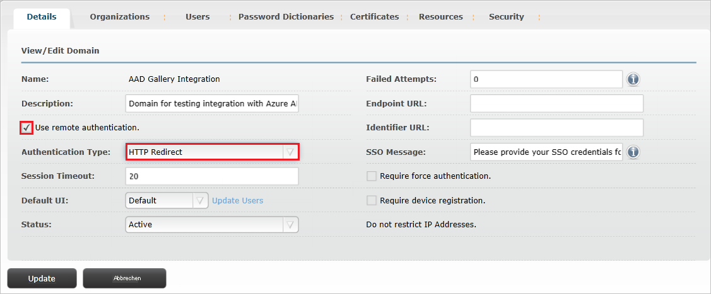
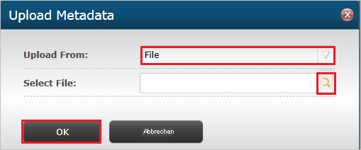
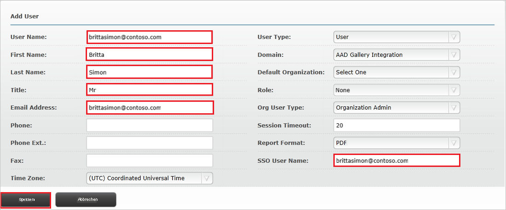

# Tutorial: Azure Active Directory-Integration mit Envi MMIS

In diesem Tutorial erfahren Sie, wie Sie Envi MMIS in Azure Active Directory (Azure AD) integrieren. Die Integration von Envi MMIS in Azure AD ermöglicht Folgendes:

* Steuern Sie in Azure AD, wer auf Envi MMIS Zugriff hat.
* Ermöglichen Sie es Ihren Benutzern, sich mit ihren Azure AD-Konten automatisch bei Envi MMIS anzumelden.
* Verwalten Sie Ihre Konten zentral im Azure-Portal.

## Voraussetzungen

Für die ersten Schritte benötigen Sie Folgendes:

* Ein Azure AD-Abonnement Falls Sie über kein Abonnement verfügen, können Sie ein [kostenloses Azure-Konto](https://azure.microsoft.com/free/) verwenden.
* Ein Envi MMIS-Abonnement, für das einmaliges Anmelden aktiviert ist.

## Beschreibung des Szenarios

In diesem Tutorial konfigurieren und testen Sie das einmalige Anmelden von Azure AD in einer Testumgebung.

* Envi MMIS unterstützt **SP**- und **IDP**-initiiertes einmaliges Anmelden.

## Hinzufügen von Envi MMIS aus dem Katalog

Zum Konfigurieren der Integration von Envi MMIS in Azure AD müssen Sie Envi MMIS aus dem Katalog der Liste mit den verwalteten SaaS-Apps hinzufügen.

1. Melden Sie sich mit einem Geschäfts-, Schul- oder Unikonto oder mit einem persönlichen Microsoft-Konto beim Azure-Portal an.
1. Wählen Sie im linken Navigationsbereich den Dienst **Azure Active Directory** aus.
1. Navigieren Sie zu **Unternehmensanwendungen**, und wählen Sie dann **Alle Anwendungen** aus.
1. Wählen Sie zum Hinzufügen einer neuen Anwendung **Neue Anwendung** aus.
1. Geben Sie im Abschnitt **Aus Katalog hinzufügen** den Suchbegriff **Envi MMIS**  in das Suchfeld ein.
1. Wählen Sie im Ergebnisbereich **Envi MMIS** aus, und fügen Sie dann die App hinzu. Warten Sie einige Sekunden, während die App Ihrem Mandanten hinzugefügt wird.

## Konfigurieren und Testen des einmaligen Anmeldens von Azure AD für Envi MMIS

Konfigurieren und testen Sie das einmalige Anmelden von Azure AD mit Envi MMIS mithilfe eines Testbenutzers namens **B. Simon**. Damit einmaliges Anmelden funktioniert, muss eine Linkbeziehung zwischen einem Azure AD-Benutzer und dem entsprechenden Benutzer in Envi MMIS eingerichtet werden.

Führen Sie zum Konfigurieren und Testen des einmaligen Anmeldens von Azure AD mit Envi MMIS die folgenden Schritte aus:

1. **[Konfigurieren des einmaligen Anmeldens von Azure AD](#configure-azure-ad-sso)** , um Ihren Benutzern die Verwendung dieses Features zu ermöglichen.
    1. **[Erstellen eines Azure AD-Testbenutzers](#create-an-azure-ad-test-user)** , um das einmalige Anmelden von Azure AD mit dem Testbenutzer B. Simon zu testen.
    1. **[Zuweisen des Azure AD-Testbenutzers](#assign-the-azure-ad-test-user)** , um B. Simon die Verwendung des einmaligen Anmeldens von Azure AD zu ermöglichen.
1. **[Konfigurieren des einmaligen Anmeldens für Envi MMIS](#configure-envi-mmis-sso)** , um die Einstellungen für einmaliges Anmelden auf der Anwendungsseite zu konfigurieren
    1. **[Erstellen eines Envi MMIS-Testbenutzers](#create-envi-mmis-test-user)** , um eine Entsprechung von B. Simon in Envi MMIS zu erhalten, die mit der Darstellung des Benutzers in Azure AD verknüpft ist
1. **[Testen des einmaligen Anmeldens](#test-sso)** , um zu überprüfen, ob die Konfiguration funktioniert

## Konfigurieren des einmaligen Anmeldens (Single Sign-On, SSO) von Azure AD

Gehen Sie wie folgt vor, um das einmalige Anmelden von Azure AD im Azure-Portal zu aktivieren.

1. Navigieren Sie im Azure-Portal auf der Anwendungsintegrationsseite für **Envi MMIS** zum Abschnitt **Verwalten**, und wählen Sie **Einmaliges Anmelden** aus.
1. Wählen Sie auf der Seite **SSO-Methode auswählen** die Methode **SAML** aus.
1. Klicken Sie auf der Seite **Einmaliges Anmelden (SSO) mit SAML einrichten** auf das Stiftsymbol für **Grundlegende SAML-Konfiguration**, um die Einstellungen zu bearbeiten.

   

4. Führen Sie im Abschnitt **Grundlegende SAML-Konfiguration** die folgenden Schritte aus, wenn Sie die Anwendung im **IDP**-initiierten Modus konfigurieren möchten:

    a. Geben Sie im Textfeld **Bezeichner** eine URL im folgenden Format ein: `https://www.<CUSTOMER DOMAIN>.com/Account`

    b. Geben Sie im Textfeld **Antwort-URL** eine URL im folgenden Format ein: `https://www.<CUSTOMER DOMAIN>.com/Account/Acs`

5. Klicken Sie auf **Zusätzliche URLs festlegen**, und führen Sie den folgenden Schritt aus, wenn Sie die Anwendung im **SP-initiierten Modus** konfigurieren möchten:

    Geben Sie im Textfeld **Anmelde-URL** eine URL im folgenden Format ein: `https://www.<CUSTOMER DOMAIN>.com/Account`

    > [!NOTE]
    > Hierbei handelt es sich um Beispielwerte. Sie müssen diese Werte mit dem tatsächlichen Bezeichner, der Antwort-URL und der Anmelde-URL aktualisieren. Wenden Sie sich an das [Clientsupportteam von Envi MMIS](mailto:support@ioscorp.com), um diese Werte zu erhalten. Sie können sich auch die Muster im Abschnitt **Grundlegende SAML-Konfiguration** im Azure-Portal ansehen.

6. Klicken Sie auf der Seite **Einmaliges Anmelden (SSO) mit SAML einrichten** im Abschnitt **SAML-Signaturzertifikat** auf **Herunterladen**, um den Ihren Anforderungen entsprechenden **Verbundmetadaten-XML**-Code aus den verfügbaren Optionen herunterzuladen und auf Ihrem Computer zu speichern.

    

7. Kopieren Sie im Abschnitt **Envi MMIS einrichten** die entsprechenden URLs gemäß Ihren Anforderungen.

    

### Erstellen eines Azure AD-Testbenutzers 

In diesem Abschnitt erstellen Sie im Azure-Portal einen Testbenutzer mit dem Namen B. Simon.

1. Wählen Sie im linken Bereich des Microsoft Azure-Portals **Azure Active Directory** > **Benutzer** > **Alle Benutzer** aus.
1. Wählen Sie oben im Bildschirm die Option **Neuer Benutzer** aus.
1. Führen Sie unter den Eigenschaften für **Benutzer** die folgenden Schritte aus:
   1. Geben Sie im Feld **Name** die Zeichenfolge `B.Simon` ein.  
   1. Geben Sie im Feld **Benutzername** die Zeichenfolge username@companydomain.extension ein. Beispiel: `B.Simon@contoso.com`.
   1. Aktivieren Sie das Kontrollkästchen **Kennwort anzeigen**, und notieren Sie sich den Wert aus dem Feld **Kennwort**.
   1. Klicken Sie auf **Erstellen**.

### Zuweisen des Azure AD-Testbenutzers

In diesem Abschnitt ermöglichen Sie B. Simon die Verwendung des einmaligen Anmeldens von Azure, indem Sie Zugriff auf Envi MMIS gewähren.

1. Wählen Sie im Azure-Portal **Unternehmensanwendungen** > **Alle Anwendungen** aus.
1. Wählen Sie in der Anwendungsliste den Eintrag **Envi MMIS** aus.
1. Navigieren Sie auf der Übersichtsseite der App zum Abschnitt **Verwalten**, und wählen Sie **Benutzer und Gruppen** aus.
1. Wählen Sie **Benutzer hinzufügen** und anschließend im Dialogfeld **Zuweisung hinzufügen** die Option **Benutzer und Gruppen** aus.
1. Wählen Sie im Dialogfeld **Benutzer und Gruppen** in der Liste „Benutzer“ den Eintrag **B. Simon** aus, und klicken Sie dann unten auf dem Bildschirm auf die Schaltfläche **Auswählen**.
1. Wenn den Benutzern eine Rolle zugewiesen werden soll, können Sie sie im Dropdownmenü **Rolle auswählen** auswählen. Wurde für diese App keine Rolle eingerichtet, ist die Rolle „Standardzugriff“ ausgewählt.
1. Klicken Sie im Dialogfeld **Zuweisung hinzufügen** auf die Schaltfläche **Zuweisen**.

## Konfigurieren des einmaligen Anmeldens für Envi MMIS

1. Melden Sie sich in einem anderen Webbrowserfenster bei der Envi MMIS-Website als Administrator an.

2. Klicken Sie auf die Registerkarte **My Domain**.

    

3. Klicken Sie auf **Bearbeiten**.

    

4. Aktivieren Sie das Kontrollkästchen **Use remote authentication** (Remoteauthentifizierung verwenden), und wählen Sie dann **HTTP Redirect** (HTTP-Umleitung) in der Dropdownliste **Authentication Type** (Authentifizierungstyp) aus.

    

5. Wählen Sie die Registerkarte **Resources** (Ressourcen) aus, und klicken Sie dann auf **Upload Metadata** (Metadaten hochladen).

    

6. Führen Sie im Popupmenü **Upload Metadata** (Metadaten hochladen) die folgenden Schritte aus:

    

    a. Wählen Sie im Dropdownmenü **Upload from** (Hochladen aus) die Option **File** (Datei) aus.

    b. Laden Sie die heruntergeladene Metadatendatei aus dem Azure-Portal hoch, indem Sie auf das Symbol **Choose File** (Datei auswählen) klicken.

    c. Klicken Sie auf **OK**.

7. Nach dem Hochladen der heruntergeladenen Metadatendatei werden die Felder automatisch aufgefüllt. Klicken Sie auf **Aktualisieren**.

    

### Erstellen eines Envi MMIS-Testbenutzers

Damit sich Azure AD-Benutzer bei Envi MMIS anmelden können, müssen sie in Envi MMIS bereitgestellt werden. Im Fall von Envi MMIS ist die Bereitstellung eine manuelle Aufgabe.

**Führen Sie zum Bereitstellen eines Benutzerkontos die folgenden Schritte aus:**

1. Melden Sie sich bei der Envi MMIS-Unternehmenswebsite als Administrator an.

2. Klicken Sie auf die Registerkarte **User List** (Benutzerliste).

    

3. Klicken Sie auf die Schaltfläche **Add User** (Benutzer hinzufügen).

    

4. Führen Sie im Abschnitt **Add User** die folgenden Schritte aus:

    

    a. Geben Sie im Textfeld **User Name** (Benutzername) den Benutzernamen des Kontos von Britta Simon ein. (Beispiel: **brittasimon\@contoso.com**)
    
    b. Geben Sie im Textfeld **First Name** (Vorname) den Vornamen von Britta Simon ein: **Britta**.

    c. Geben Sie im Textfeld **Last Name** (Nachname) den Nachnamen von Britta Simon ein: **Simon**.

    d. Geben Sie im Textfeld **Title** (Titel) den Titel des Benutzers ein.
    
    e. Geben Sie im Textfeld **Email Address** (E-Mail-Adresse) die E-Mail-Adresse des Kontos von Britta Simon ein. (Beispiel: **brittasimon\@contoso.com**)

    f. Geben Sie im Textfeld **SSO User Name** (Benutzername für einmaliges Anmelden) den Benutzernamen des Kontos von Britta Simon ein. (Beispiel: **brittasimon\@contoso.com**)

    g. Klicken Sie auf **Speichern**.

## Testen des einmaligen Anmeldens

In diesem Abschnitt testen Sie die Azure AD-Konfiguration für einmaliges Anmelden mit den folgenden Optionen: 

#### SP-initiiert:

* Klicken Sie im Azure-Portal auf **Diese Anwendung testen**. Dadurch werden Sie zur Anmelde-URL für Envi MMIS weitergeleitet, wo Sie den Anmeldeflow initiieren können.  

* Navigieren Sie direkt zur Anmelde-URL für Envi MMIS, und initiieren Sie dort den Anmeldeflow.

#### IDP-initiiert:

* Klicken Sie im Azure-Portal auf **Diese Anwendung testen**. Dadurch sollten Sie automatisch bei der Envi MMIS-Instanz angemeldet werden, für die Sie einmaliges Anmelden eingerichtet haben. 

Sie können auch den Microsoft-Bereich „Meine Apps“ verwenden, um die Anwendung in einem beliebigen Modus zu testen. Beim Klicken auf die Kachel „Envi MMIS“ in „Meine Apps“ geschieht Folgendes: Wenn Sie die Anwendung im SP-Modus konfiguriert haben, werden Sie zum Initiieren des Anmeldeflows zur Anmeldeseite der Anwendung weitergeleitet. Wenn Sie die Anwendung im IDP-Modus konfiguriert haben, sollten Sie automatisch bei der Envi MMIS-Instanz angemeldet werden, für die Sie einmaliges Anmelden eingerichtet haben. Weitere Informationen zu „Meine Apps“ finden Sie in [dieser Einführung](https://support.microsoft.com/account-billing/sign-in-and-start-apps-from-the-my-apps-portal-2f3b1bae-0e5a-4a86-a33e-876fbd2a4510).

## Nächste Schritte

Nach dem Konfigurieren von Envi MMIS können Sie die Sitzungssteuerung erzwingen, die in Echtzeit vor der Exfiltration und Infiltration vertraulicher Unternehmensdaten schützt. Die Sitzungssteuerung basiert auf bedingtem Zugriff. [Hier](/cloud-app-security/proxy-deployment-aad) erfahren Sie, wie Sie die Sitzungssteuerung mit Microsoft Cloud App Security erzwingen.