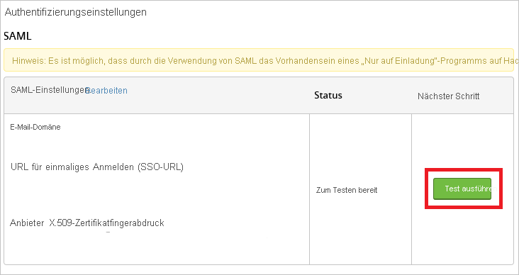
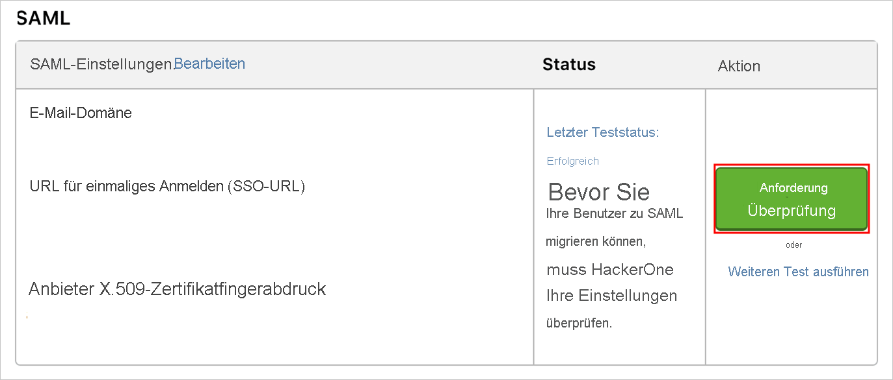

# Tutorial: Azure Active Directory-Integration mit HackerOne

In diesem Tutorial erfahren Sie, wie Sie HackerOne in Azure Active Directory (Azure AD) integrieren. Die Integration von HackerOne in Azure AD ermöglicht Ihnen Folgendes:

* Sie können in Azure AD steuern, wer Zugriff auf HackerOne hat.
* Sie ermöglichen es Ihren Benutzern, sich mit ihren Azure AD-Konten automatisch bei HackerOne anzumelden.
* Verwalten Sie Ihre Konten zentral im Azure-Portal.

## Voraussetzungen

Für die ersten Schritte benötigen Sie Folgendes:

* Ein Azure AD-Abonnement Falls Sie über kein Abonnement verfügen, können Sie ein [kostenloses Azure-Konto](https://azure.microsoft.com/free/) verwenden.
* Ein HackerOne-Abonnement, für das einmaliges Anmelden (SSO) aktiviert ist.

## Beschreibung des Szenarios

In diesem Tutorial konfigurieren und testen Sie das einmalige Anmelden von Azure AD in einer Testumgebung.

* HackerOne unterstützt **SP-initiiertes** einmaliges Anmelden.
* HackerOne unterstützt die **Just-in-Time**-Benutzerbereitstellung.

> [!NOTE]
> Der Bezeichner dieser Anwendung ist ein fester Zeichenfolgenwert, daher kann in einem Mandanten nur eine Instanz konfiguriert werden.

## Hinzufügen von HackerOne aus dem Katalog

Zum Konfigurieren der Integration von HackerOne in Azure AD müssen Sie HackerOne aus dem Katalog der Liste mit den verwalteten SaaS-Apps hinzufügen.

1. Melden Sie sich mit einem Geschäfts-, Schul- oder Unikonto oder mit einem persönlichen Microsoft-Konto beim Azure-Portal an.
1. Wählen Sie im linken Navigationsbereich den Dienst **Azure Active Directory** aus.
1. Navigieren Sie zu **Unternehmensanwendungen**, und wählen Sie dann **Alle Anwendungen** aus.
1. Wählen Sie zum Hinzufügen einer neuen Anwendung **Neue Anwendung** aus.
1. Geben Sie im Abschnitt **Aus dem Katalog hinzufügen** den Suchbegriff **HackerOne** in das Suchfeld ein.
1. Wählen Sie im Ergebnisbereich **HackerOne** aus und fügen Sie dann die App hinzu. Warten Sie einige Sekunden, während die App Ihrem Mandanten hinzugefügt wird.

## Konfigurieren und Testen des einmaligen Anmeldens von Azure AD für HackerOne

Konfigurieren und testen Sie das einmalige Anmelden von Azure AD mit HackerOne mithilfe eines Testbenutzers namens **B. Simon**. Damit das einmalige Anmelden funktioniert, muss eine Linkbeziehung zwischen einem Azure AD-Benutzer und dem entsprechenden Benutzer in HackerOne eingerichtet werden.

Führen Sie zum Konfigurieren und Testen des einmaligen Anmeldens von Azure AD mit HackerOne die folgenden Schritte aus:

1. **[Konfigurieren des einmaligen Anmeldens von Azure AD](#configure-azure-ad-sso)** , um Ihren Benutzern die Verwendung dieses Features zu ermöglichen.
    1. **[Erstellen eines Azure AD-Testbenutzers](#create-an-azure-ad-test-user)** , um das einmalige Anmelden von Azure AD mit dem Testbenutzer B. Simon zu testen.
    1. **[Zuweisen des Azure AD-Testbenutzers](#assign-the-azure-ad-test-user)** , um B. Simon die Verwendung des einmaligen Anmeldens von Azure AD zu ermöglichen.
1. **[Konfigurieren des einmaligen Anmeldens für HackerOne](#configure-hackerone-sso)** , um die Einstellungen für einmaliges Anmelden auf der Anwendungsseite zu konfigurieren
    1. **[Erstellen eines Testbenutzers für HackerOne](#create-hackerone-test-user)** , um eine Entsprechung von B. Simon in HackerOne zu erhalten, die mit der Benutzerdarstellung in Azure AD verknüpft ist
1. **[Testen des einmaligen Anmeldens](#test-sso)** , um zu überprüfen, ob die Konfiguration funktioniert

## Konfigurieren des einmaligen Anmeldens (Single Sign-On, SSO) von Azure AD

Gehen Sie wie folgt vor, um das einmalige Anmelden von Azure AD im Azure-Portal zu aktivieren.

1. Navigieren Sie im Azure-Portal auf der Anwendungsintegrationsseite für **HackerOne** zum Abschnitt **Verwalten**, und wählen Sie **Einmaliges Anmelden** aus.
1. Wählen Sie auf der Seite **SSO-Methode auswählen** die Methode **SAML** aus.
1. Klicken Sie auf der Seite **Einmaliges Anmelden (SSO) mit SAML einrichten** auf das Stiftsymbol für **Grundlegende SAML-Konfiguration**, um die Einstellungen zu bearbeiten.

   

4. Führen Sie im Abschnitt **Grundlegende SAML-Konfiguration** die folgenden Schritte aus:

    a. Geben Sie im Textfeld **Bezeichner (Entitäts-ID)** den folgenden Wert ein: `hackerone.com`.

    b. Geben Sie im Textfeld **Anmelde-URL** eine URL im folgenden Format ein: `https://hackerone.com/users/saml/sign_in?email=<CONFIGURED_DOMAIN>`.

    > [!Note]
    > Der Wert der Anmelde-URL entspricht nicht dem tatsächlichen Wert. Aktualisieren Sie diesen Wert mit der tatsächlichen Anmelde-URL. Sie können sich auch die Muster im Abschnitt **Grundlegende SAML-Konfiguration** im Azure-Portal ansehen.

5. Klicken Sie auf der Seite **Einmaliges Anmelden (SSO) mit SAML einrichten** im Abschnitt **SAML-Signaturzertifikat** auf **Herunterladen**, um das Ihrer Anforderung entsprechende **Zertifikat (Base64)** aus den angegebenen Optionen herunterzuladen und auf Ihrem Computer zu speichern.

    

6. Kopieren Sie im Abschnitt **HackerOne einrichten** die entsprechenden URLs gemäß Ihren Anforderungen.

    

### Erstellen eines Azure AD-Testbenutzers

In diesem Abschnitt erstellen Sie im Azure-Portal einen Testbenutzer mit dem Namen B. Simon.

1. Wählen Sie im linken Bereich des Microsoft Azure-Portals **Azure Active Directory** > **Benutzer** > **Alle Benutzer** aus.
1. Wählen Sie oben im Bildschirm die Option **Neuer Benutzer** aus.
1. Führen Sie unter den Eigenschaften für **Benutzer** die folgenden Schritte aus:
   1. Geben Sie im Feld **Name** die Zeichenfolge `B.Simon` ein.  
   1. Geben Sie im Feld **Benutzername** die Zeichenfolge username@companydomain.extension ein. Beispiel: `B.Simon@contoso.com`.
   1. Aktivieren Sie das Kontrollkästchen **Kennwort anzeigen**, und notieren Sie sich den Wert aus dem Feld **Kennwort**.
   1. Klicken Sie auf **Erstellen**.

### Zuweisen des Azure AD-Testbenutzers

In diesem Abschnitt ermöglichen Sie B. Simon die Verwendung des einmaligen Anmeldens von Azure, indem Sie den Zugriff auf HackerOne gewähren.

1. Wählen Sie im Azure-Portal **Unternehmensanwendungen** > **Alle Anwendungen** aus.
1. Wählen Sie in der Anwendungsliste **HackerOne** aus.
1. Navigieren Sie auf der Übersichtsseite der App zum Abschnitt **Verwalten**, und wählen Sie **Benutzer und Gruppen** aus.
1. Wählen Sie **Benutzer hinzufügen** und anschließend im Dialogfeld **Zuweisung hinzufügen** die Option **Benutzer und Gruppen** aus.
1. Wählen Sie im Dialogfeld **Benutzer und Gruppen** in der Liste „Benutzer“ den Eintrag **B. Simon** aus, und klicken Sie dann unten auf dem Bildschirm auf die Schaltfläche **Auswählen**.
1. Wenn den Benutzern eine Rolle zugewiesen werden soll, können Sie sie im Dropdownmenü **Rolle auswählen** auswählen. Wurde für diese App keine Rolle eingerichtet, ist die Rolle „Standardzugriff“ ausgewählt.
1. Klicken Sie im Dialogfeld **Zuweisung hinzufügen** auf die Schaltfläche **Zuweisen**.

## Konfigurieren des einmaligen Anmeldens für HackerOne

1. Melden Sie sich bei Ihrem HackerOne-Mandanten als Administrator an.

2. Klicken Sie im oberen Menü auf **Settings**.

    

3. Navigieren Sie zu **Authentication** (Authentifizierung), und klicken Sie auf **Add SAML settings** (SAML-Einstellungen hinzufügen).

    

4. Führen Sie im Dialogfeld **SAML Settings** (SAML-Einstellungen) die folgenden Schritte aus:

    

    a. Geben Sie im Textfeld **Email Domain** eine registrierte Domäne ein.

    b. Fügen Sie in die Textfelder für die **URL zur einmaligen Anmeldung** den Wert der **Anmelde-URL** ein, den Sie aus dem Azure-Portal kopiert haben.

    c. Öffnen Sie Ihre aus dem Azure-Portal heruntergeladene **Zertifikatdatei** im Editor, kopieren Sie den Inhalt in die Zwischenablage, und fügen Sie ihn anschließend in das Textfeld **X.509-Zertifikat** ein.

    d. Klicken Sie auf **Speichern**.

5. Führen Sie im Dialogfeld „Authentication Settings“ die folgenden Schritte aus:

    

    a. Klicken Sie auf **Run test**.

6. Wenn der Test erfolgreich abgeschlossen wurde und das Feld **Status** die Angabe **Letzter Teststatus: Erfolg** enthält, wählen Sie die Schaltfläche **Überprüfung anfordern** zur Übermittlung an HackerOne zur Genehmigung aus.

    

7. Nachdem die Einstellungen von HackerOne genehmigt wurden, können Sie die Schaltfläche **Benutzer migrieren** auswählen, um die SSO-Authentifizierung für alle Benutzer erforderlich zu machen.

    

### Erstellen eines HackerOne-Testbenutzers

In diesem Abschnitt wird in HackerOne ein Benutzer namens Britta Simon erstellt. HackerOne unterstützt die Just-in-Time-Benutzerbereitstellung, die standardmäßig aktiviert ist. Für Sie steht in diesem Abschnitt kein Aktionselement zur Verfügung. Ist ein Benutzer noch nicht in HackerOne vorhanden, wird nach der Authentifizierung ein neuer Benutzer erstellt.

## Testen des einmaligen Anmeldens

In diesem Abschnitt testen Sie die Azure AD-Konfiguration für einmaliges Anmelden mit den folgenden Optionen: 

* Klicken Sie im Azure-Portal auf **Diese Anwendung testen**. Dadurch werden Sie zur Anmelde-URL für HackerOne weitergeleitet, wo Sie den Anmeldeablauf initiieren können. 

* Navigieren Sie direkt zur HackerOne-Anmelde-URL, und initiieren Sie dort den Anmeldeablauf.

* Sie können „Meine Apps“ von Microsoft verwenden. Wenn Sie in „Meine Apps“ auf die Kachel „HackerOne“ klicken, werden Sie zur Anmelde-URL für HackerOne umgeleitet. Weitere Informationen zu „Meine Apps“ finden Sie in [dieser Einführung](https://support.microsoft.com/account-billing/sign-in-and-start-apps-from-the-my-apps-portal-2f3b1bae-0e5a-4a86-a33e-876fbd2a4510).

## Nächste Schritte

Nach dem Konfigurieren von HackerOne können Sie die Sitzungssteuerung erzwingen, die Ihre vertraulichen Unternehmensdaten in Echtzeit vor der Exfiltration und Infiltration schützt. Die Sitzungssteuerung basiert auf bedingtem Zugriff. [Hier](/cloud-app-security/proxy-deployment-aad) erfahren Sie, wie Sie die Sitzungssteuerung mit Microsoft Cloud App Security erzwingen.