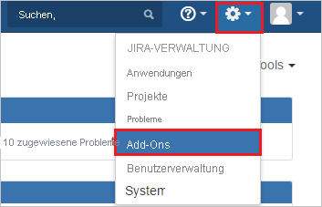
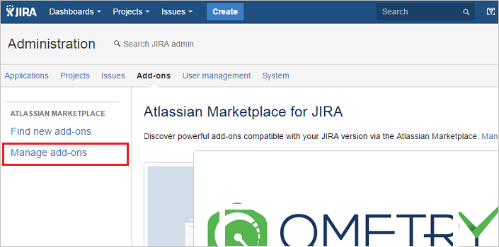
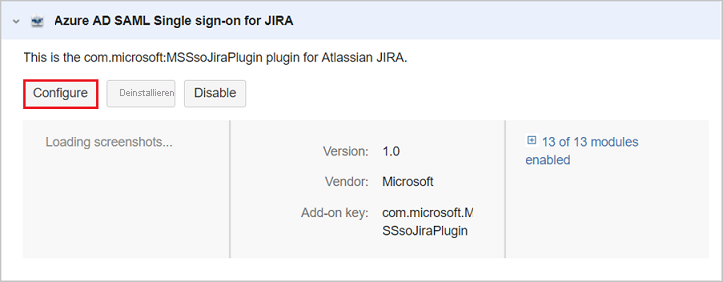
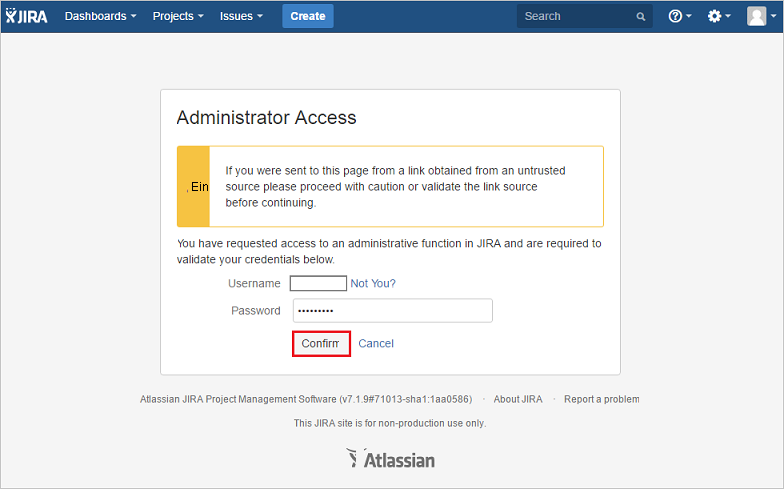
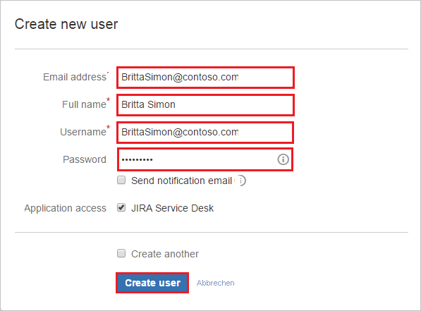

# Tutorial: Azure AD-SSO-Integration in JIRA SAML SSO by Microsoft (Version 5.2)

In diesem Tutorial erfahren Sie, wie Sie JIRA SAML SSO by Microsoft (V5.2) in Azure Active Directory (Azure AD) integrieren. Die Integration von JIRA SAML SSO by Microsoft (V5.2) in Azure AD ermöglicht Folgendes:

* Steuern Sie in Azure AD, wer Zugriff auf JIRA SAML SSO by Microsoft (V5.2) hat.
* Ermöglichen Sie es Ihren Benutzern, sich mit ihren Azure AD-Konten automatisch bei JIRA SAML SSO by Microsoft (V5.2) anzumelden.
* Verwalten Sie Ihre Konten zentral im Azure-Portal.

## BESCHREIBUNG

Verwenden Sie Ihr Microsoft Azure Active Directory-Konto mit einem Atlassian JIRA-Server, um einmaliges Anmelden zu ermöglichen. Auf diese Weise können sich alle Benutzer in Ihrer Organisation mit den Azure AD-Anmeldeinformationen bei der JIRA-Anwendung anmelden. Dieses Plug-In nutzt SAML 2.0 für den Verbund.

## Voraussetzungen

Um die Azure AD-Integration in JIRA SAML SSO by Microsoft (Version 5.2) konfigurieren zu können, benötigen Sie Folgendes:

- Ein Azure AD-Abonnement
- JIRA Core und Software 5.2 müssen unter einer 64-Bit-Version von Windows installiert und konfiguriert werden.
- JIRA-Server ist für HTTPS aktiviert.
- Beachten Sie, dass die unterstützten Versionen für das JIRA-Plug-In weiter unten aufgeführt sind.
- Der JIRA-Server sollte über das Internet erreichbar sein, insbesondere zur Authentifizierung über die Azure AD-Anmeldeseite. Außerdem sollte er in der Lage sein, das Token von Azure AD zu erhalten.
- In JIRA eingerichtete Administratoranmeldeinformationen.
- WebSudo-Deaktivierung in JIRA.
- Erstellter Testbenutzer in der JIRA-Serveranwendung.

> [!NOTE]
> Um die Schritte in diesem Tutorial zu testen, wird empfohlen, keine Produktionsumgebung mit JIRA zu verwenden. Testen Sie die Integration zuerst in der Entwicklungs- oder Stagingumgebung der Anwendung, und verwenden Sie erst danach die Produktionsumgebung.

Um die Schritte in diesem Tutorial zu testen, sollten Sie folgende Empfehlungen beachten:

- Verwenden Sie die Produktionsumgebung nur, wenn dies unbedingt erforderlich ist.
- Ein Azure AD-Abonnement Falls Sie über kein Abonnement verfügen, können Sie ein [kostenloses Azure-Konto](https://azure.microsoft.com/free/) verwenden.

## Unterstützte JIRA-Versionen

* JIRA Core und Software: 5.2.
* JIRA unterstützt auch 6.0 bis 7.12. Weitere Informationen finden Sie unter [JIRA SAML SSO by Microsoft](jiramicrosoft-tutorial.md).

> [!NOTE]
> Beachten Sie, dass unser JIRA-Plug-In auch unter Ubuntu Version 16.04 funktioniert.

## Beschreibung des Szenarios

In diesem Tutorial konfigurieren und testen Sie das einmalige Anmelden von Azure AD in einer Testumgebung.

* JIRA SAML SSO by Microsoft (Version 5.2) unterstützt **SP**-initiiertes einmaliges Anmelden.

## Hinzufügen von JIRA SAML SSO by Microsoft (V5.2) aus dem Katalog

Zum Konfigurieren der Integration von JIRA SAML SSO by Microsoft (Version 5.2) in Azure AD müssen Sie JIRA SAML SSO by Microsoft (Version 5.2) aus dem Katalog der Liste mit den verwalteten SaaS-Apps hinzufügen.

1. Melden Sie sich mit einem Geschäfts-, Schul- oder Unikonto oder mit einem persönlichen Microsoft-Konto beim Azure-Portal an.
1. Wählen Sie im linken Navigationsbereich den Dienst **Azure Active Directory** aus.
1. Navigieren Sie zu **Unternehmensanwendungen**, und wählen Sie dann **Alle Anwendungen** aus.
1. Wählen Sie zum Hinzufügen einer neuen Anwendung **Neue Anwendung** aus.
1. Geben Sie im Abschnitt **Aus Katalog hinzufügen** den Suchbegriff **JIRA SAML SSO by Microsoft (V5.2)** in das Suchfeld ein.
1. Wählen Sie im Ergebnisbereich **JIRA SAML SSO by Microsoft (V5.2)** aus, und fügen Sie dann die App hinzu. Warten Sie einige Sekunden, während die App Ihrem Mandanten hinzugefügt wird.

## Konfigurieren und Testen des einmaligen Anmeldens von Azure AD für JIRA SAML SSO by Microsoft (V5.2)

In diesem Abschnitt konfigurieren und testen Sie das einmalige Anmelden von Azure AD mit JIRA SAML SSO by Microsoft (V5.2) anhand eines Testbenutzers namens **Britta Simon**. Damit einmaliges Anmelden funktioniert, muss zwischen einem Azure AD-Benutzer und dem entsprechenden Benutzer in JIRA SAML SSO by Microsoft (V5.2) eine Linkbeziehung eingerichtet werden.

Führen Sie zum Konfigurieren und Testen des einmaligen Anmeldens von Azure AD mit JIRA SAML SSO by Microsoft (V5.2) die folgenden Schritte aus:

1. **[Konfigurieren des einmaligen Anmeldens von Azure AD](#configure-azure-ad-sso)** , um Ihren Benutzern die Verwendung dieses Features zu ermöglichen.
    1. **[Erstellen eines Azure AD-Testbenutzers](#create-an-azure-ad-test-user)** , um das einmalige Anmelden mit Azure AD mit dem Testbenutzer Britta Simon zu testen.
    1. **[Zuweisen des Azure AD-Testbenutzers](#assign-the-azure-ad-test-user)** , um Britta Simon für das einmalige Anmelden von Azure AD zu aktivieren.
2. **[Konfigurieren des einmaligen Anmeldens für JIRA SAML SSO by Microsoft (V5.2)](#configure-jira-saml-sso-by-microsoft-v52-sso)** , um die Einstellungen für einmaliges Anmelden auf der Anwendungsseite zu konfigurieren
    1. **[Erstellen eines JIRA SAML SSO by Microsoft (V5.2)-Testbenutzers](#create-jira-saml-sso-by-microsoft-v52-test-user)** , um eine Entsprechung für Britta Simon in JIRA SAML SSO by Microsoft (V5.2) zu erhalten, die mit ihrer Darstellung in Azure AD verknüpft ist
1. **[Testen des einmaligen Anmeldens](#test-sso)** , um zu überprüfen, ob die Konfiguration funktioniert

### Konfigurieren des einmaligen Anmeldens (Single Sign-On, SSO) von Azure AD

1. Navigieren Sie im Azure-Portal auf der Anwendungsintegrationsseite für **JIRA SAML SSO by Microsoft (V5.2)** zum Abschnitt **Verwalten**, und wählen Sie **Einmaliges Anmelden** aus.
1. Wählen Sie auf der Seite **SSO-Methode auswählen** die Methode **SAML** aus.
1. Klicken Sie auf der Seite **Einmaliges Anmelden (SSO) mit SAML einrichten** auf das Stiftsymbol für **Grundlegende SAML-Konfiguration**, um die Einstellungen zu bearbeiten.

   

4. Führen Sie im Abschnitt **Grundlegende SAML-Konfiguration** die folgenden Schritte aus:

    a. Geben Sie im Feld **Bezeichner** eine URL im folgenden Format ein: `https://<domain:port>/`.

    b. Geben Sie im Textfeld **Antwort-URL** eine URL im folgenden Format ein: `https://<domain:port>/plugins/servlet/saml/auth`

    c. Geben Sie im Textfeld **Anmelde-URL** eine URL im folgenden Format ein: `https://<domain:port>/plugins/servlet/saml/auth`

    > [!NOTE]
    > Hierbei handelt es sich um Beispielwerte. Sie müssen diese Werte mit dem tatsächlichen Bezeichner, der Antwort-URL und der Anmelde-URL aktualisieren. Der Port ist optional, sofern es sich um eine benannte URL handelt. Diese Werte werden während der Konfiguration des JIRA-Plug-Ins empfangen, die später im Tutorial beschrieben wird.

5. Klicken Sie auf der Seite **Einmaliges Anmelden (SSO) mit SAML einrichten** im Abschnitt **SAML-Signaturzertifikat** auf die Schaltfläche „Kopieren“, um die **App-Verbundmetadaten-URL** zu kopieren, und speichern Sie sie auf Ihrem Computer.

    

### Erstellen eines Azure AD-Testbenutzers

In diesem Abschnitt erstellen Sie im Azure-Portal einen Testbenutzer mit dem Namen B. Simon.

1. Wählen Sie im linken Bereich des Microsoft Azure-Portals **Azure Active Directory** > **Benutzer** > **Alle Benutzer** aus.
1. Wählen Sie oben im Bildschirm die Option **Neuer Benutzer** aus.
1. Führen Sie unter den Eigenschaften für **Benutzer** die folgenden Schritte aus:
    1. Geben Sie im Feld **Name** die Zeichenfolge `B.Simon` ein.  
    1. Geben Sie im Feld **Benutzername** die Zeichenfolge username@companydomain.extension ein. Beispiel: `B.Simon@contoso.com`.
    1. Aktivieren Sie das Kontrollkästchen **Kennwort anzeigen**, und notieren Sie sich den Wert aus dem Feld **Kennwort**.
    1. Klicken Sie auf **Erstellen**.

### Zuweisen des Azure AD-Testbenutzers

In diesem Abschnitt ermöglichen Sie B. Simon die Verwendung des einmaligen Anmeldens von Azure, indem Sie ihr Zugriff auf JIRA SAML SSO by Microsoft (V5.2) gewähren.

1. Wählen Sie im Azure-Portal **Unternehmensanwendungen** > **Alle Anwendungen** aus.
1. Wählen Sie in der Anwendungsliste **JIRA SAML SSO by Microsoft (V5.2)** aus.
1. Navigieren Sie auf der Übersichtsseite der App zum Abschnitt **Verwalten**, und wählen Sie **Benutzer und Gruppen** aus.
1. Wählen Sie **Benutzer hinzufügen** und anschließend im Dialogfeld **Zuweisung hinzufügen** die Option **Benutzer und Gruppen** aus.
1. Wählen Sie im Dialogfeld **Benutzer und Gruppen** in der Liste „Benutzer“ den Eintrag **B. Simon** aus, und klicken Sie dann unten auf dem Bildschirm auf die Schaltfläche **Auswählen**.
1. Wenn den Benutzern eine Rolle zugewiesen werden soll, können Sie sie im Dropdownmenü **Rolle auswählen** auswählen. Wurde für diese App keine Rolle eingerichtet, ist die Rolle „Standardzugriff“ ausgewählt.
1. Klicken Sie im Dialogfeld **Zuweisung hinzufügen** auf die Schaltfläche **Zuweisen**.

## Konfigurieren des einmaligen Anmeldens für JIRA SAML SSO by Microsoft (V5.2)

1. Melden Sie sich in einem anderen Webbrowserfenster bei Ihrer JIRA-Instanz als Administrator an.

2. Fahren Sie mit dem Mauszeiger über das Zahnrad, und klicken Sie auf die **Add-Ons**.

    

3. Klicken Sie im Registerkartenabschnitt „Add-Ons“ auf **Add-Ons verwalten**.

    

4. Laden Sie das Plug-In aus dem [Microsoft Download Center](https://www.microsoft.com/download/details.aspx?id=56521) herunter. Laden Sie das von Microsoft bereitgestellte Plug-In manuell mithilfe des Menüs **Add-On hochladen** hoch. Das Herunterladen von Plug-Ins wird unter [Microsoft-Servicevertrag](https://www.microsoft.com/servicesagreement/) beschrieben.

    

5. Sobald das Plug-In installiert ist, wird es im Abschnitt **User-installed add-ons** (Vom Benutzer installierte Add-Ons) angezeigt. Klicken Sie auf **Konfigurieren**, um das neue Plug-In zu konfigurieren.

    

6. Führen Sie auf der Konfigurationsseite die folgenden Schritte aus:

    

    > [!TIP]
    > Stellen Sie sicher, dass der App nur ein Zertifikat zugeordnet wird, um einen Fehler bei der Auflösung der Metadaten zu vermeiden. Bei mehreren Zertifikaten erhält der Administrator nach dem Auflösen der Metadaten eine Fehlermeldung.

    a. Fügen Sie im Textfeld **Metadaten-URL** den Wert für die **Verbundmetadaten-URL der App** ein, den Sie aus dem Azure-Portal kopiert haben, und klicken Sie auf die Schaltfläche **Auflösen**. Die IdP-Metadaten-URL wird gelesen, und alle Felder werden aufgefüllt.

    b. Kopieren Sie die Werte von **Bezeichner, Antwort-URL und Anmelde-URL**. Fügen Sie sie anschließend in die Textfelder **Bezeichner, Antwort-URL und Anmelde-URL** bzw. im Abschnitt **Grundlegende SAML-Konfiguration** im Azure-Portal ein.

    c. Geben Sie in **Login Button Name** (Name der Anmeldeschaltfläche) den Schaltflächennamen ein, der auf dem Anmeldebildschirm für Ihre Benutzer angezeigt werden soll.

    d. Wählen Sie unter **SAML User ID Locations** (Speicherorte der SAML-Benutzer-ID) entweder die Option **User ID is in the NameIdentifier element of the Subject statement** (Benutzer-ID ist im NameIdentifier-Element der Subject-Anweisung enthalten) oder **User ID is in an Attribute element** (Benutzer-ID ist in einem Attribute-Element enthalten) aus.  Diese ID muss die JIRA-Benutzer-ID sein. Wenn die Benutzer-ID nicht übereinstimmt, ist eine Anmeldung nicht möglich.

    > [!Note]
    > Der Standardspeicherort der SAML-Benutzer-ID ist „Name Identifier“. Sie können dies in ein Attribut ändern und den entsprechenden Attributnamen eingeben.

    e. Wenn Sie die Option **User ID is in an Attribute element** (Benutzer-ID ist in einem Attribute-Element enthalten) auswählen, geben Sie im Textfeld **Attributname** den Namen des Attributs ein, in dem die Benutzer-ID erwartet wird. 

    f. Wenn Sie die Verbunddomäne von Azure AD (z.B. AD FS usw.) verwenden, klicken Sie auf die Option **Startbereichserkennung aktivieren**, und konfigurieren Sie den **Domänennamen**.

    g. Geben Sie in **Domänenname** den Domänennamen für den Fall einer auf AD FS basierenden Anmeldung ein.

    h. Setzen Sie ein Häkchen bei **Einmaliges Abmelden aktivieren**, wenn ein Benutzer beim Abmelden von JIRA bei Azure AD abgemeldet werden soll. 

    i. Klicken Sie auf die Schaltfläche **Save**, um die Änderungen zu speichern.

    > [!NOTE]
    > Weitere Informationen zur Installation und Problembehandlung finden Sie im [Administratorhandbuch zum MS JIRA SSO-Connector](./ms-confluence-jira-plugin-adminguide.md), das auch die [FAQs](./ms-confluence-jira-plugin-adminguide.md) zur weiteren Unterstützung enthält.

### Erstellen eines JIRA SAML SSO by Microsoft (V5.2)-Testbenutzers

Damit sich Azure AD-Benutzer bei einem lokalen JIRA-Server anmelden können, müssen sie auf einem lokalen JIRA-Server bereitgestellt werden.

**Führen Sie zum Bereitstellen eines Benutzerkontos die folgenden Schritte aus:**

1. Melden Sie sich bei Ihrem lokalen JIRA-Server als Administrator an.

2. Fahren Sie mit dem Mauszeiger über das Zahnrad, und klicken Sie auf **Benutzerverwaltung**.

    

3. Sie werden zur Seite „Administratorzugriff“ umgeleitet, um Ihr **Kennwort** einzugeben. Klicken Sie anschließend auf die Schaltfläche **Bestätigen**.

    

4. Klicken Sie im Registerkartenabschnitt **Benutzerverwaltung** auf **Benutzer erstellen**.

     

5. Führen Sie auf der Dialogfeldseite **Neuen Benutzer erstellen** die folgenden Schritte durch:

    

    a. Geben Sie im Textfeld **E-Mail-Adresse** die E-Mail-Adresse des Benutzers, z.B. Brittasimon@contoso.com, ein.

    b. Geben Sie im Textfeld **Vollständiger Name** den vollständigen Namen des Benutzers, z.B. „Britta Simon“, ein.

    c. Geben Sie im Textfeld **Benutzername** die E-Mail-Adresse des Benutzers, z.B. Brittasimon@contoso.com, ein.

    d. Geben Sie im Textfeld **Kennwort** das Kennwort des Benutzers ein.

    e. Klicken Sie auf **Benutzer erstellen**.

## Testen des einmaligen Anmeldens

In diesem Abschnitt testen Sie die Azure AD-Konfiguration für einmaliges Anmelden mit den folgenden Optionen: 

* Klicken Sie im Azure-Portal auf **Diese Anwendung testen**. Dadurch werden Sie zur Anmelde-URL für JIRA SAML SSO by Microsoft (V5.2) weitergeleitet, wo Sie den Anmeldeflow initiieren können. 

* Rufen Sie direkt die Anmelde-URL für JIRA SAML SSO by Microsoft (V5.2) auf, und initiieren Sie den Anmeldeflow.

* Sie können „Meine Apps“ von Microsoft verwenden. Wenn Sie in „Meine Apps“ auf die Kachel „JIRA SAML SSO by Microsoft (V5.2)“ klicken, werden Sie zur Anmelde-URL für JIRA SAML SSO by Microsoft (V5.2) weitergeleitet. Weitere Informationen zu „Meine Apps“ finden Sie in [dieser Einführung](https://support.microsoft.com/account-billing/sign-in-and-start-apps-from-the-my-apps-portal-2f3b1bae-0e5a-4a86-a33e-876fbd2a4510).

## Nächste Schritte

Nach dem Konfigurieren von JIRA SAML SSO by Microsoft (V5.2) können Sie die Sitzungssteuerung erzwingen, die in Echtzeit vor der Exfiltration und Infiltration vertraulicher Unternehmensdaten schützt. Die Sitzungssteuerung basiert auf bedingtem Zugriff. [Hier](/cloud-app-security/proxy-deployment-aad) erfahren Sie, wie Sie die Sitzungssteuerung mit Microsoft Cloud App Security erzwingen.