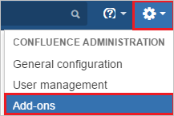
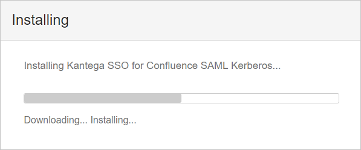
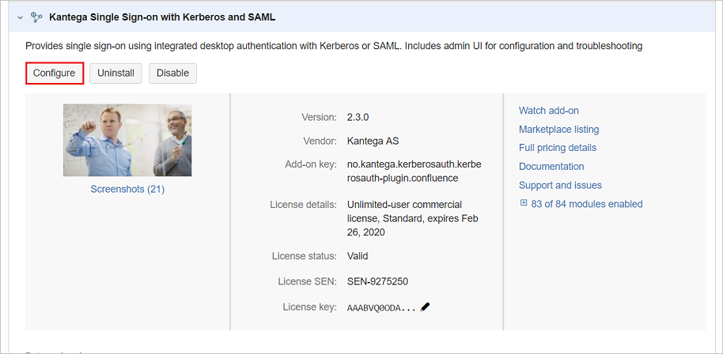
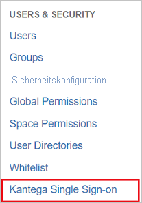
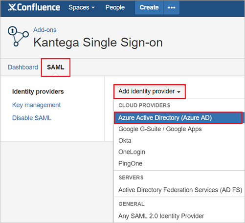
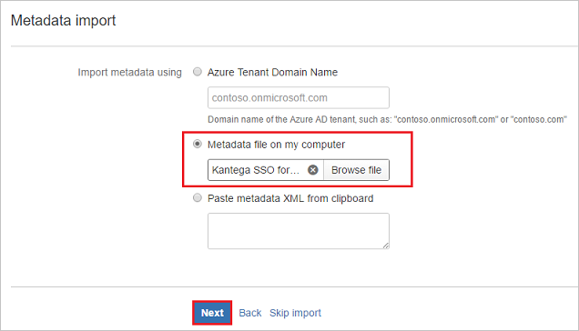
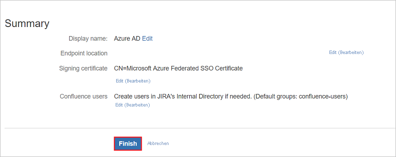

# Tutorial: Integration des einmaligen Anmeldens (Single Sign-On, SSO) von Azure AD mit Kantega SSO for Confluence

In diesem Tutorial erfahren Sie, wie Sie Kantega SSO for Confluence in Azure Active Directory (Azure AD) integrieren. Die Integration von Kantega SSO for Confluence in Azure AD ermöglicht Folgendes:

* Steuern Sie in Azure AD, wer Zugriff auf Kantega SSO for Confluence hat.
* Ermöglichen Sie es Ihren Benutzern, sich mit ihren Azure AD-Konten automatisch bei Kantega SSO for Confluence anzumelden.
* Verwalten Sie Ihre Konten zentral im Azure-Portal.

## Voraussetzungen

Um die Azure AD-Integration mit Kantega SSO for Confluence konfigurieren zu können, benötigen Sie Folgendes:

* Ein Azure AD-Abonnement Sollten Sie nicht über eine Azure AD-Umgebung verfügen, können Sie ein [kostenloses Konto](https://azure.microsoft.com/free/) verwenden.
* Kantega SSO for Confluence-Abonnement, für das einmaliges Anmelden aktiviert ist

## Beschreibung des Szenarios

In diesem Tutorial konfigurieren und testen Sie das einmalige Anmelden von Azure AD in einer Testumgebung.

* Kantega SSO for Confluence unterstützt **SP- und IDP-initiiertes** einmaliges Anmelden.

## Hinzufügen von Kantega SSO for Confluence aus dem Katalog

Zum Konfigurieren der Integration von Kantega SSO for Confluence in Azure AD müssen Sie Kantega SSO for Confluence aus dem Katalog der Liste mit den verwalteten SaaS-Apps hinzufügen.

1. Melden Sie sich mit einem Geschäfts-, Schul- oder Unikonto oder mit einem persönlichen Microsoft-Konto beim Azure-Portal an.
1. Wählen Sie im linken Navigationsbereich den Dienst **Azure Active Directory** aus.
1. Navigieren Sie zu **Unternehmensanwendungen**, und wählen Sie dann **Alle Anwendungen** aus.
1. Wählen Sie zum Hinzufügen einer neuen Anwendung **Neue Anwendung** aus.
1. Geben Sie im Abschnitt **Aus Katalog hinzufügen** den Suchbegriff **Kantega SSO for Confluence** in das Suchfeld ein.
1. Wählen Sie im Ergebnisbereich **Kantega SSO for Confluence** aus, und fügen Sie dann die App hinzu. Warten Sie einige Sekunden, während die App Ihrem Mandanten hinzugefügt wird.

## Konfigurieren und Testen des einmaligen Anmeldens von Azure AD für Kantega SSO for Confluence

Konfigurieren und testen Sie das einmalige Anmelden von Azure AD mit Kantega SSO for Confluence mithilfe eines Testbenutzers mit dem Namen **B. Simon**. Damit einmaliges Anmelden funktioniert, muss eine Linkbeziehung zwischen einem Azure AD-Benutzer und dem entsprechenden Benutzer in Kantega SSO for Confluence eingerichtet werden.

Führen Sie zum Konfigurieren und Testen des einmaligen Anmeldens von Azure AD mit Kantega SSO for Confluence die folgenden Schritte aus:

1. **[Konfigurieren des einmaligen Anmeldens von Azure AD](#configure-azure-ad-sso)** , um Ihren Benutzern die Verwendung dieses Features zu ermöglichen.
    1. **[Erstellen eines Azure AD-Testbenutzers](#create-an-azure-ad-test-user)** , um das einmalige Anmelden von Azure AD mit dem Testbenutzer B. Simon zu testen.
    1. **[Zuweisen des Azure AD-Testbenutzers](#assign-the-azure-ad-test-user)** , um B. Simon die Verwendung des einmaligen Anmeldens von Azure AD zu ermöglichen.
1. **[Konfigurieren des einmaligen Anmeldens für Kantega SSO for Confluence](#configure-kantega-sso-for-confluence-sso)**, um die Einstellungen für einmaliges Anmelden auf der Anwendungsseite zu konfigurieren
    1. **[Erstellen eines Kantega SSO for Confluence-Testbenutzers](#create-kantega-sso-for-confluence-test-user)**, um eine Entsprechung von B. Simon in Kantega SSO for Confluence zu erhalten, die mit ihrer Darstellung in Azure AD verknüpft ist
1. **[Testen des einmaligen Anmeldens](#test-sso)** , um zu überprüfen, ob die Konfiguration funktioniert

## Konfigurieren des einmaligen Anmeldens (Single Sign-On, SSO) von Azure AD

Gehen Sie wie folgt vor, um das einmalige Anmelden von Azure AD im Azure-Portal zu aktivieren.

1. Navigieren Sie im Azure-Portal auf der Anwendungsintegrationsseite für **Kantega SSO for Confluence** zum Abschnitt **Verwalten**, und wählen Sie **Einmaliges Anmelden** aus.
1. Wählen Sie auf der Seite **SSO-Methode auswählen** die Methode **SAML** aus.
1. Klicken Sie auf der Seite **Einmaliges Anmelden (SSO) mit SAML einrichten** auf das Stiftsymbol für **Grundlegende SAML-Konfiguration**, um die Einstellungen zu bearbeiten.

   

4. Führen Sie im Abschnitt **Grundlegende SAML-Konfiguration** die folgenden Schritte aus, wenn Sie die Anwendung im **IDP-initiierten** Modus konfigurieren möchten:

    a. Geben Sie im Textfeld **Bezeichner** eine URL im folgenden Format ein: `https://<server-base-url>/plugins/servlet/no.kantega.saml/sp/<uniqueid>/login`

    b. Geben Sie im Textfeld **Antwort-URL** eine URL im folgenden Format ein: `https://<server-base-url>/plugins/servlet/no.kantega.saml/sp/<uniqueid>/login`

5. Klicken Sie auf **Zusätzliche URLs festlegen**, und führen Sie den folgenden Schritt aus, wenn Sie die Anwendung im **SP-initiierten Modus** konfigurieren möchten:

    Geben Sie im Textfeld **Anmelde-URL** eine URL im folgenden Format ein: `https://<server-base-url>/plugins/servlet/no.kantega.saml/sp/<uniqueid>/login`

    > [!NOTE]
    > Hierbei handelt es sich um Beispielwerte. Sie müssen diese Werte mit dem tatsächlichen Bezeichner, der Antwort-URL und der Anmelde-URL aktualisieren. Diese Werte werden während der Konfiguration des Confluence-Plug-Ins empfangen, die später im Tutorial beschrieben wird.

6. Klicken Sie auf der Seite **Einmaliges Anmelden (SSO) mit SAML einrichten** im Abschnitt **SAML-Signaturzertifikat** auf **Herunterladen**, um den Ihren Anforderungen entsprechenden **Verbundmetadaten-XML**-Code aus den verfügbaren Optionen herunterzuladen und auf Ihrem Computer zu speichern.

    

7. Kopieren Sie im Abschnitt **Kantega SSO for Confluence einrichten** die entsprechenden URLs gemäß Ihren Anforderungen.

    

### Erstellen eines Azure AD-Testbenutzers

In diesem Abschnitt erstellen Sie im Azure-Portal einen Testbenutzer mit dem Namen B. Simon.

1. Wählen Sie im linken Bereich des Microsoft Azure-Portals **Azure Active Directory** > **Benutzer** > **Alle Benutzer** aus.
1. Wählen Sie oben im Bildschirm die Option **Neuer Benutzer** aus.
1. Führen Sie unter den Eigenschaften für **Benutzer** die folgenden Schritte aus:
   1. Geben Sie im Feld **Name** die Zeichenfolge `B.Simon` ein.  
   1. Geben Sie im Feld **Benutzername** die Zeichenfolge username@companydomain.extension ein. Beispiel: `B.Simon@contoso.com`.
   1. Aktivieren Sie das Kontrollkästchen **Kennwort anzeigen**, und notieren Sie sich den Wert aus dem Feld **Kennwort**.
   1. Klicken Sie auf **Erstellen**.

### Zuweisen des Azure AD-Testbenutzers

In diesem Abschnitt ermöglichen Sie B. Simon die Verwendung des einmaligen Anmeldens von Azure, indem Sie ihr Zugriff auf Kantega SSO for Confluence gewähren.

1. Wählen Sie im Azure-Portal **Unternehmensanwendungen** > **Alle Anwendungen** aus.
1. Wählen Sie in der Anwendungsliste **Kantega SSO for Confluence** aus.
1. Navigieren Sie auf der Übersichtsseite der App zum Abschnitt **Verwalten**, und wählen Sie **Benutzer und Gruppen** aus.
1. Wählen Sie **Benutzer hinzufügen** und anschließend im Dialogfeld **Zuweisung hinzufügen** die Option **Benutzer und Gruppen** aus.
1. Wählen Sie im Dialogfeld **Benutzer und Gruppen** in der Liste „Benutzer“ den Eintrag **B. Simon** aus, und klicken Sie dann unten auf dem Bildschirm auf die Schaltfläche **Auswählen**.
1. Wenn den Benutzern eine Rolle zugewiesen werden soll, können Sie sie im Dropdownmenü **Rolle auswählen** auswählen. Wurde für diese App keine Rolle eingerichtet, ist die Rolle „Standardzugriff“ ausgewählt.
1. Klicken Sie im Dialogfeld **Zuweisung hinzufügen** auf die Schaltfläche **Zuweisen**.

## Konfigurieren des einmaligen Anmeldens für Kantega SSO for Confluence

1. Melden Sie sich in einem anderen Webbrowserfenster in Ihrem **Confluence-Verwaltungsportal** als Administrator an.

1. Fahren Sie mit dem Mauszeiger über das Zahnrad, und klicken Sie auf die **Add-Ons**.

    

1. Klicken Sie auf der Registerkarte **ATLASSIAN MARKETPLACE** auf **Nach neuen Add-Ons suchen**.

    

1. Suchen Sie nach **Kantega SSO for Confluence SAML Kerberos**, und klicken Sie auf die Schaltfläche **Installieren**, um das neue SAML-Plug-In zu installieren.

    

1. Die Installation des Plug-Ins wird gestartet.

    

1. Gehen Sie nach Abschluss der Installation wie folgt vor: Klicken Sie auf **Schließen**.

    

1. Klicken Sie auf **Manage**.

    

1. Klicken Sie auf **Konfigurieren**, um das neue Plug-In zu konfigurieren.

    

1. Dieses neue Plug-In wird auch auf der Registerkarte **BENUTZER & SICHERHEIT** angezeigt.

    

1. Im Abschnitt **SAML**: Wählen Sie in der Dropdownliste **Identitätsanbieter hinzufügen** die Option **Azure Active Directory (Azure AD)** .

    

1. Wählen Sie als Abonnementebene die Option **Basic**.

    

1. Führen Sie im Abschnitt **App-Eigenschaften** die folgenden Schritte aus:

    

    a. Kopieren Sie den Wert für den **App-ID-URI**, und verwenden Sie ihn als **Bezeichner, Antwort-URL und Anmelde-URL** im Abschnitt **Grundlegende SAML-Konfiguration** des Azure-Portals.

    b. Klicken Sie auf **Weiter**.

1. Führen Sie im Abschnitt **Metadata import** (Metadatenimport) die folgenden Schritte aus: 

    

    a. Wählen Sie **Metadata file on my computer** (Metadatendatei auf meinem Computer), und laden Sie die Metadatendatei hoch, die Sie aus dem Azure-Portal heruntergeladen haben.

    b. Klicken Sie auf **Weiter**.

1. Führen Sie im Abschnitt **Name and SSO location** (Name und SSO-Standort) die folgenden Schritte aus:

    

    a. Fügen Sie im Textfeld **Name des Identitätsanbieters** den Namen des Identitätsanbieters hinzu (z.B. Azure AD).

    b. Klicken Sie auf **Weiter**.

1. Überprüfen Sie das Signaturzertifikat, und klicken Sie auf **Weiter**.

    

1. Führen Sie im Abschnitt **Confluence user accounts** (Confluence-Benutzerkonten) die folgenden Schritte aus:

    

    a. Wählen Sie **Create users in Confluence's internal Directory if needed** (Benutzer im internen Confluence-Verzeichnis erstellen, falls erforderlich), und geben Sie den entsprechenden Namen der Gruppe für Benutzer ein (können mehrere durch Kommas getrennte Gruppen sein).

    b. Klicken Sie auf **Weiter**.

1. Klicken Sie auf **Fertig stellen**.

    

1. Führen Sie im Abschnitt **Known domains for Azure AD** (Bekannte Domänen für Azure AD) die folgenden Schritte aus: 

    

    a. Wählen Sie im linken Bereich der Seite die Option **Known domains** (Bekannte Domänen).

    b. Geben Sie den Domänennamen im Textfeld **Known domains** (Bekannte Domänen) ein.

    c. Klicken Sie auf **Speichern**.

### Erstellen eines Kantega SSO for Confluence-Testbenutzers

Damit sich Azure AD-Benutzer bei Confluence anmelden können, müssen sie in Confluence bereitgestellt werden. Im Fall von Kantega SSO for Confluence ist die Bereitstellung eine manuelle Aufgabe.

**Führen Sie zum Bereitstellen eines Benutzerkontos die folgenden Schritte aus:**

1. Melden Sie sich bei der Kantega SSO for Confluence-Unternehmenswebsite als Administrator an.

1. Fahren Sie mit dem Mauszeiger über das Zahnrad, und klicken Sie auf **Benutzerverwaltung**.

    

1. Klicken Sie im Abschnitt „Benutzer“ auf die Registerkarte **Benutzer hinzufügen**. Führen Sie auf der Dialogfeldseite **Benutzer hinzufügen** die folgenden Schritte aus:

    

    a. Geben Sie im Textfeld **Benutzername** die E-Mail-Adresse des Benutzers, z.B. Brittasimon@contoso.com, ein.

    b. Geben Sie im Textfeld **Vollständiger Name** den vollständigen Namen des Benutzers, z.B. „Britta Simon“, ein.

    c. Geben Sie im Textfeld **E-Mail-Adresse** die E-Mail-Adresse des Benutzers, z.B. Brittasimon@contoso.com, ein.

    d. Geben Sie im Textfeld **Kennwort** das Kennwort des Benutzers ein.

    e. Klicken Sie auf **Kennwort bestätigen**, um das Kennwort erneut einzugeben.

    f. Klicken Sie auf die Schaltfläche **Hinzufügen**.

## Testen des einmaligen Anmeldens

In diesem Abschnitt testen Sie die Azure AD-Konfiguration für einmaliges Anmelden mit den folgenden Optionen: 

#### SP-initiiert:

* Klicken Sie im Azure-Portal auf **Diese Anwendung testen**. Dadurch werden Sie zur Anmelde-URL für Kantega SSO for Confluence weitergeleitet, wo Sie den Anmeldeablauf initiieren können.  

* Navigieren Sie direkt zur Anmelde-URL für Kantega SSO for Confluence, und initiieren Sie den Anmeldeflow.

#### IDP-initiiert:

* Klicken Sie im Azure-Portal auf **Diese Anwendung testen**. Daraufhin sollten Sie automatisch bei der Kantega SSO for Confluence-Instanz angemeldet werden, für die Sie einmaliges Anmelden eingerichtet haben. 

Sie können auch den Microsoft-Bereich „Meine Apps“ verwenden, um die Anwendung in einem beliebigen Modus zu testen. Beim Klicken auf die Kachel „Kantega SSO for Confluence“ unter „Meine Apps“ geschieht Folgendes: Wenn Sie die Anwendung im SP-Modus konfiguriert haben, werden Sie zum Initiieren des Anmeldeablaufs zur Anmeldeseite der Anwendung weitergeleitet. Wenn Sie die Anwendung im IDP-Modus konfiguriert haben, sollten Sie automatisch bei der Kantega SSO for Confluence-Instanz angemeldet werden, für die Sie einmaliges Anmelden eingerichtet haben. Weitere Informationen zu „Meine Apps“ finden Sie in [dieser Einführung](../user-help/my-apps-portal-end-user-access.md).

## Nächste Schritte

Nach dem Konfigurieren von Kantega SSO for Confluence können Sie die Sitzungssteuerung erzwingen, die in Echtzeit vor der Exfiltration und Infiltration vertraulicher Unternehmensdaten schützt. Die Sitzungssteuerung basiert auf bedingtem Zugriff. [Hier](/cloud-app-security/proxy-deployment-aad) erfahren Sie, wie Sie die Sitzungssteuerung mit Microsoft Cloud App Security erzwingen.