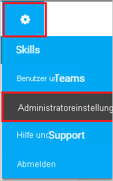
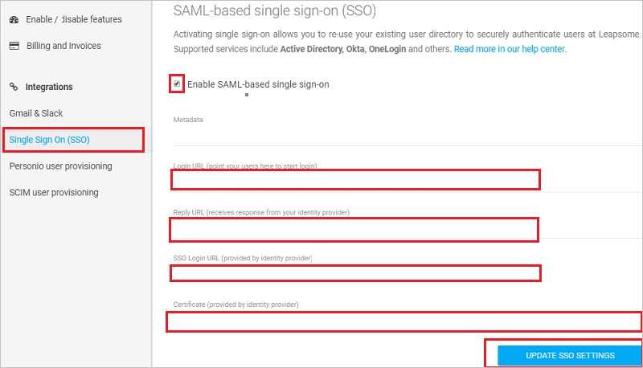

# Tutorial: Integration des einmaligen Anmeldens (Single Sign-On, SSO) von Azure Active Directory mit Leapsome

In diesem Tutorial erfahren Sie, wie Sie Leapsome in Azure Active Directory (Azure AD) integrieren. Die Integration von Leapsome in Azure AD ermöglicht Folgendes:

* Steuern Sie in Azure AD, wer Zugriff auf Leapsome hat.
* Ermöglichen Sie es Ihren Benutzern, sich mit ihren Azure AD-Konten automatisch bei Leapsome anzumelden.
* Verwalten Sie Ihre Konten zentral im Azure-Portal.

## Voraussetzungen

Für die ersten Schritte benötigen Sie Folgendes:

* Ein Azure AD-Abonnement Falls Sie über kein Abonnement verfügen, können Sie ein [kostenloses Azure-Konto](https://azure.microsoft.com/free/) verwenden.
* Ein Leapsome-Abonnement, für das einmaliges Anmelden (Single Sign-On, SSO) aktiviert ist

## Beschreibung des Szenarios

In diesem Tutorial konfigurieren und testen Sie das einmalige Anmelden von Azure AD in einer Testumgebung.

* Leapsome unterstützt **SP- und IDP-initiiertes** einmaliges Anmelden.
* Leapsome unterstützt [automatisierte Benutzerbereitstellung](leapsome-provisioning-tutorial.md).

> [!NOTE]
> Der Bezeichner dieser Anwendung ist ein fester Zeichenfolgenwert, daher kann in einem Mandanten nur eine Instanz konfiguriert werden.

## Hinzufügen von Leapsome aus dem Katalog

Zum Konfigurieren der Integration von Leapsome in Azure AD müssen Sie Leapsome aus dem Katalog der Liste mit den verwalteten SaaS-Apps hinzufügen.

1. Melden Sie sich mit einem Geschäfts-, Schul- oder Unikonto oder mit einem persönlichen Microsoft-Konto beim Azure-Portal an.
1. Wählen Sie im linken Navigationsbereich den Dienst **Azure Active Directory** aus.
1. Navigieren Sie zu **Unternehmensanwendungen**, und wählen Sie dann **Alle Anwendungen** aus.
1. Wählen Sie zum Hinzufügen einer neuen Anwendung **Neue Anwendung** aus.
1. Geben Sie im Abschnitt **Aus Katalog hinzufügen** den Suchbegriff **Leapsome** in das Suchfeld ein.
1. Wählen Sie im Ergebnisbereich **Leapsome** aus, und fügen Sie dann die App hinzu. Warten Sie einige Sekunden, während die App Ihrem Mandanten hinzugefügt wird.

## Konfigurieren und Testen des einmaligen Anmeldens von Azure AD für Leapsome

Konfigurieren und testen Sie das einmalige Anmelden von Azure AD mit Leapsome mithilfe eines Testbenutzers mit dem Namen **B. Simon**. Damit einmaliges Anmelden funktioniert, muss eine Linkbeziehung zwischen einem Azure AD-Benutzer und dem entsprechenden Benutzer in Leapsome eingerichtet werden.

Führen Sie zum Konfigurieren und Testen des einmaligen Anmeldens von Azure AD mit Leapsome die folgenden Schritte aus:

1. **[Konfigurieren des einmaligen Anmeldens von Azure AD](#configure-azure-ad-sso)** , um Ihren Benutzern die Verwendung dieses Features zu ermöglichen.
    1. **[Erstellen eines Azure AD-Testbenutzers](#create-an-azure-ad-test-user)** , um das einmalige Anmelden von Azure AD mit dem Testbenutzer B. Simon zu testen.
    1. **[Zuweisen des Azure AD-Testbenutzers](#assign-the-azure-ad-test-user)** , um B. Simon die Verwendung des einmaligen Anmeldens von Azure AD zu ermöglichen.
1. **[Konfigurieren des einmaligen Anmeldens für Leapsome](#configure-leapsome-sso)**, um die Einstellungen für einmaliges Anmelden auf der Anwendungsseite zu konfigurieren
    1. **[Erstellen eines Leapsome-Testbenutzers](#create-leapsome-test-user)**, um ein Pendant von B. Simon in Leapsome zu erhalten, das mit ihrer Darstellung in Azure AD verknüpft ist
1. **[Testen des einmaligen Anmeldens](#test-sso)** , um zu überprüfen, ob die Konfiguration funktioniert

## Konfigurieren des einmaligen Anmeldens (Single Sign-On, SSO) von Azure AD

Gehen Sie wie folgt vor, um das einmalige Anmelden von Azure AD im Azure-Portal zu aktivieren.

1. Navigieren Sie im Azure-Portal auf der Anwendungsintegrationsseite für **Leapsome** zum Abschnitt **Verwalten**, und wählen Sie **Einmaliges Anmelden** aus.
1. Wählen Sie auf der Seite **SSO-Methode auswählen** die Methode **SAML** aus.
1. Klicken Sie auf der Seite **Einmaliges Anmelden (SSO) mit SAML einrichten** auf das Stiftsymbol für **Grundlegende SAML-Konfiguration**, um die Einstellungen zu bearbeiten.

   

1. Führen Sie im Abschnitt **Grundlegende SAML-Konfiguration** die folgenden Schritte aus, wenn Sie die Anwendung im **IDP-initiierten** Modus konfigurieren möchten:

    a. Geben Sie im Textfeld **Bezeichner** die URL `https://www.leapsome.com` ein.

    b. Geben Sie im Textfeld **Antwort-URL** eine URL im folgenden Format ein: `https://www.leapsome.com/api/users/auth/saml/<CLIENTID>/assert`

1. Klicken Sie auf **Zusätzliche URLs festlegen**, und führen Sie den folgenden Schritt aus, wenn Sie die Anwendung im **SP-initiierten Modus** konfigurieren möchten:

    Geben Sie im Textfeld **Anmelde-URL** eine URL im folgenden Format ein: `https://www.leapsome.com/api/users/auth/saml/<CLIENTID>/login`

    > [!NOTE]
    > Der Wert der „Antwort-URL“ und der „Anmelde-URL“ entspricht nicht dem tatsächlichen Wert. Sie aktualisieren ihn mit den tatsächlichen Werten. Dies wird später in diesem Tutorial beschrieben.

1. Die Leapsome-Anwendung erwartet die SAML-Assertionen in einem bestimmten Format. Daher müssen Sie Ihrer Konfiguration der SAML-Tokenattribute benutzerdefinierte Attributzuordnungen hinzufügen. Der folgende Screenshot zeigt die Liste der Standardattribute.

    

1. Darüber hinaus wird von der Anwendung „Leapsome“ erwartet, dass in der SAML-Antwort noch einige weitere Attribute zurückgegeben werden (siehe unten). Diese Attribute werden ebenfalls vorab aufgefüllt, Sie können sie jedoch nach Bedarf überprüfen.

    | Name | Quellattribut | Namespace |
    | ---------------| --------------- | --------- |  
    | firstname | user.givenname | http://schemas.xmlsoap.org/ws/2005/05/identity/claims |
    | lastname | user.surname | http://schemas.xmlsoap.org/ws/2005/05/identity/claims |
    | title | user.jobtitle | http://schemas.xmlsoap.org/ws/2005/05/identity/claims |
    | picture | URL zum Bild des Mitarbeiters | http://schemas.xmlsoap.org/ws/2005/05/identity/claims |
    | | |

    > [!Note]
    > Bei dem Wert des Bildattributs handelt es sich nicht um den tatsächlichen Wert. Aktualisieren Sie diesen Wert mit der tatsächlichen Bild-URL. Um diesen Wert zu erhalten, wenden Sie sich an das [Supportteam für den Leapsome-Client](mailto:support@leapsome.com).

1. Navigieren Sie auf der Seite **Einmaliges Anmelden (SSO) mit SAML einrichten** im Abschnitt **SAML-Signaturzertifikat** zum Eintrag **Zertifikat (Base64)** . Wählen Sie **Herunterladen** aus, um das Zertifikat herunterzuladen, und speichern Sie es auf Ihrem Computer.

    

1. Kopieren Sie im Abschnitt **Leapsome einrichten** die entsprechenden URLs gemäß Ihren Anforderungen.

    

### Erstellen eines Azure AD-Testbenutzers

In diesem Abschnitt erstellen Sie im Azure-Portal einen Testbenutzer mit dem Namen B. Simon.

1. Wählen Sie im linken Bereich des Microsoft Azure-Portals **Azure Active Directory** > **Benutzer** > **Alle Benutzer** aus.
1. Wählen Sie oben im Bildschirm die Option **Neuer Benutzer** aus.
1. Führen Sie unter den Eigenschaften für **Benutzer** die folgenden Schritte aus:
   1. Geben Sie im Feld **Name** die Zeichenfolge `B.Simon` ein.  
   1. Geben Sie im Feld **Benutzername** die Zeichenfolge username@companydomain.extension ein. Beispiel: `B.Simon@contoso.com`.
   1. Aktivieren Sie das Kontrollkästchen **Kennwort anzeigen**, und notieren Sie sich den Wert aus dem Feld **Kennwort**.
   1. Klicken Sie auf **Erstellen**.

### Zuweisen des Azure AD-Testbenutzers

In diesem Abschnitt ermöglichen Sie B. Simon die Verwendung des einmaligen Anmeldens von Azure, indem Sie ihr Zugriff auf Leapsome gewähren.

1. Wählen Sie im Azure-Portal **Unternehmensanwendungen** > **Alle Anwendungen** aus.
1. Wählen Sie in der Anwendungsliste **Leapsome** aus.
1. Navigieren Sie auf der Übersichtsseite der App zum Abschnitt **Verwalten**, und wählen Sie **Benutzer und Gruppen** aus.
1. Wählen Sie **Benutzer hinzufügen** und anschließend im Dialogfeld **Zuweisung hinzufügen** die Option **Benutzer und Gruppen** aus.
1. Wählen Sie im Dialogfeld **Benutzer und Gruppen** in der Liste „Benutzer“ den Eintrag **B. Simon** aus, und klicken Sie dann unten auf dem Bildschirm auf die Schaltfläche **Auswählen**.
1. Wenn den Benutzern eine Rolle zugewiesen werden soll, können Sie sie im Dropdownmenü **Rolle auswählen** auswählen. Wurde für diese App keine Rolle eingerichtet, ist die Rolle „Standardzugriff“ ausgewählt.
1. Klicken Sie im Dialogfeld **Zuweisung hinzufügen** auf die Schaltfläche **Zuweisen**.

## Konfigurieren des einmaligen Anmeldens für Leapsome

1. Melden Sie sich in einem anderen Webbrowserfenster bei Leapsome als Sicherheitsadministrator an.

1. Klicken Sie oben rechts auf das Logo für die Einstellungen und anschließend auf **Administratoreinstellungen**.

    

1. Klicken Sie in der linken Menüleiste auf **Einmaliges Anmelden (SSO)**, und führen Sie auf der Seite **SAML-basierten einmaliges Anmelden (SSO)** die folgenden Schritte aus:

    

    a. Wählen Sie **SAML-basiertes einmaliges Anmelden aktivieren** aus.

    b. Kopieren Sie den Wert **Login URL (point your users here to start login)** (Anmelde-URL (Benutzer hierher verweisen, um Anmeldung zu starten), und fügen Sie ihn im Azure-Portal im Abschnitt **Grundlegende SAML-Konfiguration** in das Textfeld **Anmelde-URL** ein.

    c. Kopieren Sie den Wert **Reply URL (receives response from your identity provider)** (Antwort-URL (erhält die Antwort von Ihrem Identitätsanbieter)), und fügen Sie ihn im Azure-Portal im Abschnitt **Grundlegende SAML-Konfiguration** in das Textfeld **Antwort-URL** ein.

    d. Fügen Sie im Textfeld **SSO Login URL (provided by identity provider)** (SSO-Anmelde-URL (von Ihrem Identitätsanbieter bereitgestellt)) den Wert der **Anmelde-URL** ein, den Sie aus dem Azure-Portal kopiert haben.

    e. Kopieren Sie das aus dem Azure-Portal heruntergeladene Zertifikat ohne die Kommentare `--BEGIN CERTIFICATE and END CERTIFICATE--`, und fügen Sie es in das Textfeld **Certificate (provided by identity provider)** (Zertifikat (von Ihrem Identitätsanbieter bereitgestellt)) ein.

    f. Klicken Sie auf **SSO-EINSTELLUNGEN AKTUALISIEREN**.

### Erstellen eines Leapsome-Testbenutzers

In diesem Abschnitt erstellen Sie in Leapsome einen Benutzer namens Britta Simon. Wenden Sie sich an das [Supportteam für den Leapsome-Client](mailto:support@leapsome.com), um die Benutzer oder die Domänen hinzuzufügen, die zur Zulassungsliste für die Leapsome-Plattform hinzugefügt werden sollen. Wird die Domäne vom Team hinzugefügt, werden Benutzer automatisch auf der Leapsome-Plattform bereitgestellt. Benutzer müssen erstellt und aktiviert werden, damit Sie einmaliges Anmelden verwenden können.

Außerdem unterstützt Leapsome automatische Benutzerbereitstellung. Weitere Informationen zum Konfigurieren der automatischen Benutzerbereitstellung finden Sie [hier](./leapsome-provisioning-tutorial.md).

## Testen des einmaligen Anmeldens

In diesem Abschnitt testen Sie die Azure AD-Konfiguration für einmaliges Anmelden mit den folgenden Optionen: 

#### SP-initiiert:

* Klicken Sie im Azure-Portal auf **Diese Anwendung testen**. Dadurch werden Sie zur Anmelde-URL für Leapsome weitergeleitet, wo Sie den Anmeldeflow initiieren können.  

* Navigieren Sie direkt zur Anmelde-URL von Leapsome, und initiieren Sie dort den Anmeldeflow.

#### IDP-initiiert:

* Klicken Sie im Azure-Portal auf **Diese Anwendung testen**. Dadurch sollten Sie automatisch bei der Leapsome-Instanz angemeldet werden, für die Sie einmaliges Anmelden eingerichtet haben. 

Sie können auch den Microsoft-Bereich „Meine Apps“ verwenden, um die Anwendung in einem beliebigen Modus zu testen. Beim Klicken auf die Kachel „Leapsome“ in „Meine Apps“ geschieht Folgendes: Wenn Sie die Anwendung im SP-Modus konfiguriert haben, werden Sie zum Initiieren des Anmeldeflows zur Anmeldeseite der Anwendung weitergeleitet. Wenn Sie die Anwendung im IDP-Modus konfiguriert haben, sollten Sie automatisch bei der Leapsome-Instanz angemeldet werden, für die Sie einmaliges Anmelden eingerichtet haben. Weitere Informationen zu „Meine Apps“ finden Sie in [dieser Einführung](https://support.microsoft.com/account-billing/sign-in-and-start-apps-from-the-my-apps-portal-2f3b1bae-0e5a-4a86-a33e-876fbd2a4510).

## Nächste Schritte

Nach dem Konfigurieren von Leapsome können Sie die Sitzungssteuerung erzwingen, die in Echtzeit vor der Exfiltration und Infiltration vertraulicher Unternehmensdaten schützt. Die Sitzungssteuerung basiert auf bedingtem Zugriff. [Hier](/cloud-app-security/proxy-deployment-aad) erfahren Sie, wie Sie die Sitzungssteuerung mit Microsoft Cloud App Security erzwingen.