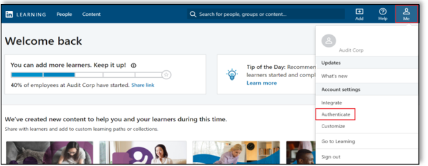
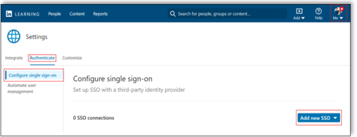
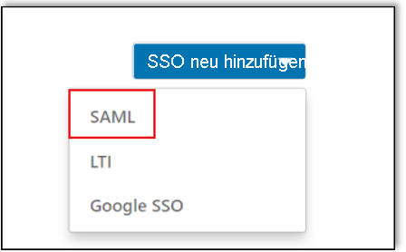
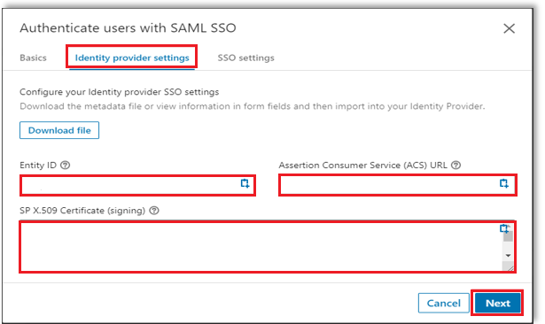
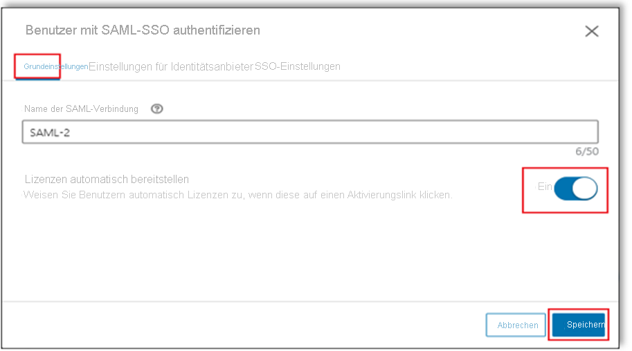

# Tutorial: Azure AD-SSO-Integration in LinkedIn Learning

In diesem Tutorial erfahren Sie, wie Sie LinkedIn Learning in Azure Active Directory (Azure AD) integrieren. Die Integration von LinkedIn Learning in Azure AD ermöglicht Folgendes:

* Steuern Sie in Azure AD, wer Zugriff auf LinkedIn Learning hat.
* Ermöglichen Sie es Ihren Benutzern, sich mit ihren Azure AD-Konten automatisch bei LinkedIn Learning anzumelden.
* Verwalten Sie Ihre Konten zentral im Azure-Portal.

## Voraussetzungen

Für die ersten Schritte benötigen Sie Folgendes:

* Ein Azure AD-Abonnement Falls Sie über kein Abonnement verfügen, können Sie ein [kostenloses Azure-Konto](https://azure.microsoft.com/free/) verwenden.
* Ein LinkedIn Learning-Abonnement, für das einmaliges Anmelden (Single Sign-On, SSO) aktiviert ist

## Beschreibung des Szenarios

In diesem Tutorial konfigurieren und testen Sie das einmalige Anmelden von Azure AD in einer Testumgebung.

* LinkedIn Learning unterstützt durch **SP und IDP** initiiertes einmaliges Anmelden.
* LinkedIn Learning unterstützt die **Just-in-Time**-Benutzerbereitstellung.
* LinkedIn Learnung unterstützt die [Automatisierte Benutzerbereitstellung](linkedin-learning-provisioning-tutorial.md).

## Hinzufügen von LinkedIn Learning aus dem Katalog

Zum Konfigurieren der Integration von LinkedIn Learning in Azure AD müssen Sie LinkedIn Learning aus dem Katalog zur Liste der verwalteten SaaS-Apps hinzufügen.

1. Melden Sie sich mit einem Geschäfts-, Schul- oder Unikonto oder mit einem persönlichen Microsoft-Konto beim Azure-Portal an.
1. Wählen Sie im linken Navigationsbereich den Dienst **Azure Active Directory** aus.
1. Navigieren Sie zu **Unternehmensanwendungen**, und wählen Sie dann **Alle Anwendungen** aus.
1. Wählen Sie zum Hinzufügen einer neuen Anwendung **Neue Anwendung** aus.
1. Geben Sie im Abschnitt **Aus Katalog hinzufügen** den Suchbegriff **LinkedIn Learning** in das Suchfeld ein.
1. Wählen Sie im Ergebnisbereich **LinkedIn Learning** aus, und fügen Sie dann die App hinzu. Warten Sie einige Sekunden, während die App Ihrem Mandanten hinzugefügt wird.

## Konfigurieren und Testen des einmaligen Anmeldens von Azure AD für LinkedIn Learning

Konfigurieren und testen Sie das einmalige Anmelden von Azure AD mit LinkedIn Learning mithilfe eines Testbenutzers mit dem Namen **B. Simon**. Damit einmaliges Anmelden funktioniert, muss eine Linkbeziehung zwischen einem Azure AD-Benutzer und dem entsprechenden Benutzer in LinkedIn Learning eingerichtet werden.

Führen Sie zum Konfigurieren und Testen des einmaligen Anmeldens von Azure AD mit LinkedIn Learning die folgenden Schritte aus:

1. **[Konfigurieren des einmaligen Anmeldens von Azure AD](#configure-azure-ad-sso)** , um Ihren Benutzern die Verwendung dieses Features zu ermöglichen.
    1. **[Erstellen eines Azure AD-Testbenutzers](#create-an-azure-ad-test-user)** , um das einmalige Anmelden von Azure AD mit dem Testbenutzer B. Simon zu testen.
    1. **[Zuweisen des Azure AD-Testbenutzers](#assign-the-azure-ad-test-user)** , um B. Simon die Verwendung des einmaligen Anmeldens von Azure AD zu ermöglichen.
1. **[Konfigurieren des einmaligen Anmeldens für LinkedIn Learning](#configure-linkedin-learning-sso)** , um die Einstellungen für einmaliges Anmelden auf der Anwendungsseite zu konfigurieren
    1. **[Zuweisen von Lizenzen](#assign-licenses)** , um in LinkedIn Learning eine Entsprechung von B. Simon zu erhalten, die mit ihrer Darstellung in Azure AD verknüpft ist
1. **[Testen des einmaligen Anmeldens](#test-sso)** , um zu überprüfen, ob die Konfiguration funktioniert

## Konfigurieren des einmaligen Anmeldens (Single Sign-On, SSO) von Azure AD

Gehen Sie wie folgt vor, um das einmalige Anmelden von Azure AD im Azure-Portal zu aktivieren.

1. Navigieren Sie im Azure-Portal auf der Anwendungsintegrationsseite für **LinkedIn Learning** zum Abschnitt **Verwalten**, und wählen Sie **Einmaliges Anmelden** aus.
1. Wählen Sie auf der Seite **SSO-Methode auswählen** die Methode **SAML** aus.
1. Klicken Sie auf der Seite **Einmaliges Anmelden (SSO) mit SAML einrichten** auf das Stiftsymbol für **Grundlegende SAML-Konfiguration**, um die Einstellungen zu bearbeiten.

   

1. Führen Sie im Abschnitt **Grundlegende SAML-Konfiguration** die folgenden Schritte aus, wenn Sie die Anwendung im **IDP-initiierten** Modus konfigurieren möchten:

    a. Geben Sie im Textfeld **Bezeichner** die **Entitäts-ID** ein, die Sie aus dem LinkedIn-Portal kopiert haben. 

    b. Geben Sie in das Textfeld **Antwort-URL** den Wert für **Assertion Consumer Service (ACS)-URL** ein, den Sie aus dem LinkedIn-Portal kopiert haben.

    c. Wenn Sie die Anwendung im **SP-initiierten** Modus konfigurieren möchten, klicken Sie im Abschnitt **Grundlegende SAML-Konfiguration**, in dem Sie Ihre Anmelde-URL angeben, auf **Zusätzliche URLs festlegen**. Kopieren Sie die **Assertionsverbraucherdienst-URL (ACS)** , und ersetzen Sie „/saml/“ durch „/login/“, um Ihre Anmelde-URL zu erstellen. Danach sollte die Anmelde-URL folgendes Muster aufweisen:

    `https://www.linkedin.com/checkpoint/enterprise/login/<AccountId>?application=learning&applicationInstanceId=<InstanceId>`

    > [!NOTE]
    > Hierbei handelt es sich um Beispielwerte. Diese Werte müssen durch die tatsächlichen Werte für Bezeichner, Antwort-URL und Anmelde-URL ersetzt werden. Entsprechende Informationen finden Sie im Abschnitt **Konfigurieren des einmaligen Anmeldens für LinkedIn Learning** dieses Tutorials.

1. Die LinkedIn Learning-Anwendung erwartet die SAML-Assertionen in einem bestimmten Format. Daher müssen Sie Ihrer Konfiguration der SAML-Tokenattribute benutzerdefinierte Attributzuordnungen hinzufügen. Der folgende Screenshot zeigt die Liste der Standardattribute. **nameidentifier** ist hier **user.userprincipalname** zugeordnet. Die LinkedIn Learning-Anwendung erwartet, dass **nameidentifier** der Wert **user.mail** zugeordnet ist. Sie müssen die Attributzuordnung daher entsprechend ändern, indem Sie auf das Symbol **Bearbeiten** klicken.

    

1. Navigieren Sie auf der Seite **Einmaliges Anmelden (SSO) mit SAML einrichten** im Abschnitt **SAML-Signaturzertifikat** zu **Verbundmetadaten-XML**, und wählen Sie **Herunterladen** aus, um das Zertifikat herunterzuladen und auf Ihrem Computer zu speichern.

    

1. Kopieren Sie im Abschnitt **LinkedIn Learning einrichten** die entsprechenden URLs gemäß Ihren Anforderungen.

    

### Erstellen eines Azure AD-Testbenutzers

In diesem Abschnitt erstellen Sie im Azure-Portal einen Testbenutzer mit dem Namen B. Simon.

1. Wählen Sie im linken Bereich des Microsoft Azure-Portals **Azure Active Directory** > **Benutzer** > **Alle Benutzer** aus.
1. Wählen Sie oben im Bildschirm die Option **Neuer Benutzer** aus.
1. Führen Sie unter den Eigenschaften für **Benutzer** die folgenden Schritte aus:
   1. Geben Sie im Feld **Name** die Zeichenfolge `B.Simon` ein.  
   1. Geben Sie im Feld **Benutzername** die Zeichenfolge username@companydomain.extension ein. Beispiel: `B.Simon@contoso.com`.
   1. Aktivieren Sie das Kontrollkästchen **Kennwort anzeigen**, und notieren Sie sich den Wert aus dem Feld **Kennwort**.
   1. Klicken Sie auf **Erstellen**.

### Zuweisen des Azure AD-Testbenutzers

In diesem Abschnitt ermöglichen Sie B. Simon die Verwendung des einmaligen Anmeldens von Azure, indem Sie ihr Zugriff auf LinkedIn Learning gewähren.

1. Wählen Sie im Azure-Portal **Unternehmensanwendungen** > **Alle Anwendungen** aus.
1. Wählen Sie in der Anwendungsliste **LinkedIn Learning** aus.
1. Navigieren Sie auf der Übersichtsseite der App zum Abschnitt **Verwalten**, und wählen Sie **Benutzer und Gruppen** aus.
1. Wählen Sie **Benutzer hinzufügen** und anschließend im Dialogfeld **Zuweisung hinzufügen** die Option **Benutzer und Gruppen** aus.
1. Wählen Sie im Dialogfeld **Benutzer und Gruppen** in der Liste „Benutzer“ den Eintrag **B. Simon** aus, und klicken Sie dann unten auf dem Bildschirm auf die Schaltfläche **Auswählen**.
1. Wenn den Benutzern eine Rolle zugewiesen werden soll, können Sie sie im Dropdownmenü **Rolle auswählen** auswählen. Wurde für diese App keine Rolle eingerichtet, ist die Rolle „Standardzugriff“ ausgewählt.
1. Klicken Sie im Dialogfeld **Zuweisung hinzufügen** auf die Schaltfläche **Zuweisen**.

## Konfigurieren des einmaligen Anmeldens für LinkedIn Learning

1. Melden Sie sich bei Ihrer LinkedIn Learning-Unternehmenswebsite als Administrator an.

1. Wählen Sie **Wechseln Sie zu Admin** > **Ich** > **Authentifizieren**. 

     

1. Wählen Sie unter **Authentifizieren** die Option **Einmaliges Anmelden konfigurieren** aus, und klicken Sie auf **Neues einmaliges Anmelden hinzufügen**.    

    

1. Wählen Sie in der Dropdownliste **Neues einmaliges Anmelden hinzufügen** die Option **SAML** aus.

    

1. Geben Sie in der Registerkarte **Grundlagen** den **SAML-Verbindungsnamen** ein und klicken Sie auf **Weiter**.

    

1. Navigieren Sie zur Registerkarte **Identitätsanbietereinstellungen**, klicken Sie auf **Datei herunterladen**, um die Metadatendatei herunterzuladen und auf Ihrem Computer zu speichern, und klicken Sie auf **Weiter**.

    

    > [!NOTE]    
    > Möglicherweise können Sie diese Datei nicht in Ihren Identitätsanbieter importieren. Okta verfügt beispielsweise nicht über diese Funktionalität. Wenn dieser Fall Ihren Konfigurationsanforderungen entspricht, fahren Sie mit Arbeiten mit einzelnen Feldern fort.

1. Klicken Sie in der Registerkarte **Identitätsanbietereinstellungen** auf **Informationen aus Feldern laden und kopieren**, um die erforderlichen Felder zu kopieren und im Azure-Portal in den Abschnitt **Grundlegende SAML-Konfiguration** einzufügen, und klicken Sie auf **Weiter**.

    

1. Klicken Sie im Reiter **SSO Einstellungen** auf **XML-Datei hochladen**, um die **Verbundmetadaten-XML-Datei** hochzuladen, die Sie aus dem Azure-Portal heruntergeladen haben.

    

1. Füllen Sie die erforderlichen Felder manuell aus, die Sie in der Registerkarte **SSO-Einstellungen** aus dem Azure-Portal kopiert haben.

    

1. Wählen Sie unter **SSO-Einstellungen** Ihre SSO-Optionen gemäß Ihren Anforderungen aus und klicken Sie auf **Speichern**.

    

#### Aktivieren des einmaligen Anmeldens (SSO)

Aktivieren Sie nach Abschluss Ihrer Konfiguration das einmalige Anmelden, indem Sie in der Dropdownliste für den SSO-Status die Option **Aktiv** auswählen.

  ")

### Zuweisen von Lizenzen

Nachdem Sie das einmalige Anmelden aktiviert haben, können Sie Ihren Mitarbeitern automatisch Lizenzen zuweisen, indem Sie die Option **Lizenzen automatisch bereitstellen** auf **Ein** umschalten und auf **Speichern** klicken. Wenn Sie diese Option aktivieren, wird Benutzern automatisch eine Lizenz gewährt, wenn sie zum ersten Mal authentifiziert werden.

   

> [!NOTE]   
> Wenn Sie diese Option nicht aktivieren, muss ein Administrator die Benutzer manuell in der Registerkarte Personen hinzufügen. LinkedIn Learning identifiziert Benutzer anhand ihrer E-Mail-Adresse.

## Testen des einmaligen Anmeldens 

In diesem Abschnitt testen Sie die Azure AD-Konfiguration für einmaliges Anmelden mit den folgenden Optionen: 

#### SP-initiiert:

* Klicken Sie im Azure-Portal auf **Diese Anwendung testen**. Dadurch werden Sie zur Anmelde-URL für LinkedIn Learning weitergeleitet, wo Sie den Anmeldeflow initiieren können.  

* Rufen Sie direkt die LinkedIn Learning-Anmelde-URL auf, und initiieren Sie den Anmeldeflow.

#### IDP-initiiert:

* Klicken Sie im Azure-Portal auf **Diese Anwendung testen**. Dadurch sollten Sie automatisch bei der LinkedIn Learning-Instanz angemeldet werden, für die Sie einmaliges Anmelden eingerichtet haben. 

Sie können auch den Microsoft-Bereich „Meine Apps“ verwenden, um die Anwendung in einem beliebigen Modus zu testen. Beim Klicken auf die Kachel „LinkedIn Learning“ in „Meine Apps“ geschieht Folgendes: Wenn Sie die Anwendung im SP-Modus konfiguriert haben, werden Sie zum Initiieren des Anmeldeflows zur Anmeldeseite der Anwendung weitergeleitet. Wenn Sie die Anwendung im IDP-Modus konfiguriert haben, sollten Sie automatisch bei der LinkedIn Learning-Instanz angemeldet werden, für die Sie einmaliges Anmelden eingerichtet haben. Weitere Informationen zu „Meine Apps“ finden Sie in [dieser Einführung](https://support.microsoft.com/account-billing/sign-in-and-start-apps-from-the-my-apps-portal-2f3b1bae-0e5a-4a86-a33e-876fbd2a4510).

## Nächste Schritte

Nach dem Konfigurieren von LinkedIn Learning können Sie die Sitzungssteuerung erzwingen, die in Echtzeit vor der Exfiltration und Infiltration vertraulicher Unternehmensdaten schützt. Die Sitzungssteuerung basiert auf bedingtem Zugriff. [Hier](/cloud-app-security/proxy-deployment-aad) erfahren Sie, wie Sie die Sitzungssteuerung mit Microsoft Cloud App Security erzwingen.
