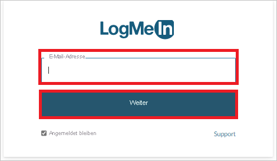
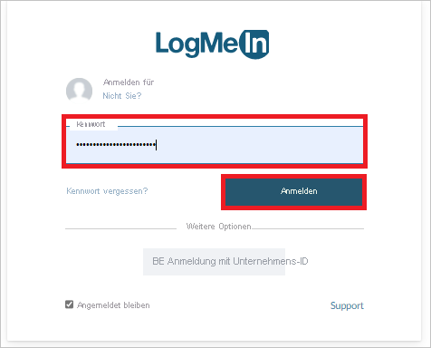

# Tutorial: Konfigurieren von LogMeIn für die automatische Benutzerbereitstellung

In diesem Tutorial werden die Schritte beschrieben, die Sie sowohl in LogMeIn als auch in Azure Active Directory (Azure AD) ausführen müssen, um die automatische Benutzerbereitstellung zu konfigurieren. Nach der Konfiguration stellt Azure AD mithilfe des Azure AD-Bereitstellungsdiensts automatisch Benutzer und Gruppen für [LogMeIn](https://www.logmein.com/) bereit bzw. hebt deren Bereitstellung auf. Wichtige Details zum Zweck und zur Funktionsweise dieses Diensts sowie häufig gestellte Fragen finden Sie unter [Automatisieren der Bereitstellung und Bereitstellungsaufhebung von Benutzern für SaaS-Anwendungen mit Azure Active Directory](../app-provisioning/user-provisioning.md). 

## Unterstützte Funktionen
> [!div class="checklist"]
> * Erstellen von Benutzern in LogMeIn
> * Entfernen von Benutzern aus LogMeIn, wenn diese keinen Zugriff mehr benötigen
> * Synchronisieren von Benutzerattributen zwischen Azure AD und LogMeIn
> * Bereitstellen von Gruppen und Gruppenmitgliedschaften in LogMeIn
> * [Einmaliges Anmelden](./logmein-tutorial.md) bei LogMeIn (empfohlen)

## Voraussetzungen

Das diesem Tutorial zu Grunde liegende Szenario setzt voraus, dass Sie bereits über die folgenden Voraussetzungen verfügen:

* [Azure AD-Mandant](../develop/quickstart-create-new-tenant.md) 
* Ein Benutzerkonto in Azure AD mit der [Berechtigung](../roles/permissions-reference.md) für die Konfiguration von Bereitstellungen (z. B. Anwendungsadministrator, Cloudanwendungsadministrator, Anwendungsbesitzer oder Globaler Administrator). 
* Eine im LogMeIn Organization Center erstellte Organisation mit mindestens einer überprüften Domäne. 
* Ein Benutzerkonto im LogMeIn Organization Center mit der [Berechtigung](https://support.goto.com/meeting/help/manage-organization-users-g2m710102) zum Konfigurieren der Bereitstellung, z. B. mit der Rolle als Organisationsadministrator mit Lese- und Schreibberechtigung (siehe Schritt 2).

## Schritt 1: Planen der Bereitstellung
1. Erfahren Sie, [wie der Bereitstellungsdienst funktioniert](../app-provisioning/user-provisioning.md).
2. Bestimmen Sie, wer [in den Bereitstellungsbereich](../app-provisioning/define-conditional-rules-for-provisioning-user-accounts.md) einbezogen werden soll.
3. Legen Sie fest, welche Daten [zwischen Azure AD und LogMeIn zugeordnet werden sollen](../app-provisioning/customize-application-attributes.md). 

## Schritt 2: Konfigurieren von LogMeIn für die Unterstützung der Bereitstellung mit Azure AD

1. Melden Sie sich beim [Organization Center](https://organization.logmeininc.com) an.

2. Die in der E-Mail-Adresse Ihres Kontos verwendete Domäne ist die Domäne, die Sie innerhalb von 10 Tagen bestätigen sollen.  

3. Sie können den Besitz Ihrer Domäne mit einer der folgenden Methoden bestätigen:

   **Methode 1: Fügen Sie Ihrer Domänenzonendatei einen DNS-Eintrag hinzu.**  
   Um die DNS-Methode zu verwenden, fügen Sie einen DNS-Eintrag auf der Ebene der E-Mail-Domäne in Ihrer DNS-Zone ein.  Beispiele für die Verwendung von „main.com“ als Domäne sind: `@ IN TXT "logmein-verification-code=668e156b-f5d3-430e-9944-f1d4385d043e"` ODER `main.com. IN TXT “logmein-verification-code=668e156b-f5d3-430e-9944-f1d4385d043e”`.

   Ausführliche Anweisungen:
     1. Melden Sie sich beim Konto Ihrer Domäne auf Ihrem Domänenhost an.
     2. Navigieren Sie zur Seite zum Aktualisieren der DNS-Einträge Ihrer Domäne.
     3. Suchen Sie die TXT-Einträge für Ihre Domäne, und fügen Sie dann einen TXT-Eintrag für die Domäne und für jede Unterdomäne hinzu.
     4. Speichern Sie alle Änderungen.
     5. Sie können überprüfen, ob die Änderung erfolgt ist, indem Sie eine Befehlszeile öffnen und einen der nachstehenden Befehle eingeben (abhängig vom jeweiligen Betriebssystem mit „main.com“ als Beispiel für die Domäne):
         * Für Unix- und Linux-Systeme: `$ dig TXT main.com`
         * Für Windows Systeme: `c:\ > nslookup -type=TXT main.com`
     6. Die Antwort wird in einer eigenen Zeile angezeigt.

   **Methode 2: Hochladen einer Webserverdatei auf die jeweilige Website.**
   Laden Sie eine Klartextdatei in das Stammverzeichnis Ihres Webservers, die eine Bestätigungszeichenfolge ohne Leerzeichen oder Sonderzeichen außerhalb der Zeichenfolge enthält.
   
      * Ort: `http://<yourdomain>/logmein-verification-code.txt`
      * Inhalt: `logmein-verification-code=668e156b-f5d3-430e-9944-f1d4385d043e`

4. Kehren Sie nach dem Hinzufügen des DNS-Eintrags bzw. der TXT-Datei zum [Organization Center](https://organization.logmeininc.com) zurück und klicken Sie auf **Verify** (Bestätigen).

5. Sie haben nun eine Organisation im Organization Center erstellt, indem Sie Ihre Domäne bestätigt haben. Das Konto, das im Rahmen dieser Bestätigung verwendet wurde, ist jetzt der Organisationsadministrator.

## Schritt 3: Hinzufügen von LogMeIn aus dem Azure AD-Anwendungskatalog

Fügen Sie LogMeIn aus dem Azure AD-Anwendungskatalog hinzu, um mit dem Verwalten der Bereitstellung in LogMeIn zu beginnen. Wenn Sie LogMeIn zuvor für das einmalige Anmelden (Single Sign-On, SSO) eingerichtet haben, können Sie dieselbe Anwendung verwenden. Es ist jedoch empfehlenswert, beim erstmaligen Testen der Integration eine separate App zu erstellen. [Hier](../manage-apps/add-application-portal.md) erfahren Sie mehr über das Hinzufügen einer Anwendung aus dem Katalog. 

## Schritt 4. Definieren der Benutzer für den Bereitstellungsbereich 

Mit dem Azure AD-Bereitstellungsdienst können Sie anhand der Zuweisung zur Anwendung oder aufgrund von Attributen für den Benutzer/die Gruppe festlegen, wer in die Bereitstellung einbezogen werden soll. Wenn Sie sich dafür entscheiden, anhand der Zuweisung festzulegen, wer für Ihre App bereitgestellt werden soll, können Sie der Anwendung mithilfe der folgenden [Schritte](../manage-apps/assign-user-or-group-access-portal.md) Benutzer und Gruppen zuweisen. Wenn Sie allein anhand der Attribute des Benutzers oder der Gruppe auswählen möchten, wer bereitgestellt wird, können Sie einen [hier](../app-provisioning/define-conditional-rules-for-provisioning-user-accounts.md) beschriebenen Bereichsfilter verwenden. 

* Beim Zuweisen von Benutzern und Gruppen zu LogMeIn müssen Sie eine andere Rolle als **Standardzugriff** auswählen. Benutzer mit der Rolle „Standardzugriff“ werden von der Bereitstellung ausgeschlossen und in den Bereitstellungsprotokollen als „nicht effektiv berechtigt“ gekennzeichnet. Wenn für die Anwendung nur die Rolle „Standardzugriff“ verfügbar ist, können Sie das [Anwendungsmanifest aktualisieren](../develop/howto-add-app-roles-in-azure-ad-apps.md) und weitere Rollen hinzufügen. 

* Fangen Sie klein an. Testen Sie die Bereitstellung mit einer kleinen Gruppe von Benutzern und Gruppen, bevor Sie sie für alle freigeben. Wenn der Bereitstellungsbereich auf zugewiesene Benutzer und Gruppen festgelegt ist, können Sie dies durch Zuweisen von einem oder zwei Benutzern oder Gruppen zur App kontrollieren. Ist der Bereich auf alle Benutzer und Gruppen festgelegt, können Sie einen [attributbasierten Bereichsfilter](../app-provisioning/define-conditional-rules-for-provisioning-user-accounts.md) angeben. 

## Schritt 5: Konfigurieren der automatischen Benutzerbereitstellung für LogMeIn 

In diesem Abschnitt werden die Schritte zum Konfigurieren des Azure AD-Bereitstellungsdiensts zum Erstellen, Aktualisieren und Deaktivieren von Benutzern bzw. Gruppen in ServiceNow auf der Grundlage von Benutzer- oder Gruppenzuweisungen in Azure AD erläutert.

### So konfigurieren Sie die automatische Benutzerbereitstellung für LogMeIn in Azure AD:

1. Melden Sie sich beim [Azure-Portal](https://portal.azure.com) an. Wählen Sie **Unternehmensanwendungen** und dann **Alle Anwendungen**.

    

2. Wählen Sie in der Anwendungsliste **LogMeIn** aus.

    

3. Wählen Sie die Registerkarte **Bereitstellung**.

    

4. Legen Sie den **Bereitstellungsmodus** auf **Automatisch** fest.

    

5. Klicken Sie im Abschnitt **Administratoranmeldeinformationen** auf **Autorisieren**. Sie werden zur Seite „Authorization“ (Autorisierung) von **LogMeIn** weitergeleitet. Geben Sie Ihren LogMeIn-Benutzernamen ein, und klicken Sie auf die Schaltfläche **Next** (Weiter). Geben Sie Ihr LogMeIn-Kennwort ein, und klicken Sie auf die Schaltfläche **Sign In**  (Anmelden). Klicken Sie auf **Verbindung testen**, um sicherzustellen, dass Azure AD eine Verbindung mit LogMeIn herstellen kann. Vergewissern Sie sich bei einem Verbindungsfehler, dass Ihr LogMeIn-Konto über Administratorberechtigungen verfügt, und versuchen Sie es noch mal.

    

      

      

6. Geben Sie im Feld **Benachrichtigungs-E-Mail** die E-Mail-Adresse einer Person oder Gruppe ein, die Benachrichtigungen zu Bereitstellungsfehlern erhalten soll, und aktivieren Sie das Kontrollkästchen **Bei Fehler E-Mail-Benachrichtigung senden**.

    

7. Wählen Sie **Speichern** aus.

8. Wählen Sie im Abschnitt **Zuordnungen** die Option **Azure Active Directory-Benutzer mit LogMeIn synchronisieren** aus.

9. Überprüfen Sie im Abschnitt **Attributzuordnung** die Benutzerattribute, die von Azure AD mit LogMeIn synchronisiert werden. Die als **übereinstimmende** Eigenschaften ausgewählten Attribute werden für den Abgleich der Benutzerkonten in LogMeIn für Updatevorgänge verwendet. Wenn Sie das [übereinstimmende Zielattribut](../app-provisioning/customize-application-attributes.md) ändern möchten, müssen Sie sicherstellen, dass die LogMeIn-API das Filtern von Benutzern nach diesem Attribut unterstützt. Wählen Sie die Schaltfläche **Speichern**, um alle Änderungen zu übernehmen.

   |attribute|type|
   |---|---|
   |userName|String|
   |externalId|String|
   |aktiv|Boolean|
   |name.givenName|String|
   |name.familyName|String|
   |urn:ietf:params:scim:schemas:extension:enterprise:2.0:User:department|String|
   |urn:ietf:params:scim:schemas:extension:enterprise:2.0:User:employeeNumber|String|
   |urn:ietf:params:scim:schemas:extension:enterprise:2.0:User:costCenter|String|
   |urn:ietf:params:scim:schemas:extension:enterprise:2.0:User:division|String|

10. Wählen Sie im Abschnitt **Zuordnungen** die Option **Azure Active Directory-Gruppen mit LogMeIn synchronisieren** aus.

11. Überprüfen Sie im Abschnitt **Attributzuordnung** die Gruppenattribute, die von Azure AD mit LogMeIn synchronisiert werden. Die als **übereinstimmende** Eigenschaften ausgewählten Attribute werden für den Abgleich der Gruppen in LogMeIn für Updatevorgänge verwendet. Wählen Sie die Schaltfläche **Speichern**, um alle Änderungen zu übernehmen.

      |attribute|type|
      |---|---|
      |displayName|String|
      |externalId|String|
      |members|Verweis|

12. Wenn Sie Bereichsfilter konfigurieren möchten, lesen Sie die Anweisungen unter [Attributbasierte Anwendungsbereitstellung mit Bereichsfiltern](../app-provisioning/define-conditional-rules-for-provisioning-user-accounts.md).

13. Um den Azure AD-Bereitstellungsdienst für LogMeIn zu aktivieren, ändern Sie im Abschnitt **Einstellungen** den **Bereitstellungsstatus** in **Ein**.

    

14. Legen Sie die Benutzer und/oder Gruppen fest, die in LogMeIn bereitgestellt werden sollen, indem Sie im Abschnitt **Einstellungen** unter **Bereich** die gewünschten Werte auswählen.

    

15. Wenn Sie fertig sind, klicken Sie auf **Speichern**.

    

Durch diesen Vorgang wird der erstmalige Synchronisierungszyklus für alle Benutzer und Gruppen gestartet, die im Abschnitt **Einstellungen** unter **Bereich** definiert wurden. Der erste Zyklus dauert länger als nachfolgende Zyklen, die ungefähr alle 40 Minuten erfolgen, solange der Azure AD-Bereitstellungsdienst ausgeführt wird. 

## Schritt 6: Überwachen der Bereitstellung
Nachdem Sie die Bereitstellung konfiguriert haben, können Sie mit den folgenden Ressourcen die Bereitstellung überwachen:

1. Mithilfe der [Bereitstellungsprotokolle](../reports-monitoring/concept-provisioning-logs.md) können Sie ermitteln, welche Benutzer erfolgreich bzw. nicht erfolgreich bereitgestellt wurden.
2. Anhand der [Fortschrittsleiste](../app-provisioning/application-provisioning-when-will-provisioning-finish-specific-user.md) können Sie den Status des Bereitstellungszyklus überprüfen und den Fortschritt der Bereitstellung verfolgen.
3. Wenn sich die Bereitstellungskonfiguration in einem fehlerhaften Zustand zu befinden scheint, wird die Anwendung unter Quarantäne gestellt. Weitere Informationen zu den verschiedenen Quarantänestatus finden Sie [hier](../app-provisioning/application-provisioning-quarantine-status.md).  

## Zusätzliche Ressourcen

* [Verwalten der Benutzerkontobereitstellung für Unternehmens-Apps](../app-provisioning/configure-automatic-user-provisioning-portal.md)
* [Was bedeuten Anwendungszugriff und einmaliges Anmelden mit Azure Active Directory?](../manage-apps/what-is-single-sign-on.md)

## Nächste Schritte

* [Erfahren Sie, wie Sie Protokolle überprüfen und Berichte zu Bereitstellungsaktivitäten abrufen.](../app-provisioning/check-status-user-account-provisioning.md)