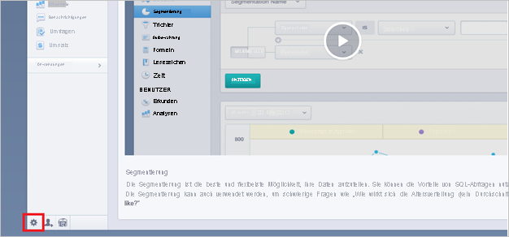
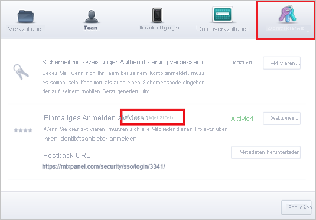
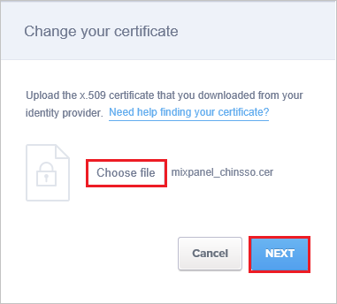
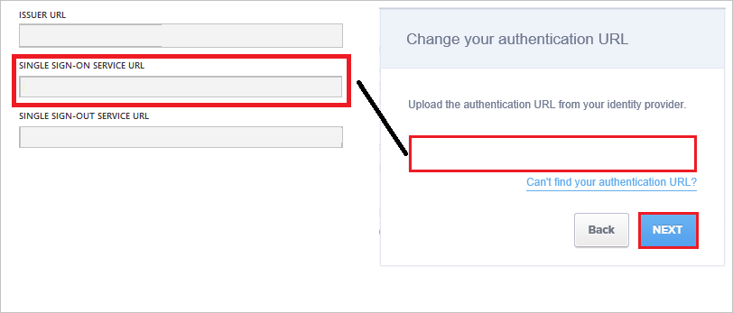
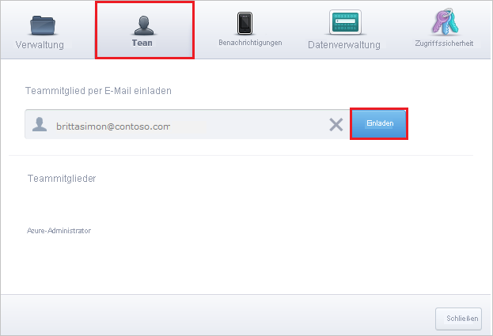

# Tutorial: Azure Active Directory-Integration mit Mixpanel

In diesem Tutorial erfahren Sie, wie Sie Mixpanel in Azure Active Directory (Azure AD) integrieren. Die Integration von Mixpanel in Azure AD ermöglicht Ihnen Folgendes:

* Sie können in Azure AD steuern, wer Zugriff auf Mixpanel hat.
* Sie können Ihren Benutzern, ermöglichen sich mit ihren Azure AD-Konten automatisch bei Mixpanel anzumelden.
* Verwalten Sie Ihre Konten zentral im Azure-Portal.

## Voraussetzungen

Für die ersten Schritte benötigen Sie Folgendes:

* Ein Azure AD-Abonnement Falls Sie über kein Abonnement verfügen, können Sie ein [kostenloses Azure-Konto](https://azure.microsoft.com/free/) verwenden.
* Ein Mixpanel-Abonnement, für das einmaliges Anmelden aktiviert ist.

## Beschreibung des Szenarios

In diesem Tutorial konfigurieren und testen Sie das einmalige Anmelden von Azure AD in einer Testumgebung.

* Mixpanel unterstützt **SP-initiiertes** einmaliges Anmelden.

> [!NOTE]
> Der Bezeichner dieser Anwendung ist ein fester Zeichenfolgenwert, daher kann in einem Mandanten nur eine Instanz konfiguriert werden.

## Hinzufügen von Mixpanel aus dem Katalog

Zum Konfigurieren der Integration von Mixpanel in Azure AD müssen Sie Mixpanel aus dem Katalog der Liste der verwalteten SaaS-Apps hinzufügen.

1. Melden Sie sich mit einem Geschäfts-, Schul- oder Unikonto oder mit einem persönlichen Microsoft-Konto beim Azure-Portal an.
1. Wählen Sie im linken Navigationsbereich den Dienst **Azure Active Directory** aus.
1. Navigieren Sie zu **Unternehmensanwendungen**, und wählen Sie dann **Alle Anwendungen** aus.
1. Wählen Sie zum Hinzufügen einer neuen Anwendung **Neue Anwendung** aus.
1. Geben Sie im Abschnitt **Aus dem Katalog hinzufügen** den Suchbegriff **Mixpanel** in das Suchfeld ein.
1. Wählen Sie die Option **Mixpanel** im Ergebnisbereich aus, und fügen Sie dann die App hinzu. Warten Sie einige Sekunden, während die App Ihrem Mandanten hinzugefügt wird.

## Konfigurieren und Testen des einmaligen Anmeldens von Azure AD für Mixpanel

Konfigurieren und testen Sie das einmalige Anmelden von Azure AD mit Mixpanel mithilfe eines Testbenutzers mit dem Namen **B. Simon**. Damit das einmalige Anmelden funktioniert, muss eine Linkbeziehung zwischen einem Azure AD-Benutzer und dem entsprechenden Benutzer in Mixpanel eingerichtet werden.

Führen Sie zum Konfigurieren und Testen des einmaligen Anmeldens von Azure AD mit Mixpanel die folgenden Schritte aus:

1. **[Konfigurieren des einmaligen Anmeldens von Azure AD](#configure-azure-ad-sso)** , um Ihren Benutzern die Verwendung dieses Features zu ermöglichen.
    1. **[Erstellen eines Azure AD-Testbenutzers](#create-an-azure-ad-test-user)** , um das einmalige Anmelden von Azure AD mit dem Testbenutzer B. Simon zu testen.
    1. **[Zuweisen des Azure AD-Testbenutzers](#assign-the-azure-ad-test-user)** , um B. Simon die Verwendung des einmaligen Anmeldens von Azure AD zu ermöglichen.
1. **[Konfigurieren des einmaligen Anmeldens für Mixpanel](#configure-mixpanel-sso)** , um die Einstellungen für einmaliges Anmelden auf der Anwendungsseite zu konfigurieren.
    1. **[Erstellen eines Mixpanel-Testbenutzers](#create-mixpanel-test-user)** , um in Mixpanel die Entsprechung von B. Simon zu erhalten, die mit der Benutzerdarstellung in Azure AD verknüpft ist.
1. **[Testen des einmaligen Anmeldens](#test-sso)** , um zu überprüfen, ob die Konfiguration funktioniert

## Konfigurieren des einmaligen Anmeldens (Single Sign-On, SSO) von Azure AD

Gehen Sie wie folgt vor, um das einmalige Anmelden von Azure AD im Azure-Portal zu aktivieren.

1. Navigieren Sie im Azure-Portal auf der Anwendungsintegrationsseite für **Mixpanel** zum Abschnitt **Verwalten** und wählen Sie **einmaliges Anmelden** aus.
1. Wählen Sie auf der Seite **SSO-Methode auswählen** die Methode **SAML** aus.
1. Klicken Sie auf der Seite **Einmaliges Anmelden (SSO) mit SAML einrichten** auf das Stiftsymbol für **Grundlegende SAML-Konfiguration**, um die Einstellungen zu bearbeiten.

   

4. Führen Sie im Abschnitt **Grundlegende SAML-Konfiguration** den folgenden Schritt aus:

    Geben Sie im Textfeld **Anmelde-URL** die URL ein: `https://mixpanel.com/login/`.

    > [!NOTE]
    > Registrieren Sie sich unter [https://mixpanel.com/register/](https://mixpanel.com/register/), um Ihre Anmeldeinformationen einzurichten, und wenden Sie sich zur Aktivierung der SSO-Einstellungen für Ihren Mandanten an das [Mixpanel-Supportteam](mailto:support@mixpanel.com). Gegebenenfalls können Sie den Wert für die Anmelde-URL auch vom Mixpanel-Supportteam erhalten. 

5. Klicken Sie auf der Seite **Einmaliges Anmelden (SSO) mit SAML einrichten** im Abschnitt **SAML-Signaturzertifikat** auf **Herunterladen**, um das Ihrer Anforderung entsprechende **Zertifikat (Base64)** aus den angegebenen Optionen herunterzuladen und auf Ihrem Computer zu speichern.

    

6. Kopieren Sie im Abschnitt **Mixpanel einrichten** die entsprechenden URLs gemäß Ihren Anforderungen.

    

### Erstellen eines Azure AD-Testbenutzers 

In diesem Abschnitt erstellen Sie im Azure-Portal einen Testbenutzer mit dem Namen B. Simon.

1. Wählen Sie im linken Bereich des Microsoft Azure-Portals **Azure Active Directory** > **Benutzer** > **Alle Benutzer** aus.
1. Wählen Sie oben im Bildschirm die Option **Neuer Benutzer** aus.
1. Führen Sie unter den Eigenschaften für **Benutzer** die folgenden Schritte aus:
   1. Geben Sie im Feld **Name** die Zeichenfolge `B.Simon` ein.  
   1. Geben Sie im Feld **Benutzername** die Zeichenfolge username@companydomain.extension ein. Beispiel: `B.Simon@contoso.com`.
   1. Aktivieren Sie das Kontrollkästchen **Kennwort anzeigen**, und notieren Sie sich den Wert aus dem Feld **Kennwort**.
   1. Klicken Sie auf **Erstellen**.

### Zuweisen des Azure AD-Testbenutzers

In diesem Abschnitt ermöglichen Sie B. Simon durch gewähren des Zugriffs auf Mixpanel die Verwendung des einmaligen Anmeldens von Azure.

1. Wählen Sie im Azure-Portal **Unternehmensanwendungen** > **Alle Anwendungen** aus.
1. Wählen Sie in der Anwendungsliste den Eintrag **Mixpanel** aus.
1. Navigieren Sie auf der Übersichtsseite der App zum Abschnitt **Verwalten**, und wählen Sie **Benutzer und Gruppen** aus.
1. Wählen Sie **Benutzer hinzufügen** und anschließend im Dialogfeld **Zuweisung hinzufügen** die Option **Benutzer und Gruppen** aus.
1. Wählen Sie im Dialogfeld **Benutzer und Gruppen** in der Liste „Benutzer“ den Eintrag **B. Simon** aus, und klicken Sie dann unten auf dem Bildschirm auf die Schaltfläche **Auswählen**.
1. Wenn den Benutzern eine Rolle zugewiesen werden soll, können Sie sie im Dropdownmenü **Rolle auswählen** auswählen. Wurde für diese App keine Rolle eingerichtet, ist die Rolle „Standardzugriff“ ausgewählt.
1. Klicken Sie im Dialogfeld **Zuweisung hinzufügen** auf die Schaltfläche **Zuweisen**.

## Konfigurieren des SSO für Mixpanel

1. Melden Sie sich in einem anderen Browserfenster in Ihrer Mixpanel-Anwendung als Administrator an.

2. Klicken in der linken unteren Ecke der Seite auf das kleine **Zahnradsymbol** . 
   
     

3. Klicken Sie auf die Registerkarte **Access security** (Zugriffssicherheit) und dann auf **Change settings** (Einstellungen ändern).
   
     

4. Klicken Sie auf der Dialogfeldseite **Change your certificate** (Zertifikat ändern) auf **Choose file** (Datei auswählen), um das heruntergeladene Zertifikat hochzuladen, und klicken Sie dann auf **NEXT** (WEITER).
   
     

5.  Fügen Sie auf der Dialogfeldseite **Change your authentication URL** (Authentifizierungs-URL ändern) im Textfeld für die Authentifizierungs-URL den Wert der **Anmelde-URL** ein, den Sie aus dem Azure-Portal kopiert haben, und klicken Sie anschließend auf **NEXT** (WEITER).
   
     

6. Klicken Sie auf **Fertig**.

### Erstellen eines Mixpanel-Testbenutzers

Das Ziel dieses Abschnitts ist das Erstellen eines Benutzers namens Britta Simon in Mixpanel. 

1. Melden Sie sich bei Ihrer Mixpanel-Unternehmenswebsite als Administrator an.

2. Klicken Sie in der linken unteren Ecke der Seite auf die kleine Zahnrad-Schaltfläche, um das Fenster **Einstellungen** zu öffnen.

3. Klicken Sie auf die Registerkarte **Team** .

4. Geben Sie im Textfeld für **Team Member** die in Azure hinterlegte E-Mail-Adresse von Britta Simon ein.
   
     

5. Klicken Sie auf **Einladen**. 

> [!Note]
> Der Benutzer erhält eine E-Mail für die Profileinrichtung.

## Testen des einmaligen Anmeldens

In diesem Abschnitt testen Sie die Azure AD-Konfiguration für einmaliges Anmelden mit den folgenden Optionen: 

* Klicken Sie im Azure-Portal auf **Diese Anwendung testen**. Dadurch werden Sie zur Anmelde-URL für Mixpanel weitergeleitet, wo Sie den Anmeldeabfluss initiieren können. 

* Navigieren Sie direkt zur Anmelde-URL für Mixpanel, und initiieren Sie dort den Anmeldeabfluss.

* Sie können „Meine Apps“ von Microsoft verwenden. Wenn Sie in „Meine Apps“ auf die Kachel „Mixpanel“ klicken, werden Sie zur Anmelde-URL für Mixpanel weitergeleitet. Weitere Informationen zu „Meine Apps“ finden Sie in [dieser Einführung](../user-help/my-apps-portal-end-user-access.md).

## Nächste Schritte

Nach dem Konfigurieren von Mixpanel können Sie die Sitzungssteuerung erzwingen, die Ihre vertraulichen Unternehmensdaten in Echtzeit vor der Exfiltration und Infiltration schützt. Die Sitzungssteuerung basiert auf bedingtem Zugriff. [Hier](/cloud-app-security/proxy-deployment-aad) erfahren Sie, wie Sie die Sitzungssteuerung mit Microsoft Cloud App Security erzwingen.