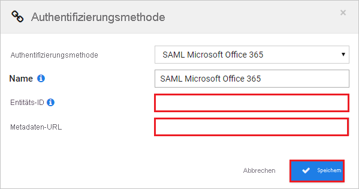
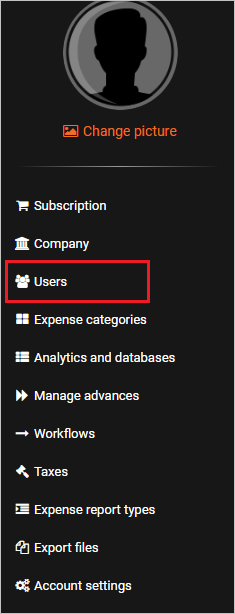

# Tutorial: Azure AD-SSO -Integration in N2F - Expense reports

In diesem Tutorial erfahren Sie, wie Sie N2F - Expense reports in Azure Active Directory (Azure AD) integrieren. Die Integration von N2F - Expense reports in Azure AD ermöglicht Ihnen Folgendes:

* Steuern in Azure AD, wer Zugriff auf N2F - Expense reports besitzt.
* Ermöglicht Benutzern, sich mit ihrem Azure AD-Konto automatisch bei N2F - Expense reports anzumelden.
* Verwalten Sie Ihre Konten zentral im Azure-Portal.

## Voraussetzungen

Für die ersten Schritte benötigen Sie Folgendes:

* Ein Azure AD-Abonnement Falls Sie über kein Abonnement verfügen, können Sie ein [kostenloses Azure-Konto](https://azure.microsoft.com/free/) verwenden.
* Ein N2F - Expense reports-Abonnement, für das einmaliges Anmelden aktiviert ist.

## Beschreibung des Szenarios

In diesem Tutorial konfigurieren und testen Sie das einmalige Anmelden von Azure AD in einer Testumgebung.

* N2F - Expense reports unterstützt **SP**- und **IDP**-initiiertes einmaliges Anmelden.

## Hinzufügen von N2F - Expense reports aus dem Katalog

Um die Integration von N2F in Azure AD zu konfigurieren, müssen Sie N2F aus dem Katalog Ihrer Liste von verwalteten SaaS-Anwendungen hinzufügen.

1. Melden Sie sich mit einem Geschäfts-, Schul- oder Unikonto oder mit einem persönlichen Microsoft-Konto beim Azure-Portal an.
1. Wählen Sie im linken Navigationsbereich den Dienst **Azure Active Directory** aus.
1. Navigieren Sie zu **Unternehmensanwendungen**, und wählen Sie dann **Alle Anwendungen** aus.
1. Wählen Sie zum Hinzufügen einer neuen Anwendung **Neue Anwendung** aus.
1. Geben Sie im Abschnitt **Aus Katalog hinzufügen** den Suchbegriff **N2F - Expense reports** in das Suchfeld ein.
1. Wählen Sie im Ergebnisbereich **N2F - Expense reports** aus, und fügen Sie die App dann hinzu. Warten Sie einige Sekunden, während die App Ihrem Mandanten hinzugefügt wird.

## Konfigurieren und Testen von Azure AD-SSO für N2F - Expense reports

Konfigurieren und testen Sie das einmalige Anmelden von Azure AD mit N2F - Expense reports mithilfe eines Testbenutzers mit dem Namen **B. Simon**. Damit einmaliges Anmelden funktioniert, muss eine Linkbeziehung zwischen einem Azure AD-Benutzer und dem entsprechenden Benutzer in N2F - Expense reports eingerichtet werden.

Führen Sie zum Konfigurieren und Testen von Azure AD-SSO mit N2F - Expense reports die folgenden Schritte aus:

1. **[Konfigurieren des einmaligen Anmeldens von Azure AD](#configure-azure-ad-sso)** , um Ihren Benutzern die Verwendung dieses Features zu ermöglichen.
    1. **[Erstellen eines Azure AD-Testbenutzers](#create-an-azure-ad-test-user)** , um das einmalige Anmelden von Azure AD mit dem Testbenutzer B. Simon zu testen.
    1. **[Zuweisen des Azure AD-Testbenutzers](#assign-the-azure-ad-test-user)** , um B. Simon die Verwendung des einmaligen Anmeldens von Azure AD zu ermöglichen.
1. **[Konfigurieren von SSO für N2F - Expense reports](#configure-n2f---expense-reports-sso)** , um die Einstellungen für einmaliges Anmelden auf der Anwendungsseite zu konfigurieren.
    1. **[Erstellen eines N2F - Expense reports-Testbenutzers](#create-n2f---expense-reports-test-user)** , um ein Pendant zu B. Simon in N2F - Expense reports zu erhalten, das mit der Darstellung in Azure AD verknüpft ist.
1. **[Testen des einmaligen Anmeldens](#test-sso)** , um zu überprüfen, ob die Konfiguration funktioniert

## Konfigurieren des einmaligen Anmeldens (Single Sign-On, SSO) von Azure AD

Gehen Sie wie folgt vor, um das einmalige Anmelden von Azure AD im Azure-Portal zu aktivieren.

1. Navigieren Sie im Azure-Portal auf der Anwendungsintegrationsseite für **N2F - Expense reports** zum Abschnitt **Verwalten**, und wählen Sie **Einmaliges Anmelden** aus.
1. Wählen Sie auf der Seite **SSO-Methode auswählen** die Methode **SAML** aus.
1. Klicken Sie auf der Seite **Einmaliges Anmelden (SSO) mit SAML einrichten** auf das Stiftsymbol für **Grundlegende SAML-Konfiguration**, um die Einstellungen zu bearbeiten.

   

4. Wenn Sie die Anwendung im **IDP**-initiierten Modus konfigurieren möchten, müssen Sie im Abschnitt **Grundlegende SAML-Konfiguration** keine Schritte ausführen, da die App bereits vorab in Azure integriert wurde.

5. Klicken Sie auf **Zusätzliche URLs festlegen**, und führen Sie den folgenden Schritt aus, wenn Sie die Anwendung im **SP-initiierten Modus** konfigurieren möchten:

    Geben Sie im Textfeld **Anmelde-URL** die URL ein: `https://www.n2f.com/app/`.

6. Klicken Sie auf der Seite **Einmaliges Anmelden (SSO) mit SAML einrichten** im Abschnitt **SAML-Signaturzertifikat** auf die Schaltfläche „Kopieren“, um die **App-Verbundmetadaten-URL** zu kopieren, und speichern Sie sie auf Ihrem Computer.

    

7. Kopieren Sie im Abschnitt **myPolicies einrichten** die entsprechenden URLs gemäß Ihren Anforderungen.

    

### Erstellen eines Azure AD-Testbenutzers 

In diesem Abschnitt erstellen Sie im Azure-Portal einen Testbenutzer mit dem Namen B. Simon.

1. Wählen Sie im linken Bereich des Microsoft Azure-Portals **Azure Active Directory** > **Benutzer** > **Alle Benutzer** aus.
1. Wählen Sie oben im Bildschirm die Option **Neuer Benutzer** aus.
1. Führen Sie unter den Eigenschaften für **Benutzer** die folgenden Schritte aus:
   1. Geben Sie im Feld **Name** die Zeichenfolge `B.Simon` ein.  
   1. Geben Sie im Feld **Benutzername** die Zeichenfolge username@companydomain.extension ein. Beispiel: `B.Simon@contoso.com`.
   1. Aktivieren Sie das Kontrollkästchen **Kennwort anzeigen**, und notieren Sie sich den Wert aus dem Feld **Kennwort**.
   1. Klicken Sie auf **Erstellen**.

### Zuweisen des Azure AD-Testbenutzers

In diesem Abschnitt ermöglichen Sie Azure-SSO für B. Simon, indem Sie Zugriff auf N2F - Expense reports gewähren.

1. Wählen Sie im Azure-Portal **Unternehmensanwendungen** > **Alle Anwendungen** aus.
1. Wählen Sie in der Anwendungsliste **N2F** aus.
1. Navigieren Sie auf der Übersichtsseite der App zum Abschnitt **Verwalten**, und wählen Sie **Benutzer und Gruppen** aus.
1. Wählen Sie **Benutzer hinzufügen** und anschließend im Dialogfeld **Zuweisung hinzufügen** die Option **Benutzer und Gruppen** aus.
1. Wählen Sie im Dialogfeld **Benutzer und Gruppen** in der Liste „Benutzer“ den Eintrag **B. Simon** aus, und klicken Sie dann unten auf dem Bildschirm auf die Schaltfläche **Auswählen**.
1. Wenn den Benutzern eine Rolle zugewiesen werden soll, können Sie sie im Dropdownmenü **Rolle auswählen** auswählen. Wurde für diese App keine Rolle eingerichtet, ist die Rolle „Standardzugriff“ ausgewählt.
1. Klicken Sie im Dialogfeld **Zuweisung hinzufügen** auf die Schaltfläche **Zuweisen**.

## Konfigurieren von SSO für N2F - Expense reports

1. Melden Sie sich in einem anderen Webbrowserfenster auf der N2F-Unternehmenswebsite als Administrator an.

2. Klicken Sie auf **Settings** (Einstellungen), und wählen Sie aus der Dropdownliste **Advanced Settings** (Erweiterte Einstellungen) aus.

    

3. Wählen Sie die Registerkarte **Account settings** (Kontoeinstellungen) aus.

    

4. Wählen Sie **Authentication** (Authentifizierung) und dann die Registerkarte **+ Add an authentication method** (Authentifizierungsmethode hinzufügen) aus.

    

5. Wählen Sie als Authentifizierungsmethode **SAML Microsoft Office 365** (Microsoft Office 365-SAML) aus.

    

6. Führen Sie im Abschnitt **Authentication method** (Authentifizierungsmethode) die folgenden Schritte aus:

    

    a. Fügen Sie in das Textfeld **Entity ID** (Entitäts-ID) den Wert für den **Azure AD-Bezeichner** ein, den Sie aus dem Azure-Portal kopiert haben.

    b. Fügen Sie im Textfeld **Metadata URL** (Metadaten-URL) den Wert der **Verbundmetadaten-URL der App** ein, den Sie aus dem Azure-Portal kopiert haben.

    c. Klicken Sie auf **Speichern**.

### Erstellen eines N2F - Expense reports-Testbenutzers

Azure AD-Benutzer müssen in N2F bereitgestellt werden, um sich bei N2F anmelden zu können. Im Fall von N2F muss die Bereitstellung manuell erfolgen.

**Führen Sie zum Bereitstellen eines Benutzerkontos die folgenden Schritte aus:**

1. Melden Sie sich auf der N2F-Unternehmenswebsite als Administrator an.

2. Klicken Sie auf **Settings** (Einstellungen), und wählen Sie aus der Dropdownliste **Advanced Settings** (Erweiterte Einstellungen) aus.

    

3. Wählen Sie links im Navigationsbereich die Registerkarte **Users** (Benutzer) aus.

    

4. Wählen Sie die Registerkarte **+ New user** (Neuer Benutzer) aus.

    

5. Führen Sie im Abschnitt **User** (Benutzer) die folgenden Schritte aus:

    

    a. Geben Sie im Textfeld **Email address** (E-Mail-Adresse) die E-Mail-Adresse des Benutzers ein, z. B. **brittasimon\@contoso.com**.

    b. Geben Sie im Textfeld **Vorname** den Vornamen des Benutzers ein (z.B. **Britta**).

    c. Geben Sie im Textfeld **Name** den Namen des Benutzers ein, z.B. **BrittaSimon**.

    d. Wählen Sie **Role, Direct manager (N+1)** (Rolle, Direkter Vorgesetzter (N+1)) und **Division** (Abteilung) gemäß Ihren Organisationsanforderungen aus.

    e. Klicken Sie auf **Validate and send invitation** (Bestätigen und Einladung senden).

    > [!NOTE]
    > Wenn beim Hinzufügen des Benutzers Probleme auftreten, wenden Sie sich an das [N2F-Supportteam](mailto:support@n2f.com).

## Testen des einmaligen Anmeldens

In diesem Abschnitt testen Sie die Azure AD-Konfiguration für einmaliges Anmelden mit den folgenden Optionen: 

#### SP-initiiert:

* Klicken Sie im Azure-Portal auf **Diese Anwendung testen**. Dadurch werden Sie zur Anmelde-URL für N2F - Expense reports weitergeleitet. Dort können Sie den Anmeldeablauf initiieren.  

* Navigieren Sie direkt zur Anmelde-URL von N2F - Expense reports, und initiieren Sie dort den Anmeldeflow.

#### IDP-initiiert:

* Klicken Sie im Azure-Portal auf **Diese Anwendung testen**. Dadurch sollten Sie automatisch bei der N2F - Expense reports-Instanz angemeldet werden, für die Sie einmaliges Anmelden eingerichtet haben. 

Sie können auch den Microsoft-Bereich „Meine Apps“ verwenden, um die Anwendung in einem beliebigen Modus zu testen. Beim Klicken auf die Kachel „N2F - Expense reports“ in „Meine Apps“ geschieht Folgendes: Wenn Sie die Anwendung im SP-Modus konfiguriert haben, werden Sie zum Initiieren des Anmeldeflows zur Anmeldeseite der Anwendung weitergeleitet. Wenn Sie die Anwendung im IDP-Modus konfiguriert haben, sollten Sie automatisch bei der N2F - Expense reports-Instanz angemeldet werden, für die Sie einmaliges Anmelden eingerichtet haben. Weitere Informationen zu „Meine Apps“ finden Sie in [dieser Einführung](../user-help/my-apps-portal-end-user-access.md).

## Nächste Schritte

Nach dem Konfigurieren von N2F - Expense reports können Sie die Sitzungssteuerung erzwingen, die in Echtzeit vor der Exfiltration und Infiltration vertraulicher Unternehmensdaten schützt. Die Sitzungssteuerung basiert auf bedingtem Zugriff. [Hier](/cloud-app-security/proxy-deployment-aad) erfahren Sie, wie Sie die Sitzungssteuerung mit Microsoft Cloud App Security erzwingen.