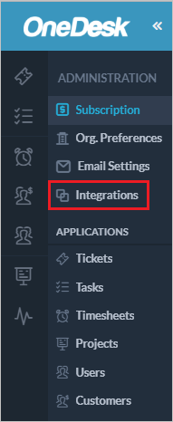
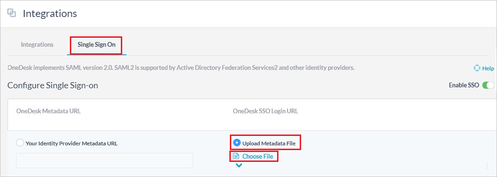

# Tutorial: Integration des einmaligen Anmeldens (Single Sign-On, SSO) von Azure AD mit OneDesk

In diesem Tutorial erfahren Sie, wie Sie OneDesk in Azure Active Directory (Azure AD) integrieren. Die Integration von OneDesk in Azure AD ermöglicht Folgendes:

* Steuern Sie in Azure AD, wer Zugriff auf OneDesk hat.
* Ermöglichen Sie es Ihren Benutzern, sich mit ihren Azure AD-Konten automatisch bei OneDesk anzumelden.
* Verwalten Sie Ihre Konten zentral im Azure-Portal.

## Voraussetzungen

Für die ersten Schritte benötigen Sie Folgendes:

* Ein Azure AD-Abonnement Falls Sie über kein Abonnement verfügen, können Sie ein [kostenloses Azure-Konto](https://azure.microsoft.com/free/) verwenden.
* Ein OneDesk-Abonnement, für das einmaliges Anmelden (Single Sign-On, SSO) aktiviert ist

## Beschreibung des Szenarios

In diesem Tutorial konfigurieren und testen Sie das einmalige Anmelden von Azure AD in einer Testumgebung.

* OneDesk unterstützt **SP- und IDP-initiiertes** einmaliges Anmelden.
* OneDesk unterstützt die **Just-In-Time**-Benutzerbereitstellung.

## Hinzufügen von OneDesk aus dem Katalog

Zum Konfigurieren der Integration von OneDesk in Azure AD müssen Sie OneDesk aus dem Katalog der Liste mit den verwalteten SaaS-Apps hinzufügen.

1. Melden Sie sich mit einem Geschäfts-, Schul- oder Unikonto oder mit einem persönlichen Microsoft-Konto beim Azure-Portal an.
1. Wählen Sie im linken Navigationsbereich den Dienst **Azure Active Directory** aus.
1. Navigieren Sie zu **Unternehmensanwendungen**, und wählen Sie dann **Alle Anwendungen** aus.
1. Wählen Sie zum Hinzufügen einer neuen Anwendung **Neue Anwendung** aus.
1. Geben Sie im Abschnitt **Aus Katalog hinzufügen** den Suchbegriff **OneDesk** in das Suchfeld ein.
1. Wählen Sie im Ergebnisbereich **OneDesk** aus, und fügen Sie dann die App hinzu. Warten Sie einige Sekunden, während die App Ihrem Mandanten hinzugefügt wird.

## Konfigurieren und Testen des einmaligen Anmeldens von Azure AD für OneDesk

Konfigurieren und testen Sie das einmalige Anmelden von Azure AD mit OneDesk mithilfe eines Testbenutzers mit dem Namen **B. Simon**. Damit einmaliges Anmelden funktioniert, muss eine Linkbeziehung zwischen einem Azure AD-Benutzer und dem entsprechenden Benutzer in OneDesk eingerichtet werden.

Führen Sie die folgenden Schritte aus, um das einmalige Anmelden von Azure AD mit OneDesk zu konfigurieren und zu testen:

1. **[Konfigurieren des einmaligen Anmeldens von Azure AD](#configure-azure-ad-sso)** , um Ihren Benutzern die Verwendung dieses Features zu ermöglichen.
    1. **[Erstellen eines Azure AD-Testbenutzers](#create-an-azure-ad-test-user)** , um das einmalige Anmelden von Azure AD mit dem Testbenutzer B. Simon zu testen.
    1. **[Zuweisen des Azure AD-Testbenutzers](#assign-the-azure-ad-test-user)** , um B. Simon die Verwendung des einmaligen Anmeldens von Azure AD zu ermöglichen.
1. **[Konfigurieren des einmaligen Anmeldens für OneDesk](#configure-onedesk-sso)** , um die Einstellungen für einmaliges Anmelden auf der Anwendungsseite zu konfigurieren
    1. **[Erstellen eines OneDesk-Testbenutzers](#create-onedesk-test-user)** , um eine Entsprechung von B. Simon in OneDesk zu erhalten, die mit ihrer Darstellung in Azure AD verknüpft ist
1. **[Testen des einmaligen Anmeldens](#test-sso)** , um zu überprüfen, ob die Konfiguration funktioniert

## Konfigurieren des einmaligen Anmeldens (Single Sign-On, SSO) von Azure AD

Gehen Sie wie folgt vor, um das einmalige Anmelden von Azure AD im Azure-Portal zu aktivieren.

1. Navigieren Sie im Azure-Portal auf der Anwendungsintegrationsseite für **OneDesk** zum Abschnitt **Verwalten**, und wählen Sie **Einmaliges Anmelden** aus.
1. Wählen Sie auf der Seite **SSO-Methode auswählen** die Methode **SAML** aus.
1. Klicken Sie auf der Seite **Einmaliges Anmelden (SSO) mit SAML einrichten** auf das Stiftsymbol für **Grundlegende SAML-Konfiguration**, um die Einstellungen zu bearbeiten.

   

1. Führen Sie im Abschnitt **Grundlegende SAML-Konfiguration** die folgenden Schritte aus, wenn Sie die Anwendung im **IDP-initiierten** Modus konfigurieren möchten:

    a. Geben Sie im Textfeld **Bezeichner** einen Wert nach folgendem Muster ein: `onedesk.com_<specific_tenant_string>`

    b. Geben Sie im Textfeld **Antwort-URL** eine URL im folgenden Format ein: `https://app.onedesk.com/sso/saml/SSO/alias/onedesk.com_<specific_tenant_string>`

1. Klicken Sie auf **Zusätzliche URLs festlegen**, und führen Sie den folgenden Schritt aus, wenn Sie die Anwendung im **SP-initiierten Modus** konfigurieren möchten:

    Geben Sie im Textfeld **Anmelde-URL** eine URL im folgenden Format ein: `https://app.onedesk.com/sso/saml/login/alias/onedesk.com_<specific_tenant_string>`

    > [!NOTE]
    > Hierbei handelt es sich um Beispielwerte. Sie müssen diese Werte mit dem tatsächlichen Bezeichner, der Antwort-URL und der Anmelde-URL aktualisieren. Diese Werte erhalten Sie vom [OneDesk-Supportteam](mailto:hello@onedesk.com). Sie können sich auch die Muster im Abschnitt **Grundlegende SAML-Konfiguration** im Azure-Portal ansehen.

1. Navigieren Sie auf der Seite **Einmaliges Anmelden (SSO) mit SAML einrichten** im Abschnitt **SAML-Signaturzertifikat** zu **Verbundmetadaten-XML**, und wählen Sie **Herunterladen** aus, um das Zertifikat herunterzuladen und auf Ihrem Computer zu speichern.

    

1. Kopieren Sie im Abschnitt **OneDesk einrichten** die entsprechenden URLs gemäß Ihren Anforderungen.

    

### Erstellen eines Azure AD-Testbenutzers

In diesem Abschnitt erstellen Sie im Azure-Portal einen Testbenutzer mit dem Namen B. Simon.

1. Wählen Sie im linken Bereich des Microsoft Azure-Portals **Azure Active Directory** > **Benutzer** > **Alle Benutzer** aus.
1. Wählen Sie oben im Bildschirm die Option **Neuer Benutzer** aus.
1. Führen Sie unter den Eigenschaften für **Benutzer** die folgenden Schritte aus:
   1. Geben Sie im Feld **Name** die Zeichenfolge `B.Simon` ein.  
   1. Geben Sie im Feld **Benutzername** die Zeichenfolge username@companydomain.extension ein. Beispiel: `B.Simon@contoso.com`.
   1. Aktivieren Sie das Kontrollkästchen **Kennwort anzeigen**, und notieren Sie sich den Wert aus dem Feld **Kennwort**.
   1. Klicken Sie auf **Erstellen**.

### Zuweisen des Azure AD-Testbenutzers

In diesem Abschnitt ermöglichen Sie B. Simon die Verwendung des einmaligen Anmeldens von Azure, indem Sie ihr Zugriff auf OneDesk gewähren.

1. Wählen Sie im Azure-Portal **Unternehmensanwendungen** > **Alle Anwendungen** aus.
1. Wählen Sie in der Anwendungsliste **OneDesk** aus.
1. Navigieren Sie auf der Übersichtsseite der App zum Abschnitt **Verwalten**, und wählen Sie **Benutzer und Gruppen** aus.
1. Wählen Sie **Benutzer hinzufügen** und anschließend im Dialogfeld **Zuweisung hinzufügen** die Option **Benutzer und Gruppen** aus.
1. Wählen Sie im Dialogfeld **Benutzer und Gruppen** in der Liste „Benutzer“ den Eintrag **B. Simon** aus, und klicken Sie dann unten auf dem Bildschirm auf die Schaltfläche **Auswählen**.
1. Wenn Sie einen beliebigen Rollenwert in der SAML-Assertion erwarten, wählen Sie im Dialogfeld **Rolle auswählen** die entsprechende Rolle für den Benutzer in der Liste aus, und klicken Sie dann im unteren Bildschirmbereich auf die Schaltfläche **Auswählen**.
1. Klicken Sie im Dialogfeld **Zuweisung hinzufügen** auf die Schaltfläche **Zuweisen**.

## Konfigurieren des einmaligen Anmeldens für OneDesk

1. Wenn Sie die Konfiguration in OneDesk automatisieren möchten, müssen Sie die **Browsererweiterung „Meine Apps“ für die sichere Anmeldung** installieren, indem Sie auf **Erweiterung installieren** klicken.

    

1. Klicken Sie nach dem Hinzufügen der Erweiterung zum Browser auf **OneDesk einrichten**, um zur Anwendung OneDesk weitergeleitet zu werden. Geben Sie dort die Administratoranmeldeinformationen ein, um sich bei OneDesk anzumelden. Die Browsererweiterung konfiguriert die Anwendung automatisch für Sie und automatisiert die Schritte 3 bis 5.

    

1. Wenn Sie OneDesk manuell einrichten möchten, melden Sie sich in einem neuen Webbrowserfenster bei der OneDesk-Unternehmenswebsite als Administrator an, und führen Sie die folgenden Schritte aus:

1. Klicken Sie auf die Registerkarte **Integrations** (Integrationen).

    

1. Klicken Sie auf die Registerkarte **Single Sign On** (Einmaliges Anmelden), wählen Sie **Upload Metadata File** (Metadatendatei hochladen) aus, und klicken Sie auf **Choose File** (Datei auswählen), um die Metadatendatei hochzuladen, die Sie aus dem Azure-Portal heruntergeladen haben.

    

### Erstellen eines OneDesk-Testbenutzers

In diesem Abschnitt wird in OneDesk ein Benutzer namens B. Simon erstellt. OneDesk unterstützt die Just-in-Time-Benutzerbereitstellung (standardmäßig aktiviert). Für Sie steht in diesem Abschnitt kein Aktionselement zur Verfügung. Ist ein Benutzer noch nicht in OneDesk vorhanden, wird nach der Authentifizierung ein neuer Benutzer erstellt.

## Testen des einmaligen Anmeldens

In diesem Abschnitt testen Sie die Azure AD-Konfiguration für einmaliges Anmelden mit den folgenden Optionen: 

#### SP-initiiert:

* Klicken Sie im Azure-Portal auf **Diese Anwendung testen**. Dadurch werden Sie zur Anmelde-URL für OneDesk weitergeleitet, wo Sie den Anmeldeflow initiieren können.  

* Navigieren Sie direkt zur Anmelde-URL von OneDesk, und initiieren Sie dort den Anmeldeflow.

#### IDP-initiiert:

* Klicken Sie im Azure-Portal auf **Diese Anwendung testen**. Dadurch sollten Sie automatisch bei der OneDesk-Instanz angemeldet werden, für die Sie einmaliges Anmelden eingerichtet haben. 

Sie können auch den Microsoft-Bereich „Meine Apps“ verwenden, um die Anwendung in einem beliebigen Modus zu testen. Beim Klicken auf die Kachel „OneDesk“ unter „Meine Apps“ geschieht Folgendes: Wenn Sie die Anwendung im SP-Modus konfiguriert haben, werden Sie zum Initiieren des Anmeldeflows zur Anmeldeseite der Anwendung weitergeleitet. Wenn Sie die Anwendung im IDP-Modus konfiguriert haben, sollten Sie automatisch bei der OneDesk-Instanz angemeldet werden, für die Sie einmaliges Anmelden eingerichtet haben. Weitere Informationen zu „Meine Apps“ finden Sie in [dieser Einführung](../user-help/my-apps-portal-end-user-access.md).

## Nächste Schritte

Nach dem Konfigurieren von OneDesk können Sie die Sitzungssteuerung erzwingen, die in Echtzeit vor der Exfiltration und Infiltration vertraulicher Unternehmensdaten schützt. Die Sitzungssteuerung basiert auf bedingtem Zugriff. [Hier](/cloud-app-security/proxy-deployment-aad) erfahren Sie, wie Sie die Sitzungssteuerung mit Microsoft Cloud App Security erzwingen.