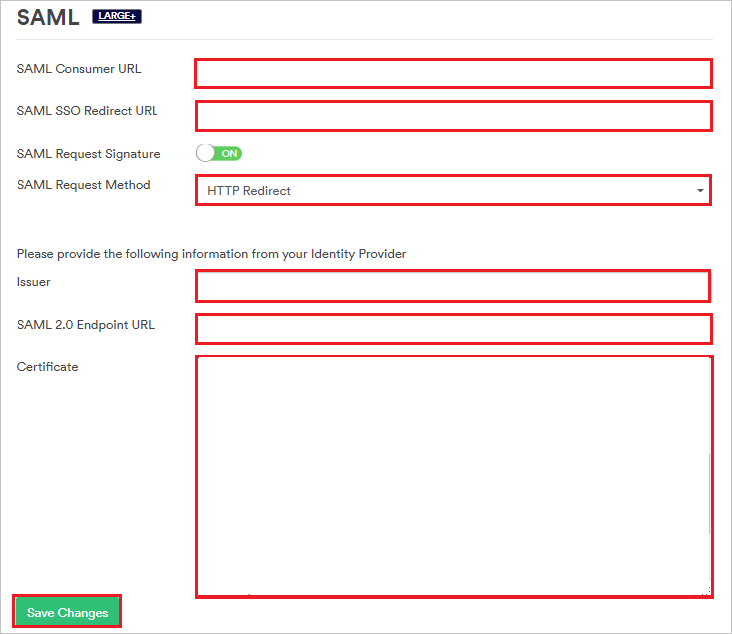
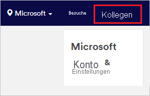
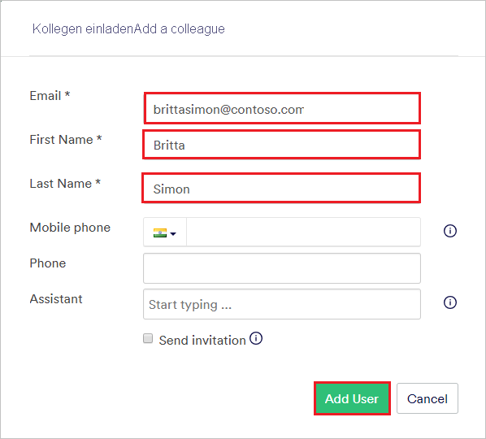

# Tutorial: Azure Active Directory-Integration in Proxyclick

In diesem Tutorial erfahren Sie, wie Sie Proxyclick in Azure Active Directory (Azure AD) integrieren. Die Integration von Proxyclick in Azure AD ermöglicht Folgendes:

* Steuern Sie in Azure AD, wer Zugriff auf Proxyclick hat.
* Ermöglichen Sie es Ihren Benutzern, sich mit ihren Azure AD-Konten automatisch bei Proxyclick anzumelden.
* Verwalten Sie Ihre Konten zentral im Azure-Portal.

## Voraussetzungen

Für die ersten Schritte benötigen Sie Folgendes:

* Ein Azure AD-Abonnement Falls Sie über kein Abonnement verfügen, können Sie ein [kostenloses Azure-Konto](https://azure.microsoft.com/free/) verwenden.
* Ein Proxyclick-Abonnement, für das einmaliges Anmelden aktiviert ist.

## Beschreibung des Szenarios

In diesem Tutorial konfigurieren und testen Sie das einmalige Anmelden von Azure AD in einer Testumgebung.

* Proxyclick unterstützt SP- und IdP-initiiertes einmaliges Anmelden.

## Hinzufügen von Proxyclick aus dem Katalog

Zum Konfigurieren der Integration von Proxyclick in Azure AD müssen Sie Proxyclick aus dem Katalog der Liste mit den verwalteten SaaS-Apps hinzufügen.

1. Melden Sie sich mit einem Geschäfts-, Schul- oder Unikonto oder mit einem persönlichen Microsoft-Konto beim Azure-Portal an.
1. Wählen Sie im linken Navigationsbereich den Dienst **Azure Active Directory** aus.
1. Navigieren Sie zu **Unternehmensanwendungen**, und wählen Sie dann **Alle Anwendungen** aus.
1. Wählen Sie zum Hinzufügen einer neuen Anwendung **Neue Anwendung** aus.
1. Geben Sie im Abschnitt **Aus Katalog hinzufügen** den Suchbegriff **Proxyclick** in das Suchfeld ein.
1. Wählen Sie im Ergebnisbereich **Proxyclick** aus, und fügen Sie dann die App hinzu. Warten Sie einige Sekunden, während die App Ihrem Mandanten hinzugefügt wird.

## Konfigurieren und Testen des einmaligen Anmeldens von Azure AD für Proxyclick

Konfigurieren und testen Sie das einmalige Anmelden von Azure AD mit Proxyclick mithilfe eines Testbenutzers mit dem Namen **B. Simon**. Damit einmaliges Anmelden funktioniert, muss eine Linkbeziehung zwischen einem Azure AD-Benutzer und dem entsprechenden Benutzer in Proxyclick eingerichtet werden.

Führen Sie die folgenden Schritte aus, um das einmalige Anmelden von Azure AD mit Proxyclick zu konfigurieren und zu testen:

1. **[Konfigurieren des einmaligen Anmeldens von Azure AD](#configure-azure-ad-sso)** , um Ihren Benutzern die Verwendung dieses Features zu ermöglichen.
    1. **[Erstellen eines Azure AD-Testbenutzers](#create-an-azure-ad-test-user)** , um das einmalige Anmelden von Azure AD mit dem Testbenutzer B. Simon zu testen.
    1. **[Zuweisen des Azure AD-Testbenutzers](#assign-the-azure-ad-test-user)** , um B. Simon die Verwendung des einmaligen Anmeldens von Azure AD zu ermöglichen.
1. **[Konfigurieren des einmaligen Anmeldens für Proxyclick](#configure-proxyclick-sso)** , um die Einstellungen für einmaliges Anmelden auf der Anwendungsseite zu konfigurieren
    1. **[Erstellen eines Proxyclick-Testbenutzers](#create-proxyclick-test-user)** , um eine Entsprechung von B. Simon in Proxyclick zu erhalten, die mit der Darstellung des Benutzers in Azure AD verknüpft ist
1. **[Testen des einmaligen Anmeldens](#test-sso)** , um zu überprüfen, ob die Konfiguration funktioniert

## Konfigurieren des einmaligen Anmeldens (Single Sign-On, SSO) von Azure AD

Gehen Sie wie folgt vor, um das einmalige Anmelden von Azure AD im Azure-Portal zu aktivieren.

1. Navigieren Sie im Azure-Portal auf der Anwendungsintegrationsseite für **Proxyclick** zum Abschnitt **Verwalten**, und wählen Sie **Einmaliges Anmelden** aus.
1. Wählen Sie auf der Seite **SSO-Methode auswählen** die Methode **SAML** aus.
1. Klicken Sie auf der Seite **Einmaliges Anmelden (SSO) mit SAML einrichten** auf das Stiftsymbol für **Grundlegende SAML-Konfiguration**, um die Einstellungen zu bearbeiten.

   

4. Führen Sie im Dialogfeld **Grundlegende SAML-Konfiguration** die folgenden Schritte aus, wenn Sie die Anwendung im IdP-initiierten Modus konfigurieren möchten.
    
    a. Geben Sie im Feld **Bezeichner** eine URL im folgenden Format ein: `https://saml.proxyclick.com/init/<COMPANY_ID>`.

    b. Geben Sie im Feld **Antwort-URL** eine URL im folgenden Format ein: `https://saml.proxyclick.com/consume/<COMPANY_ID>`

5. Wenn Sie die Anwendung im SP-initiierten Modus konfigurieren möchten, wählen Sie **Zusätzliche URLs festlegen** aus. Geben Sie im Textfeld **Anmelde-URL** eine URL nach folgendem Muster ein:
   
   `https://saml.proxyclick.com/init/<COMPANY_ID>`

    > [!NOTE]
    > Diese Werte sind Platzhalter. Sie müssen die tatsächlichen Werte für Bezeichner, Antwort-URL und Anmelde-URL verwenden. Die Schritte zum Abrufen dieser Werte werden später in diesem Tutorial beschrieben.

6. Wählen Sie auf der Seite **Einmaliges Anmelden (SSO) mit SAML einrichten** im Abschnitt **SAML-Signaturzertifikat** den Link **Herunterladen** neben **Zertifikat (Base64)** gemäß Ihren Anforderungen aus, und speichern Sie das Zertifikat auf Ihrem Computer:

    

7. Kopieren Sie im Abschnitt **Proxyclick einrichten** die entsprechenden URLs gemäß Ihren Anforderungen:

    

### Erstellen eines Azure AD-Testbenutzers

In diesem Abschnitt erstellen Sie im Azure-Portal einen Testbenutzer mit dem Namen B. Simon.

1. Wählen Sie im linken Bereich des Microsoft Azure-Portals **Azure Active Directory** > **Benutzer** > **Alle Benutzer** aus.
1. Wählen Sie oben im Bildschirm die Option **Neuer Benutzer** aus.
1. Führen Sie unter den Eigenschaften für **Benutzer** die folgenden Schritte aus:
   1. Geben Sie im Feld **Name** die Zeichenfolge `B.Simon` ein.  
   1. Geben Sie im Feld **Benutzername** die Zeichenfolge username@companydomain.extension ein. Beispiel: `B.Simon@contoso.com`.
   1. Aktivieren Sie das Kontrollkästchen **Kennwort anzeigen**, und notieren Sie sich den Wert aus dem Feld **Kennwort**.
   1. Klicken Sie auf **Erstellen**.

### Zuweisen des Azure AD-Testbenutzers

In diesem Abschnitt ermöglichen Sie B. Simon die Verwendung des einmaligen Anmeldens von Azure, indem Sie Zugriff auf Proxyclick gewähren.

1. Wählen Sie im Azure-Portal **Unternehmensanwendungen** > **Alle Anwendungen** aus.
1. Wählen Sie in der Anwendungsliste **Proxyclick** aus.
1. Navigieren Sie auf der Übersichtsseite der App zum Abschnitt **Verwalten**, und wählen Sie **Benutzer und Gruppen** aus.
1. Wählen Sie **Benutzer hinzufügen** und anschließend im Dialogfeld **Zuweisung hinzufügen** die Option **Benutzer und Gruppen** aus.
1. Wählen Sie im Dialogfeld **Benutzer und Gruppen** in der Liste „Benutzer“ den Eintrag **B. Simon** aus, und klicken Sie dann unten auf dem Bildschirm auf die Schaltfläche **Auswählen**.
1. Wenn den Benutzern eine Rolle zugewiesen werden soll, können Sie sie im Dropdownmenü **Rolle auswählen** auswählen. Wurde für diese App keine Rolle eingerichtet, ist die Rolle „Standardzugriff“ ausgewählt.
1. Klicken Sie im Dialogfeld **Zuweisung hinzufügen** auf die Schaltfläche **Zuweisen**.

## Konfigurieren des einmaligen Anmeldens für Proxyclick

1. Melden Sie sich in einem neuen Webbrowserfenster auf der Proxyclick-Unternehmenswebsite als Administrator an.

2. Wählen Sie **Account & Settings** (Konto & Einstellungen) aus.

    

3. Scrollen Sie nach unten zum Abschnitt **Integrations** (Integrationen), und wählen Sie **SAML** aus.

    

4. Führen Sie im Abschnitt **SAML** (SAML) die folgenden Schritte aus:

    

    1. Kopieren Sie den Wert für **SAML Consumer URL** (SAML-Consumer-URL), und fügen Sie ihn im Azure-Portal im Abschnitt **Grundlegende SAML-Konfiguration** in das Textfeld **Antwort-URL** ein.

    1. Kopieren Sie den Wert für **SAML SSO Redirect URL** (Umleitungs-URL für SAML-SSO), und fügen Sie ihn im Azure-Portal im Abschnitt **Grundlegende SAML-Konfiguration** in die Felder **Anmelde-URL** und **Bezeichner** ein.

    1. Wählen Sie in der Liste **SAML Request Method** (SAML-Anforderungsmethode) die Option **HTTP Redirect** (HTTP-Umleitung) aus.

    1. Fügen Sie im Feld **Issuer** (Aussteller) den Wert für den **Azure AD-Bezeichner** ein, den Sie aus dem Azure-Portal kopiert haben.

    1. Fügen Sie im Feld **SAML 2.0 Endpoint URL** (SAML 2.0-Endpunkt-URL) die **Anmelde-URL** ein, die Sie aus dem Azure-Portal kopiert haben.

    1. Öffnen Sie im Editor die Zertifikatdatei, die Sie aus dem Azure-Portal heruntergeladen haben. Fügen Sie den Inhalt dieser Datei in das Feld **Certificate** (Zertifikat) ein.

    1. Klicken Sie auf **Save changes** (Änderungen speichern).

### Erstellen eines Proxyclick-Testbenutzers

Damit sich Azure AD-Benutzer bei Proxyclick anmelden können, müssen Sie sie in Proxyclick hinzufügen. Sie müssen diese manuell hinzufügen.

Zum Erstellen eines Benutzerkontos führen Sie die folgenden Schritte aus:

1. Melden Sie sich auf der Proxyclick-Unternehmenswebsite als Administrator an.

1. Wählen Sie oben im Fenster die Option **Colleagues** (Kollegen) aus.

    

1. Wählen Sie **Add Colleague** (Kollegen hinzufügen) aus.

    

1. Führen Sie im Abschnitt **Add a colleague** (Kollegen hinzufügen) die folgenden Schritte aus:

    

    1. Geben Sie im Feld **Email** (E-Mail) die E-Mail-Adresse des Benutzers ein. In diesem Fall: **brittasimon\@contoso.com**.

    1. Geben Sie im Textfeld **First Name** (Vorname) den Vornamen des Benutzers ein. In diesem Fall ist dies **Britta**.

    1. Geben Sie im Textfeld **Last Name** (Nachname) den Nachnamen des Benutzers ein. In diesem Fall ist dies **Simon**.

    1. Wählen Sie **Add User** (Benutzer hinzufügen) aus.

## Testen des einmaligen Anmeldens

In diesem Abschnitt testen Sie die Azure AD-Konfiguration für einmaliges Anmelden mit den folgenden Optionen: 

#### SP-initiiert:

* Klicken Sie im Azure-Portal auf **Diese Anwendung testen**. Dadurch werden Sie zur Anmelde-URL für Proxyclick weitergeleitet, wo Sie den Anmeldeflow initiieren können.  

* Navigieren Sie direkt zur Anmelde-URL für Proxyclick, und initiieren Sie dort den Anmeldeflow.

#### IDP-initiiert:

* Klicken Sie im Azure-Portal auf **Diese Anwendung testen**. Dadurch sollten Sie automatisch bei der Proxyclick-Instanz angemeldet werden, für die Sie einmaliges Anmelden eingerichtet haben. 

Sie können auch den Microsoft-Bereich „Meine Apps“ verwenden, um die Anwendung in einem beliebigen Modus zu testen. Beim Klicken auf die Kachel „Proxyclick“ in „Meine Apps“ geschieht Folgendes: Wenn Sie den SP-Modus konfiguriert haben, werden Sie zum Initiieren des Anmeldeflows zur Anmeldeseite der Anwendung weitergeleitet. Wenn Sie den IDP-Modus konfiguriert haben, sollten Sie automatisch bei der Proxyclick-Instanz angemeldet werden, für die Sie einmaliges Anmelden eingerichtet haben. Weitere Informationen zu „Meine Apps“ finden Sie in [dieser Einführung](../user-help/my-apps-portal-end-user-access.md).

## Nächste Schritte

Nach dem Konfigurieren von Proxyclick können Sie die Sitzungssteuerung erzwingen, die in Echtzeit vor der Exfiltration und Infiltration vertraulicher Unternehmensdaten schützt. Die Sitzungssteuerung basiert auf bedingtem Zugriff. [Hier](/cloud-app-security/proxy-deployment-aad) erfahren Sie, wie Sie die Sitzungssteuerung mit Microsoft Cloud App Security erzwingen.