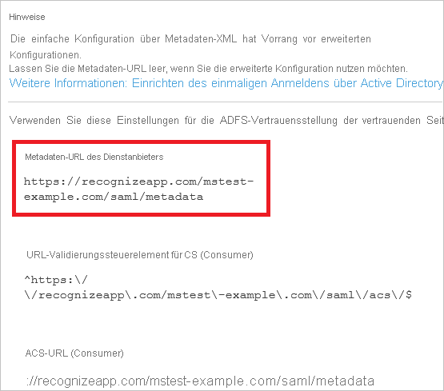

# Tutorial: Azure Active Directory-Integration mit Recognize

In diesem Tutorial erfahren Sie, wie Sie Recognize in Azure Active Directory (Azure AD) integrieren. Die Integration von Recognize in Azure AD ermöglicht Folgendes:

* In Azure AD steuern, wer Zugriff auf Recognize hat
* Benutzern ermöglichen, sich mit ihren Azure AD-Konten automatisch bei Recognize anzumelden
* Verwalten Sie Ihre Konten zentral im Azure-Portal.

## Voraussetzungen

Für die ersten Schritte benötigen Sie Folgendes:

* Ein Azure AD-Abonnement Falls Sie über kein Abonnement verfügen, können Sie ein [kostenloses Azure-Konto](https://azure.microsoft.com/free/) verwenden.
* Ein Recognize-Abonnement, für das einmaliges Anmelden aktiviert ist

## Beschreibung des Szenarios

In diesem Tutorial konfigurieren und testen Sie das einmalige Anmelden von Azure AD in einer Testumgebung.

* Recognize unterstützt **SP-initiiertes** einmaliges Anmelden.

## Hinzufügen von Recognize aus dem Katalog

Zum Konfigurieren der Integration von Workrite in Azure AD müssen Sie Recognize aus dem Katalog der Liste der verwalteten SaaS-Apps hinzufügen.

1. Melden Sie sich mit einem Geschäfts-, Schul- oder Unikonto oder mit einem persönlichen Microsoft-Konto beim Azure-Portal an.
1. Wählen Sie im linken Navigationsbereich den Dienst **Azure Active Directory** aus.
1. Navigieren Sie zu **Unternehmensanwendungen**, und wählen Sie dann **Alle Anwendungen** aus.
1. Wählen Sie zum Hinzufügen einer neuen Anwendung **Neue Anwendung** aus.
1. Geben Sie im Abschnitt **Aus Katalog hinzufügen** den Suchbegriff **Recognize** in das Suchfeld ein.
1. Wählen Sie im Ergebnisbereich **Recognize** aus, und fügen Sie dann die App hinzu. Warten Sie einige Sekunden, während die App Ihrem Mandanten hinzugefügt wird.

## Konfigurieren und Testen des einmaligen Anmeldens von Azure AD für Recognize

Konfigurieren und testen Sie das einmalige Anmelden von Azure AD mit Recognize mithilfe eines Testbenutzers mit dem Namen **B. Simon**. Damit einmaliges Anmelden funktioniert, muss eine Linkbeziehung zwischen einem Azure AD-Benutzer und dem entsprechenden Benutzer in Recognize eingerichtet werden.

Führen Sie zum Konfigurieren und Testen des einmaligen Anmeldens von Azure AD in Recognize die folgenden Schritte aus:

1. **[Konfigurieren des einmaligen Anmeldens von Azure AD](#configure-azure-ad-sso)** , um Ihren Benutzern die Verwendung dieses Features zu ermöglichen.
    1. **[Erstellen eines Azure AD-Testbenutzers](#create-an-azure-ad-test-user)** , um das einmalige Anmelden von Azure AD mit dem Testbenutzer B. Simon zu testen.
    1. **[Zuweisen des Azure AD-Testbenutzers](#assign-the-azure-ad-test-user)** , um B. Simon die Verwendung des einmaligen Anmeldens von Azure AD zu ermöglichen.
1. **[Konfigurieren des einmaligen Anmeldens für Recognize](#configure-recognize-sso)** , um die Einstellungen für einmaliges Anmelden auf der Anwendungsseite zu konfigurieren
    1. **[Erstellen eines Recognize-Testbenutzers](#create-recognize-test-user)** , um ein Pendant von B. Simon in Recognize zu erhalten, das mit ihrer Darstellung in Azure AD verknüpft ist
1. **[Testen des einmaligen Anmeldens](#test-sso)** , um zu überprüfen, ob die Konfiguration funktioniert

## Konfigurieren des einmaligen Anmeldens (Single Sign-On, SSO) von Azure AD

Gehen Sie wie folgt vor, um das einmalige Anmelden von Azure AD im Azure-Portal zu aktivieren.

1. Suchen Sie im Azure-Portal auf der Anwendungsintegrationsseite für **Recognize** den Abschnitt **Verwalten**, und wählen Sie **Einmaliges Anmelden** aus.
1. Wählen Sie auf der Seite **SSO-Methode auswählen** die Methode **SAML** aus.
1. Klicken Sie auf der Seite **Einmaliges Anmelden (SSO) mit SAML einrichten** auf das Stiftsymbol für **Grundlegende SAML-Konfiguration**, um die Einstellungen zu bearbeiten.

   

4. Führen Sie im Abschnitt **Grundlegende SAML-Konfiguration** die folgenden Schritte aus, wenn Sie über eine **Dienstanbieter-Metadatendatei** verfügen:

    >[!NOTE]
    >Sie rufen die **Dienstanbieter-Metadatendatei** in diesem Tutorial im Abschnitt **Konfigurieren des einmaligen Anmeldens für Recognize** ab.

    a. Klicken Sie auf **Metadatendatei hochladen**.

    

    b. Klicken Sie auf das **Ordnerlogo**, wählen Sie die Metadatendatei aus, und klicken Sie auf **Hochladen**.

    

    c. Nach dem erfolgreichen Upload der Metadatendatei wird der Wert **Bezeichner** automatisch im Abschnitt „Grundlegende SAML-Konfiguration“ eingefügt:

     Geben Sie im Textfeld **Anmelde-URL** eine URL im folgenden Format ein: `https://recognizeapp.com/<YOUR_DOMAIN>/saml/sso`.

    > [!Note]
    > Wird der Wert **Bezeichner** nicht automatisch aufgefüllt, können Sie ihn abrufen, indem Sie im Abschnitt mit den SSO-Einstellungen die Metadaten-URL des Dienstanbieters öffnen. Die Vorgehensweise ist weiter unten im Tutorial im Abschnitt **Konfigurieren des einmaligen Anmeldens für Recognize** erläutert. Der Wert der Anmelde-URL entspricht nicht dem tatsächlichen Wert. Ersetzen Sie diesen Wert durch die tatsächliche Anmelde-URL. Den Wert erhalten Sie vom [Supportteam für den Recognize-Client](mailto:support@recognizeapp.com). Sie können sich auch die Muster im Abschnitt **Grundlegende SAML-Konfiguration** im Azure-Portal ansehen.

5. Klicken Sie auf der Seite **Einmaliges Anmelden (SSO) mit SAML einrichten** im Abschnitt **SAML-Signaturzertifikat** auf **Herunterladen**, um das Ihrer Anforderung entsprechende **Zertifikat (Base64)** aus den angegebenen Optionen herunterzuladen und auf Ihrem Computer zu speichern.

    

6. Kopieren Sie im Abschnitt **Recognize einrichten** die entsprechenden URLs gemäß Ihren Anforderungen.

    

### Erstellen eines Azure AD-Testbenutzers 

In diesem Abschnitt erstellen Sie im Azure-Portal einen Testbenutzer mit dem Namen B. Simon.

1. Wählen Sie im linken Bereich des Microsoft Azure-Portals **Azure Active Directory** > **Benutzer** > **Alle Benutzer** aus.
1. Wählen Sie oben im Bildschirm die Option **Neuer Benutzer** aus.
1. Führen Sie unter den Eigenschaften für **Benutzer** die folgenden Schritte aus:
   1. Geben Sie im Feld **Name** die Zeichenfolge `B.Simon` ein.  
   1. Geben Sie im Feld **Benutzername** die Zeichenfolge username@companydomain.extension ein. Beispiel: `B.Simon@contoso.com`.
   1. Aktivieren Sie das Kontrollkästchen **Kennwort anzeigen**, und notieren Sie sich den Wert aus dem Feld **Kennwort**.
   1. Klicken Sie auf **Erstellen**.

### Zuweisen des Azure AD-Testbenutzers

In diesem Abschnitt ermöglichen Sie B.Simon die Verwendung des einmaligen Anmeldens von Azure, indem Sie dem Benutzer Zugriff auf Recognize gewähren.

1. Wählen Sie im Azure-Portal **Unternehmensanwendungen** > **Alle Anwendungen** aus.
1. Wählen Sie in der Anwendungsliste den Eintrag **Recognize** aus.
1. Navigieren Sie auf der Übersichtsseite der App zum Abschnitt **Verwalten**, und wählen Sie **Benutzer und Gruppen** aus.
1. Wählen Sie **Benutzer hinzufügen** und anschließend im Dialogfeld **Zuweisung hinzufügen** die Option **Benutzer und Gruppen** aus.
1. Wählen Sie im Dialogfeld **Benutzer und Gruppen** in der Liste „Benutzer“ den Eintrag **B. Simon** aus, und klicken Sie dann unten auf dem Bildschirm auf die Schaltfläche **Auswählen**.
1. Wenn den Benutzern eine Rolle zugewiesen werden soll, können Sie sie im Dropdownmenü **Rolle auswählen** auswählen. Wurde für diese App keine Rolle eingerichtet, ist die Rolle „Standardzugriff“ ausgewählt.
1. Klicken Sie im Dialogfeld **Zuweisung hinzufügen** auf die Schaltfläche **Zuweisen**.

## Konfigurieren des einmaligen Anmeldens für Recognize

1. Melden Sie sich in einem anderen Webbrowserfenster bei Ihrem Recognize-Mandanten als Administrator an.

2. Klicken Sie auf der rechten oberen Ecke auf **Menü**. Wechseln Sie zu **Company Admin** (Unternehmensadministrator).
   
    

3. Klicken Sie im linken Navigationsbereich auf **Einstellungen**.
   
    

4. Führen Sie im Abschnitt **SSO Settings** (SSO-Einstellungen) die folgenden Schritte aus:
   
    
    
    a. Wählen Sie für **Enable SSO** (SSO aktivieren) die Option **ON** (EIN) aus.

    b. Fügen Sie in das Textfeld **IDP Entity ID** (IDP-Entitäts-ID) den Wert für **Azure AD-Bezeichner** ein, den Sie aus dem Azure-Portal kopiert haben.
    
    c. Fügen Sie in das Textfeld **Sso target url** (SSO-Ziel-URL) den Wert der **Anmelde-URL** ein, den Sie aus dem Azure-Portal kopiert haben.
    
    d. Fügen Sie in das Textfeld **Slo target url** (SLO-Ziel-URL) den Wert der **Abmelde-URL** ein, den Sie aus dem Azure-Portal kopiert haben. 
    
    e. Öffnen Sie die heruntergeladene Datei **Zertifikat (Base64)** in Editor, kopieren Sie den Inhalt in die Zwischenablage, und fügen Sie ihn anschließend in das Textfeld **Zertifikat** ein.
    
    f. Klicken Sie auf die Schaltfläche **Save settings** (Einstellungen speichern). 

5. Kopieren Sie neben dem Abschnitt **SSO Settings** (SSO-Einstellungen) die URL unter **Service Provider Metadata url** (Metadaten-URL des Dienstanbieters).
   
    

6. Öffnen Sie den **Metadaten-URL-Link** in einem leeren Browserfenster, um das Metadatendokument herunterzuladen. Kopieren Sie anschließend den Wert für „EntityDescriptor (entityID)“ in der Datei, und fügen Sie ihn im Azure-Portal im Abschnitt **Grundlegende SAML-Konfiguration** in das Textfeld **Bezeichner** ein.
    
    

### Erstellen eines Recognize-Testbenutzers

Damit sich Azure AD-Benutzer bei Recognize anmelden können, müssen sie in Recognize bereitgestellt werden. Im Fall von Recognize muss die Bereitstellung manuell durchgeführt werden.

Diese App unterstützt keine SCIM-Bereitstellung. Sie verfügt aber über eine Benutzersynchronisierung, die Benutzer bereitstellt. 

**Führen Sie zum Bereitstellen eines Benutzerkontos die folgenden Schritte aus:**

1. Melden Sie sich bei der Recognize-Unternehmenswebsite als Administrator an.

2. Klicken Sie auf der rechten oberen Ecke auf **Menü**. Wechseln Sie zu **Company Admin** (Unternehmensadministrator).

3. Klicken Sie im linken Navigationsbereich auf **Einstellungen**.

4. Führen Sie im Abschnitt **User Sync** (Benutzersynchronisierung) die folgenden Schritte aus.
   
    
   
    a. Wählen Sie für **Sync Enabled** (Synchronisierung aktiviert) die Option **ON** (EIN) aus.
   
    b. Wählen Sie für **Choose sync provider** (Synchronisierungsanbieter auswählen) die Option **Microsoft/Office 365** aus.
   
    c. Klicken Sie auf **Run User Sync** (Benutzersynchronisierung ausführen).

## Testen des einmaligen Anmeldens 

In diesem Abschnitt testen Sie die Azure AD-Konfiguration für einmaliges Anmelden mit den folgenden Optionen: 

* Klicken Sie im Azure-Portal auf **Diese Anwendung testen**. Dadurch werden Sie zur Anmelde-URL für Recognize weitergeleitet, wo Sie den Anmeldeflow initiieren können. 

* Rufen Sie direkt die Recognize-Anmelde-URL auf, und initiieren Sie den Anmeldeflow.

* Sie können „Meine Apps“ von Microsoft verwenden. Wenn Sie in „Meine Apps“auf die Kachel „Recognize“ klicken, werden Sie zur Anmelde-URL für Recognize weitergeleitet. Weitere Informationen zu „Meine Apps“ finden Sie in [dieser Einführung](../user-help/my-apps-portal-end-user-access.md).

## Nächste Schritte

Nach dem Konfigurieren von Recognize können Sie die Sitzungssteuerung erzwingen, die in Echtzeit vor der Exfiltration und Infiltration vertraulicher Unternehmensdaten schützt. Die Sitzungssteuerung basiert auf bedingtem Zugriff. [Hier](/cloud-app-security/proxy-deployment-aad) erfahren Sie, wie Sie die Sitzungssteuerung mit Microsoft Cloud App Security erzwingen.
