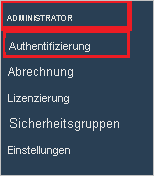
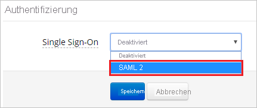
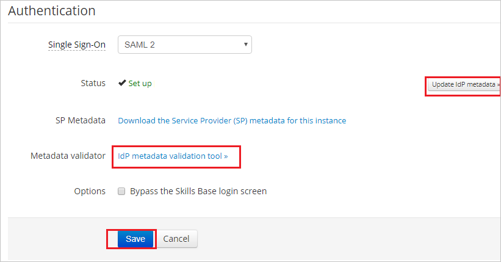

# Tutorial: Azure Active Directory-Integration mit Skills Base

In diesem Tutorial erfahren Sie, wie Sie Skills Base in Azure Active Directory (Azure AD) integrieren. Die Integration von Skills Base in Azure AD ermöglicht Ihnen Folgendes:

* Sie können in Azure AD steuern, wer Zugriff auf Skills Base hat.
* Sie es können es Ihren Benutzern ermöglichen, sich mit ihrem Azure AD-Konto automatisch bei Skills Base anzumelden.
* Verwalten Sie Ihre Konten zentral im Azure-Portal.

## Voraussetzungen

Für die ersten Schritte benötigen Sie Folgendes:

* Ein Azure AD-Abonnement Falls Sie über kein Abonnement verfügen, können Sie ein [kostenloses Azure-Konto](https://azure.microsoft.com/free/) verwenden.
* Ein Skills Base-Abonnement, für das einmaliges Anmelden (SSO) aktiviert ist.

> [!NOTE]
> Diese Integration kann auch über die Azure AD-Umgebung für die US Government-Cloud verwendet werden. Sie finden diese Anwendung im Azure AD-Katalog für US Government-Cloudanwendungen und konfigurieren sie auf die gleiche Weise wie in der öffentlichen Cloud.

## Beschreibung des Szenarios

In diesem Tutorial konfigurieren und testen Sie das einmalige Anmelden von Azure AD in einer Testumgebung.

* Skills Base unterstützt **SP-initiiertes** einmaliges Anmelden.
* Skills Base unterstützt die **Just-in-Time**-Benutzerbereitstellung.

> [!NOTE]
> Der Bezeichner dieser Anwendung ist ein fester Zeichenfolgenwert, daher kann in einem Mandanten nur eine Instanz konfiguriert werden.

## Hinzufügen von Skills Base aus dem Katalog

Zum Konfigurieren der Integration von Skills Base in Azure AD müssen Sie Skills Base aus dem Katalog der Liste mit den verwalteten SaaS-Apps hinzufügen.

1. Melden Sie sich mit einem Geschäfts-, Schul- oder Unikonto oder mit einem persönlichen Microsoft-Konto beim Azure-Portal an.
1. Wählen Sie im linken Navigationsbereich den Dienst **Azure Active Directory** aus.
1. Navigieren Sie zu **Unternehmensanwendungen**, und wählen Sie dann **Alle Anwendungen** aus.
1. Wählen Sie zum Hinzufügen einer neuen Anwendung **Neue Anwendung** aus.
1. Geben Sie im Abschnitt **Aus dem Katalog hinzufügen** den Suchbegriff **Skills Base** in das Suchfeld ein.
1. Wählen Sie im Ergebnisbereich **Skills Base** aus, und fügen Sie dann die App hinzu. Warten Sie einige Sekunden, während die App Ihrem Mandanten hinzugefügt wird.

## Konfigurieren und Testen des einmaligen Anmeldens von Azure AD für Skills Base

Konfigurieren und testen Sie das einmalige Anmelden von Azure AD mit Skills Base mithilfe eines Testbenutzers namens **B. Simon**. Damit das einmalige Anmelden funktioniert, muss eine Linkbeziehung zwischen einem Azure AD-Benutzer und dem entsprechenden Benutzer in Skills Base eingerichtet werden.

Führen Sie zum Konfigurieren und Testen des einmaligen Anmeldens von Azure AD mit Skills Base die folgenden Schritte aus:

1. **[Konfigurieren des einmaligen Anmeldens von Azure AD](#configure-azure-ad-sso)** , um Ihren Benutzern die Verwendung dieses Features zu ermöglichen.
    1. **[Erstellen eines Azure AD-Testbenutzers](#create-an-azure-ad-test-user)** , um das einmalige Anmelden von Azure AD mit dem Testbenutzer B. Simon zu testen.
    1. **[Zuweisen des Azure AD-Testbenutzers](#assign-the-azure-ad-test-user)** , um B. Simon die Verwendung des einmaligen Anmeldens von Azure AD zu ermöglichen.
1. **[Konfigurieren des einmaligen Anmeldens für Skills Base](#configure-skills-base-sso)** , um die Einstellungen für das einmalige Anmelden auf der Anwendungsseite zu konfigurieren.
    1. **[Erstellen eines Skills Base-Testbenutzers](#create-skills-base-test-user)** , um eine Entsprechung von B. Simon in Skills Base zu erhalten, die mit einer Benutzerdarstellung in Azure AD verknüpft ist.
1. **[Testen des einmaligen Anmeldens](#test-sso)** , um zu überprüfen, ob die Konfiguration funktioniert

## Konfigurieren des einmaligen Anmeldens (Single Sign-On, SSO) von Azure AD

Gehen Sie wie folgt vor, um das einmalige Anmelden von Azure AD im Azure-Portal zu aktivieren.

1. Navigieren Sie im Azure-Portal auf der Anwendungsintegrationsseite für **Skills Base** zum Abschnitt **Verwalten** und wählen Sie **Einmaliges Anmelden** aus.
1. Wählen Sie auf der Seite **SSO-Methode auswählen** die Methode **SAML** aus.
1. Klicken Sie auf der Seite **Einmaliges Anmelden (SSO) mit SAML einrichten** auf das Stiftsymbol für **Grundlegende SAML-Konfiguration**, um die Einstellungen zu bearbeiten.

   

4. Führen Sie im Abschnitt **Grundlegende SAML-Konfiguration** den folgenden Schritt aus:

    Geben Sie im Textfeld **Anmelde-URL** eine URL im folgenden Format ein: `https://app.skills-base.com/o/<customer-unique-key>`

    > [!NOTE]
    > Sie können die Anmelde URL von der Anwendung Skills Base abrufen. Melden Sie sich als Administrator an, und navigieren Sie zu „Verwaltung > Einstellungen > Instanzendetails > Verknüpfungslink“. Kopieren Sie die Anmelde URL, und fügen Sie sie in das obige Textfeld ein.

5. Klicken Sie auf der Seite **Einmaliges Anmelden (SSO) mit SAML einrichten** im Abschnitt **SAML-Signaturzertifikat** auf **Herunterladen**, um den Ihren Anforderungen entsprechenden **Verbundmetadaten-XML**-Code aus den verfügbaren Optionen herunterzuladen und auf Ihrem Computer zu speichern.

    

6. Kopieren Sie im Abschnitt **Skills Base einrichten** die entsprechenden URLs gemäß Ihren Anforderungen.

    

### Erstellen eines Azure AD-Testbenutzers

In diesem Abschnitt erstellen Sie im Azure-Portal einen Testbenutzer mit dem Namen B. Simon.

1. Wählen Sie im linken Bereich des Microsoft Azure-Portals **Azure Active Directory** > **Benutzer** > **Alle Benutzer** aus.
1. Wählen Sie oben im Bildschirm die Option **Neuer Benutzer** aus.
1. Führen Sie unter den Eigenschaften für **Benutzer** die folgenden Schritte aus:
   1. Geben Sie im Feld **Name** die Zeichenfolge `B.Simon` ein.  
   1. Geben Sie im Feld **Benutzername** die Zeichenfolge username@companydomain.extension ein. Beispiel: `B.Simon@contoso.com`.
   1. Aktivieren Sie das Kontrollkästchen **Kennwort anzeigen**, und notieren Sie sich den Wert aus dem Feld **Kennwort**.
   1. Klicken Sie auf **Erstellen**.

### Zuweisen des Azure AD-Testbenutzers

In diesem Abschnitt ermöglichen Sie B. Simon die Verwendung des einmaligen Anmeldens von Azure, indem Sie den Zugriff auf Skills Base gewähren.

1. Wählen Sie im Azure-Portal **Unternehmensanwendungen** > **Alle Anwendungen** aus.
1. Wählen Sie in der Anwendungsliste **Skills Base** aus.
1. Navigieren Sie auf der Übersichtsseite der App zum Abschnitt **Verwalten**, und wählen Sie **Benutzer und Gruppen** aus.
1. Wählen Sie **Benutzer hinzufügen** und anschließend im Dialogfeld **Zuweisung hinzufügen** die Option **Benutzer und Gruppen** aus.
1. Wählen Sie im Dialogfeld **Benutzer und Gruppen** in der Liste „Benutzer“ den Eintrag **B. Simon** aus, und klicken Sie dann unten auf dem Bildschirm auf die Schaltfläche **Auswählen**.
1. Wenn den Benutzern eine Rolle zugewiesen werden soll, können Sie sie im Dropdownmenü **Rolle auswählen** auswählen. Wurde für diese App keine Rolle eingerichtet, ist die Rolle „Standardzugriff“ ausgewählt.
1. Klicken Sie im Dialogfeld **Zuweisung hinzufügen** auf die Schaltfläche **Zuweisen**.

## Konfigurieren des einmaligen Anmeldens für Skills Base

1. Melden Sie sich in einem anderen Webbrowserfenster als Sicherheitsadministrator bei Skills Base an.

2. Klicken Sie im linken Bereich des Menüs unter **ADMIN** (ADMINISTRATOR) auf **Authentication** (Authentifizierung).

    

3. Legen Sie „Single Sign-On“ (Einmaliges Anmelden) auf der Seite **Authentication** (Authentifizierung) auf **SAML 2** fest.

    

4. Führen Sie auf der Seite **Authentication** (Authentifizierung) die folgenden Schritte aus:

    

    a. Klicken Sie auf die Schaltfläche **Update IdP metadata** (IdP-Metadaten aktualisieren) neben der Option **Satus**, und fügen Sie den Inhalt der Metadaten-XML, die sie aus dem Azure-Portal heruntergeladen haben, in das entsprechende Textfeld ein.

    > [!Note]
    > Sie können die IdP-Metadaten wie im Screenshot hervorgehoben ebenfalls über das Tool für die **Überprüfung von Metadaten** überprüfen.

    b. Klicken Sie auf **Speichern**.

### Erstellen eines Skills Base-Testbenutzers

In diesem Abschnitt wird eine Benutzerin mit dem Namen Britta Simon in Skills Base erstellt. Skills Base unterstützt die Just-in-Time-Benutzerbereitstellung, die standardmäßig aktiviert ist. Für Sie steht in diesem Abschnitt kein Aktionselement zur Verfügung. Ist ein Benutzer noch nicht in Skills Base vorhanden, wird nach der Authentifizierung ein neuer Benutzer erstellt.

> [!Note]
> Wenn Sie einen Benutzer manuell erstellen müssen, befolgen Sie [diese Anweisungen](http://wiki.skills-base.net/index.php?title=Adding_people_and_enabling_them_to_log_in).

## Testen des einmaligen Anmeldens

In diesem Abschnitt testen Sie die Azure AD-Konfiguration für einmaliges Anmelden mit den folgenden Optionen: 

* Klicken Sie im Azure-Portal auf **Diese Anwendung testen**. Dadurch werden Sie zur Anmelde-URL für Skills Base weitergeleitet. Dort können Sie den Anmeldeablauf initiieren. 

* Rufen Sie direkt die Skills Base-Anmelde-URL auf und initiieren Sie den Anmeldeablauf.

* Sie können „Meine Apps“ von Microsoft verwenden. Wenn Sie in „Meine Apps“auf die Kachel „Skills Base“ klicken, werden Sie zur Anmelde-URL für Skills Base weitergeleitet. Weitere Informationen zu „Meine Apps“ finden Sie in [dieser Einführung](https://support.microsoft.com/account-billing/sign-in-and-start-apps-from-the-my-apps-portal-2f3b1bae-0e5a-4a86-a33e-876fbd2a4510).

## Nächste Schritte

Nach dem Konfigurieren von Skills Base können Sie die Sitzungssteuerung erzwingen, die Ihre vertraulichen Unternehmensdaten in Echtzeit vor der Exfiltration und Infiltration schützt. Die Sitzungssteuerung basiert auf bedingtem Zugriff. [Hier](/cloud-app-security/proxy-deployment-aad) erfahren Sie, wie Sie die Sitzungssteuerung mit Microsoft Cloud App Security erzwingen.