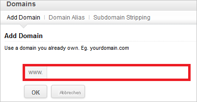
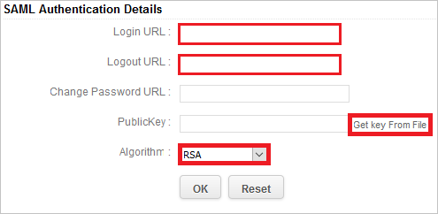
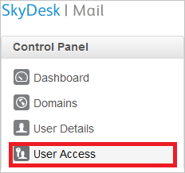

# Tutorial: Integration des einmaligen Anmeldens (Single Sign-On, SSO) von Azure AD mit SkyDesk Email

In diesem Tutorial erfahren Sie, wie Sie SkyDesk Email in Azure Active Directory (Azure AD) integrieren. Die Integration von SkyDesk Email in Azure AD ermöglicht Folgendes:

* Sie können in Azure AD steuern, wer auf SkyDesk Email zugreifen kann.
* Sie können Ihren Benutzern ermöglichen, sich mit ihren Azure AD-Konten automatisch bei SkyDesk Email anzumelden.
* Verwalten Sie Ihre Konten zentral im Azure-Portal.

## Voraussetzungen

Für die ersten Schritte benötigen Sie Folgendes:

* Ein Azure AD-Abonnement Falls Sie über kein Abonnement verfügen, können Sie ein [kostenloses Azure-Konto](https://azure.microsoft.com/free/) verwenden.
* Ein SkyDesk Email-Abonnement, für das einmaliges Anmelden (SSO) aktiviert ist

## Beschreibung des Szenarios

In diesem Tutorial konfigurieren und testen Sie das einmalige Anmelden von Azure AD in einer Testumgebung.

* SkyDesk Email unterstützt **SP**-initiiertes einmaliges Anmelden.

> [!NOTE]
> Der Bezeichner dieser Anwendung ist ein fester Zeichenfolgenwert, daher kann in einem Mandanten nur eine Instanz konfiguriert werden.

## Hinzufügen von SkyDesk Email aus dem Katalog

Zum Konfigurieren der Integration von SkyDesk Email in Azure AD müssen Sie SkyDesk Email aus dem Katalog zu Ihrer Liste der verwalteten SaaS-Apps hinzufügen.

1. Melden Sie sich mit einem Geschäfts-, Schul- oder Unikonto oder mit einem persönlichen Microsoft-Konto beim Azure-Portal an.
1. Wählen Sie im linken Navigationsbereich den Dienst **Azure Active Directory** aus.
1. Navigieren Sie zu **Unternehmensanwendungen**, und wählen Sie dann **Alle Anwendungen** aus.
1. Wählen Sie zum Hinzufügen einer neuen Anwendung **Neue Anwendung** aus.
1. Geben Sie im Abschnitt **Aus Katalog hinzufügen** den Suchbegriff **SkyDesk Email** in das Suchfeld ein.
1. Wählen Sie **SkyDesk Email** im Ergebnisbereich aus, und fügen Sie dann die App hinzu. Warten Sie einige Sekunden, während die App Ihrem Mandanten hinzugefügt wird.

## Konfigurieren und Testen des einmaligen Anmeldens von Azure AD für SkyDesk Email

Konfigurieren und testen Sie das einmalige Anmelden von Azure AD mit SkyDesk Email mithilfe eines Testbenutzers namens **B.Simon**. Damit das einmalige Anmelden funktioniert, muss eine Linkbeziehung zwischen einem Azure AD-Benutzer und dem entsprechenden Benutzer in SkyDesk Email eingerichtet werden.

Führen Sie zum Konfigurieren und Testen des einmaligen Anmeldens von Azure AD mit SkyDesk Email die folgenden Schritte aus:

1. **[Konfigurieren des einmaligen Anmeldens von Azure AD](#configure-azure-ad-sso)** , um Ihren Benutzern die Verwendung dieses Features zu ermöglichen.
    1. **[Erstellen eines Azure AD-Testbenutzers](#create-an-azure-ad-test-user)** , um das einmalige Anmelden von Azure AD mit dem Testbenutzer B. Simon zu testen.
    1. **[Zuweisen des Azure AD-Testbenutzers](#assign-the-azure-ad-test-user)** , um B. Simon die Verwendung des einmaligen Anmeldens von Azure AD zu ermöglichen.
1. **[Konfigurieren des einmaligen Anmeldens für SkyDesk Email](#configure-skydesk-email-sso)** , um die Einstellungen für das einmalige Anmelden auf der Anwendungsseite zu konfigurieren.
    1. **[Erstellen eines SkyDesk Email-Testbenutzers](#create-skydesk-email-test-user)** , um ein Pendant zu B.Simon in SkyDesk Email zu erhalten, das mit dem äquivalenten Benutzer in Azure AD verknüpft ist.
1. **[Testen des einmaligen Anmeldens](#test-sso)** , um zu überprüfen, ob die Konfiguration funktioniert

## Konfigurieren des einmaligen Anmeldens (Single Sign-On, SSO) von Azure AD

Gehen Sie wie folgt vor, um das einmalige Anmelden von Azure AD im Azure-Portal zu aktivieren.

1. Navigieren Sie im Azure-Portal auf der Anwendungsintegrationsseite für **SkyDesk Email** zum Abschnitt **Verwalten**, und wählen Sie **Einmaliges Anmelden** aus.
1. Wählen Sie auf der Seite **SSO-Methode auswählen** die Methode **SAML** aus.
1. Klicken Sie auf der Seite **Einmaliges Anmelden (SSO) mit SAML einrichten** auf das Stiftsymbol für **Grundlegende SAML-Konfiguration**, um die Einstellungen zu bearbeiten.

   

4. Führen Sie im Abschnitt **Grundlegende SAML-Konfiguration** den folgenden Schritt aus:

    Geben Sie im Textfeld **Anmelde-URL** eine URL im folgenden Format ein: `https://mail.skydesk.jp/portal/<companyname>`

    > [!NOTE]
    > Dieser Wert entspricht nicht dem tatsächlichen Wert. Ersetzen Sie diesen Wert durch die tatsächliche Anmelde-URL. Wenden Sie sich an das [Supportteam für den SkyDesk Email-Client](https://www.skydesk.jp/apps/support/), um den Wert zu erhalten. Sie können sich auch die Muster im Abschnitt **Grundlegende SAML-Konfiguration** im Azure-Portal ansehen.

5. Klicken Sie auf der Seite **Einmaliges Anmelden (SSO) mit SAML einrichten** im Abschnitt **SAML-Signaturzertifikat** auf **Herunterladen**, um das Ihrer Anforderung entsprechende **Zertifikat (Base64)** aus den angegebenen Optionen herunterzuladen und auf Ihrem Computer zu speichern.

    

6. Kopieren Sie im Abschnitt **SkyDesk Email einrichten** die entsprechenden URLs gemäß Ihren Anforderungen.

    

### Erstellen eines Azure AD-Testbenutzers

In diesem Abschnitt erstellen Sie im Azure-Portal einen Testbenutzer mit dem Namen B. Simon.

1. Wählen Sie im linken Bereich des Microsoft Azure-Portals **Azure Active Directory** > **Benutzer** > **Alle Benutzer** aus.
1. Wählen Sie oben im Bildschirm die Option **Neuer Benutzer** aus.
1. Führen Sie unter den Eigenschaften für **Benutzer** die folgenden Schritte aus:
   1. Geben Sie im Feld **Name** die Zeichenfolge `B.Simon` ein.  
   1. Geben Sie im Feld **Benutzername** die Zeichenfolge username@companydomain.extension ein. Beispiel: `B.Simon@contoso.com`.
   1. Aktivieren Sie das Kontrollkästchen **Kennwort anzeigen**, und notieren Sie sich den Wert aus dem Feld **Kennwort**.
   1. Klicken Sie auf **Erstellen**.

### Zuweisen des Azure AD-Testbenutzers

In diesem Abschnitt ermöglichen Sie B.Simon die Verwendung des einmaligen Anmeldens von Azure, indem Sie ihr Zugriff auf SkyDesk Email gewähren.

1. Wählen Sie im Azure-Portal **Unternehmensanwendungen** > **Alle Anwendungen** aus.
1. Wählen Sie in der Anwendungsliste **SkyDesk Email** aus.
1. Navigieren Sie auf der Übersichtsseite der App zum Abschnitt **Verwalten**, und wählen Sie **Benutzer und Gruppen** aus.
1. Wählen Sie **Benutzer hinzufügen** und anschließend im Dialogfeld **Zuweisung hinzufügen** die Option **Benutzer und Gruppen** aus.
1. Wählen Sie im Dialogfeld **Benutzer und Gruppen** in der Liste „Benutzer“ den Eintrag **B. Simon** aus, und klicken Sie dann unten auf dem Bildschirm auf die Schaltfläche **Auswählen**.
1. Wenn den Benutzern eine Rolle zugewiesen werden soll, können Sie sie im Dropdownmenü **Rolle auswählen** auswählen. Wurde für diese App keine Rolle eingerichtet, ist die Rolle „Standardzugriff“ ausgewählt.
1. Klicken Sie im Dialogfeld **Zuweisung hinzufügen** auf die Schaltfläche **Zuweisen**.

## Konfigurieren des einmaligen Anmeldens für SkyDesk Email

1. Melden Sie sich in einem anderen Webbrowser als Administrator bei Ihrem SkyDesk Email-Konto an.

1. Klicken Sie im oberen Menü auf **Setup**, und wählen Sie **Org** aus.

    
  
1. Klicken Sie im linken Bereich auf **Domains** (Domänen).

    

1. Klicken Sie auf **Add Domain** (Domäne hinzufügen).

    

1. Geben Sie den Namen Ihrer Domäne ein, und überprüfen Sie die Domäne dann.

    

1. Klicken Sie im linken Bereich auf **SAML Authentication** .

    

1. Führen Sie auf der Dialogseite **SAML Authentication** die folgenden Schritte aus:

    

    > [!NOTE]
    > Um die SAML-basierte Authentifizierung zu verwenden, sollten Sie entweder eine **überprüfte Domäne** oder eine **Portal-URL** eingerichtet haben. Sie können die Portal-URL mit dem eindeutigen Namen einrichten.

    

    a. Fügen Sie in das Textfeld **Anmelde-URL** den Wert der **Anmelde-URL** ein, den Sie aus dem Azure-Portal kopiert haben.

    b. Fügen Sie in das Textfeld **Abmelde-URL** den Wert der **Abmelde-URL** ein, den Sie aus dem Azure-Portal kopiert haben.

    c. **Change Password URL** ist optional, lassen Sie dieses Feld leer.

    d. Klicken Sie auf **Schlüssel aus Datei abrufen**, um das heruntergeladene Zertifikat aus dem Azure-Portal auszuwählen, und klicken Sie dann auf **Öffnen**, um das Zertifikat hochzuladen.

    e. Wählen Sie als **Algorithmus** den Wert **RSA** aus.

    f. Klicken Sie zum Speichern der Änderungen auf **OK** .

### Erstellen eines SkyDesk Email-Testbenutzers

In diesem Abschnitt erstellen Sie in SkyDesk Email einen Benutzer mit dem Namen Britta Simon.

Klicken Sie in SkyDesk Email im linken Bereich auf **User Access**, und geben Sie Ihren Benutzernamen ein.

> [!NOTE]
> Wenn Sie mehrere Benutzer erstellen müssen, setzen Sie sich mit dem [Supportteam für den SkyDesk Email-Client](https://www.skydesk.jp/apps/support/) in Verbindung.

## Testen des einmaligen Anmeldens

In diesem Abschnitt testen Sie die Azure AD-Konfiguration für einmaliges Anmelden mit den folgenden Optionen: 

* Klicken Sie im Azure-Portal auf **Diese Anwendung testen**. Dadurch werden Sie zur Anmelde-URL für SkyDesk Email weitergeleitet. Dort können Sie den Anmeldeflow initiieren. 

* Navigieren Sie direkt zur Anmelde-URL für SkyDesk Email, und initiieren Sie von dort den Anmeldeflow.

* Sie können „Meine Apps“ von Microsoft verwenden. Wenn Sie unter „Meine Apps“ auf die Kachel „SkyDesk Email“ klicken, werden Sie zur Anmelde-URL für SkyDesk Email weitergeleitet. Weitere Informationen zu „Meine Apps“ finden Sie in [dieser Einführung](../user-help/my-apps-portal-end-user-access.md).

## Nächste Schritte

Nach dem Konfigurieren von SkyDesk Email können Sie die Sitzungssteuerung erzwingen, die in Echtzeit vor der Exfiltration und Infiltration vertraulicher Unternehmensdaten schützt. Die Sitzungssteuerung basiert auf bedingtem Zugriff. [Hier](/cloud-app-security/proxy-deployment-aad) erfahren Sie, wie Sie die Sitzungssteuerung mit Microsoft Cloud App Security erzwingen.