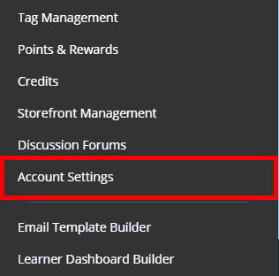
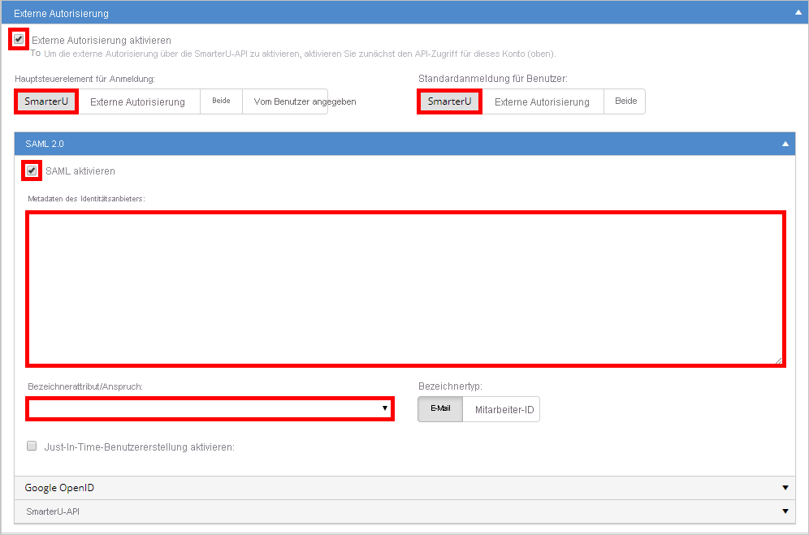

# Tutorial: Azure Active Directory-Integration mit SmarterU

> [!NOTE]
> Der Prozess für die Integration von SmarterU in Azure Active Directory wird ebenfalls im [SmarterU-Hilfesystem](https://help.smarteru.com/ID2053086) dokumentiert und verwaltet.

In diesem Tutorial erfahren Sie, wie Sie SmarterU in Azure Active Directory (Azure AD) integrieren. Die Integration von SmarterU in Azure AD ermöglicht Folgendes:

* Steuern Sie in Azure AD, wer Zugriff auf SmarterU hat.
* Ermöglichen Sie es Ihren Benutzern, sich mit ihren Azure AD-Konten automatisch bei SmarterU anzumelden.
* Verwalten Sie Ihre Konten zentral im Azure-Portal.

## Voraussetzungen

Für die ersten Schritte benötigen Sie Folgendes:

* Ein Azure AD-Abonnement Falls Sie über kein Abonnement verfügen, können Sie ein [kostenloses Azure-Konto](https://azure.microsoft.com/free/) verwenden.
* SmarterU-Abonnement, für das einmaliges Anmelden (Single Sign-On, SSO) aktiviert ist

## Beschreibung des Szenarios

In diesem Tutorial konfigurieren und testen Sie das einmalige Anmelden von Azure AD in einer Testumgebung.

* SmarterU unterstützt **IDP**-initiiertes einmaliges Anmelden.

> [!NOTE]
> Der Bezeichner dieser Anwendung ist ein fester Zeichenfolgenwert, daher kann in einem Mandanten nur eine Instanz konfiguriert werden.

## Hinzufügen von SmarterU über den Katalog

Zum Konfigurieren der Integration von SmarterU in Azure AD müssen Sie SmarterU über den Katalog der Liste mit den verwalteten SaaS-Apps hinzufügen.

1. Melden Sie sich mit einem Geschäfts-, Schul- oder Unikonto oder mit einem persönlichen Microsoft-Konto beim Azure-Portal an.
1. Wählen Sie im linken Navigationsbereich den Dienst **Azure Active Directory** aus.
1. Navigieren Sie zu **Unternehmensanwendungen**, und wählen Sie dann **Alle Anwendungen** aus.
1. Wählen Sie zum Hinzufügen einer neuen Anwendung **Neue Anwendung** aus.
1. Geben Sie im Abschnitt **Aus Katalog hinzufügen** den Suchbegriff **SmarterU** in das Suchfeld ein.
1. Wählen Sie im Ergebnisbereich **SmarterU** aus, und fügen Sie dann die App hinzu. Warten Sie einige Sekunden, während die App Ihrem Mandanten hinzugefügt wird.

## Konfigurieren und Testen des einmaligen Anmeldens von Azure AD für SmarterU

Konfigurieren und testen Sie das einmalige Anmelden von Azure AD mit SmarterU mithilfe eines Testbenutzers mit dem Namen **B. Simon**. Damit einmaliges Anmelden funktioniert, muss eine Linkbeziehung zwischen einem Azure AD-Benutzer und dem entsprechenden Benutzer in SmarterU eingerichtet werden.

Führen Sie zum Konfigurieren und Testen des einmaligen Anmeldens von Azure AD mit SmarterU die folgenden Schritte aus:

1. **[Konfigurieren des einmaligen Anmeldens von Azure AD](#configure-azure-ad-sso)** , um Ihren Benutzern die Verwendung dieses Features zu ermöglichen.
    1. **[Erstellen eines Azure AD-Testbenutzers](#create-an-azure-ad-test-user)** , um das einmalige Anmelden von Azure AD mit dem Testbenutzer B. Simon zu testen.
    1. **[Zuweisen des Azure AD-Testbenutzers](#assign-the-azure-ad-test-user)** , um B. Simon die Verwendung des einmaligen Anmeldens von Azure AD zu ermöglichen.
1. **[Konfigurieren des einmaligen Anmeldens für SmarterU](#configure-smarteru-sso)** , um die Einstellungen für einmaliges Anmelden auf der Anwendungsseite zu konfigurieren
    1. **[Erstellen eines SmarterU-Testbenutzers](#create-smarteru-test-user)** , um eine Entsprechung von B. Simon in SmarterU zu erhalten, die mit ihrer Darstellung in Azure AD verknüpft ist
1. **[Testen des einmaligen Anmeldens](#test-sso)** , um zu überprüfen, ob die Konfiguration funktioniert

## Konfigurieren des einmaligen Anmeldens (Single Sign-On, SSO) von Azure AD

Gehen Sie wie folgt vor, um das einmalige Anmelden von Azure AD im Azure-Portal zu aktivieren.

1. Navigieren Sie im Azure-Portal auf der Anwendungsintegrationsseite für **SmarterU** zum Abschnitt **Verwalten**, und wählen Sie **Einmaliges Anmelden** aus.
1. Wählen Sie auf der Seite **SSO-Methode auswählen** die Methode **SAML** aus.
1. Klicken Sie auf der Seite **Einmaliges Anmelden (SSO) mit SAML einrichten** auf das Stiftsymbol für **Grundlegende SAML-Konfiguration**, um die Einstellungen zu bearbeiten.

   

4. Führen Sie im Abschnitt **Grundlegende SAML-Konfiguration** den folgenden Schritt aus:

    Geben Sie im Textfeld **Bezeichner** die URL `https://www.smarteru.com/` ein.

5. Klicken Sie auf der Seite **Einmaliges Anmelden (SSO) mit SAML einrichten** im Abschnitt **SAML-Signaturzertifikat** auf **Herunterladen**, um den Ihren Anforderungen entsprechenden **Verbundmetadaten-XML**-Code aus den verfügbaren Optionen herunterzuladen und auf Ihrem Computer zu speichern.

    

6. Kopieren Sie im Abschnitt  **einrichten** die entsprechenden URLs gemäß Ihren Anforderungen.

    

### Erstellen eines Azure AD-Testbenutzers

In diesem Abschnitt erstellen Sie im Azure-Portal einen Testbenutzer mit dem Namen B. Simon.

1. Wählen Sie im linken Bereich des Microsoft Azure-Portals **Azure Active Directory** > **Benutzer** > **Alle Benutzer** aus.
1. Wählen Sie oben im Bildschirm die Option **Neuer Benutzer** aus.
1. Führen Sie unter den Eigenschaften für **Benutzer** die folgenden Schritte aus:
   1. Geben Sie im Feld **Name** die Zeichenfolge `B.Simon` ein.  
   1. Geben Sie im Feld **Benutzername** die Zeichenfolge username@companydomain.extension ein. Beispiel: `B.Simon@contoso.com`.
   1. Aktivieren Sie das Kontrollkästchen **Kennwort anzeigen**, und notieren Sie sich den Wert aus dem Feld **Kennwort**.
   1. Klicken Sie auf **Erstellen**.

### Zuweisen des Azure AD-Testbenutzers

In diesem Abschnitt ermöglichen Sie B. Simon die Verwendung des einmaligen Anmeldens von Azure, indem Sie ihr Zugriff auf SmarterU gewähren.

1. Wählen Sie im Azure-Portal **Unternehmensanwendungen** > **Alle Anwendungen** aus.
1. Wählen Sie in der Anwendungsliste die Option **SmarterU** aus.
1. Navigieren Sie auf der Übersichtsseite der App zum Abschnitt **Verwalten**, und wählen Sie **Benutzer und Gruppen** aus.
1. Wählen Sie **Benutzer hinzufügen** und anschließend im Dialogfeld **Zuweisung hinzufügen** die Option **Benutzer und Gruppen** aus.
1. Wählen Sie im Dialogfeld **Benutzer und Gruppen** in der Liste „Benutzer“ den Eintrag **B. Simon** aus, und klicken Sie dann unten auf dem Bildschirm auf die Schaltfläche **Auswählen**.
1. Wenn den Benutzern eine Rolle zugewiesen werden soll, können Sie sie im Dropdownmenü **Rolle auswählen** auswählen. Wurde für diese App keine Rolle eingerichtet, ist die Rolle „Standardzugriff“ ausgewählt.
1. Klicken Sie im Dialogfeld **Zuweisung hinzufügen** auf die Schaltfläche **Zuweisen**.

## Konfigurieren des einmaligen Anmeldens für SmarterU

1. Melden Sie sich in einem anderen Webbrowserfenster bei der SmarterU-Unternehmenswebsite als Administrator an.

1. Klicken Sie oben auf der Symbolleiste auf **Kontoeinstellungen**.

    

1. Führen Sie auf der Kontenkonfigurationsseite die folgenden Schritte aus:

     

    a. Wählen Sie **Externe Autorisierung aktivieren**.
  
    b. Wählen Sie im Abschnitt **Master-Anmeldesteuerelement** die Registerkarte **SmarterU** aus.
  
    c. Wählen Sie im Abschnitt **Benutzer-Standardanmeldung** die Registerkarte **SmarterU** aus.
  
    d. Wählen Sie **SAML aktivieren**.
  
    e. Kopieren Sie den Inhalt der heruntergeladenen Metadatendatei, und fügen Sie ihn in das Textfeld **IdP-Metadaten** ein.

    f. Wählen Sie **ein Bezeichnerattribut bzw. einen Anspruch** aus.
  
    g. Klicken Sie auf **Speichern**.

### Erstellen eines Testbenutzers für SmarterU

Damit sich Azure AD-Benutzer bei SmarterU anmelden können, müssen sie in SmarterU bereitgestellt werden. Im Fall von SmarterU ist die Bereitstellung eine manuelle Aufgabe.

**Führen Sie zum Bereitstellen eines Benutzerkontos die folgenden Schritte aus:**

1. Melden Sie sich bei Ihrem **SmarterU** -Mandanten an.

1. Wechseln Sie zu **Benutzer**.

1. Führen Sie im Abschnitt "Benutzer“ die folgenden Schritte aus:

      

    a. Klicken Sie auf **+Benutzer**.

    b. Geben Sie die zugehörigen Attributwerte des Azure AD-Benutzerkontos in die folgenden Textfelder ein: **Primäre E-Mail-Adresse**, **Mitarbeiter-ID**, **Kennwort**, **Kennwort überprüfen**, **Vorname**, **Nachname**.

    c. Klicken Sie auf **Aktiv**.

    d. Klicken Sie auf **Speichern**.

> [!NOTE]
> Sie können Azure AD-Benutzerkonten auch mit anderen Tools zum Erstellen von SmarterU-Benutzerkonten oder mit den von SmarterU bereitgestellten APIs erstellen.

## Testen des einmaligen Anmeldens

In diesem Abschnitt testen Sie die Azure AD-Konfiguration für einmaliges Anmelden mit den folgenden Optionen:

* Klicken Sie im Azure-Portal auf „Diese Anwendung testen“. Dadurch sollten Sie automatisch bei der SmarterU-Instanz angemeldet werden, für die Sie einmaliges Anmelden eingerichtet haben.

* Sie können „Meine Apps“ von Microsoft verwenden. Wenn Sie unter „Meine Apps“ auf die Kachel „SmarterU“ klicken, sollten Sie automatisch bei der SmarterU-Instanz angemeldet werden, für die Sie einmaliges Anmelden eingerichtet haben. Weitere Informationen zu „Meine Apps“ finden Sie in [dieser Einführung](https://support.microsoft.com/account-billing/sign-in-and-start-apps-from-the-my-apps-portal-2f3b1bae-0e5a-4a86-a33e-876fbd2a4510).

## Nächste Schritte

Nach dem Konfigurieren von SmarterU können Sie die Sitzungssteuerung erzwingen, die in Echtzeit vor der Exfiltration und Infiltration vertraulicher Unternehmensdaten schützt. Die Sitzungssteuerung basiert auf bedingtem Zugriff. [Hier](/cloud-app-security/proxy-deployment-aad) erfahren Sie, wie Sie die Sitzungssteuerung mit Microsoft Cloud App Security erzwingen.