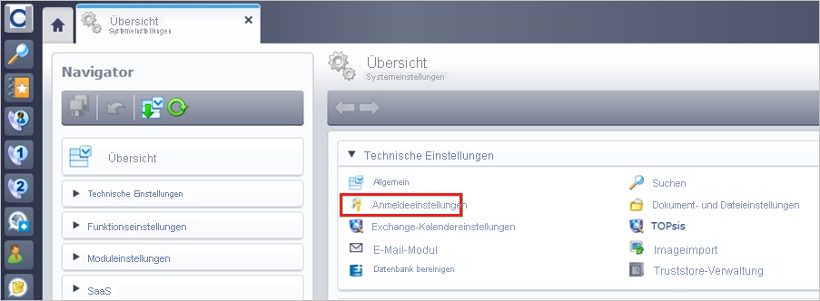
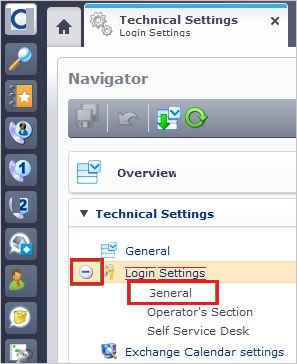
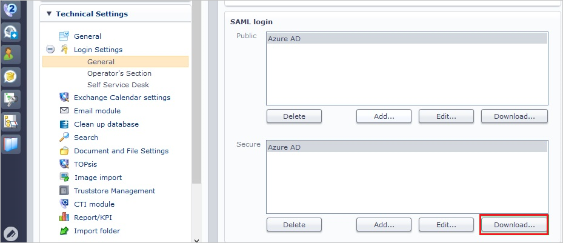
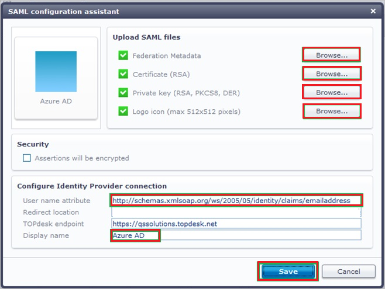
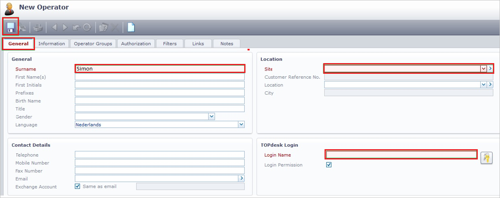

# Tutorial: Azure AD-SSO-Integration in TOPdesk - Secure

In diesem Tutorial erfahren Sie, wie Sie TOPdesk - Secure in Azure Active Directory (Azure AD) integrieren. Die Integration von TOPdesk - Secure in Azure AD ermöglicht Folgendes:

* Steuern Sie in Azure AD, wer Zugriff auf TOPdesk - Secure hat.
* Ermöglichen Sie es Ihren Benutzern, sich mit ihren Azure AD-Konten automatisch bei TOPdesk - Secure anzumelden (einmaliges Anmelden; Single Sign-On, SSO).
* Verwalten Sie Ihre Konten zentral im Azure-Portal.

## Voraussetzungen

Für die ersten Schritte benötigen Sie Folgendes:
 
 * Ein Azure AD-Abonnement Falls Sie über kein Abonnement verfügen, können Sie ein [kostenloses Azure-Konto](https://azure.microsoft.com/free/) verwenden.
* Ein TOPdesk - Secure-Abonnement, für das einmaliges Anmelden (Single Sign-On, SSO) aktiviert ist

## Beschreibung des Szenarios

In diesem Tutorial konfigurieren und testen Sie das einmalige Anmelden von Azure AD in einer Testumgebung.

* TOPdesk - Secure unterstützt **SP**-initiiertes einmaliges Anmelden.

## Hinzufügen von TOPdesk - Secure aus dem Katalog

Zum Konfigurieren der Integration von TOPdesk - Secure in Azure AD müssen Sie TOPdesk - Secure aus dem Katalog zur Liste mit den verwalteten SaaS-Apps hinzufügen.

1. Melden Sie sich mit einem Geschäfts-, Schul- oder Unikonto oder mit einem persönlichen Microsoft-Konto beim Azure-Portal an.
1. Wählen Sie im linken Navigationsbereich den Dienst **Azure Active Directory** aus.
1. Navigieren Sie zu **Unternehmensanwendungen**, und wählen Sie dann **Alle Anwendungen** aus.
1. Wählen Sie zum Hinzufügen einer neuen Anwendung **Neue Anwendung** aus.
1. Geben Sie im Abschnitt **Aus Katalog hinzufügen** den Suchbegriff **TOPdesk - Secure** in das Suchfeld ein.
1. Wählen Sie im Ergebnisbereich **TOPdesk - Secure** aus, und fügen Sie dann die App hinzu. Warten Sie einige Sekunden, während die App Ihrem Mandanten hinzugefügt wird.

## Konfigurieren und Testen des einmaligen Anmeldens von Azure AD für TOPdesk - Secure

In diesem Abschnitt konfigurieren und testen Sie das einmalige Anmelden von Azure AD bei TOPdesk – Secure mithilfe einer Testbenutzerin namens **Britta Simon**.
Damit einmaliges Anmelden funktioniert, muss eine Linkbeziehung zwischen einem Azure AD-Benutzer und dem entsprechenden Benutzer in TOPdesk – Secure eingerichtet werden.

Zum Konfigurieren und Testen des einmaligen Anmeldens von Azure AD mit TOPdesk - Secure müssen Sie die folgenden Schritte ausführen:

1. **[Konfigurieren des einmaligen Anmeldens von Azure AD](#configure-azure-ad-sso)** , um Ihren Benutzern die Verwendung dieses Features zu ermöglichen.
    1. **[Erstellen eines Azure AD-Testbenutzers](#create-an-azure-ad-test-user)** , um das einmalige Anmelden mit Azure AD mit dem Testbenutzer Britta Simon zu testen.
    2. **[Zuweisen des Azure AD-Testbenutzers](#assign-the-azure-ad-test-user)** , um Britta Simon für das einmalige Anmelden von Azure AD zu aktivieren.
2. **[Konfigurieren des einmaligen Anmeldens für TOPdesk - Secure](#configure-topdesk---secure-sso)** , um die Einstellungen für einmaliges Anmelden auf der Anwendungsseite zu konfigurieren
    1. **[Erstellen eines TOPdesk – Secure-Testbenutzers](#create-topdesk---secure-test-user)**, um eine Entsprechung von Britta Simon in TOPdesk – Secure zu erhalten, die mit ihrer Darstellung in Azure AD verknüpft ist.
1. **[Testen des einmaligen Anmeldens](#test-sso)** , um zu überprüfen, ob die Konfiguration funktioniert

## Konfigurieren des einmaligen Anmeldens (Single Sign-On, SSO) von Azure AD

In diesem Abschnitt aktivieren Sie das einmalige Anmelden von Azure AD im Azure-Portal.

Führen Sie zum Konfigurieren des einmaligen Anmeldens von Azure AD bei TOPdesk – Secure die folgenden Schritte aus:

1. Wählen Sie im Azure-Portal auf der Anwendungsintegrationsseite für **TOPdesk - Secure** die Option **Einmaliges Anmelden** aus.

2. Wählen Sie im Dialogfeld **SSO-Methode auswählen** den Modus **SAML/WS-Fed** aus, um einmaliges Anmelden zu aktivieren.

3. Klicken Sie auf der Seite **Einmaliges Anmelden (SSO) mit SAML einrichten** auf das Stiftsymbol, um das Dialogfeld **Grundlegende SAML-Konfiguration** zu öffnen.

    

4. Führen Sie im Abschnitt **Grundlegende SAML-Konfiguration** die folgenden Schritte aus:

    a. Geben Sie im Feld **Identifier URL** (Bezeichner-URL) die TOPdesk-Metadaten-URL ein, die Sie aus der TOPdesk-Konfiguration abrufen können. Verwenden Sie das folgende Format: `https://<companyname>.topdesk.net/saml-metadata/<identifier>`.

    b. Geben Sie im Textfeld **Antwort-URL** eine URL im folgenden Format ein: `https://<companyname>.topdesk.net/tas/secure/login/verify`

    c. Geben Sie im Textfeld **Anmelde-URL** eine URL im folgenden Format ein: `https://<companyname>.topdesk.net`

    > [!NOTE]
    > Hierbei handelt es sich um Beispielwerte. Sie müssen diese Werte mit dem tatsächlichen Bezeichner, der Antwort-URL und Anmelde-URL aktualisieren. Wenden Sie sich an das [Supportteam für den TOPdesk - Secure-Client](https://www.topdesk.com/en/services/support/), um diese Werte zu erhalten. Sie können sich auch die Muster im Abschnitt **Grundlegende SAML-Konfiguration** im Azure-Portal ansehen.

5. Klicken Sie auf der Seite **Einmaliges Anmelden (SSO) mit SAML einrichten** im Abschnitt **SAML-Signaturzertifikat** auf **Herunterladen**, um den Ihren Anforderungen entsprechenden **Verbundmetadaten-XML**-Code aus den verfügbaren Optionen herunterzuladen und auf Ihrem Computer zu speichern.

    

6. Kopieren Sie im Abschnitt **TOPdesk – Secure einrichten** die entsprechenden URLs gemäß Ihren Anforderungen.

    

### Erstellen eines Azure AD-Testbenutzers 

In diesem Abschnitt erstellen Sie im Azure-Portal einen Testbenutzer mit dem Namen B. Simon.

1. Wählen Sie im linken Bereich des Microsoft Azure-Portals **Azure Active Directory** > **Benutzer** > **Alle Benutzer** aus.
1. Wählen Sie oben im Bildschirm die Option **Neuer Benutzer** aus.
1. Führen Sie unter den Eigenschaften für **Benutzer** die folgenden Schritte aus:
   1. Geben Sie im Feld **Name** die Zeichenfolge `B.Simon` ein.  
   1. Geben Sie im Feld **Benutzername** die Zeichenfolge username@companydomain.extension ein. Beispiel: `B.Simon@contoso.com`.
   1. Aktivieren Sie das Kontrollkästchen **Kennwort anzeigen**, und notieren Sie sich den Wert aus dem Feld **Kennwort**.
   1. Klicken Sie auf **Erstellen**.

### Zuweisen des Azure AD-Testbenutzers

In diesem Abschnitt ermöglichen Sie B. Simon die Verwendung des einmaligen Anmeldens von Azure, indem Sie ihr Zugriff auf TOPdesk - Secure gewähren.

1. Wählen Sie im Azure-Portal **Unternehmensanwendungen** > **Alle Anwendungen** aus.
1. Wählen Sie in der Anwendungsliste den Eintrag **TOPdesk - Secure** aus.
1. Navigieren Sie auf der Übersichtsseite der App zum Abschnitt **Verwalten**, und wählen Sie **Benutzer und Gruppen** aus.
1. Wählen Sie **Benutzer hinzufügen** und anschließend im Dialogfeld **Zuweisung hinzufügen** die Option **Benutzer und Gruppen** aus.
1. Wählen Sie im Dialogfeld **Benutzer und Gruppen** in der Liste „Benutzer“ den Eintrag **B. Simon** aus, und klicken Sie dann unten auf dem Bildschirm auf die Schaltfläche **Auswählen**.
1. Wenn den Benutzern eine Rolle zugewiesen werden soll, können Sie sie im Dropdownmenü **Rolle auswählen** auswählen. Wurde für diese App keine Rolle eingerichtet, ist die Rolle „Standardzugriff“ ausgewählt.
1. Klicken Sie im Dialogfeld **Zuweisung hinzufügen** auf die Schaltfläche **Zuweisen**.

## Konfigurieren des einmaligen Anmeldens für TOPdesk - Secure

1. Melden Sie sich auf Ihrer **TOPdesk – Secure**-Unternehmenswebsite als Administrator an.

2. Klicken Sie im **TOPdesk**-Menü auf **Einstellungen**.

    

3. Klicken Sie auf **Anmeldeeinstellungen**.

    

4. Erweitern Sie das Menü **Anmeldeeinstellungen**, und klicken Sie dann auf **Allgemein**.

    

5. Führen Sie im Abschnitt **Sicher** des Konfigurationsabschnitts **SAML-Anmeldung** die folgenden Schritte aus:

    

    a. Klicken Sie auf **Herunterladen**, um die öffentliche Metadatendatei herunterzuladen, und speichern Sie sie dann lokal auf Ihrem Computer.

    b. Öffnen Sie die Metadatendatei, und suchen Sie den Knoten **AssertionConsumerService**.

    

    c. Kopieren Sie den Wert **AssertionConsumerService**, und fügen Sie ihn im Abschnitt **Domäne und URLs für TOPdesk - Secure** in das Textfeld Antwort-URL ein.

6. Zum Erstellen einer Zertifikatsdatei führen Sie die folgenden Schritte durch:

    

    a. Öffnen Sie die aus dem Azure-Portal heruntergeladene Metadatendatei.

    b. Erweitern Sie den Knoten **RoleDescriptor**, der einen **xsi:type** gleich **fed:ApplicationServiceType** aufweist.

    c. Kopieren Sie den Wert des Knotens **X509Certificate**.

    d. Speichern Sie den kopierten **X509Certificate**-Wert lokal auf Ihrem Computer in einer Datei.

7. Klicken Sie im Abschnitt **Öffentlich** auf **Hinzufügen**.

    

8. Führen Sie auf der Dialogseite **SAML-Konfigurationsassistent** die folgenden Schritte aus:

    

    a. Klicken Sie zum Hochladen der aus dem Azure-Portal heruntergeladenen Metadatendatei unter **Verbundmetadaten** auf **Durchsuchen**.

    b. Zum Hochladen der Zertifikatsdatei klicken Sie unter **Zertifikat (RSA)** auf **Durchsuchen**.

    c. Für **Privater Schlüssel (RSA, PKCS8, DER)** können Sie Ihren eigenen privaten Schlüssel hochladen oder sich an das [Supportteam für den TOPdesk - Secure-Client](https://www.topdesk.com/en/services/support/) wenden, um den privaten Schlüssel zu erhalten.

    d. Wenn Sie die Logodatei hochladen möchten, die Sie vom TOPdesk-Supportteam erhalten haben, klicken Sie unter **Logo-Symbol** auf **Durchsuchen**.

    e. Geben Sie `http://schemas.xmlsoap.org/ws/2005/05/identity/claims/emailaddress` in das Textfeld **Benutzernamenattribut** ein.

    f. Geben Sie in das Textfeld **Anzeigename** einen Namen für Ihre Konfiguration ein.

    g. Klicken Sie auf **Speichern**.

### Erstellen eines TOPdesk – Secure-Testbenutzers

Damit sich Azure AD-Benutzer bei TOPdesk - Secure anmelden können, müssen sie in TOPdesk - Secure bereitgestellt werden.  
Im Fall von TOPdesk - Secure ist die Bereitstellung eine manuelle Aufgabe.

### So konfigurieren Sie die Benutzerbereitstellung

1. Melden Sie sich bei Ihrer **TOPdesk - Secure** -Unternehmenswebsite als Administrator an.

2. Klicken Sie im Menü oben auf **TOPdesk \> Neu \> Support-Dateien \> Operator**.

    

3. Führen Sie im Dialogfeld **Neuer Operator** die folgenden Schritte aus:

    

    a. Klicken Sie auf die Registerkarte **Allgemein**.

    b. Geben Sie im Textfeld **Nachname** den Nachnamen des Benutzers ein, z.B. **Simon**.

    c. Wählen Sie eine **Website** für das Konto im Abschnitt **Speicherort** aus.

    d. Geben Sie im Abschnitt **TOPdesk-Anmeldung** in das Textfeld **Anmeldename** einen Anmeldenamen für den Benutzer ein.

    e. Klicken Sie auf **Speichern**.

> [!NOTE]
> Sie können Azure AD-Benutzerkonten auch mit anderen Tools zum Erstellen von TOPdesk – Secure-Benutzerkonten oder mit den APIs von TOPdesk – Secure bereitstellen.

## Testen des einmaligen Anmeldens

In diesem Abschnitt testen Sie die Azure AD-Konfiguration für einmaliges Anmelden mit den folgenden Optionen: 

* Klicken Sie im Azure-Portal auf **Diese Anwendung testen**. Dadurch werden Sie zur Anmelde-URL für TOPdesk - Secure weitergeleitet, wo Sie den Anmeldeflow initiieren können. 

* Rufen Sie direkt die Anmelde-URL für TOPdesk - Secure auf, und initiieren Sie den Anmeldeflow.

* Sie können „Meine Apps“ von Microsoft verwenden. Wenn Sie unter „Meine Apps“ auf die Kachel „TOPdesk - Secure“ klicken, sollten Sie automatisch bei der Instanz von TOPdesk - Secure angemeldet werden, für die Sie einmaliges Anmelden eingerichtet haben. Weitere Informationen zu „Meine Apps“ finden Sie in [dieser Einführung](https://support.microsoft.com/account-billing/sign-in-and-start-apps-from-the-my-apps-portal-2f3b1bae-0e5a-4a86-a33e-876fbd2a4510).

## Nächste Schritte

Nach dem Konfigurieren von TOPdesk - Secure können Sie die Sitzungssteuerung erzwingen, die in Echtzeit vor der Exfiltration und Infiltration vertraulicher Unternehmensdaten schützt. Die Sitzungssteuerung basiert auf bedingtem Zugriff. [Hier](/cloud-app-security/proxy-deployment-any-app) erfahren Sie, wie Sie die Sitzungssteuerung mit Microsoft Cloud App Security erzwingen.
