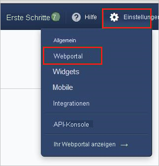
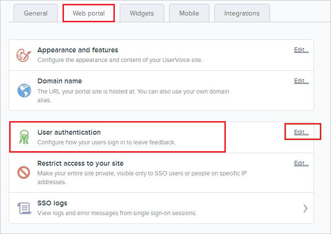
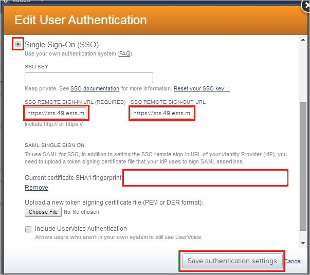
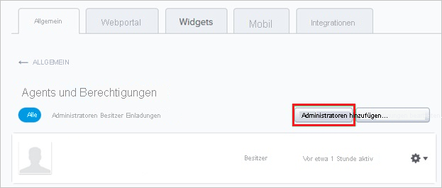

# Tutorial: Azure Active Directory-Integration mit UserVoice

In diesem Tutorial erfahren Sie, wie Sie UserVoice in Azure Active Directory (Azure AD) integrieren. Die Integration von UserVoice in Azure AD ermöglicht Folgendes:

* Sie können in Azure AD steuern, wer Zugriff auf UserVoice hat.
* Ermöglichen Sie es Ihren Benutzern, sich mit ihren Azure AD-Konten automatisch bei UserVoice anzumelden.
* Verwalten Sie Ihre Konten zentral im Azure-Portal.

## Voraussetzungen

Um die Azure AD-Integration mit UserVoice konfigurieren zu können, benötigen Sie Folgendes:

* Ein Azure AD-Abonnement Sollten Sie nicht über eine Azure AD-Umgebung verfügen, können Sie ein [kostenloses Konto](https://azure.microsoft.com/free/) verwenden.
* Ein UserVoice-Abonnement, für das einmaliges Anmelden aktiviert ist

## Beschreibung des Szenarios

In diesem Tutorial konfigurieren und testen Sie das einmalige Anmelden von Azure AD in einer Testumgebung.

* UserVoice unterstützt **SP-initiiertes** einmaliges Anmelden.

## Hinzufügen von UserVoice aus dem Katalog

Zum Konfigurieren der Integration von UserVoice in Azure AD müssen Sie UserVoice aus dem Katalog der Liste mit den verwalteten SaaS-Apps hinzufügen.

1. Melden Sie sich mit einem Geschäfts-, Schul- oder Unikonto oder mit einem persönlichen Microsoft-Konto beim Azure-Portal an.
1. Wählen Sie im linken Navigationsbereich den Dienst **Azure Active Directory** aus.
1. Navigieren Sie zu **Unternehmensanwendungen**, und wählen Sie dann **Alle Anwendungen** aus.
1. Wählen Sie zum Hinzufügen einer neuen Anwendung **Neue Anwendung** aus.
1. Geben Sie im Abschnitt **Aus Katalog hinzufügen** den Suchbegriff **UserVoice** in das Suchfeld ein.
1. Wählen Sie im Ergebnisbereich **UserVoice** aus, und fügen Sie dann die App hinzu. Warten Sie einige Sekunden, während die App Ihrem Mandanten hinzugefügt wird.

## Konfigurieren und Testen des einmaligen Anmeldens von Azure AD für UserVoice

Konfigurieren und testen Sie das einmalige Anmelden von Azure AD mit UserVoice mithilfe eines Testbenutzers mit dem Namen **B. Simon**. Damit einmaliges Anmelden funktioniert, muss eine Linkbeziehung zwischen einem Azure AD-Benutzer und dem entsprechenden Benutzer in UserVoice eingerichtet werden.

Führen Sie zum Konfigurieren und Testen des einmaligen Anmeldens von Azure AD für UserVoice die folgenden Schritte aus:

1. **[Konfigurieren des einmaligen Anmeldens von Azure AD](#configure-azure-ad-sso)** , um Ihren Benutzern die Verwendung dieses Features zu ermöglichen.
    1. **[Erstellen eines Azure AD-Testbenutzers](#create-an-azure-ad-test-user)** , um das einmalige Anmelden von Azure AD mit dem Testbenutzer B. Simon zu testen.
    1. **[Zuweisen des Azure AD-Testbenutzers](#assign-the-azure-ad-test-user)** , um B. Simon die Verwendung des einmaligen Anmeldens von Azure AD zu ermöglichen.
1. **[Konfigurieren des einmaligen Anmeldens für UserVoice](#configure-uservoice-sso)** , um die Einstellungen für einmaliges Anmelden auf der Anwendungsseite zu konfigurieren
    1. **[Erstellen eines UserVoice-Testbenutzers](#create-uservoice-test-user)** , um eine Entsprechung von B. Simon in UserVoice zu erhalten, die mit ihrer Darstellung in Azure AD verknüpft ist
1. **[Testen des einmaligen Anmeldens](#test-sso)** , um zu überprüfen, ob die Konfiguration funktioniert

## Konfigurieren des einmaligen Anmeldens (Single Sign-On, SSO) von Azure AD

Gehen Sie wie folgt vor, um das einmalige Anmelden von Azure AD im Azure-Portal zu aktivieren.

1. Navigieren Sie im Azure-Portal auf der Anwendungsintegrationsseite für **UserVoice** zum Abschnitt **Verwalten**, und wählen Sie **Einmaliges Anmelden** aus.
1. Wählen Sie auf der Seite **SSO-Methode auswählen** die Methode **SAML** aus.
1. Klicken Sie auf der Seite **Einmaliges Anmelden (SSO) mit SAML einrichten** auf das Stiftsymbol für **Grundlegende SAML-Konfiguration**, um die Einstellungen zu bearbeiten.

   

4. Führen Sie im Abschnitt **Grundlegende SAML-Konfiguration** die folgenden Schritte aus:

    a. Geben Sie im Textfeld **Bezeichner (Entitäts-ID)** eine URL im folgenden Format ein: `https://<TENANT_NAME>.UserVoice.com`.

    b. Geben Sie im Textfeld **Anmelde-URL** eine URL im folgenden Format ein: `https://<TENANT_NAME>.UserVoice.com`.

    > [!NOTE]
    > Hierbei handelt es sich um Beispielwerte. Ersetzen Sie diese Werte durch den tatsächlichen Bezeichner und die tatsächliche Anmelde-URL. Wenden Sie sich an das [Clientsupportteam von UserVoice](https://www.uservoice.com/), um diese Werte zu erhalten. Sie können sich auch die Muster im Abschnitt **Grundlegende SAML-Konfiguration** im Azure-Portal ansehen.

5. Klicken Sie im Abschnitt **SAML-Signaturzertifikat** auf die Schaltfläche **Bearbeiten**, um das Dialogfeld **SAML-Signaturzertifikat** zu öffnen.

    

6. Kopieren Sie im Abschnitt **SAML-Signaturzertifikat** den **Fingerabdruck**, und speichern Sie ihn auf Ihrem Computer.

    

7. Kopieren Sie im Abschnitt **UserVoice einrichten** die entsprechenden URLs gemäß Ihren Anforderungen.

    

### Erstellen eines Azure AD-Testbenutzers 

In diesem Abschnitt erstellen Sie im Azure-Portal einen Testbenutzer mit dem Namen B. Simon.

1. Wählen Sie im linken Bereich des Microsoft Azure-Portals **Azure Active Directory** > **Benutzer** > **Alle Benutzer** aus.
1. Wählen Sie oben im Bildschirm die Option **Neuer Benutzer** aus.
1. Führen Sie unter den Eigenschaften für **Benutzer** die folgenden Schritte aus:
   1. Geben Sie im Feld **Name** die Zeichenfolge `B.Simon` ein.  
   1. Geben Sie im Feld **Benutzername** die Zeichenfolge username@companydomain.extension ein. Beispiel: `B.Simon@contoso.com`.
   1. Aktivieren Sie das Kontrollkästchen **Kennwort anzeigen**, und notieren Sie sich den Wert aus dem Feld **Kennwort**.
   1. Klicken Sie auf **Erstellen**.

### Zuweisen des Azure AD-Testbenutzers

In diesem Abschnitt ermöglichen Sie B. Simon die Verwendung des einmaligen Anmeldens von Azure, indem Sie Zugriff auf UserVoice gewähren.

1. Wählen Sie im Azure-Portal **Unternehmensanwendungen** > **Alle Anwendungen** aus.
1. Wählen Sie in der Anwendungsliste **UserVoice** aus.
1. Navigieren Sie auf der Übersichtsseite der App zum Abschnitt **Verwalten**, und wählen Sie **Benutzer und Gruppen** aus.
1. Wählen Sie **Benutzer hinzufügen** und anschließend im Dialogfeld **Zuweisung hinzufügen** die Option **Benutzer und Gruppen** aus.
1. Wählen Sie im Dialogfeld **Benutzer und Gruppen** in der Liste „Benutzer“ den Eintrag **B. Simon** aus, und klicken Sie dann unten auf dem Bildschirm auf die Schaltfläche **Auswählen**.
1. Wenn den Benutzern eine Rolle zugewiesen werden soll, können Sie sie im Dropdownmenü **Rolle auswählen** auswählen. Wurde für diese App keine Rolle eingerichtet, ist die Rolle „Standardzugriff“ ausgewählt.
1. Klicken Sie im Dialogfeld **Zuweisung hinzufügen** auf die Schaltfläche **Zuweisen**.

## Konfigurieren einmaligen Anmeldens von UserVoice

1. Melden Sie sich in einem anderen Webbrowserfenster bei der UserVoice-Unternehmenswebsite als Administrator an.

2. Klicken Sie auf der Symbolleiste oben auf **Settings** (Einstellungen), und wählen Sie dann aus dem Menü die Option **Web portal** aus.
   
    

3. Klicken Sie auf der Registerkarte **Web portal** im Abschnitt **User authentication** (Benutzerauthentifizierung) auf **Edit** (Bearbeiten), um die Dialogfeldseite **Edit User Authentication** (Benutzerauthentifizierung bearbeiten) zu öffnen.
   
    

4. Führen Sie auf der Dialogseite **Benutzerauthentifizierung bearbeiten** die folgenden Schritte aus:
   
    
   
    a. Klicken Sie auf **Einmaliges Anmelden (SSO)** .
 
    b. Fügen Sie den Wert der **Anmelde-URL**, den Sie im Azure-Portal kopiert haben, in das Textfeld **SSO Remote Sign-In** (SSO-Remoteanmeldung) ein.

    c. Fügen Sie den Wert der **Abmelde-URL**, den Sie im Azure-Portal kopiert haben, in das Textfeld **SSO Remote Sign-Out** (SSO-Remoteabmeldung) ein.
 
    d. Fügen Sie in das Textfeld **Current certificate SHA1 fingerprint** (SHA1-Fingerabdruck des aktuellen Zertifikats) den Wert für **Fingerabdruck** aus dem Azure-Portal ein.
    
    e. Klicken Sie auf **Authentifizierungseinstellungen speichern**.

### Erstellen eines UserVoice-Testbenutzers

Damit sich Azure AD-Benutzer bei UserVoice anmelden können, müssen sie in UserVoice bereitgestellt werden. Im Fall von UserVoice ist die Bereitstellung eine manuelle Aufgabe.

### Führen Sie zum Bereitstellen eines Benutzerkontos die folgenden Schritte aus:

1. Melden Sie sich bei Ihrem **UserVoice**-Mandanten an.

2. Wechseln Sie zu **Einstellungen**.
   
    

3. Klicken Sie auf **Allgemein**.

4. Klicken Sie auf **Agents und Berechtigungen**.
   
    

5. Klicken Sie auf **Administratoren hinzufügen**.
   
    

6. Führen Sie im Dialogfeld **Benutzer einladen** die folgenden Schritte aus:
   
    
   
    a. Geben Sie in das Textfeld „E-Mails“ die E-Mail-Adresse des Azure AD-Kontos ein, das Sie bereitstellen möchten, und klicken Sie auf **Hinzufügen**.
   
    b. Klicken Sie auf **Einladen**.

> [!NOTE]
> Sie können Azure AD-Benutzerkonten auch mithilfe anderer Tools zum Erstellen von UserVoice-Benutzerkonten oder mithilfe der von UserVoice bereitgestellten APIs erstellen.

## Testen des einmaligen Anmeldens 

In diesem Abschnitt testen Sie die Azure AD-Konfiguration für einmaliges Anmelden mit den folgenden Optionen: 

* Klicken Sie im Azure-Portal auf **Diese Anwendung testen**. Dadurch werden Sie zur Anmelde-URL für UserVoice weitergeleitet, wo Sie den Anmeldeflow initiieren können. 

* Rufen Sie direkt die UserVoice-Anmelde-URL auf, und initiieren Sie den Anmeldeflow.

* Sie können „Meine Apps“ von Microsoft verwenden. Wenn Sie in „Meine Apps“auf die Kachel „UserVoice“ klicken, werden Sie zur Anmelde-URL für UserVoice weitergeleitet. Weitere Informationen zu „Meine Apps“ finden Sie in [dieser Einführung](https://support.microsoft.com/account-billing/sign-in-and-start-apps-from-the-my-apps-portal-2f3b1bae-0e5a-4a86-a33e-876fbd2a4510).

## Nächste Schritte

Nach dem Konfigurieren von UserVoice können Sie die Sitzungssteuerung erzwingen, die in Echtzeit vor der Exfiltration und Infiltration vertraulicher Unternehmensdaten schützt. Die Sitzungssteuerung basiert auf bedingtem Zugriff. [Hier](/cloud-app-security/proxy-deployment-aad) erfahren Sie, wie Sie die Sitzungssteuerung mit Microsoft Cloud App Security erzwingen.