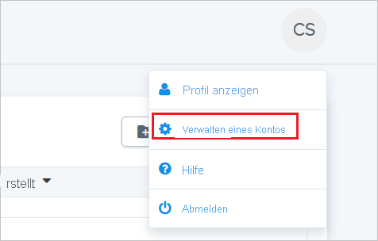
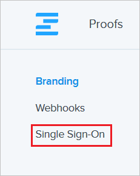
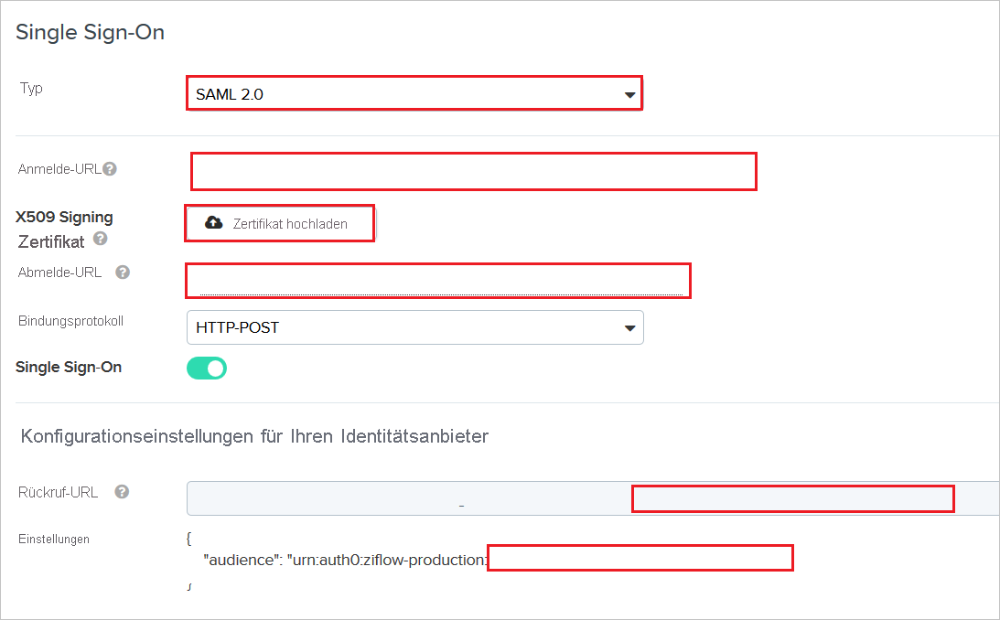
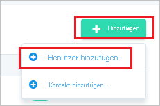
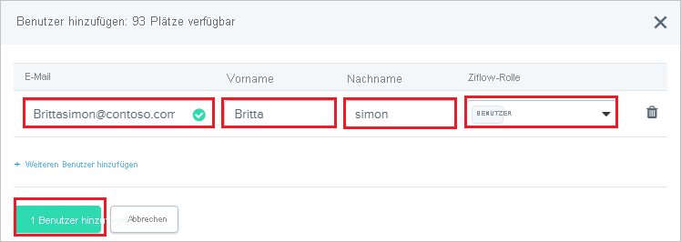

# Tutorial: Azure Active Directory-Integration mit Ziflow

In diesem Tutorial erfahren Sie, wie Sie Ziflow in Azure Active Directory (Azure AD) integrieren. Die Integration von Ziflow in Azure AD ermöglicht Ihnen Folgendes:

* Sie können in Azure AD steuern, wer Zugriff auf Zoom hat.
* Sie können Ihren Benutzern ermöglichen, sich mit ihren Azure AD-Konten automatisch bei Ziflow anzumelden.
* Verwalten Sie Ihre Konten zentral im Azure-Portal.

## Voraussetzungen

Um die Azure AD-Integration mit Ziflow konfigurieren zu können, benötigen Sie Folgendes:

* Ein Azure AD-Abonnement Sollten Sie nicht über eine Azure AD-Umgebung verfügen, können Sie ein [kostenloses Konto](https://azure.microsoft.com/free/) verwenden.
* Ein Ziflow-Abonnement, ist für das einmalige Anmelden aktiviert.

## Beschreibung des Szenarios

In diesem Tutorial konfigurieren und testen Sie das einmalige Anmelden von Azure AD in einer Testumgebung.

* Ziflow unterstützt **SP**-initiiertes einmaliges Anmelden.

## Hinzufügen von Ziflow aus dem Katalog

Zum Konfigurieren der Integration von Ziflow in Azure AD müssen Sie Ziflow aus dem Katalog zur Liste mit den verwalteten SaaS-Apps hinzufügen.

1. Melden Sie sich mit einem Geschäfts-, Schul- oder Unikonto oder mit einem persönlichen Microsoft-Konto beim Azure-Portal an.
1. Wählen Sie im linken Navigationsbereich den Dienst **Azure Active Directory** aus.
1. Navigieren Sie zu **Unternehmensanwendungen**, und wählen Sie dann **Alle Anwendungen** aus.
1. Wählen Sie zum Hinzufügen einer neuen Anwendung **Neue Anwendung** aus.
1. Geben Sie im Abschnitt **Aus dem Katalog hinzufügen** den Suchbegriff **Ziflow** in das Suchfeld ein.
1. Wählen Sie im Ergebnisbereich **Ziflow** aus, und fügen dann Sie dann die App hinzu. Warten Sie einige Sekunden, während die App Ihrem Mandanten hinzugefügt wird.

## Konfigurieren und Testen des einmaligen Anmeldens von Azure AD für Ziflow

Konfigurieren und testen Sie das einmalige Anmelden von Azure AD mit Ziflow mithilfe eines Testbenutzers nsmend **B. Simon**. Damit das einmalige Anmelden funktioniert, muss eine Linkbeziehung zwischen einem Azure AD-Benutzer und dem entsprechenden Benutzer in Ziflow eingerichtet werden.

Führen Sie zum Konfigurieren und Testen des einmaligen Anmeldens von Azure AD mit Ziflow die folgenden Schritte aus:

1. **[Konfigurieren des einmaligen Anmeldens von Azure AD](#configure-azure-ad-sso)** , um Ihren Benutzern die Verwendung dieses Features zu ermöglichen.
    1. **[Erstellen eines Azure AD-Testbenutzers](#create-an-azure-ad-test-user)** , um das einmalige Anmelden von Azure AD mit dem Testbenutzer B. Simon zu testen.
    1. **[Zuweisen des Azure AD-Testbenutzers](#assign-the-azure-ad-test-user)** , um B. Simon die Verwendung des einmaligen Anmeldens von Azure AD zu ermöglichen.
1. **[Konfigurieren des einmaligen Anmeldens für Ziflow](#configure-ziflow-sso)** , um die Einstellungen für das einmalige Anmelden auf der Anwendungsseite zu konfigurieren.
    1. **[Erstellen eines Ziflow-Testbenutzers](#create-ziflow-test-user)** , um eine Entsprechung von B. Simon in Ziflow zu erhalten, die mit der Darstellung des Benutzers in Azure AD verknüpft ist.
1. **[Testen des einmaligen Anmeldens](#test-sso)** , um zu überprüfen, ob die Konfiguration funktioniert

## Konfigurieren des einmaligen Anmeldens (Single Sign-On, SSO) von Azure AD

Gehen Sie wie folgt vor, um das einmalige Anmelden von Azure AD im Azure-Portal zu aktivieren.

1. Navigieren Sie im Azure-Portal auf der Anwendungsintegrationsseite für **Ziflow** zum Abschnitt **Verwalten** und wählen Sie dann **Einmaliges Anmelden** aus.
1. Wählen Sie auf der Seite **SSO-Methode auswählen** die Methode **SAML** aus.
1. Klicken Sie auf der Seite **Einmaliges Anmelden (SSO) mit SAML einrichten** auf das Stiftsymbol für **Grundlegende SAML-Konfiguration**, um die Einstellungen zu bearbeiten.

   

4. Führen Sie im Abschnitt **Grundlegende SAML-Konfiguration** die folgenden Schritte aus:

    a. Geben Sie im Textfeld **Bezeichner (Entitäts-ID)** einen Wert im folgenden Format ein: `urn:auth0:ziflow-production:<UNIQUE_ID>`.

    b. Geben Sie im Textfeld **Anmelde-URL** eine URL im folgenden Format ein: `https://ziflow-production.auth0.com/login/callback?connection=<UNIQUE_ID>`.

    > [!NOTE]
    > Die vorangehenden Werte sind keine echten Werte. Sie aktualisieren den eindeutigen ID-Wert des Bezeichners und der Anmelde-URL mit dem tatsächlichen Wert. Dies wird später in diesem Tutorial beschrieben.

5. Klicken Sie auf der Seite **Einmaliges Anmelden (SSO) mit SAML einrichten** im Abschnitt **SAML-Signaturzertifikat** auf **Herunterladen**, um das Ihrer Anforderung entsprechende **Zertifikat (Base64)** aus den angegebenen Optionen herunterzuladen und auf Ihrem Computer zu speichern.

    

6. Kopieren Sie im Abschnitt **Ziflow einrichten** die entsprechenden URLs gemäß Ihren Anforderungen.

    

### Erstellen eines Azure AD-Testbenutzers 

In diesem Abschnitt erstellen Sie im Azure-Portal einen Testbenutzer mit dem Namen B. Simon.

1. Wählen Sie im linken Bereich des Microsoft Azure-Portals **Azure Active Directory** > **Benutzer** > **Alle Benutzer** aus.
1. Wählen Sie oben im Bildschirm die Option **Neuer Benutzer** aus.
1. Führen Sie unter den Eigenschaften für **Benutzer** die folgenden Schritte aus:
   1. Geben Sie im Feld **Name** die Zeichenfolge `B.Simon` ein.  
   1. Geben Sie im Feld **Benutzername** die Zeichenfolge username@companydomain.extension ein. Beispiel: `B.Simon@contoso.com`.
   1. Aktivieren Sie das Kontrollkästchen **Kennwort anzeigen**, und notieren Sie sich den Wert aus dem Feld **Kennwort**.
   1. Klicken Sie auf **Erstellen**.

### Zuweisen des Azure AD-Testbenutzers

In diesem Abschnitt ermöglichen Sie B. Simon die Verwendung des einmaligen Anmeldens mit Azure, indem Sie den Zugriff auf Ziflow gewähren.

1. Wählen Sie im Azure-Portal **Unternehmensanwendungen** > **Alle Anwendungen** aus.
1. Wählen Sie in der Anwendungsliste **Ziflow** aus.
1. Navigieren Sie auf der Übersichtsseite der App zum Abschnitt **Verwalten**, und wählen Sie **Benutzer und Gruppen** aus.
1. Wählen Sie **Benutzer hinzufügen** und anschließend im Dialogfeld **Zuweisung hinzufügen** die Option **Benutzer und Gruppen** aus.
1. Wählen Sie im Dialogfeld **Benutzer und Gruppen** in der Liste „Benutzer“ den Eintrag **B. Simon** aus, und klicken Sie dann unten auf dem Bildschirm auf die Schaltfläche **Auswählen**.
1. Wenn den Benutzern eine Rolle zugewiesen werden soll, können Sie sie im Dropdownmenü **Rolle auswählen** auswählen. Wurde für diese App keine Rolle eingerichtet, ist die Rolle „Standardzugriff“ ausgewählt.
1. Klicken Sie im Dialogfeld **Zuweisung hinzufügen** auf die Schaltfläche **Zuweisen**.

## Konfigurieren des einmaligen Anmeldens für Ziflow

1. Melden Sie sich in einem anderen Webbrowserfenster als Sicherheitsadministrator bei Ziflow an.

2. Klicken Sie in der Ecke oben rechts auf den Avatar und anschließend auf **Manage account** (Konto verwalten).

    

3. Klicken Sie oben links auf **Single Sign-On** (Einmaliges Anmelden).

    

4. Führen Sie auf der Seite **Single Sign-On** (Einmaliges Anmelden) die folgenden Schritte aus:

    

    a. Wählen Sie für **Type** (Typ) die Option **SAML 2.0** aus.

    b. Fügen Sie in das Textfeld **Sign In URL** (Anmelde-URL) den Wert der **Anmelde-URL** ein, den Sie aus dem Azure-Portal kopiert haben.

    c. Laden Sie das Base64-codierte Zertifikat, das Sie aus dem Azure-Portal heruntergeladen haben, unter **X509 Signing Certificate** (X509-Signaturzertifikat) hoch.

    d. Fügen Sie in das Textfeld **Sign Out URL** (Abmelde-URL) den Wert der **Abmelde-URL** ein, den Sie aus dem Azure-Portal kopiert haben.

    e. Kopieren Sie im Abschnitt **Configuration Settings for your Identifier Provider** (Konfigurationseinstellungen für Ihren Identitätsanbieter) den hervorgehobenen eindeutigen ID-Wert, und fügen Sie ihn mit dem Bezeichner und der Anmelde-URL im Azure-Portal unter **Grundlegende SAML-Konfiguration** an.

### Erstellen eines Ziflow-Testbenutzers

Damit sich Azure AD-Benutzer bei Ziflow anmelden können, müssen sie in Ziflow bereitgestellt werden. Im Fall von Ziflow ist die Bereitstellung eine manuelle Aufgabe.

Führen Sie zum Bereitstellen eines Benutzerkontos die folgenden Schritte aus:

1. Melden Sie sich bei Ziflow als Sicherheitsadministrator an.

2. Navigieren Sie oben zu **People** (Personen).

    

3. Klicken Sie auf **Add** (Hinzufügen) und anschließend auf **Add user** (Benutzer hinzufügen).

    

4. Führen Sie im Popupfenster **Benutzer hinzufügen** die folgenden Schritte aus:

    

    a. Geben Sie im Textfeld **Email** (E-Mail-Adresse) die E-Mail-Adresse des Benutzers ein, z.B. brittasimon@contoso.com.

    b. Geben Sie im Textfeld **First Name** (Vorname) den Vornamen des Benutzers ein, z.B. „Britta“.

    c. Geben Sie im Textfeld **Last Name** (Nachname) den Nachnamen des Benutzers ein, z.B. „Simon“.

    d. Wählen Sie Ihre Ziflow-Rolle aus.

    e. Klicken Sie auf **Add 1 user** (1 Benutzer hinzufügen).

    > [!NOTE]
    > Der Besitzer des Azure Active Directory-Kontos erhält eine E-Mail und folgt einem Link zur Bestätigung des Kontos, bevor es aktiv wird.

## Testen des einmaligen Anmeldens 

In diesem Abschnitt testen Sie die Azure AD-Konfiguration für einmaliges Anmelden mit den folgenden Optionen: 

* Klicken Sie im Azure-Portal auf **Diese Anwendung testen**. Dadurch werden Sie zur Anmelde-URL für Ziflow weitergeleitet, wo Sie den Anmeldeablauf initiieren können. 

* Navigieren Sie direkt zur Anmelde-URL für Ziflow, und initiieren Sie den Anmeldeablauf.

* Sie können „Meine Apps“ von Microsoft verwenden. Wenn Sie in „Meine Apps“ auf die Kachel „Ziflow“ klicken, werden Sie zur Anmelde-URL für Ziflow weitergeleitet. Weitere Informationen zu „Meine Apps“ finden Sie in [dieser Einführung](https://support.microsoft.com/account-billing/sign-in-and-start-apps-from-the-my-apps-portal-2f3b1bae-0e5a-4a86-a33e-876fbd2a4510).

## Nächste Schritte

Nach dem Konfigurieren von Ziflow können Sie die Sitzungssteuerung erzwingen, die Ihre vertraulichen Unternehmensdaten in Echtzeit vor der Exfiltration und Infiltration schützt. Die Sitzungssteuerung basiert auf bedingtem Zugriff. [Hier](/cloud-app-security/proxy-deployment-aad) erfahren Sie, wie Sie die Sitzungssteuerung mit Microsoft Cloud App Security erzwingen.
