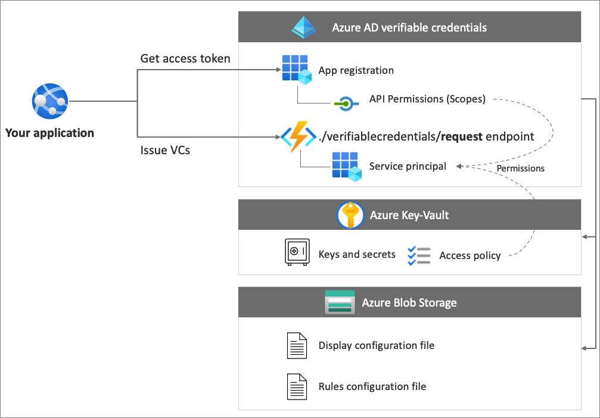
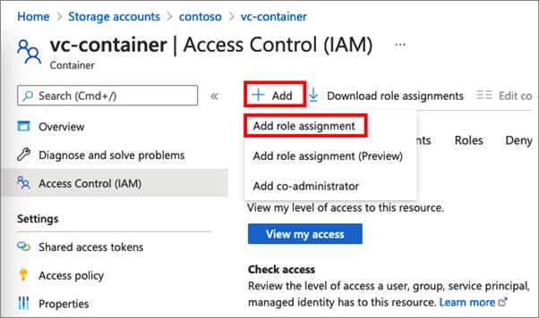
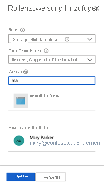
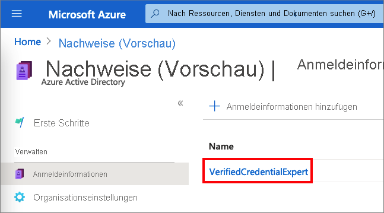
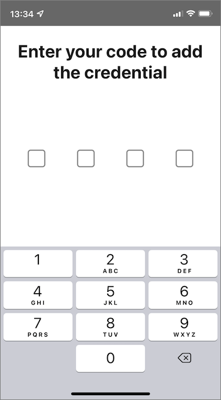
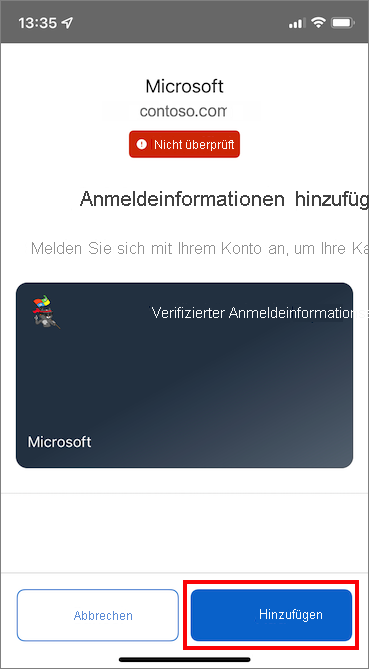

# <a name="issue-azure-ad-verifiable-credentials-from-an-application-preview"></a>Ausstellen von Azure AD-Nachweisen über eine Anwendung (Vorschau)

In diesem Tutorial führen Sie eine Beispielanwendung auf Ihrem lokalen Computer aus, die eine Verbindung mit Ihrem Azure AD-Mandanten (Azure Active Directory) herstellt. Mithilfe der Anwendung stellen Sie eine Karte für Nachweisexperten aus und überprüfen sie.

In diesem Artikel werden folgende Vorgehensweisen behandelt:

> [!div class="checklist"]
>
> - Einrichten einer Azure Blob Storage-Instanz zum Speichern der Nachweiskonfigurationsdateien
> - Erstellen und Hochladen der Nachweiskonfigurationsdateien
> - Erstellen der Karte für Nachweisexperten in Azure
> - Sammeln von Nachweis- und Umgebungsdetails zum Einrichten der Beispielanwendung
> - Herunterladen des Beispielanwendungscodes auf Ihren lokalen Computer
> - Aktualisieren der Beispielanwendung mit Ihrer Karte für Nachweisexperten und den Umgebungsdetails
> - Ausführen der Beispielanwendung und Ausstellen der ersten Karte für Nachweisexperten
> - Überprüfen der Karte für Nachweisexperten

Im folgenden Diagramm sind die Architektur für Azure AD-Nachweise und die Komponente dargestellt, die Sie konfigurieren:



## <a name="prerequisites"></a>Voraussetzungen

- Bevor Sie beginnen, sollten Sie [einen Mandanten für den Azure AD-Nachweis einrichten](/azure/active-directory/verifiable-credentials/verifiable-credentials-configure-tenant).
- Installieren Sie [Git](https://git-scm.com/downloads), um das Repository zu klonen, das als Host für die Beispiel-App fungiert.
- [Visual Studio Code](https://code.visualstudio.com/Download) oder ein ähnlicher Code-Editor
- [.NET 5.0](https://dotnet.microsoft.com/download/dotnet/5.0)
- [ngrok](https://ngrok.com/) (kostenlos)
- Ein mobiles Gerät mit Microsoft Authenticator
  - Es muss mindestens Android-Version 6.2108.5654 installiert sein.
  - Es muss mindestens iOS-Version 6.5.82 installiert sein.

## <a name="create-a-storage-account"></a>Speicherkonto erstellen

Azure Blob Storage ist die Objektspeicherlösung von Microsoft für die Cloud. Der Azure AD-Nachweisdienst nutzt [Azure Blob Storage](/azure/storage/blobs/storage-blobs-introduction), um die Nachweiskonfigurationsdateien beim Ausstellen von Nachweisen zu speichern.

Erstellen und konfigurieren Sie Ihre Azure Blob Storage-Instanz mithilfe der folgenden Schritte:

1. Falls Sie kein Azure Blob Storage-Konto besitzen, [erstellen Sie ein Speicherkonto](/azure/storage/common/storage-account-create).
1. Erstellen Sie nach der Erstellung des Speicherkontos einen Container. Scrollen Sie im linken Menü für das Speicherkonto zum Abschnitt **Datenspeicher**, und wählen Sie **Container** aus.
1. Wählen Sie die Schaltfläche **+ Container**.
1. Geben Sie unter **Name** einen Namen für den neuen Container ein. Der Containername muss klein geschrieben werden, mit einem Buchstaben oder einer Zahl beginnen und darf nur Buchstaben, Zahlen und Bindestriche (-) enthalten. Beispiel: *vc-container*
1. Legen Sie **Öffentliche Zugriffsebene** auf **Privat** (kein anonymer Zugriff) fest.
1. Klicken Sie auf **Erstellen**.  

    Der folgende Screenshot zeigt das Erstellen eines Containers:  

   

## <a name="grant-access-to-the-container"></a>Gewähren des Zugriffs auf den Container

Gewähren Sie nach dem Erstellen des Containers dem angemeldeten Benutzer die richtige Rollenzuweisung, damit er auf die Dateien in Storage Blob zugreifen kann.

1. Wählen Sie in der Containerliste *vc-container* aus.

1. Wählen Sie im Menü die Option **Zugriffssteuerung (IAM)** aus.

1. Wählen Sie **+ Hinzufügen** und dann **Rollenzuweisung hinzufügen** aus.

     

1. Gehen Sie auf der Seite **Rollenzuweisung hinzufügen** wie folgt vor:

    1. Wählen Sie unter **Rolle** die Option **Storage-Blobdatenleser** aus.

    1. Wählen Sie für **Zugriff zuweisen zu** die Option **Benutzer, Gruppe oder Dienstprinzipal** aus.

    1. Suchen Sie dann nach dem Konto, das Sie zum Ausführen dieser Schritte verwenden, und wählen Sie es aus.

        

>[!IMPORTANT]
>Standardmäßig wird die Rolle " Besitzer " dem Container Ersteller zugewiesen. Die Rolle „Besitzer“ ist allein nicht ausreichend. Ihr Konto benötigt die Rolle „Leser von Speicherblobdaten“. Weitere Informationen finden Sie unter [Zuweisen einer Azure-Rolle für den Zugriff auf Blob- und Warteschlangendaten über das Azure-Portal](/azure/storage/blobs/assign-azure-role-data-access).

### <a name="upload-the-configuration-files"></a>Hochladen der Konfigurationsdateien

Der Azure AD-Nachweisdienst verwendet zwei JSON-Konfigurationsdateien: die Regel- und die Anzeigedatei. 

- In der Regeldatei sind wichtige Eigenschaften der Nachweise beschrieben. Insbesondere werden die Ansprüche beschrieben, die Antragsteller (Benutzer) bereitstellen müssen, damit ein Nachweis für sie ausgestellt wird. 
- Mit der Anzeigedatei wird das Branding des Nachweises und das Format der Ansprüche gesteuert.

In diesem Abschnitt laden Sie eine Beispielregeldatei und eine Beispielanzeigedatei in Ihren Speicher hoch. Weitere Informationen zum Anpassen dieser Dateien finden Sie unter [Gewusst wie: Anpassen Ihrer Nachweise (Vorschau)](credential-design.md).

Führen Sie zum Hochladen der Konfigurationsdateien die folgenden Schritte aus:

1. Kopieren Sie den folgenden JSON-Code, und speichern Sie den Inhalt in einer Datei namens „VerifiedCredentialExpertDisplay.json“:

    ```json
    {
      "default": {
        "locale": "en-US",
        "card": {
          "title": "Verified Credential Expert",
          "issuedBy": "Microsoft",
          "backgroundColor": "#2E4053",
          "textColor": "#ffffff",
          "logo": {
            "uri": "https://didcustomerplayground.blob.core.windows.net/public/VerifiedCredentialExpert_icon.png",
            "description": "Verified Credential Expert Logo"
          },
          "description": "Use your verified credential to prove to anyone that you know all about verifiable credentials."
        },
        "consent": {
          "title": "Do you want to get your Verified Credential?",
          "instructions": "Sign in with your account to get your card."
        },
        "claims": {
          "vc.credentialSubject.firstName": {
            "type": "String",
            "label": "First name"
          },
          "vc.credentialSubject.lastName": {
            "type": "String",
            "label": "Last name"
          }
        }
      }
    }
    ```

1. Kopieren Sie den folgenden JSON-Code, und speichern Sie den Inhalt in einer Datei namens „VerifiedCredentialExpertRules.json“. Im folgenden Nachweis sind einige einfache Ansprüche definiert: firstName und lastName.

    ```json
    {
      "attestations": {
        "idTokens": [
          {
            "id": "https://self-issued.me",
            "mapping": {
              "firstName": { "claim": "$.given_name" },
              "lastName": { "claim": "$.family_name" }
            },
            "configuration": "https://self-issued.me",
            "client_id": "",
            "redirect_uri": ""
          }
        ]
      },
      "validityInterval": 2592001,
      "vc": {
        "type": [ "VerifiedCredentialExpert" ]
      }
    }
    ```
    
1. Navigieren Sie im Azure-Portal zu dem [von Ihnen erstellten](#create-a-storage-account) Azure Blob Storage-Container.

1. Wählen Sie im Menü auf der linken Seite **Container** aus, um eine Liste mit den darin enthaltenen Blobs anzuzeigen. Wählen Sie den zuvor erstellten Container **vc-container** aus.

1. Wählen Sie die Schaltfläche **Hochladen** aus, um das Uploadblatt zu öffnen, und navigieren Sie in Ihrem lokalen Dateisystem zu einer Datei, um sie hochzuladen. Wählen Sie die Dateien **VerifiedCredentialExpertDisplay.json** und **VerifiedCredentialExpertRules.json** aus. Wählen Sie dann **Hochladen** aus, um die Datei in den Container hochzuladen.

## <a name="create-the-verifiable-credential-expert-card-in-azure"></a>Erstellen der Karte für Nachweisexperten in Azure

In diesem Schritt erstellen Sie die Karte für Nachweisexperten mithilfe von Azure AD-Nachweisen. Nach dem Erstellen eines Nachweises kann Ihr Azure AD-Mandant diesen Nachweis für Benutzer ausstellen, die einen Prozess zur Ausstellung von Nachweisen initiieren.

1. Suchen Sie im [Azure-Portal](https://portal.azure.com/) über das Haupteingabefeld für die Suche nach **Nachweis**. Wählen Sie dann **Nachweise (Vorschau)** aus.
1. Nach dem [Einrichten Ihres Mandanten](verifiable-credentials-configure-tenant.md) sollte der Bildschirm mit der Option zum **Erstellen eines neuen Nachweises** angezeigt werden. Wenn er nicht geöffnet wird oder Sie weitere Nachweise erstellen möchten, wählen Sie **Leistungsnachweise** aus. Wählen Sie anschließend **+ Leistungsnachweis** aus.
1. Gehen Sie auf der Seite zum Erstellen eines neuen Nachweises wie folgt vor:

    1. Geben Sie in das Feld **Name** für den Nachweis den Namen **VerifiedCredentialExpert** ein. Dieser Name wird im Portal verwendet, um Ihre überprüfbaren Anmeldeinformationen zu identifizieren. Er ist im Rahmen des Vertrags für überprüfbare Anmeldeinformationen enthalten.

    1. Wählen Sie unter **Abonnement** das Azure AD-Abonnement aus, unter dem Sie die Azure Blob Storage-Instanz erstellt haben.

    1. Sie müssen unter **Anzeigedatei** die **Anzeigedatei auswählen**. Wählen Sie im Abschnitt „Speicherkonten“ die Option **vc-container** aus. Wählen Sie dann die Datei **VerifiedCredentialExpertDisplay.json** aus, und klicken Sie auf **Auswählen**.

    1. Sie müssen unter **Rules file** (Regeldatei) die **Regeldatei auswählen**. Wählen Sie im Abschnitt „Speicherkonten“ die Option **vc-container** aus. Wählen Sie dann die Datei **VerifiedCredentialExpertRules.json** aus, und klicken Sie auf **Auswählen**.

    Der folgende Screenshot zeigt, wie Sie einen neuen Nachweis erstellen:

    

1. Wählen Sie auf dem Bildschirm Neue Anmeldeinformation erstellen die Option **Erstellen** aus.

## <a name="gather-credentials-and-environment-details-to-set-up-your-sample-application"></a>Sammeln von Nachweis- und Umgebungsdetails zum Einrichten Ihrer Beispielanwendung

Nachdem Sie nun über einen neuen Nachweis verfügen, sammeln Sie einige Informationen zu Ihrer Umgebung und dem von Ihnen erstellten Nachweis. Sie verwenden diese Informationen beim Einrichten Ihrer Beispielanwendung.

1. Wählen Sie unter „Nachweise“ die Option **Leistungsnachweise** und dann in der Liste der Nachweise den zuvor erstellten Nachweis „VerifiedCredentialExpert“ aus

    

1. Kopieren Sie die **URL für das Ausstellen von Nachweisen**. Diese URL setzt sich aus den Regel- und Anzeigedateien zusammen. Dies ist die URL, die vom Authenticator ausgewertet wird, bevor dem Benutzer Ausstellungsvoraussetzungen für überprüfbare Anmeldeinformationen angezeigt werden. Notieren Sie sie zur späteren Verwendung.

1. Kopieren Sie den Wert unter **Dezentraler Bezeichner**, und notieren Sie ihn zur späteren Verwendung.

1. Kopieren Sie die **Mandanten-ID**, und notieren Sie sie zur späteren Verwendung. Auf dem folgenden Screenshot wird gezeigt, wie Sie die erforderlichen Werte kopieren:

    

## <a name="download-the-sample-code"></a>Herunterladen des Beispielcodes

Die Beispielanwendung ist in .NET verfügbar, und der Code wird in einem GitHub Repository verwaltet. Laden Sie unseren [Beispielcode auf GitHub](https://github.com/Azure-Samples/active-directory-verifiable-credentials-dotnet) herunter, oder klonen Sie das Repository auf Ihrem lokalen Computer:


```bash
git clone git@github.com:Azure-Samples/active-directory-verifiable-credentials-dotnet.git
```

## <a name="configure-the-verifiable-credentials-app"></a>Einrichten der Nachweis-App

Erstellen Sie einen geheimen Clientschlüssel für die von Ihnen erstellte registrierte Anwendung. Die Beispielanwendung verwendet den geheimen Clientschlüssel beim Anfordern von Token als Identitätsnachweis.

1. Navigieren Sie zur Seite **App-Registrierungen** in **Azure Active Directory**.

1. Wählen Sie die zuvor erstellte Anwendung **verifiable-credentials-app** aus.

1. Wählen Sie den Namen aus, der in den Details der App-Registrierungen angezeigt werden soll.

1. Kopieren Sie den Wert unter **Anwendungs-ID (Client)**, und speichern Sie ihn zur späteren Verwendung.  

     

1. Wählen Sie in den App-Registrierungsdetails im Hauptmenü unter **Verwalten** die Option **Zertifikate und Geheimnisse** aus.

1. Wählen Sie **Neuer geheimer Clientschlüssel** aus.

    1. Geben Sie im Feld **Beschreibung** eine Beschreibung für den geheimen Clientschlüssel ein (z. B. **vc-sample-secret**).

    1. Wählen Sie unter **Gültig bis** einen Gültigkeitszeitraum für das Geheimnis (etwa sechs Monate) und anschließend **Hinzufügen** aus.

    1. Notieren Sie den **Wert** des Geheimnisses. Dieser Wert wird in einem späteren Schritt für die Konfiguration verwendet. Der Wert des Geheimnisses wird nicht erneut angezeigt und kann auch nicht auf andere Weise abgerufen werden. Notieren Sie ihn daher, sobald er angezeigt wird.

An diesem Punkt sollten Sie über alle erforderlichen Informationen verfügen, die Sie zum Einrichten Ihrer Beispielanwendung benötigen.

## <a name="update-the-sample-application"></a>Aktualisieren der Beispielanwendung

Nun nehmen Sie Änderungen am Aussteller-Code der Beispiel-App vor, um ihn mit Ihrer URL für die überprüfbaren Anmeldeinformationen zu aktualisieren. Dieser Schritt ermöglicht es Ihnen, überprüfbare Anmeldeinformationen mit Ihrem eigenen Mandanten auszugeben.

1. Öffnen Sie im Ordner *active-directory-verifiable-credentials-dotnet-main* Visual Studio Code, und wählen Sie das Projekt im Ordner **1.asp-net-core-api-idtokenhint** aus.

1. Öffnen Sie im Projektstammordner die Datei appsettings.json. Diese Datei enthält Informationen zu Ihrem Azure AD-Nachweis. Aktualisieren Sie die folgenden Eigenschaften mit den Informationen, die Sie zuvor in den obigen Schritten notiert haben.

    1. **TenantID**: Ihre Mandanten-ID
    1. **ClientID**: Ihre Client-ID
    1. **ClientSecret**: Ihr geheimer Clientschlüssel
    1. **IssuerAuthority**: Ihr dezentraler Bezeichner
    1. **VerifierAuthority**: Ihr dezentraler Bezeichner
    1. **CredentialManifest**: Die URL für das Ausstellen von Nachweisen

1. Speichern Sie die *appsettings.json*-Datei.

Der folgende JSON-Code zeigt die vollständige Datei „appsettings.json“.

```json
{
  "AppSettings": {
    "Endpoint": "https://beta.did.msidentity.com/v1.0/{0}/verifiablecredentials/request",
    "VCServiceScope": "bbb94529-53a3-4be5-a069-7eaf2712b826/.default",
    "Instance": "https://login.microsoftonline.com/{0}",

    "TenantId": "12345678-0000-0000-0000-000000000000",
    "ClientId": "33333333-0000-0000-0000-000000000000",
    "ClientSecret": "123456789012345678901234567890",
    "CertificateName": "[Or instead of client secret: Enter here the name of a certificate (from the user cert store) as registered with your application]",
    "IssuerAuthority": "did:ion:EiCcn9dz_OC6HY60AYBXF2Dd8y5_2UYIx0Ni6QIwRarjzg:eyJkZWx0YSI6eyJwYXRjaGVzIjpbeyJhY3Rpb24iOiJyZXBsYWNlIiwiZG9jdW1lbnQiOnsicHVibGljS2V5cyI6W3siaWQiOiJzaWdfN2U4MmYzNjUiLCJwdWJsaWNLZXlKd2siOnsiY3J2Ijoic2VjcDI1NmsxIiwia3R5IjoiRUMiLCJ4IjoiaUo0REljV09aWVA...",
    "VerifierAuthority": " did:ion:EiCcn9dz_OC6HY60AYBXF2Dd8y5_2UYIx0Ni6QIwRarjzg:eyJkZWx0YSI6eyJwYXRjaGVzIjpbeyJhY3Rpb24iOiJyZXBsYWNlIiwiZG9jdW1lbnQiOnsicHVibGljS2V5cyI6W3siaWQiOiJzaWdfN2U4MmYzNjUiLCJwdWJsaWNLZXlKd2siOnsiY3J2Ijoic2VjcDI1NmsxIiwia3R5IjoiRUMiLCJ4IjoiaUo0REljV09aWVA...",
    "CredentialManifest":  "https://beta.did.msidentity.com/v1.0/12345678-0000-0000-0000-000000000000/verifiableCredential/contracts/VerifiedCredentialExpert"
  }
}
```

## <a name="issuing-your-first-verified-expert-card"></a>Ausstellen Ihrer ersten Karte für Nachweisexperten

Sie können jetzt Ihre erste Karte für Nachweisexperten ausstellen, indem Sie die Beispielanwendung ausführen.

1. Führen Sie in Visual Studio Code das Projekt „Verifiable_credentials_DotNet“ aus. Führen Sie alternativ in der Befehlsshell die folgenden Befehle aus:

    ```bash
    cd active-directory-verifiable-credentials-dotnet/1. asp-net-core-api-idtokenhint  dotnet build "asp-net-core-api-idtokenhint.csproj" -c Debug -o .\\bin\\Debug\\netcoreapp3.  dotnet run
    ```

1. Führen Sie in einem anderen Terminal den folgenden Befehl aus. Mit diesem Befehl wird [ngrok](https://ngrok.com/) ausgeführt, um eine URL an 3000 einzurichten und öffentlich im Internet verfügbar zu machen.

    ```bash
    ngrok http 3000
    ```

    >[!NOTE]
    > Auf einigen Computern müssen Sie den Befehl unter Umständen im folgenden Format ausführen: `./ngrok http 3000`.

1. Öffnen Sie die HTTPS-URL, die von ngrok generiert wird.

     

1. Wählen Sie in einem Webbrowser **Get Credential** (Nachweis abrufen) aus.

     

1. Scannen Sie mithilfe Ihres mobilen Geräts den QR-Code mit der Authenticator-App. Sie können den QR-Code auch direkt mit Ihrer Kamera scannen. Dadurch wird die Authenticator-App für Sie geöffnet.

    

1. Zu diesem Zeitpunkt wird die Warnmeldung „Diese App oder Website weist möglicherweise Risiken auf.“ angezeigt. Wählen Sie **Erweitert** aus.

     

1. Wählen Sie in der Warnung zur riskanten Website die Option **Trotzdem fortfahren (unsicher)** aus. Diese Warnung wird angezeigt, weil Ihre Domäne nicht mit Ihrem DID verknüpft ist. Befolgen Sie zum Überprüfen Ihrer Domäne die Anleitung im Artikel [Verknüpfen Ihrer Domäne mit Ihrem dezentralisierten Bezeichner (Decentralized Identifier, DID)](how-to-dnsbind.md). Für dieses Tutorial können Sie die Domänenregistrierung überspringen und **Trotzdem fortfahren (unsicher)** auswählen.

     

1. Sie werden zur Eingabe eines PIN-Codes aufgefordert, der auf dem Bildschirm angezeigt wird, auf dem Sie den QR-Code gescannt haben. Die PIN wird verwendet, um die Ausstellungsnutzdaten zusätzlich zu schützen. Der PIN-Code wird jedes Mal nach dem Zufallsprinzip generiert, wenn ein QR-Code für die Ausstellung angezeigt wird.

     

1. Nach der Eingabe der PIN wird der Bildschirm **Nachweis hinzufügen** angezeigt. Beachten Sie, dass am oberen Bildschirmrand die rot angezeigte Meldung **Nicht verifiziert** angezeigt wird. Diese Warnung bezieht sich auf die oben erwähnte Domänenüberprüfung.

1. Wählen Sie **Hinzufügen** aus, um Ihren neuen Nachweis zu akzeptieren.

    

1. Glückwunsch! Sie verfügen nun über einen Nachweis für verifizierte Anmeldeinformationsexperten.

    

Kehren Sie zur Beispiel-App zurück. Sie sehen, dass die Ausstellung des Nachweises erfolgreich war.

  

## <a name="verifying-the-verified-expert-card"></a>Überprüfen der Karte für Nachweisexperten

Sie können jetzt Ihre Karte für Nachweisexperten ausstellen, indem Sie die Beispielanwendung erneut ausführen.

1. Klicken Sie in Ihrem Browser auf die Schaltfläche „Zurück“, um zur Startseite der Beispiel-App zurückzukehren.

1. Wählen Sie **Verify credential** (Nachweis überprüfen) aus.  

   

1. Scannen Sie den QR-Code mithilfe der Authenticator-App oder direkt mit der Kamera des Mobilgeräts.

1. Wenn die Warnmeldung „Diese App oder Website weist möglicherweise Risiken auf.“ angezeigt wird, wählen Sie **Erweitert** aus. Wählen Sie anschließend **Trotzdem fortfahren (unsicher)** aus.

1. Genehmigen Sie die Präsentationsanforderung, indem Sie **Zulassen** auswählen.

    

1. Nach dem Genehmigen der Präsentationsanforderung sehen Sie, dass die Anforderung genehmigt wurde. Sie können auch das Protokoll überprüfen. Wählen Sie zum Anzeigen des Protokolls den Nachweis aus:  

    

1. Wählen Sie dann **Letzte Aktivität** aus.  

    

1. Unter **Letzte Aktivität** werden die zuletzt durchgeführten Aktivitäten für Ihren Nachweis angezeigt.

    

1. Kehren Sie zur Beispiel-App zurück. Sie sehen, dass die Präsentation der Nachweise empfangen wurde.  
    

## <a name="verifiable-credential-names&quot;></a>Nachweisnamen 

Ihr Nachweis enthält **Megan Bowen** für die Werte für Vorname und Nachname im Nachweis. Diese Werte wurden in der Beispielanwendung hartcodiert und dem Nachweis zum Zeitpunkt der Ausstellung in den Nutzdaten hinzugefügt. 

In realen Szenarios pullt Ihre Anwendung die Benutzerdetails von einem Identitätsanbieter. Der folgende Codeausschnitt zeigt, wo der Name in der Beispielanwendung festgelegt wird. In einem Folgebeispiel wird gezeigt, wie Sie die Werte direkt von Ihrem Identitätsanbieter in den Nachweis einfügen.

```csharp
//file: IssuerController.cs
[HttpGet(&quot;/api/issuer/issuance-request")]
public async Task<ActionResult> issuanceRequest()
  {
    ...

    // Here you could change the payload manifest and change the first name and last name.
    payload["issuance"]["claims"]["given_name"] = "Megan";
    payload["issuance"]["claims"]["family_name"] = "Bowen";
    ...
}
  ```

## <a name="next-steps"></a>Nächste Schritte

In diesem Artikel haben Sie Folgendes gelernt:

> [!div class="checklist"]
> * Konfigurieren des Azure AD-Nachweisdiensts
> * Ausstellen und Überprüfen von Nachweisen mithilfe desselben Azure AD-Mandanten

Im [nächsten Schritt](verifiable-credentials-configure-verifier.md) erfahren Sie, wie eine Drittanbieteranwendung (auch als „anspruchsbasierte Anwendung“ bezeichnet) Ihre Nachweise mit einem eigenen API-Dienst für Azure AD-Mandantennachweise überprüfen kann.
