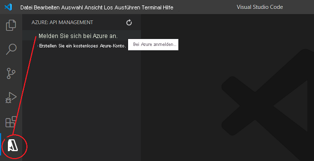
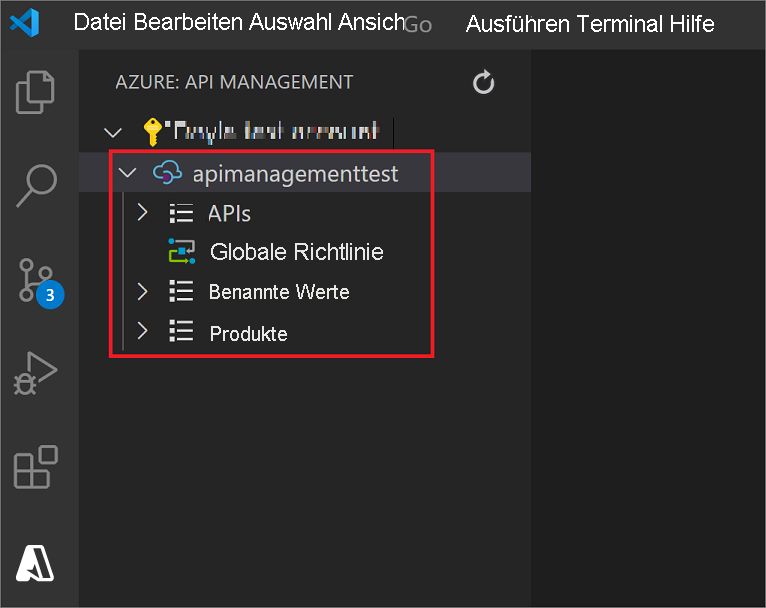
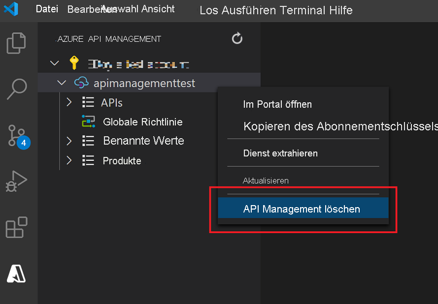

# Schnellstart: Erstellen einer neuen Azure API Management-Dienstinstanz mithilfe von Visual Studio Code

Azure API Management (APIM) unterstützt Organisationen beim Veröffentlichen von APIs für externe Entwickler, Partnerentwickler und interne Entwickler, um das volle Potenzial von Daten und Diensten ausschöpfen zu können. API Management bietet die Kernkompetenzen zur Sicherstellung eines erfolgreichen API-Programms in Form von Entwicklerengagement, geschäftlichen Erkenntnissen, Analysen, Sicherheit und Schutz. Mit APIM können Sie moderne API-Gateways für vorhandene Back-End-Dienste, die an einem beliebigen Ort gehostet werden, erstellen und verwalten. Weitere Informationen finden Sie im Thema [Übersicht](api-management-key-concepts.md).

In dieser Schnellstartanleitung werden die Schritte zum Erstellen einer neuen API Management-Instanz mithilfe der *Azure API Management-Erweiterung* für Visual Studio Code beschrieben. Sie können die Erweiterung auch verwenden, um gängige Verwaltungsvorgänge in Ihrer API Management-Instanz vorzunehmen.

## Voraussetzungen

[!INCLUDE [quickstarts-free-trial-note](../../includes/quickstarts-free-trial-note.md)]

Stellen Sie darüber hinaus sicher, dass Sie Folgendes installiert haben:

- [Visual Studio Code](https://code.visualstudio.com/)

- [Azure API Management-Erweiterung für Visual Studio Code](https://marketplace.visualstudio.com/items?itemName=ms-azuretools.vscode-apimanagement&ssr=false#overview)

## Anmelden bei Azure

Starten Sie Visual Studio Code, und öffnen Sie die Azure-Erweiterung. Falls das Azure-Symbol nicht auf der Aktivitätsleiste angezeigt wird, müssen Sie die *Azure API Management*-Erweiterung zunächst aktivieren.

Klicken Sie auf **Bei Azure anmelden...** , um ein Browserfenster zu öffnen und sich bei Ihrem Microsoft-Konto anzumelden.

## Erstellen eines API Management-Diensts

Nachdem Sie sich bei Ihrem Microsoft-Konto angemeldet haben, werden im Explorer-Bereich *Azure: API Management* Ihre Azure-Abonnements aufgelistet.

Klicken Sie mit der rechten Maustaste auf das Abonnement, das Sie verwenden möchten, und wählen Sie **Create API Management in Azure** (API Management-Instanz in Azure erstellen) aus.

Geben Sie im daraufhin geöffneten Bereich einen Namen für die neue API Management-Instanz an. Dieser muss in Azure global eindeutig sein und aus 1 bis 50 alphanumerischen Zeichen und/oder Bindestrichen bestehen. Zudem muss er mit einem Buchstaben beginnen und mit einem alphanumerischen Zeichen enden.

Eine neue API Management-Instanz und eine übergeordnete Ressourcengruppe werden mit dem angegebenen Namen erstellt. Die Instanz wird standardmäßig in der Region *USA, Westen* mit der SKU *Verbrauch* erstellt.

> [!TIP]
> Wenn Sie **Advanced Creation** (Erweiterte Erstellungsoptionen) in den Einstellungen der *Azure API Management-Erweiterung* aktivieren, können Sie darüber hinaus eine [API Management-SKU](https://azure.microsoft.com/pricing/details/api-management/), eine [Azure-Region](https://status.azure.com/en-us/status) und eine [Ressourcengruppe](../azure-resource-manager/management/overview.md) für die Bereitstellung Ihrer API Management-Instanz angeben.
>
> Die SKU *Verbrauch* kann in weniger als einer Minute erstellt werden. Die Erstellung anderer SKUs kann jedoch 30 bis 40 Minuten dauern.

An diesem Punkt können Sie Ihre erste API importieren und veröffentlichen. Darüber hinaus können Sie gängige API Management-Vorgänge innerhalb der Erweiterung für Visual Studio Code durchführen. Weitere Informationen finden Sie im [Tutorial](visual-studio-code-tutorial.md).

## Bereinigen von Ressourcen

Wenn Sie die API Management-Instanz nicht mehr benötigen, können Sie diese entfernen, indem Sie mit der rechten Maustaste auf die Instanz klicken und **Im Portal öffnen** auswählen. Dort können Sie die [API Management-Instanz](get-started-create-service-instance.md#clean-up-resources) und deren Ressourcengruppe löschen.

Alternativ können Sie auf **Delete API Management** (API Management-Instanz löschen) klicken, um nur die API Management-Instanz zu löschen. Die Ressourcengruppe wird dabei nicht gelöscht.

## Nächste Schritte

> [!div class="nextstepaction"]
> [Importieren und Verwalten von APIs mit der API Management-Erweiterung](visual-studio-code-tutorial.md)
