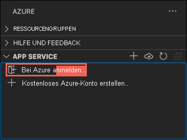
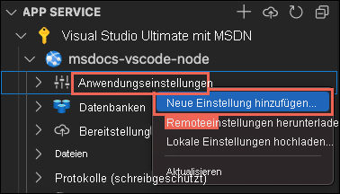
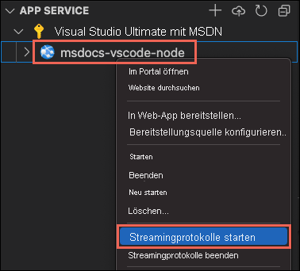

# <a name="create-a-nodejs-web-app-in-azure"></a>Erstellen einer Node.js-Web-App in Azure

In dieser Schnellstartanleitung erfahren Sie, wie Sie Ihre erste Node.js-Web-App ([Express](https://www.expressjs.com)) erstellen und für [Azure App Service](overview.md) bereitstellen. App Service unterstützt verschiedene Versionen von Node.js, sowohl unter Linux als auch Windows. 

In dieser Schnellstartanleitung wird eine App Service-App im **Free**-Tarif konfiguriert, sodass für Ihr Azure-Abonnement keine Kosten entstehen.

## <a name="set-up-your-initial-environment"></a>Einrichten der anfänglichen Umgebung

:::zone target="docs" pivot="development-environment-vscode"

- Sie benötigen ein Azure-Konto mit einem aktiven Abonnement. Sie können [kostenlos ein Konto erstellen](https://azure.microsoft.com/free/?utm_source=campaign&utm_campaign=vscode-tutorial-app-service-extension&mktingSource=vscode-tutorial-app-service-extension).
- Installieren Sie [Node.js und npm](https://nodejs.org). Führen Sie den Befehl `node --version` aus, um sich zu vergewissern, dass Node.js installiert ist.
- Installieren Sie [Visual Studio Code](https://code.visualstudio.com/).
- Die [Azure App Service-Erweiterung](https://marketplace.visualstudio.com/items?itemName=ms-azuretools.vscode-azureappservice) für Visual Studio Code.
 <!-- - <a href="https://git-scm.com/" target="_blank">Install Git</a> -->

::: zone-end

:::zone target="docs" pivot="development-environment-cli"

- Sie benötigen ein Azure-Konto mit einem aktiven Abonnement. Sie können [kostenlos ein Konto erstellen](https://azure.microsoft.com/free/?utm_source=campaign&utm_campaign=vscode-tutorial-app-service-extension&mktingSource=vscode-tutorial-app-service-extension).
- Installieren Sie [Node.js und npm](https://nodejs.org). Führen Sie den Befehl `node --version` aus, um sich zu vergewissern, dass Node.js installiert ist.
- Installieren Sie die <a href="/cli/azure/install-azure-cli" target="_blank">Azure CLI</a>, mit der Sie Befehle in einer beliebigen Shell ausführen, um Azure-Ressourcen bereitzustellen und zu konfigurieren.

::: zone-end

## <a name="create-your-nodejs-application"></a>Erstellen der Node.js-Anwendung

In diesem Schritt erstellen Sie eine Node.js-Startanwendung und stellen sicher, dass sie auf Ihrem Computer ausgeführt wird.

> [!TIP]
> Wenn Sie das [Node.js-Tutorial](https://code.visualstudio.com/docs/nodejs/nodejs-tutorial) bereits abgeschlossen haben, können Sie mit dem Schritt [Bereitstellen in Azure](#deploy-to-azure) fortfahren.

1. Erstellen Sie mithilfe des [Express-Generators](https://expressjs.com/starter/generator.html) eine einfache Node.js-Anwendung, die standardmäßig mit Node.js und NPM installiert wird.

    ```bash
    npx express-generator myExpressApp --view pug
    ```

1. Wechseln Sie in das Verzeichnis der Anwendung, und installieren Sie die NPM-Pakete.

    ```bash
    cd myExpressApp
    npm install
    ```

1. Starten Sie den Entwicklungsserver.

    ```bash
    npm start
    ```

1. Navigieren Sie in einem Browser zu `http://localhost:3000`. Die Ausgabe sollte in etwa wie folgt aussehen:

    

:::zone target="docs" pivot="development-environment-vscode"
> [!div class="nextstepaction"]
> [Ich bin auf ein Problem gestoßen](https://www.research.net/r/PWZWZ52?tutorial=node-deployment-azure-app-service&step=create-app)
::: zone-end

## <a name="deploy-to-azure"></a>Bereitstellen in Azure

Bevor Sie fortfahren, stellen Sie sicher, dass alle erforderlichen Komponenten installiert und konfiguriert sind.

> [!NOTE]
> Damit Ihre Node.js-Anwendung in Azure ausgeführt werden kann, muss sie an dem Port lauschen, der von der Umgebungsvariablen `PORT` bereitgestellt wird. In Ihrer generierten Express-App wird diese Umgebungsvariable bereits im Startskript *bin/www* verwendet (suchen Sie nach `process.env.PORT`).
>

:::zone target="docs" pivot="development-environment-vscode"

#### <a name="sign-in-to-azure"></a>Anmelden bei Azure

1. Stellen Sie im Terminal sicher, dass Sie sich im Verzeichnis *myExpressApp* befinden, und starten Sie Visual Studio Code dann mit dem folgenden Befehl:

    ```bash
    code .
    ```

1. Wählen Sie auf der [Aktivitätsleiste](https://code.visualstudio.com/docs/getstarted/userinterface) in Visual Studio Code das **Azure**-Logo aus.

1. Wählen Sie im **App Service**-Explorer die Option **Bei Azure anmelden...** aus, und befolgen Sie die Anweisungen.

    In Visual Studio Code sollten Sie Ihre Azure-E-Mail-Adresse in der Statusleiste und Ihr Abonnement im **AZURE APP SERVICE-Explorer** sehen.

    

> [!div class="nextstepaction"]
> [Ich bin auf ein Problem gestoßen](https://www.research.net/r/PWZWZ52?tutorial=node-deployment-azure-app-service&step=getting-started)

#### <a name="configure-the-app-service-app-and-deploy-code"></a>Konfigurieren der App Service-App und Bereitstellen von Code

1. Wählen Sie im **App Service**-Explorer das **In Web-App bereitstellen**-Symbol aus.

    :::image type="content" source="media/quickstart-nodejs/deploy.png" alt-text="Screenshot des Azure-App-Diensts in Visual Studio Code mit ausgewähltem blauem Pfeil.":::
        
1. Wählen Sie den Ordner *myExpressApp* aus.

# <a name="deploy-to-linux"></a>[Bereitstellen in Linux](#tab/linux)

3. Klicken Sie auf **Neue Web-App erstellen**. Standardmäßig wird ein Linux-Container verwendet.
1. Geben Sie einen global eindeutigen Namen für Ihre Web-App ein, und drücken Sie die **EINGABETASTE**. Der Name muss innerhalb von Azure eindeutig sein und darf nur alphanumerische Zeichen („A–Z“, „a–z“ und „0–9“) und Bindestriche („-“) enthalten.
1. Wählen Sie unter „Laufzeitstapel auswählen“ die gewünschte Node.js-Version aus. Eine **LTS**-Version wird empfohlen.
1. Wählen Sie unter „Tarif auswählen“ die Option **Free (F1)** aus, und warten Sie, bis die Ressourcen in Azure bereitgestellt werden.
1. Wählen Sie in dem Popup **Arbeitsbereich „myExpressApp“ immer in \<app-name> bereitstellen** die Option **Ja** aus. Auf diese Weise stellt Visual Studio Code, solange Sie sich im selben Arbeitsbereich befinden, jedes Mal in derselben App Service-App bereit.

    Während Visual Studio Code die Azure-Ressourcen und den Code bereitstellt, werden [Statusbenachrichtigungen](https://code.visualstudio.com/api/references/extension-guidelines#notifications) angezeigt.

1. Wählen Sie nach Abschluss der Bereitstellung im Benachrichtigungspopup **Website durchsuchen** aus. Im Browser sollte die Express-Standardseite angezeigt werden.

# <a name="deploy-to-windows"></a>[Bereitstellen unter Windows](#tab/windows)

3. Wählen Sie **Neue Web-App erstellen...Erweitert** aus.
1. Geben Sie einen global eindeutigen Namen für Ihre Web-App ein, und drücken Sie die **EINGABETASTE**. Der Name muss innerhalb von Azure eindeutig sein und darf nur alphanumerische Zeichen („A–Z“, „a–z“ und „0–9“) und Bindestriche („-“) enthalten.
1. Wählen Sie **Neue Ressourcengruppe erstellen** aus, und geben Sie einen Namen für die Ressourcengruppe ein, beispielsweise *AppServiceQS-rg*.
1. Wählen Sie die gewünschte Node.js-Version aus. Eine **LTS**-Version wird empfohlen.
1. Wählen Sie als Betriebssystem **Windows** aus.
1. Wählen Sie den Standort aus, von dem aus Sie Ihre App bedienen möchten. Beispiel: *Europa, Westen*.
1. Wählen Sie **Neuen App Services-Plan erstellen** aus, geben Sie einen Namen für den Plan ein (beispielsweise *AppServiceQS-plan*), und wählen Sie anschließend als Tarif **F1 Free** aus.
1. Wählen Sie für **Application Insights-Ressource für Ihre App auswählen** die Option **Vorerst überspringen** aus, und warten Sie, bis die Ressourcen in Azure bereitgestellt werden.
1. Wählen Sie in dem Popup **Arbeitsbereich „myExpressApp“ immer in \<app-name> bereitstellen** die Option **Ja** aus. Auf diese Weise stellt Visual Studio Code, solange Sie sich im selben Arbeitsbereich befinden, jedes Mal in derselben App Service-App bereit.

    Während Visual Studio Code die Azure-Ressourcen und den Code bereitstellt, werden [Statusbenachrichtigungen](https://code.visualstudio.com/api/references/extension-guidelines#notifications) angezeigt.

    > [!NOTE]
    > Nach Abschluss der Bereitstellung wird Ihre Azure-App noch nicht ausgeführt, da Ihr Projektstamm über keine *web.config* verfügt. Führen Sie die verbleibenden Schritte aus, um sie automatisch zu generieren. Weitere Informationen finden Sie unter [Sie sind nicht berechtigt, dieses Verzeichnis oder diese Seite anzuzeigen](configure-language-nodejs.md#you-do-not-have-permission-to-view-this-directory-or-page).

1. Erweitern Sie im **App Service**-Explorer in Visual Studio Code den Knoten für die neue App, klicken Sie mit der rechten Maustaste auf **Anwendungseinstellungen**, und wählen Sie **Neue Einstellung hinzufügen** aus:

    

1. Geben Sie `SCM_DO_BUILD_DURING_DEPLOYMENT` für den Einstellungsschlüssel ein.
1. Geben Sie `true` für den Einstellungswert ein.

    Diese App-Einstellung ermöglicht die Buildautomatisierung zur Bereitstellungszeit, wodurch das Startskript automatisch erkannt und die *web.config* damit generiert wird.

1. Wählen Sie im **App Service**-Explorer das **In Web-App bereitstellen**-Symbol aus, und bestätigen Sie durch erneutes Klicken auf **Bereitstellen**.
1. Warten Sie bis zum Abschluss der Bereitstellung, und wählen Sie dann im Benachrichtigungspopup **Website durchsuchen** aus. Im Browser sollte die Express-Standardseite angezeigt werden.

-----

> [!div class="nextstepaction"]
> [Ich bin auf ein Problem gestoßen](https://www.research.net/r/PWZWZ52?tutorial=node-deployment-azure-app-service&step=deploy-app)

::: zone-end

:::zone target="docs" pivot="development-environment-cli"

Stellen Sie im Terminal sicher, dass Sie sich im Verzeichnis *myExpressApp* befinden, und stellen Sie den Code mithilfe des Befehls `az webapp up` in Ihrem lokalen Ordner (*myExpressApp*) bereit:

# <a name="deploy-to-linux"></a>[Bereitstellen in Linux](#tab/linux)

```azurecli
az webapp up --sku F1 --name <app-name>
```

# <a name="deploy-to-windows"></a>[Bereitstellen unter Windows](#tab/windows)

```azurecli
az webapp up --sku F1 --name <app-name> --os-type Windows
```

-----

- Wird der Befehl `az` nicht erkannt, sollten Sie sich vergewissern, dass die Azure CLI wie unter [Einrichten der anfänglichen Umgebung](#set-up-your-initial-environment) beschrieben installiert wurde.
- Ersetzen Sie `<app_name>` durch einen Namen, der innerhalb von Azure eindeutig ist (*gültige Zeichen: `a-z`, `0-9` und `-`* ). Ein bewährtes Muster ist eine Kombination aus Ihrem Firmennamen und einer App-ID.
- Mit dem Argument `--sku F1` wird die Web-App im Free-Tarif erstellt, der keine Kosten verursacht.
- Optional können Sie das Argument `--location <location-name>` einfügen, wobei `<location_name>` eine verfügbare Azure-Region ist. Sie können eine Liste der zulässigen Regionen für Ihr Azure-Konto abrufen, indem Sie den Befehl [`az account list-locations`](/cli/azure/appservice#az_appservice_list_locations) ausführen.
- Mit dem Befehl wird standardmäßig eine Linux-App für Node.js erstellt. Um stattdessen eine Windows-App zu erstellen, verwenden Sie das Argument `--os-type`. 
- Wenn der Fehler „Der Laufzeitstapel Ihrer App konnte nicht automatisch erkannt werden“ angezeigt wird, stellen Sie sicher, dass Sie den Befehl im Verzeichnis *myExpressApp* ausführen (siehe [Behandeln von Problemen mit der automatischen Erkennung mit az webapp up](https://github.com/Azure/app-service-linux-docs/blob/master/AzWebAppUP/runtime_detection.md)).

Die Ausführung dieses Befehls kann einige Minuten in Anspruch nehmen. Bei der Ausführung werden Meldungen zum Erstellen der Ressourcengruppe, dem App Service-Plan und der App-Ressource, zur Konfiguration der Protokollierung und zur ZIP-Bereitstellung angezeigt. Anschließend wird die Meldung „You can launch the app at http://&lt;app-name&gt;.azurewebsites.net“ (Sie können die App unter http://<App-Name>.azurewebsites.net starten.) angezeigt. Dabei handelt es sich um die URL der App in Azure.

<pre>
The webapp '&lt;app-name>' doesn't exist
Creating Resource group '&lt;group-name>' ...
Resource group creation complete
Creating AppServicePlan '&lt;app-service-plan-name>' ...
Creating webapp '&lt;app-name>' ...
Configuring default logging for the app, if not already enabled
Creating zip with contents of dir /home/cephas/myExpressApp ...
Getting scm site credentials for zip deployment
Starting zip deployment. This operation can take a while to complete ...
Deployment endpoint responded with status code 202
You can launch the app at http://&lt;app-name>.azurewebsites.net
{
  "URL": "http://&lt;app-name>.azurewebsites.net",
  "appserviceplan": "&lt;app-service-plan-name>",
  "location": "centralus",
  "name": "&lt;app-name>",
  "os": "&lt;os-type>",
  "resourcegroup": "&lt;group-name>",
  "runtime_version": "node|10.14",
  "runtime_version_detected": "0.0",
  "sku": "FREE",
  "src_path": "//home//cephas//myExpressApp"
}
</pre>

[!include [az webapp up command note](../../includes/app-service-web-az-webapp-up-note.md)]

::: zone-end

## <a name="redeploy-updates"></a>Erneutes Bereitstellen von Updates

Sie können Änderungen an dieser App bereitstellen, indem Sie Änderungen in Visual Studio Code vornehmen, Ihre Dateien speichern und dann erneut in Ihrer Azure-App bereitstellen. Beispiel:

1. Öffnen Sie im Beispielprojekt *views/index.pug*, und ändern Sie

    ```PUG
    p Welcome to #{title}
    ```

    zu
    
    ```PUG
    p Welcome to Azure!
    ```

:::zone target="docs" pivot="development-environment-vscode"

2. Wählen Sie im **App Service**-Explorer das **In Web-App bereitstellen**-Symbol aus, und bestätigen Sie durch erneutes Klicken auf **Bereitstellen**.

1. Warten Sie bis zum Abschluss der Bereitstellung, und wählen Sie dann im Benachrichtigungspopup **Website durchsuchen** aus. Sie sollten sehen, dass die Meldung `Welcome to Express` in `Welcome to Azure!` geändert wurde.

::: zone-end

:::zone target="docs" pivot="development-environment-cli"

2. Speichern Sie Ihre Änderungen, und stellen Sie die App dann mit dem Befehl `az webapp up` erneut bereit, wiederum ohne Argumente:

    ```azurecli
    az webapp up
    ```
    
    In diesem Befehl werden lokal zwischengespeicherte Werte aus der Datei *.azure/config* verwendet (z. B. App-Name, Ressourcengruppe und App Service-Plan).
    
1. Sobald die Bereitstellung abgeschlossen ist, aktualisieren Sie die Webseite `http://<app-name>.azurewebsites.net`. Sie sollten sehen, dass die Meldung `Welcome to Express` in `Welcome to Azure!` geändert wurde.

::: zone-end

## <a name="stream-logs"></a>Protokolle streamen

:::zone target="docs" pivot="development-environment-vscode"

Sie können die Protokollausgabe (Aufrufe von `console.log()`) der Azure-App direkt in das Visual Studio Code-Ausgabefenster streamen.

1. Klicken Sie im **App Service**-Explorer mit der rechten Maustaste auf den App-Knoten, und wählen Sie **Streamen der Protokolle starten** aus.

    

1. Wenn Sie aufgefordert werden, die App neu zu starten, klicken Sie auf **Ja**. Sobald die App neu gestartet wurde, wird das Visual Studio Code-Ausgabefenster mit einer Verbindung mit dem Protokollstream geöffnet. 

1. Nach einigen Sekunden wird im Ausgabefenster eine Meldung mit dem Hinweis angezeigt, dass eine Verbindung mit dem Protokollstreamingdienst hergestellt wurde. Sie können weitere Ausgabeaktivitäten generieren, indem Sie die Seite im Browser aktualisieren.

    <pre>
    Connecting to log stream...
    2020-03-04T19:29:44  Welcome, you are now connected to log-streaming service. The default timeout is 2 hours.
    Change the timeout with the App Setting SCM_LOGSTREAM_TIMEOUT (in seconds).
    </pre>

> [!div class="nextstepaction"]
> [Ich bin auf ein Problem gestoßen](https://www.research.net/r/PWZWZ52?tutorial=node-deployment-azure-app-service&step=tailing-logs)

::: zone-end

:::zone target="docs" pivot="development-environment-cli"

Sie können auf die Konsolenprotokolle zugreifen, die innerhalb der App und des Containers, in dem sie ausgeführt wird, generiert wurden. Protokolle enthalten alle Ausgaben, die durch Aufrufe von `console.log()` generiert werden.

Führen Sie zum Streamen von Protokollen den Befehl [az webapp log tail](/cli/azure/webapp/log#az_webapp_log_tail) aus:

```azurecli
az webapp log tail
```

Der Befehl verwendet den Ressourcengruppennamen, der in der Datei *.azure/config* zwischengespeichert ist.

Sie können auch den Parameter `--logs` mit dem Befehl `az webapp up` einfügen, damit der Protokolldatenstrom bei der Bereitstellung automatisch geöffnet wird.

Aktualisieren Sie die App im Browser, um Konsolenprotokolle zu erstellen, die Meldungen mit einer Beschreibung der HTTP-Anforderungen an die App enthalten. Wenn nicht sofort eine Ausgabe angezeigt wird, versuchen Sie es nach 30 Sekunden erneut.

Sie können im Terminal jederzeit **STRG**+**C** drücken, um das Protokollstreaming zu beenden.

::: zone-end

## <a name="clean-up-resources"></a>Bereinigen von Ressourcen

:::zone target="docs" pivot="development-environment-vscode"

In den vorherigen Schritten haben Sie Azure-Ressourcen in einer Ressourcengruppe erstellt. Die Erstellungsschritte in dieser Schnellstartanleitung legen alle Ressourcen in dieser Ressourcengruppe ab. Zur Bereinigung müssen Sie lediglich die Ressourcengruppe entfernen.


1. Erweitern Sie in der Azure-Erweiterung von Visual Studio den **Ressourcengruppen**-Explorer.

1. Erweitern Sie das Abonnement, klicken Sie mit der rechten Maustaste auf die Ressourcengruppe, die Sie zuvor erstellt haben, und wählen Sie **Löschen** aus.

    :::image type="content" source="media/quickstart-nodejs/clean-up.png" alt-text="Screenshot der Visual Studio Code-Navigation zum Löschen einer Ressource, die App Service-Ressourcen enthält.":::

1. Wenn Sie dazu aufgefordert werden, bestätigen Sie ihren Löschvorgang, indem Sie den Namen der zu löschenden Ressourcengruppe eingeben. Im Anschluss an die Bestätigung wird die Ressourcengruppe gelöscht, und es wird nach Abschluss des Vorgangs eine [Benachrichtigung](https://code.visualstudio.com/api/references/extension-guidelines#notifications) angezeigt.

> [!div class="nextstepaction"]
> [Ich bin auf ein Problem gestoßen](https://www.research.net/r/PWZWZ52?tutorial=node-deployment-azure-app-service&step=clean-up)

::: zone-end

:::zone target="docs" pivot="development-environment-cli"

In den vorherigen Schritten haben Sie Azure-Ressourcen in einer Ressourcengruppe erstellt. Die Ressourcengruppe hat abhängig von Ihrem Standort einen Namen wie appsvc_rg_Linux_CentralUS.

Wenn Sie diese Ressourcen voraussichtlich nicht mehr benötigen, löschen Sie die Ressourcengruppen mit folgendem Befehl:

```azurecli
az group delete --no-wait
```

Der Befehl verwendet den Ressourcengruppennamen, der in der Datei *.azure/config* zwischengespeichert ist.

Mit dem Argument `--no-wait` kann für den Befehl die Rückgabe erfolgen, bevor der Vorgang abgeschlossen ist.

::: zone-end

## <a name="next-steps"></a>Nächste Schritte

Herzlichen Glückwunsch! Sie haben diese Schnellstartanleitung erfolgreich abgeschlossen!

> [!div class="nextstepaction"]
> [Tutorial: Node.js-App mit MongoDB](tutorial-nodejs-mongodb-app.md)

> [!div class="nextstepaction"]
> [Konfigurieren der Node.js-App](configure-language-nodejs.md)

Sehen Sie sich die anderen Azure-Erweiterungen an.

* [Cosmos DB](https://marketplace.visualstudio.com/items?itemName=ms-azuretools.vscode-cosmosdb)
* [Azure-Funktionen](https://marketplace.visualstudio.com/items?itemName=ms-azuretools.vscode-azurefunctions)
* [Docker-Tools](https://marketplace.visualstudio.com/items?itemName=PeterJausovec.vscode-docker)
* [Azure CLI-Tools](https://marketplace.visualstudio.com/items?itemName=ms-vscode.azurecli)
* [Azure Resource Manager Tools](https://marketplace.visualstudio.com/items?itemName=msazurermtools.azurerm-vscode-tools)

Sie können auch alle Erweiterungen auf einmal erhalten, indem Sie das [Node Pack for Azure](https://marketplace.visualstudio.com/items?itemName=ms-vscode.vscode-node-azure-pack) installieren.
