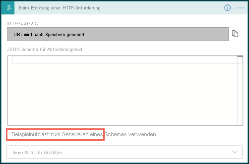
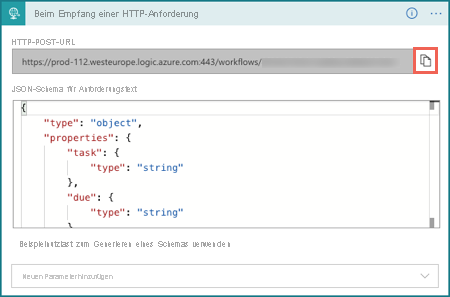
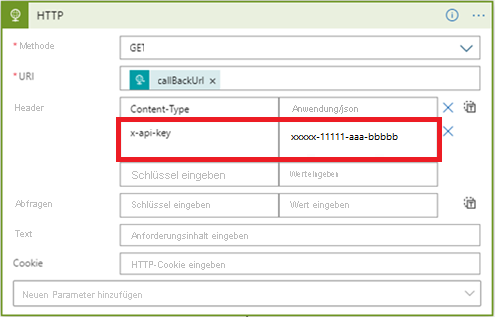
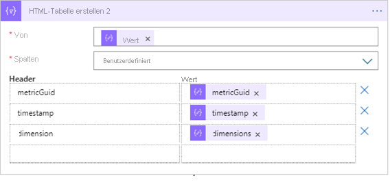
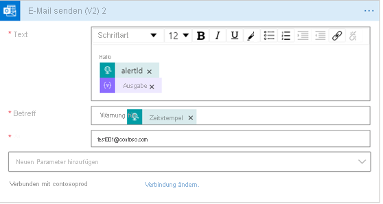
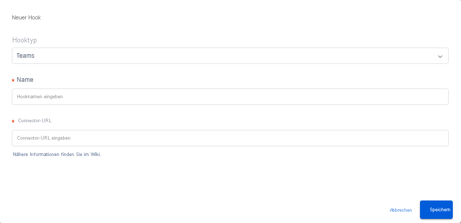
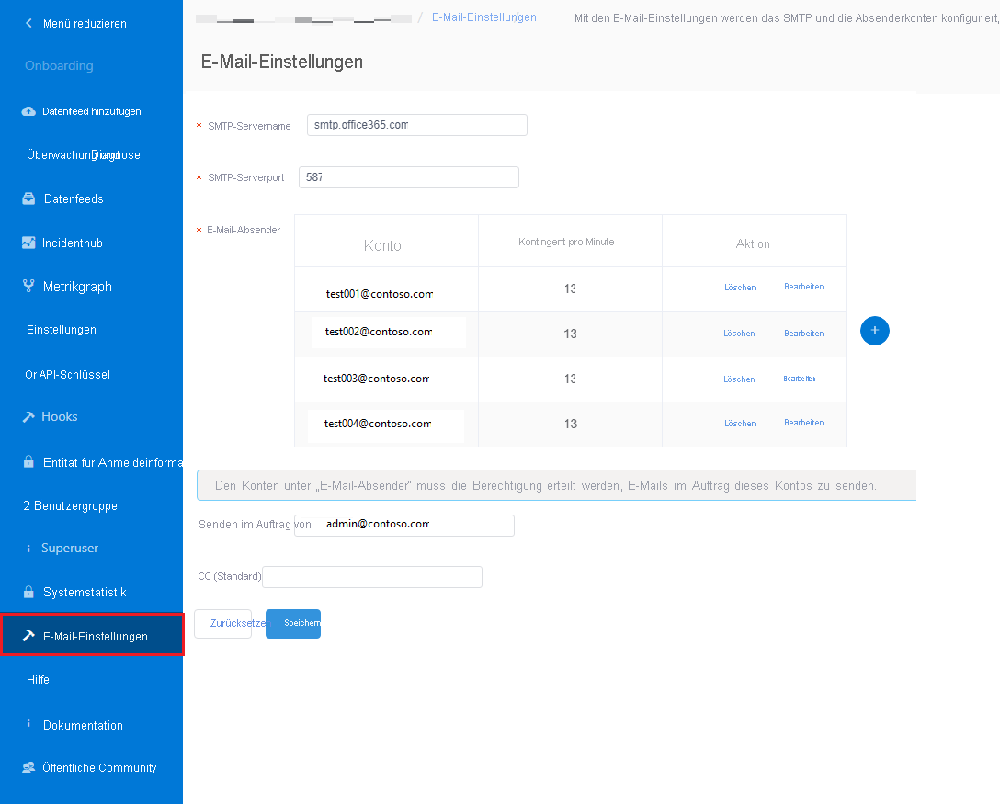
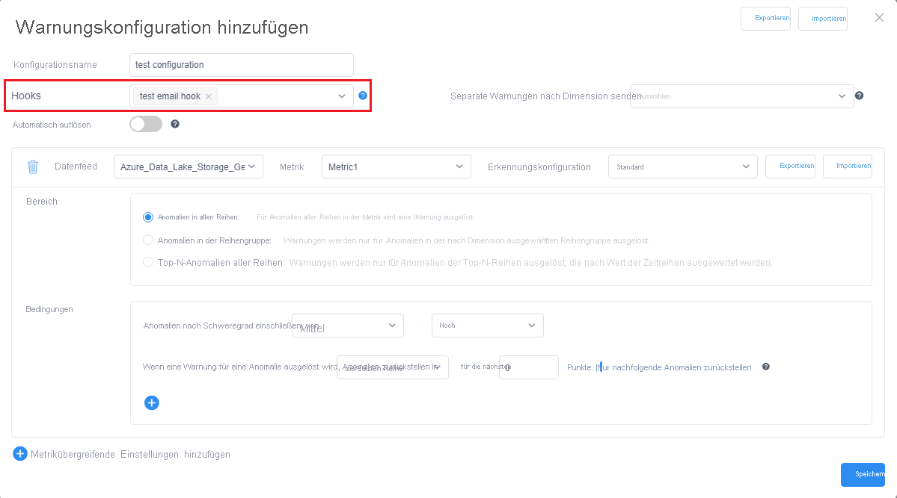

# <a name="tutorial-enable-anomaly-notification-in-metrics-advisor"></a>Tutorial: Aktivieren der Anomaliebenachrichtigung in Metrics Advisor 

<!-- 2. Introductory paragraph 
Required. Lead with a light intro that describes, in customer-friendly language, 
what the customer will learn, or do, or accomplish. Answer the fundamental “why 
would I want to do this?” question. Keep it short.
-->


<!-- 3. Tutorial outline 
Required. Use the format provided in the list below.
-->

In diesem Tutorial lernen Sie, wie die folgenden Aufgaben ausgeführt werden:

> [!div class="checklist"]
> * Erstellen eines Hooks in Metrics Advisor
> * Senden von Benachrichtigungen mit Azure Logic Apps
> * Senden von Benachrichtigungen an Microsoft Teams
> * Senden von Benachrichtigungen über den SMTP-Server

<!-- 4. Prerequisites 
Required. First prerequisite is a link to a free trial account if one exists. If there 
are no prerequisites, state that no prerequisites are needed for this tutorial.
-->

## <a name="prerequisites"></a>Voraussetzungen
### <a name="create-a-metrics-advisor-resource"></a>Erstellen einer Metrics Advisor-Ressource

Zum Erkunden der Möglichkeiten von Metrics Advisor müssen Sie unter Umständen im Azure-Portal <a href="https://go.microsoft.com/fwlink/?linkid=2142156"  title="Erstellen einer Metrics Advisor-Ressource"  target="_blank"> eine Metrics Advisor-Ressource erstellen</a>, um Ihre Metrics Advisor-Instanz bereitzustellen.

### <a name="create-a-hook-in-metrics-advisor"></a>Erstellen eines Hooks in Metrics Advisor
Ein Hook in Metrics Advisor ist eine Brücke, mit der Kunden Metrikanomalien abonnieren und Benachrichtigungen über verschiedene Kanäle senden können. Metrics Advisor bietet vier Arten von Hooks: 
    
- E-Mail-Hook
- Webhook
- Teams-Hook
- Azure DevOps-Hook

Jeder Hooktyp entspricht einem bestimmten Kanal, über den Benachrichtigungen über die Anomalie gesendet werden. 

<!-- 5. H2s
Required. Give each H2 a heading that sets expectations for the content that follows. 
Follow the H2 headings with a sentence about how the section contributes to the whole.
-->

## <a name="send-notifications-with-logic-apps-teams-and-smtp"></a>Senden von Benachrichtigungen mit Logic Apps, Teams und SMTP

#### <a name="logic-apps"></a>[Logik-Apps](#tab/logic)

### <a name="send-email-notification-by-using-azure-logic-apps"></a>Senden von E-Mail-Benachrichtigungen unter Verwendung von Azure Logic Apps

<!-- Introduction paragraph -->
Es gibt zwei allgemeine Optionen zum Senden von E-Mail-Benachrichtigungen, die in Metrics Advisor unterstützt werden. Die eine ist das Senden von E-Mail-Warnungen unter Verwendung von Webhooks und Azure Logic Apps. Die andere besteht darin, einen SMTP-Server einzurichten und zum direkten Senden von E-Mail-Warnungen zu verwenden. Dieser Abschnitt konzentriert sich auf die erste Option, da sie für Kunden, die keinen verfügbaren SMTP-Server haben, einfacher ist.

**Schritt 1:** Erstellen eines Webhooks in Metrics Advisor

Ein Webhook ist der Einstiegspunkt für alle Informationen, die über den Metrics Advisor-Dienst verfügbar sind. Wenn eine Warnung ausgelöst wird, ruft er eine vom Benutzer bereitgestellte API auf. Alle Warnungen können über einen Webhook gesendet werden.

Wählen Sie in Ihrem Metrics Advisor-Arbeitsbereich die Registerkarte **Hooks** aus, und klicken Sie dann auf die Schaltfläche **Create hook**. Wählen Sie den Hooktyp **Webhook** aus. Füllen Sie die erforderlichen Parameter aus, und klicken Sie auf **OK**. Ausführliche Anweisungen finden Sie unter [Erstellen eines Webhooks](../how-tos/alerts.md#web-hook).

Es gibt einen zusätzlichen Parameter für **Endpoint**, der ausgefüllt werden muss. Dies können Sie nach Abschluss von Schritt 3 unten tun. 


**Schritt 2:** Erstellen einer Logic Apps-Ressource

Erstellen Sie im [Azure-Portal](https://portal.azure.com) eine leere Logik-App, indem Sie die Anleitung unter [Erstellen Ihrer Logik-App](../../../logic-apps/quickstart-create-first-logic-app-workflow.md) befolgen. Kehren Sie zu diesem Tutorial zurück, wenn der **Designer für Logik-Apps** angezeigt wird.


**Schritt 3:** Hinzufügen des Triggers **Beim Empfang einer HTTP-Anforderung**

- Azure Logic Apps verwendet verschiedene Aktionen, um definierte Workflows auszulösen. In diesem Fall wird der Trigger **Beim Empfang einer HTTP-Anforderung** verwendet. 

- Wählen Sie im Dialogfeld unter **Beim Empfang einer HTTP-Anforderung** die Option **Beispielnutzlast zum Generieren eines Schemas verwenden** aus.

    

    Kopieren Sie den folgenden JSON-Beispielcode in das Textfeld, und wählen Sie **Fertig** aus.

    ```json
    {
    "properties": {
        "value": {
            "items": {
                "properties": {
                    "alertInfo": {
                        "properties": {
                            "alertId": {
                                "type": "string"
                            },
                            "anomalyAlertingConfigurationId": {
                                "type": "string"
                            },
                            "createdTime": {
                                "type": "string"
                            },
                            "modifiedTime": {
                                "type": "string"
                            },
                            "timestamp": {
                                "type": "string"
                            }
                        },
                        "type": "object"
                    },
                    "alertType": {
                        "type": "string"
                    },
                    "callBackUrl": {
                        "type": "string"
                    },
                    "hookId": {
                        "type": "string"
                    }
                },
                "required": [
                    "hookId",
                    "alertType",
                    "alertInfo",
                    "callBackUrl"
                ],
                "type": "object"
            },
            "type": "array"
        }
    },
    "type": "object"
     }
    ```

- Wählen Sie als Methode „POST“ aus, und klicken Sie dann auf **Speichern**. Nun wird die URL Ihres HTTP-Anforderungstriggers angezeigt. Wählen Sie das Kopiersymbol aus, um sie zu kopieren, und fügen Sie sie in Schritt 1 unter **Endpunkt** wieder ein. 

    

**Schritt 4.** Hinzufügen des nächsten Schritts unter Verwendung der HTTP-Aktion

Signale, die über den Webhook gepusht werden, enthalten nur eingeschränkte Informationen wie Zeitstempel, alertID, configurationID usw. Ausführliche Informationen müssen mithilfe der im Signal angegebenen Rückruf-URL abgefragt werden. Dieser Schritt dient zum Abfragen detaillierter Warnungsinformationen.  

- Auswählen einer GET-Methode
- Wählen Sie unter „URL“ in der Liste „Dynamischer Inhalt“ die Option „callBackURL“ aus.
- Geben Sie unter „Headers“ den Schlüssel „Content-Type“ und den Wert „application/json“ ein.
- Geben Sie unter „Headers“ den Schlüssel „x-api-key“ ein, und rufen Sie diesen ab, indem Sie im Metrics Advisor-Arbeitsbereich auf die Registerkarte **API-Schlüssel** klicken. Mit diesem Schritt wird sichergestellt, dass der Workflow über ausreichende Berechtigungen für API-Aufrufe verfügt.

    

**Schritt 5.** Hinzufügen des nächsten Schritts „JSON analysieren“ 

Sie müssen die Antwort der API analysieren, um die Formatierung des E-Mail-Inhalts zu vereinfachen. 
 
> [!NOTE] 
> In diesem Tutorial wird nur ein kurzes Beispiel erläutert. Das endgültige E-Mail-Format muss weiter entworfen werden. 

- Wählen Sie unter „Inhalt“ in der Liste „Dynamischer Inhalt“ die Option „Text“ aus.
- Wählen Sie **Beispielnutzlast zum Generieren eines Schemas verwenden** aus. Kopieren Sie den folgenden JSON-Beispielcode in das Textfeld, und wählen Sie **Fertig** aus.

```json
{
    "properties": {
        "@@nextLink": {},
        "value": {
            "items": {
                "properties": {
                    "properties": {
                        "properties": {
                            "IncidentSeverity": {
                                "type": "string"
                            },
                            "IncidentStatus": {
                                "type": "string"
                            }
                        },
                        "type": "object"
                    },
                    "rootNode": {
                        "properties": {
                            "createdTime": {
                                "type": "string"
                            },
                            "detectConfigGuid": {
                                "type": "string"
                            },
                            "dimensions": {
                                "properties": {
                                },
                                "type": "object"
                            },
                            "metricGuid": {
                                "type": "string"
                            },
                            "modifiedTime": {
                                "type": "string"
                            },
                            "properties": {
                                "properties": {
                                    "AnomalySeverity": {
                                        "type": "string"
                                    },
                                    "ExpectedValue": {}
                                },
                                "type": "object"
                            },
                            "seriesId": {
                                "type": "string"
                            },
                            "timestamp": {
                                "type": "string"
                            },
                            "value": {
                                "type": "number"
                            }
                        },
                        "type": "object"
                    }
                },
                "required": [
                    "rootNode",
                    "properties"
                ],
                "type": "object"
            },
            "type": "array"
        }
    },
    "type": "object"
}
```

**Schritt 6.** Hinzufügen des nächsten Schritts „HTML-Tabelle erstellen“

Vom API-Aufruf wurden eine Reihe von Informationen zurückgegeben. Je nach Szenario sind jedoch möglicherweise nicht alle Informationen nützlich. Wählen Sie die Elemente aus, die für Sie relevant sind und in die Warnungs-E-Mail aufgenommen werden sollen. 

Im Folgenden finden Sie ein Beispiel für eine HTML-Tabelle, für die die Auswahl „timestamp“, „metricGUID“ und „dimension“ in die Warnungs-E-Mail aufgenommen werden soll.



**Schritt 7.** Hinzufügen des letzten Schritts „E-Mail senden“

Es gibt mehrere Optionen zum Senden von E-Mails, die sowohl von Microsoft gehostet als auch von Drittanbietern angeboten werden. Der Kunde benötigt möglicherweise einen Mandanten bzw. ein Konto für die ausgewählte Option. Dies gilt z. B. wenn Sie „Office 365 Outlook“ als Server auswählen. Der Anmeldevorgang wird für die Herstellung der Verbindung und die Autorisierung gepumpt. Es wird eine API-Verbindung hergestellt, um den E-Mail-Server zum Senden von Warnungen zu verwenden. 

Geben Sie den Inhalt ein, den Sie unter „Text“ und „Betreff“ in die E-Mail aufnehmen möchten, und geben Sie unter „An“ eine E-Mail-Adresse ein. 


                                                                   
#### <a name="teams-channel"></a>[Teams-Kanal](#tab/teams)
                                           
### <a name="send-anomaly-notification-through-a-microsoft-teams-channel"></a>Senden von Anomaliebenachrichtigungen über einen Microsoft Teams-Kanal                            
In diesem Abschnitt wird die Vorgehensweise zum Senden von Anomaliebenachrichtigungen über einen Microsoft Teams-Kanal beschrieben. Dies kann Szenarien ermöglichen, in denen Teammitglieder an der Analyse der von Metrics Advisor erkannten Anomalien zusammenarbeiten. Der Workflow ist einfach zu konfigurieren, ohne dass eine große Anzahl von Voraussetzungen erfüllt sein müssen. 
                                               


**Schritt 1:** Hinzufügen eines „Incoming Webhook“-Connectors zum Teams Kanal

- Navigieren Sie zu dem Teams-Kanal, an den Sie eine Benachrichtigung senden möchten, und wählen Sie „•••“ (Weitere Optionen) aus. 
- Wählen Sie in der Dropdownliste die Option „Connectors“ aus. Suchen Sie im neuen Dialogfeld nach „Incoming Webhook“, und klicken Sie auf „Hinzufügen“.

        

- Wenn Sie die Option „Connectors“ nicht anzeigen können, wenden Sie sich an Ihre Teams-Gruppenbesitzer. Klicken Sie auf „Team verwalten“. Wählen Sie dann oben die Registerkarte „Einstellungen“ aus, und überprüfen Sie, ob die Einstellung „Zulassen, dass Mitglieder Connectors erstellen, aktualisieren und entfernen“ aktiviert ist.

        

- Geben Sie einen Namen für den Connector ein. Sie können auch ein Bild hochladen, um es als Avatar zu erstellen. Wählen Sie „Erstellen“ aus. Der Incoming Webhook wird dann erfolgreich Ihrem Kanal hinzugefügt. Am unteren Rand des Dialogfelds wird eine URL generiert. **Achten Sie darauf, „Kopieren“ auszuwählen**, und klicken Sie dann auf „Fertig“. 

     

**Schritt 2:** Erstellen eines neuen Teams-Hooks in Metrics Advisor

- Wählen Sie in der linken Navigationsleiste die Registerkarte „Hooks“ und dann oben rechts auf der Seite die Schaltfläche „Hook erstellen“ aus. 
- Wählen Sie den Hooktyp „Teams“ aus, geben Sie dann einen Namen ein, und fügen Sie die URL ein, die Sie im obigen Schritt kopiert haben. 
- Wählen Sie „Save“ (Speichern) aus. 

     

**Schritt 3:** Anwenden des Teams-Hooks auf eine Warnungskonfiguration

Wählen Sie einen der Datenfeeds aus, für die Sie ein Onboarding durchgeführt haben. Wählen Sie eine Metrik im Feed aus, und öffnen Sie die Detailseite für Metriken. Sie können eine „Warnungskonfiguration“ erstellen, um erkannte Anomalien zu abonnieren und über einen Teams-Kanal entsprechende Benachrichtigungen zu senden. 

Klicken Sie auf die Schaltfläche „+“, und wählen Sie den Hook aus, den Sie erstellt haben. Füllen Sie die anderen Felder aus, und klicken Sie auf „Speichern“. Dann können Sie einen Teams-Hook auf eine Warnungskonfiguration anwenden. Benachrichtigungen über neue Anomalien werden über den Teams-Kanal gesendet.


#### <a name="smtp-e-mail"></a>[SMTP-E-Mail](#tab/smtp)

### <a name="send-email-notification-by-configuring-an-smtp-server"></a>Senden von E-Mail-Benachrichtigungen durch Konfigurieren eines SMTP-Servers

In diesem Abschnitt wird erläutert, wie Sie einen SMTP-Server verwenden, um E-Mail-Benachrichtigungen über erkannte Anomalien zu senden. Stellen Sie sicher, dass Sie über einen verwendbaren SMTP-Server und ausreichende Berechtigungen zum Abrufen von Parametern wie Kontoname und Kennwort verfügen.

**Schritt 1:** Zuweisen Ihres Kontos als Rolle „Cognitive Service Metrics Advisor Administrator"  

- Ein Benutzer mit den Berechtigungen „Abonnementadministrator“ oder „Ressourcengruppenadministrator“ muss zu der Metrics Advisor-Ressource navigieren, die im Azure-Portal erstellt wurde, und die Registerkarte „Zugriffssteuerung (IAM)“ auswählen.
- Wählen Sie „Add role assignments“ aus.
- Wählen Sie die Rolle „Cognitive Services Metrics Advisor-Administrator“ und dann Ihr Konto aus, wie in der Abbildung unten dargestellt.
- Klicken Sie auf die Schaltfläche „Speichern“. Damit wurden Sie erfolgreich als Administrator einer Metrics Advisor-Ressource hinzugefügt. Alle oben genannten Aktionen müssen vom Abonnementadministrator oder Ressourcengruppenadministrator ausgeführt werden. Es kann bis zu einer Minute dauern, bis die Berechtigungen weitergegeben werden. 


**Schritt 2:** Konfigurieren des SMTP-Servers im Metrics Advisor Arbeitsbereich

Nachdem Sie die oben genannten Schritte ausgeführt haben und erfolgreich als Administrator einer Metrics Advisor-Ressource hinzugefügt wurden. Warten Sie einige Minuten, bis die Berechtigungen verteilt wurden. Melden Sie sich dann bei Ihrem Metrics Advisor-Arbeitsbereich an. Sie sollten im linken Navigationsbereich eine neue Registerkarte namens „E-Mail-Einstellung“ anzeigen können. Wählen Sie sie aus, und fahren Sie mit der Konfiguration fort. 

Auszufüllende Parameter: 

- SMTP-Servername (**erforderlich**): Geben Sie den Namen Ihres SMTP-Serveranbieters ein. Die meisten Servernamen werden im Format „smtp.domain.com“ oder „mail.domain.com“ geschrieben. Nehmen Sie als Beispiel Office365. Es sollte als „smtp.office365.com“ festgelegt werden. 
- SMTP-Serverport (**erforderlich**): Port 587 ist der Standardport für die SMTP-Übermittlung im modernen Web. Sie können zwar andere Ports für die Übermittlung verwenden (mehr dazu später), sollten aber immer mit Port 587 als Standard beginnen und nur dann einen anderen Port verwenden, wenn die Umstände dies vorschreiben (z. B. wenn Ihr Host Port 587 aus irgendeinem Grund blockiert).
- E-Mail-Absender (**erforderlich**):Dies ist das reale E-Mail-Konto, das für das Senden von E-Mails verantwortlich ist. Möglicherweise müssen Sie den Kontonamen und das Kennwort des Absenders eingeben. Sie können einen Kontingentschwellenwert für die maximale Anzahl von Warnungs-E-Mails festlegen, die innerhalb einer Minute für ein Konto gesendet werden sollen. Sie können mehrere Absender festlegen, wenn eine große Anzahl von Warnungen in einer Minute gesendet werden kann. Es sollte aber mindestens ein Konto festgelegt werden. 
- Senden im Auftrag von (optional): Wenn Sie mehrere Absender konfiguriert haben, es aber so aussehen soll, dass Warnungs-E-Mails von einem Konto gesendet werden. Sie können dieses Feld verwenden, um sie auszurichten. Beachten Sie jedoch, dass Sie den Absendern möglicherweise die Berechtigung erteilen müssen, das Senden von E-Mails im Auftrag ihres Kontos zuzulassen.  
- Standard-CC (optional): Zum Festlegen einer Standard-E-Mail-Adresse, die in allen E-Mail-Warnungen auf CC gesetzt ist. 

Im Folgenden finden Sie ein Beispiel für einen konfigurierten SMTP-Server:



**Schritt 3:** Erstellen eines E-Mail-Hooks in Metrics Advisor

Nach erfolgreicher Konfiguration eines SMTP-Servers können Sie auf der Registerkarte „Hooks“ in Metrics Advisor einen „E-Mail-Hook“ erstellen. Weitere Informationen zum Erstellen eines „E-Mail-Hooks“ finden Sie im [Artikel zu Warnungen](../how-tos/alerts.md#email-hook). Befolgen Sie die entsprechenden Schritte.

**Schritt 4.** Anwenden des E-Mail-Hooks auf eine Warnungskonfiguration

 Wählen Sie einen der Datenfeeds aus, für die Sie ein Onboarding durchgeführt haben, klicken Sie auf eine Metrik im Feed, und öffnen Sie die Detailseite für Metriken. Sie können eine „Warnungskonfiguration“ erstellen, um die Anomalien zu abonnieren, die erkannt und per E-Mail gesendet wurden. 

Klicken Sie auf die Schaltfläche „+“, und wählen Sie den Hook aus, den Sie erstellt haben. Füllen Sie die anderen Felder aus, und klicken Sie auf „Speichern“. Sie haben nun erfolgreich einen E-Mail-Hook mit einer benutzerdefinierten Warnungskonfiguration eingerichtet, und alle neuen Anomalien werden mithilfe des SMTP-Servers über den Hook eskaliert. 



---

## <a name="next-steps"></a>Nächste Schritte

Fahren Sie mit dem nächsten Artikel fort, um mehr über das Erstellen zu erfahren.
> [!div class="nextstepaction"]
> [Schreiben einer gültigen Abfrage](write-a-valid-query.md)

<!--
Remove all the comments in this template before you sign-off or merge to the 
main branch.
-->
