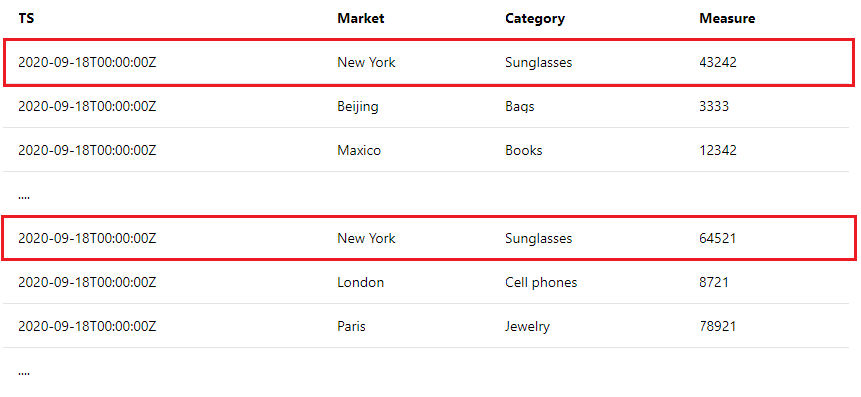

<!--
Remove all the comments in this template before you sign-off or merge to the 
main branch.
-->

<!--
This template provides the basic structure of a tutorial article.
See the [tutorial guidance](contribute-how-to-mvc-tutorial.md) in the contributor guide.

To provide feedback on this template contact 
[the templates workgroup](mailto:templateswg@microsoft.com).
-->

<!-- 1. H1 
Required. Start with "Tutorial: ". Make the first word following "Tutorial: " a 
verb.
-->

# <a name="tutorial-write-a-valid-query-to-onboard-metrics-data"></a>Tutorial: Schreiben einer gültigen Abfrage für das Onboarding von Metrikdaten

<!-- 2. Introductory paragraph 
Required. Lead with a light intro that describes, in customer-friendly language, 
what the customer will learn, or do, or accomplish. Answer the fundamental “why 
would I want to do this?” question. Keep it short.
-->


<!-- 3. Tutorial outline 
Required. Use the format provided in the list below.
-->

In diesem Tutorial lernen Sie, wie die folgenden Aufgaben ausgeführt werden:

> [!div class="checklist"]
> * Wie Sie eine gültige Abfrage für das Daten-Onboarding verfassen
> * Häufige Fehler und deren Vermeidung

<!-- 4. Prerequisites 
Required. First prerequisite is a link to a free trial account if one exists. If there 
are no prerequisites, state that no prerequisites are needed for this tutorial.
-->

## <a name="prerequisites"></a>Voraussetzungen

### <a name="create-a-metrics-advisor-resource"></a>Erstellen einer Metrics Advisor-Ressource

Hinweise zum Erstellen einer Metrics Advisor-Ressource finden Sie unter <a href="https://go.microsoft.com/fwlink/?linkid=2142156"  title="Erstellen einer Metrics Advisor-Ressource"  target="_blank">. Erstellen Sie eine Metrics Advisor-Ressource </a> in Azure-Portal, um Ihre Metrics Advisor-Instanz bereitzustellen.

<!-- 5. H2s
Required. Give each H2 a heading that sets expectations for the content that follows. 
Follow the H2 headings with a sentence about how the section contributes to the whole.
-->

## <a name="data-schema-requirements"></a>Datenschemaanforderungen
<!-- Introduction paragraph -->

[!INCLUDE [data schema requirements](../includes/data-schema-requirements.md)]


## <a name="span-idingestion-workhow-does-data-ingestion-work-in-metrics-advisorspan"></a><span id="ingestion-work">Wie funktioniert die Datenerfassung in Metrics Advisor?</span>

Beim Onboarding Ihrer Metriken für Metrics Advisor gibt es im Allgemeinen zwei Möglichkeiten:
<!-- Introduction paragraph -->
- Aggregieren Sie Ihre Metriken vorab in das erwartete Schema und speichern Sie die Daten in bestimmten Dateien. Füllen Sie die Pfadvorlage während des Onboardings aus, und Metrics Advisor wird kontinuierlich neue Dateien aus dem Pfad erfassen und die Metriken erkennen. Dies ist eine gängige Vorgehensweise für eine Datenquelle wie Azure Data Lake und Azure Blob Storage.
- Wenn Sie Daten aus Datenquellen wie Azure SQL Server, Azure Data Explorer oder anderen Quellen erfassen, die die Verwendung eines Abfrageskripts unterstützen, müssen Sie sicherstellen, dass Sie Ihre Abfrage ordnungsgemäß erstellen. In diesem Artikel erfahren Sie, wie Sie eine gültige Abfrage schreiben, um Metrikdaten wie erwartet zu integrieren. 


### <a name="what-is-an-interval"></a>Was ist ein Intervall?

Metriken müssen gemäß den Geschäftsanforderungen mit einer bestimmten Granularität überwacht werden. Beispielsweise werden KPIs (Business Key Performance Indicators) mit täglicher Granularität überwacht. Dienstmetriken werden jedoch häufig minütlich/stündlich überwacht. Daher unterscheidet sich die Häufigkeit zum Erfassen von Metrikdaten aus bestimmten Quellen. 

Metrics Advisor ruft in jedem Zeitintervall kontinuierlich Metrikdaten ab; **das Intervall entspricht dabei der Granularität der Metriken.** Jedes Mal, wenn Metrics Advisor die Abfrage ausführt, die Sie geschrieben haben, werden auch Daten in diesem bestimmten Intervall erfasst. Basierend auf diesem Datenerfassungsmechanismus sollte das Abfrageskript **nicht alle Metrikdaten zurückgeben, die in der Datenbank vorhanden sind, sondern muss das Ergebnis auf ein einzelnes Intervall beschränken.**


## <a name="how-to-write-a-valid-query"></a>Wie verfasse ich eine gültige Abfrage?
<!-- Introduction paragraph -->
### <a name="span-iduse-parameters-use-intervalstart-and-intervalend-to-limit-query-resultsspan"></a><span id="use-parameters"> Verwenden Sie @IntervalStart und @IntervalEnd zum Einschränken von Abfrageergebnissen</span>

 Um dies zu erreichen, wurden zwei Parameter bereitgestellt, die in der Abfrage verwendet werden können: **@IntervalStart** und **@IntervalEnd** . 

Jedes Mal, wenn die Abfrage ausgeführt wird, werden @IntervalStart und @IntervalEnd automatisch auf den Zeitstempel des letzten Intervalls aktualisiert und erhalten entsprechende Metrikdaten. @IntervalEnd wird immer als @IntervalStart + 1 Granularität zugewiesen. 

Hier sehen Sie ein Beispiel für die ordnungsgemäße Verwendung dieser beiden Parameter mit Azure SQL Server: 

```SQL
SELECT [timestampColumnName] AS timestamp, [dimensionColumnName], [metricColumnName] FROM [sampleTable] WHERE [timestampColumnName] >= @IntervalStart and [timestampColumnName] < @IntervalEnd;
```

Wenn Sie das Abfrageskript auf diese Weise schreiben, sollten die Zeitstempel der Metriken für jedes Abfrageergebnis im selben Intervall liegen. Metrics Advisor wird die Zeitstempel automatisch an der Granularität der Metriken ausrichten. 

### <a name="span-iduse-aggregation-use-aggregation-functions-to-aggregate-metricsspan"></a><span id="use-aggregation"> Verwenden von Aggregationsfunktionen zum Aggregieren von Metriken</span>

Es kommt häufig vor, dass es innerhalb der Datenquellen von Kunden viele Spalten gibt; es ist allerdings nicht immer sinnvoll, alle von diesen zu überwachen oder als Dimension einzuschließen. Kunden können Aggregationsfunktionen verwenden, um Metriken zu aggregieren und ausschließlich aussagekräftige Spalten als Dimensionen zu nutzen.

Im Folgenden finden Sie ein Beispiel, in dem mehr als 10 Spalten in der Datenquelle eines Kunden vorhanden sind. Es ist sinnvoll nur einige davon zu aggregieren und in eine Metrik zu bringen, um diese zu überwachen. 

| TS | Market | Device OS | Category | ... | Measure1 | Measure2 | Measure3 |
| ----------|--------|-----------|----------|-----|----------|----------|----------|
| 2020-09-18T12:23:22Z | New York | iOS | Sonnenbrille | ...| 43242 | 322 | 54546|
| 2020-09-18T12:27:34Z | Peking (Beijing) | Android | Taschen | ...| 3.333 | 126 | 67677 |
| ...

Wenn der Kunde **„Measure1“** **stündlich** überwachen und als Dimensionen **„Markt“** und **„Kategorie“** auswählen möchte, finden Sie unten Beispiele dafür, wie die Aggregationsfunktionen ordnungsgemäß verwendet werden können, um dies zu erreichen: 

- SQL-Beispiel: 

    ```sql
        SELECT dateadd(hour, datediff(hour, 0, TS),0) as NewTS
        ,Market
        ,Category
        ,sum(Measure1) as M1
        FROM [dbo].[SampleTable] where TS >= @IntervalStart and TS < @IntervalEnd
        group by Market, Category, dateadd(hour, datediff(hour, 0, TS),0)
    ```
- Azure Data Explorer-Beispiel:

    ```kusto
        SampleTable
        | where TS >= @IntervalStart and TS < @IntervalEnd
        | summarize M1 = sum(Measure1) by Market, Category, NewTS = startofhour(TS)
    ```    

> [!Note]
> Im obigen Fall möchte der Kunde Metriken stündlich überwachen, aber der unformatierte Zeitstempel (ZS) ist nicht definiert. Innerhalb der Aggregationsanweisung **ist ein Prozess für den Zeitstempel erforderlich**, um sich auf die Stunde auszurichten und eine neue Zeitstempelspalte mit dem Namen „NeuerZS“ zu generieren. 


## <a name="common-errors-during-onboarding"></a>Häufige Fehler beim Onboarding

- **Fehler:** Mehrere Zeitstempelwerte werden in Abfrageergebnissen gefunden.

    Dies ist ein häufiger Fehler, wenn Sie die Abfrageergebnisse nicht innerhalb eines Intervalls eingeschränkt haben. Wenn Sie beispielsweise eine Metrik mit einer täglichen Granularität überwachen, erhalten Sie diesen Fehler, wenn Ihre Abfrage Ergebnisse wie folgt zurückgibt: 

    
    
    Es gibt mehrere Zeitstempelwerte, die sich nicht im selben Metrikintervall (ein Tag) befinden. Lesen Sie den Abschnitt [Wie funktioniert die Datenerfassung in Metrics Advisor?](#ingestion-work), um zu verstehen, dass Metrics Advisor Metrikdaten in jedem Metrikintervall abruft. Stellen Sie dann sicher, dass Sie in Ihrer Abfrage **@IntervalStart** und **@IntervalEnd** verwenden, um die Ergebnisse innerhalb eines Intervalls einzuschränken. Ausführliche Anleitungen und Beispiele finden Sie unter [Verwenden von @IntervalStart und @IntervalEnd zum Einschränken von Abfrageergebnissen](#use-parameters). 


- **Fehler:** Doppelte Metrikwerte werden in derselben Dimensionskombination innerhalb eines Metrikintervalls gefunden.
    
    Innerhalb eines Intervalls erwartet Metrics Advisor nur einen Metrikwert für die gleichen Dimensionskombinationen. Wenn Sie beispielsweise eine Metrik mit einer täglichen Granularität überwachen, erhalten Sie diesen Fehler, wenn Ihre Abfrage Ergebnisse wie folgt zurückgibt:

    

    Ausführliche Anleitungen und Beispiele finden Sie unter [Verwenden von Aggregationsfunktionen zum Aggregieren von Metriken](#use-aggregation). 

<!-- 7. Next steps
Required: A single link in the blue box format. Point to the next logical tutorial 
in a series, or, if there are no other tutorials, to some other cool thing the 
customer can do. 
-->

## <a name="next-steps"></a>Nächste Schritte

Fahren Sie mit dem nächsten Artikel fort, um mehr über das Erstellen zu erfahren.
> [!div class="nextstepaction"]
> [Aktivieren von Anomaliebenachrichtigungen](enable-anomaly-notification.md)

<!--
Remove all the comments in this template before you sign-off or merge to the 
main branch.
