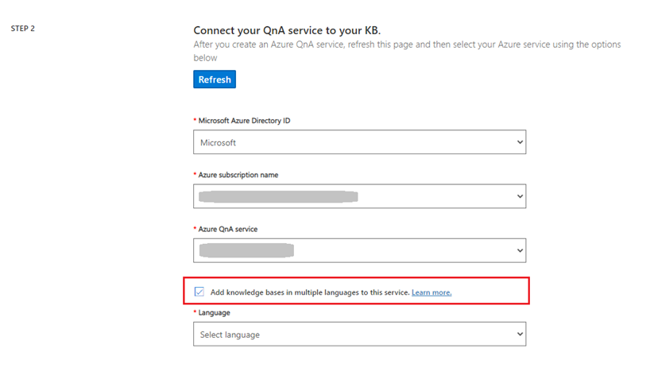
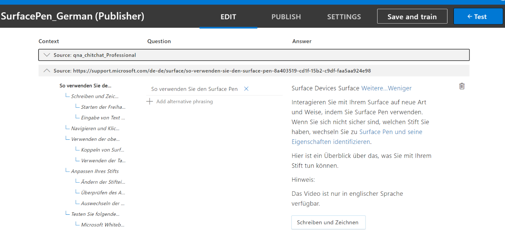

# Erstellen von Wissensdatenbanken in mehreren Sprachen

In diesem Tutorial werden Sie durch die Schritte zum Erstellen von Wissensdatenbanken in mehreren Sprachen geleitet. Zum Erstellen von Wissensdatenbanken auf Deutsch und Englisch wird die [FAQ zu Surface Pen](https://support.microsoft.com/surface/how-to-use-your-surface-pen-8a403519-cd1f-15b2-c9df-faa5aa924e98)-URL verwendet. Anschließend veröffentlichen wir die Wissensdatenbanken und verwenden [GenerateAnswerAPI](/rest/api/cognitiveservices-qnamaker/QnAMaker4.0/Runtime/GenerateAnswer), um Antworten auf häufig gestellte Fragen in der gewünschten Sprache zu erhalten.

## Erstellen einer deutschen Wissensdatenbank

Um eine Wissensdatenbank in mehreren Sprachen zu erstellen, muss die Spracheinstellung beim Erstellen der ersten Wissensdatenbank des QnA-Diensts festgelegt werden.

> [!NOTE]
> Die Option, mit der das Hinzufügen von Wissensdatenbanken in mehreren Sprachen zu einem Dienst aktiviert wird, ist nur im Rahmen der benutzerdefinierten Fragen und Antworten verfügbar, einem Feature der Textanalyse.
>
> Wenn Sie die GA-Version von QnA Maker verwenden, muss eine separate QnA Maker-Ressource für jede Sprache erstellt werden.

> [!div class="mx-imgBorder"]
> 

Aktivieren Sie in **Schritt 2** die Option „Wissensdatenbanken in mehreren Sprachen zu diesem Dienst hinzufügen“, und wählen Sie in der Dropdownliste für die Sprache der Wissensdatenbank **Deutsch** aus.
Geben Sie in Schritt 3 und 4 die erforderlichen Informationen ein, und wählen Sie dann **Wissensdatenbank erstellen** aus.
 
In diesem Schritt liest QnA Maker das Dokument und extrahiert QnA-Paare aus der Quell-URL, um die Wissensdatenbank in deutscher Sprache zu erstellen. Anschließend wird die Wissensdatenbankseite geöffnet, auf der wir den Inhalt der Wissensdatenbank bearbeiten können.

> [!div class="mx-imgBorder"]
> 

## Erstellen einer englischen Wissensdatenbank

Wir wiederholen nun die oben beschriebenen Schritte mit sprachspezifischen Änderungen in Schritt 2 und 4, um eine Wissensdatenbank in englischer Sprache zu erstellen:
1.  **Schritt 2**: Wählen Sie **Englisch** als Sprache aus.
2.  **Schritt 4**: Wählen Sie die Quelldatei in der ausgewählten Sprache aus, um eine Wissensdatenbank in englischer Sprache zu erstellen.
Sobald die Wissensdatenbank erstellt wurde, werden die relevanten QnA-Paare angezeigt, die von QnA Maker auf Englisch generiert wurden (siehe unten):

> [!div class="mx-imgBorder"]
> 

## Veröffentlichen und Abfragen der Wissensdatenbank

Die beiden Wissensdatenbanken können nun veröffentlicht und über [GenerateAnswerAPI](/rest/api/cognitiveservices-qnamaker/QnAMaker4.0/Runtime/GenerateAnswer) in der gewünschten Sprache abgefragt werden. Nachdem eine Wissensdatenbank veröffentlicht wurde, wird die folgende Seite mit Details dazu angezeigt, wie Abfragen an die Wissensdatenbank gesendet werden.

> [!div class="mx-imgBorder"]
> 

Die Sprache für die eingehende Benutzerabfrage kann mit der [Sprachenerkennung-API](../../text-analytics/how-tos/text-analytics-how-to-language-detection.md) erkannt werden, und der Benutzer kann je nach erkannter Sprache den entsprechenden Endpunkt und die entsprechende Wissensdatenbank aufrufen.