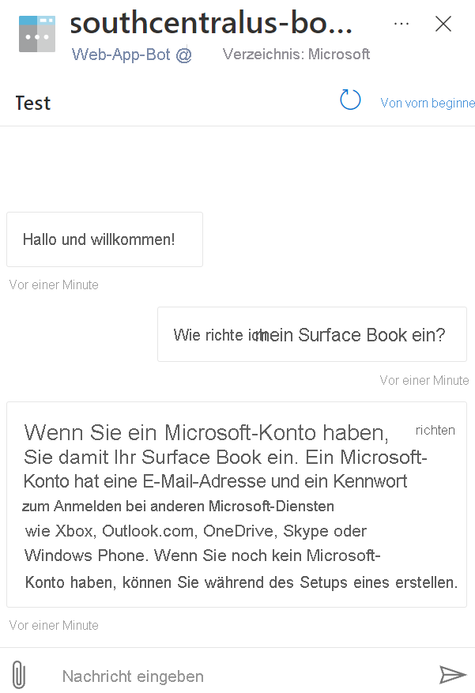
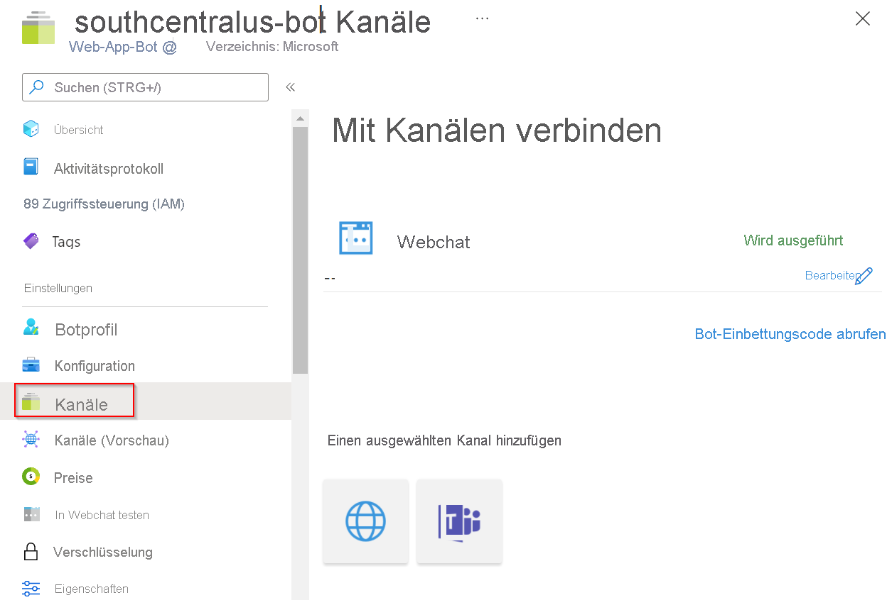

# Tutorial: Erstellen eines FAQ-Bots

Erstellen Sie mit „Fragen und Antworten“ und Azure [Bot Service](https://azure.microsoft.com/services/bot-service/) einen FAQ-Bot ohne Code.

In diesem Tutorial lernen Sie Folgendes:

<!-- green checkmark -->
> [!div class="checklist"]
> * Verknüpfen eines Fragen und Antworten-Projekts/einer Fragen und Antworten-Wissensdatenbank mit einem Azure Bot Service
> * Bereitstellen eines Bots
> * Chatten mit dem Bot im Webchat
> * Aktivieren des Bots in unterstützten Kanälen

## Erstellen und Veröffentlichen einer Wissensdatenbank

Befolgen Sie die Anleitung im [Artikel zu den ersten Schritten](../how-to/create-test-deploy.md). Nachdem die Wissensdatenbank erfolgreich bereitgestellt wurde, können Sie Artikel durcharbeiten.

## Erstellen eines Bots

Nachdem Ihr Projekt bzw. Ihre Wissensdatenbank bereitgestellt wurde, können Sie auf der Seite **Wissensdatenbank bereitstellen** einen Bot erstellen:

* Sie können schnell mehrere Bots erstellen, die alle auf die gleiche Wissensdatenbank verweisen, und dabei verschiedene Regionen oder Tarife für die einzelnen Bots verwenden.

* Wenn Sie Änderungen an der Wissensdatenbank vornehmen und sie erneut bereitstellen, müssen Sie keine weiteren Schritte für den Bot ausführen. Er ist bereits für die Verwendung mit der Wissensdatenbank konfiguriert und funktioniert auch nach späteren Änderungen. Nach jeder Veröffentlichung einer Wissensdatenbank werden alle mit ihr verbundenen Bots automatisch aktualisiert.

1. Wählen Sie im Language Studio-Portal auf der „Fragen und Antworten“-Seite **Wissensdatenbank bereitstellen** die Option **Bot erstellen** aus.

    > [!div class="mx-imgBorder"]
    > 

1. Für das Azure-Portal wird eine neue Browserregisterkarte mit der Erstellungsseite von Azure Bot Service geöffnet. Konfigurieren Sie Azure Bot Service.

    |Einstellung |Wert|
    |----------|---------|
    | Bothandle| Eindeutiger Bezeichner für den Bot. Dieser Wert darf mit dem Namen der App übereinstimmen. |
    | Subscription | Wählen Sie Ihr Abonnement aus. |
    | Ressourcengruppe | Wählen Sie eine vorhandene Ressourcengruppe aus, oder erstellen Sie eine neue. |
    | Ort | Wählen Sie den gewünschten Ort aus. |
    | Tarif | Auswählen eines Tarifs |
    |App-Name | App Service-Name für Ihren Bot |
    |SDK-Sprache | C# oder Node.js. Nachdem der Bot erstellt wurde, können Sie den Code in die lokale Entwicklungsumgebung herunterladen und den Entwicklungsprozess fortsetzen. |
    | QnA-Authentifizierungsschlüssel | Dieser Schlüssel wird automatisch anhand des bereitgestellten Fragen und Antworten-Projekts/der Fragen und Antworten-Wissensdatenbank ausgefüllt. |
    | App Service-Plan/Standort | Dieser Wert wird automatisch eingetragen. Ändern Sie diesen Wert nicht. |

1. Öffnen Sie nach der Erstellung des Bots die **Bot Service**-Ressource.
1. Wählen Sie unter **Einstellungen** die Option **In Webchat testen** aus.

    > [!div class="mx-imgBorder"]
    > 

1. Geben Sie bei der Chataufforderung **Nachricht eingeben** Folgendes ein:

    `How do I setup my surface book?`

    Der Chatbot antwortet mit einer Antwort aus Ihrer Wissensdatenbank.

    > [!div class="mx-imgBorder"]
    > 

## Integrieren des Bots in Kanäle

Wählen Sie in der von Ihnen erstellten Bot Service-Ressource **Kanäle** aus. Sie können den Bot in zusätzlichen [unterstützten Kanälen](/azure/bot-service/bot-service-manage-channels) aktivieren.

   >[!div class="mx-imgBorder"]
   >

## Bereinigen von Ressourcen

Löschen Sie die „Fragen und Antworten“- und Bot Service-Ressourcen, wenn Sie diese Anwendung nicht mehr verwenden möchten.

## Nächste Schritte

Im nächsten Artikel erfahren Sie, wie Sie Ihren FAQ-Bot mit mehrteiligen Äußerungen anpassen.
> [!div class="nextstepaction"]
> [Mehrfachdurchlauf-Eingabeaufforderungen](guided-conversations.md)
