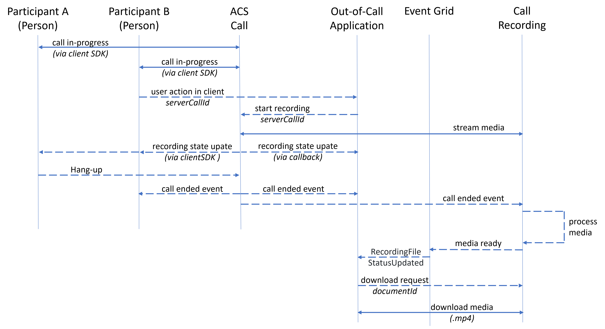

# <a name="calling-recording-overview"></a>Übersicht über die Anrufaufzeichnung

[!INCLUDE [Public Preview](../../includes/public-preview-include-document.md)]

> [!NOTE]
> Die Anrufaufzeichnung ist für Communication Services-Ressourcen verfügbar, die in Regionen in den USA, dem Vereinigten Königreich, Europa, Asien und Australien erstellt wurden.

Von der Anrufaufzeichnung wird eine Reihe von APIs zum Starten, Beenden, Anhalten und Fortsetzen der Aufzeichnung bereitgestellt. Auf diese APIs kann über serverseitige Geschäftslogik oder über durch Benutzeraktionen ausgelöste Ereignisse zugegriffen werden. Aufgezeichnete Medien werden im Audio- und Videoformat „MP4“ ausgegeben. Dieses Format wird auch von Teams zum Aufzeichnen von Medien verwendet. Benachrichtigungen im Zusammenhang mit Medien und Metadaten werden über Event Grid ausgegeben. Aufzeichnungen werden 48 Stunden lang in einem integrierten temporären Speicher gespeichert, wo sie abgerufen und in eine langfristige Speicherlösung Ihrer Wahl verschoben werden können. 



## <a name="media-output-types"></a>Medienausgabetypen
Von der Anrufaufzeichnung wird derzeit das gemischte MP4-Ausgabeformat für Audio und Video unterstützt. Das Ausgabemedium entspricht Besprechungsaufzeichnungen, die durch die Aufzeichnungsfunktion von Microsoft Teams generiert werden.

| Channeltyp | Inhaltsformat | Video | Audio |
| :----------- | :------------- | :---- | :--------------------------- |
| audioVideo | MP4 | Video (1.920 × 1.080, 8 FPS) aller Teilnehmer in Standardkachelanordnung | Gemischtes Audio (16 kHz, MP4A) aller Teilnehmer |


## <a name="run-time-control-apis"></a>Runtimesteuerungs-APIs
Runtimesteuerungs-APIs können verwendet werden, um die Aufzeichnung über interne Geschäftslogiktrigger (beispielsweise eine Anwendung, die einen Gruppenanruf erstellt und das Gespräch aufzeichnet) oder über eine vom Benutzer ausgelöste Aktion zu verwalten, die die Serveranwendung anweist, mit der Aufzeichnung zu beginnen. Anrufaufzeichnungs-APIs sind [anrufexterne APIs](./call-automation-apis.md#out-of-call-apis), die zum Initiieren der Aufzeichnung `serverCallId` verwenden. Beim Erstellen eines Anrufs wird eine `serverCallId` über das `Microsoft.Communication.CallLegStateChanged`-Ereignis zurückgegeben, nachdem ein Anruf eingerichtet wurde. Sie finden die `serverCallId` im Feld `data.serverCallId`. Weitere Informationen zum Abrufen der `serverCallId` über das Anrufclient-SDK finden Sie in unserem [Schnellstartbeispiel für die Anrufaufzeichnung](../../quickstarts/voice-video-calling/call-recording-sample.md). Wenn die Aufzeichnung gestartet wurde, wird eine `recordingOperationId` zurückgegeben, die dann für Folgevorgänge wie Anhalten und Fortsetzen verwendet wird.   

| Vorgang                            | Verwendet            | Kommentare                       |
| :-------------------- | :--------------------- | :----------------------------- |
| Aufzeichnung starten       | `serverCallId`         | Gibt `recordingOperationId` zurück. | 
| Abrufen des Aufzeichnungsstatus   | `recordingOperationId` | Gibt `recordingState` zurück.       | 
| Anhalten der Aufzeichnung       | `recordingOperationId` | Durch Anhalten und Fortsetzen der Anrufaufzeichnung können Sie die Aufzeichnung eines Teils eines Anrufs oder einer Besprechung überspringen und die Aufzeichnung in einer einzelnen Datei fortsetzen. | 
| Fortsetzen der Aufzeichnung      | `recordingOperationId` | Setzt einen angehaltenen Aufzeichnungsvorgang fort. Der Inhalt ist in derselben Datei enthalten wie der Inhalt vor dem Anhalten. | 
| Beenden der Aufzeichnung        | `recordingOperationId` | Beendet die Aufzeichnung und initiiert die endgültige Medienverarbeitung für den Dateidownload. | 


## <a name="event-grid-notifications"></a>Event Grid-Benachrichtigungen

> Azure Communication Services bietet eine kurzfristige Medienspeicherung für Aufzeichnungen. **Aufgezeichnete Inhalte, die Sie behalten möchten, müssen innerhalb von 48 Stunden exportiert werden.** Nach 48 Stunden sind die Aufzeichnungen nicht mehr verfügbar.

Eine Event Grid-Benachrichtigung (`Microsoft.Communication.RecordingFileStatusUpdated`) wird veröffentlicht, wenn eine Aufzeichnung abrufbereit ist. Dies ist in der Regel wenige Minuten nach Abschluss des Aufzeichnungsprozesses der Fall (also beispielsweise nach dem Ende der Besprechung oder nach dem Beenden der Aufzeichnung). Aufzeichnungsereignisbenachrichtigungen enthalten Werte für `contentLocation` und `metadataLocation`, mit denen sowohl aufgezeichnete Medien als auch eine Metadatendatei zur Aufzeichnung abgerufen werden können.

### <a name="notification-schema-reference"></a>Referenz zum Benachrichtigungsschema
```
{
    "id": string, // Unique guid for event
    "topic": string, // Azure Communication Services resource id
    "subject": string, // /recording/call/{call-id}
    "data": {
        "recordingStorageInfo": {
            "recordingChunks": [
                {
                    "documentId": string, // Document id for retrieving from storage
                    "index": int, // Index providing ordering for this chunk in the entire recording
                    "endReason": string, // Reason for chunk ending: "SessionEnded", "ChunkMaximumSizeExceeded”, etc.
                    "metadataLocation": <string>, // url of the metadata for this chunk
                    "contentLocation": <string>   // url of the mp4, mp3, or wav for this chunk
                }
            ]
        },
        "recordingStartTime": string, // ISO 8601 date time for the start of the recording
        "recordingDurationMs": int, // Duration of recording in milliseconds
        "sessionEndReason": string // Reason for call ending: "CallEnded", "InitiatorLeft", etc.
    },
    "eventType": string, // "Microsoft.Communication.RecordingFileStatusUpdated"
    "dataVersion": string, // "1.0"
    "metadataVersion": string, // "1"
    "eventTime": string // ISO 8601 date time for when the event was created
}
```
## <a name="regulatory-and-privacy-concerns"></a>Bedenken hinsichtlich Datenschutz und gesetzlichen Bestimmungen

In vielen Ländern und Staaten gibt es Gesetze und Vorschriften im Zusammenhang der Aufzeichnung von Telefon-, Sprach- und Videoanrufen. Diese schreiben häufig die Einwilligung des Benutzers in die Aufzeichnung seiner Kommunikation vor. Es liegt in Ihrer Verantwortung, die Anrufaufzeichnungsfunktionen im Einklang mit dem Gesetz zu verwenden. Die Einwilligung der an aufgezeichneter Kommunikation beteiligten Parteien muss auf eine Weise eingeholt werden, die den für den jeweiligen Teilnehmer geltenden Gesetzen entspricht.

Bestimmungen im Zusammenhang mit der Pflege personenbezogener Daten erfordern die Möglichkeit zum Exportieren von Benutzerdaten. Zur Erfüllung dieser Anforderungen enthalten Aufzeichnungsmetadatendateien die Teilnehmer-ID für jeden Aufrufteilnehmer im Array `participants`. Sie können die MRIs im Array `participants` mit Ihren internen Benutzeridentitäten abgleichen, um Aufrufteilnehmer zu identifizieren. Weiter unten finden Sie ein Beispiel für eine Aufzeichnungsmetadatendatei als Referenz.

## <a name="next-steps"></a>Nächste Schritte
Weitere Informationen finden Sie im [Schnellstartbeispiel zur Anrufaufzeichnung](../../quickstarts/voice-video-calling/call-recording-sample.md).

Weitere Informationen finden Sie unter den [Anrufautomatisierungs-APIs](./call-automation-apis.md).
