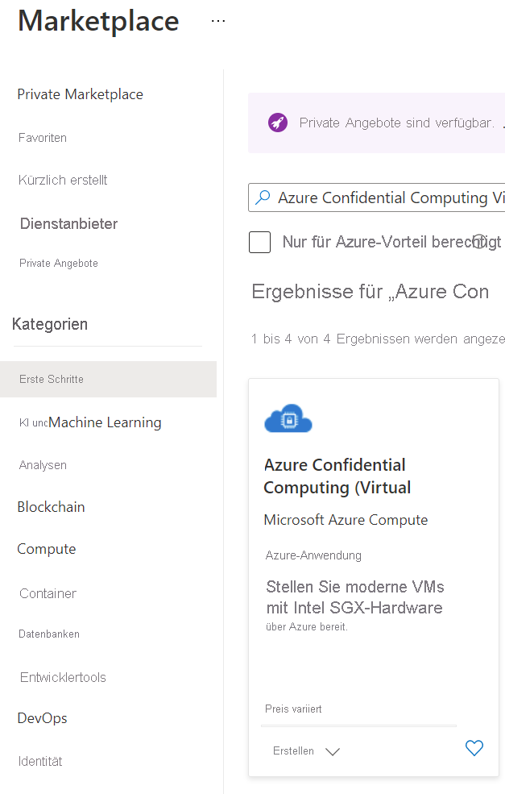

# <a name="quickstart-create-intel-sgx-vm-in-the-azure-marketplace"></a>Schnellstart: Erstellen einer Intel SGX-VM in Azure Marketplace

Dieses Tutorial führt Sie durch den Prozess der Bereitstellung von Intel SGX-VMs mithilfe von Azure Marketplace. Andernfalls wird empfohlen, den VM-Bereitstellungsflow [über das Portal oder die CLI](quick-create-portal.md) zu befolgen.

## <a name="prerequisites"></a>Voraussetzungen

Wenn Sie kein Azure-Abonnement besitzen, [erstellen Sie ein Konto](https://azure.microsoft.com/pricing/purchase-options/pay-as-you-go/), bevor Sie beginnen.

> [!NOTE]
> Mit kostenlosen Testkonten ist kein Zugriff auf die VMs in diesem Tutorial möglich. Führen Sie ein Upgrade auf ein Abonnement mit nutzungsbasierter Zahlung durch.


## <a name="sign-in-to-azure"></a>Anmelden bei Azure

1. Melden Sie sich beim [Azure-Portal](https://portal.azure.com/) an.

1. Wählen Sie oben die Option **Ressource erstellen** aus.

1. Suchen Sie im Standardbereich **Erste Schritte** nach **Azure Confidential Computing (Virtual Machine)** .

1. Klicken Sie auf die Vorlage **Azure Confidential Computing (Virtual Machine)** .

    

1. Wählen Sie auf der Startseite des virtuellen Computers die Option **Erstellen** aus.


## <a name="configure-an-intel-sgx-virtual-machine"></a>Konfigurieren einer Intel SGX-VM

1. Wählen Sie auf der Registerkarte **Grundlagen** Ihr **Abonnement** und Ihre **Ressourcengruppe** aus (für die Bereitstellung dieser Vorlage muss die Gruppe leer sein).

1. Geben Sie im Feld **Name des virtuellen Computers** einen Namen für Ihre neue VM ein.

1. Geben Sie folgende Werte ein bzw. wählen diese aus:

   * **Region**: Wählen Sie die für Sie geeignete Azure-Region aus.

        > [!NOTE]
        > Intel SGX-VMs werden in bestimmten Regionen auf spezieller Hardware ausgeführt. Informationen zur aktuellen regionalen Verfügbarkeit finden Sie in [Verfügbare Regionen](https://azure.microsoft.com/global-infrastructure/services/?products=virtual-machines) unter „DCsv2-Serie“ oder „DCsv3/DCdsv3-Serie“.

1. Konfigurieren Sie das Betriebssystemimage, das Sie für Ihren virtuellen Computer verwenden möchten. Dieses Setup unterstützt nur die Bereitstellung von Gen 2-VMs und -Images.

    * **Image wählen**: Wählen Sie für dieses Tutorial „Ubuntu 20.04 LTS (Gen 2)“ aus. Sie können auch „Windows Server Datacenter 2019“ oder „Ubuntu 18.04 LTS“ auswählen. Wenn Sie sich für eines dieser Images entscheiden, werden Sie in diesem Tutorial entsprechend umgeleitet.
   
1. Geben Sie folgende Informationen auf der Registerkarte „Grundlagen“ ein:

   * **Authentifizierungstyp:** Wählen Sie **Öffentlicher SSH-Schlüssel** aus, wenn Sie eine Linux-VM erstellen. 

        > [!NOTE]
        > Für die Authentifizierung können Sie einen öffentlichen SSH-Schlüssel oder ein Kennwort verwenden. SSH ist sicherer. Wie Sie einen SSH-Schlüssel generieren, erfahren Sie unter [Erstellen und Verwenden eines SSH-Schlüsselpaars (öffentlich und privat) für virtuelle Linux-Computer in Azure](../virtual-machines/linux/mac-create-ssh-keys.md).

    * **Benutzername**: Geben Sie den Administratornamen für die VM ein.

    * **Öffentlicher SSH-Schlüssel**: Geben Sie Ihren öffentlichen RSA-Schlüssel ein (falls zutreffend).
    
    * **Kennwort**: Geben Sie Ihr Kennwort für die Authentifizierung ein (falls zutreffend).
    
1. Geben Sie auf der Registerkarte „Einstellungen des virtuellen Computers“ die folgenden Informationen ein:

   * Auswahl der SKU-Größe für die VM
   * Die **DCsv2-Serie** unterstützt **SSD Standard**. **Premium SSD** wird für DC1, DC2 und DC4 unterstützt. 
   * Die **DCsv3- und DCdsv3-Serie** unterstützen **SSD Standard**, **Premium SSD** und **Disk Ultra**.
   
   * **Öffentliche Eingangsports**: Wählen Sie die Option **Ausgewählte Ports zulassen** und dann in der Liste **Öffentliche Eingangsports hinzufügen** die Optionen **SSH (22)** und **HTTP (80)** aus. Wählen Sie bei der Bereitstellung einer Windows-VM die Optionen **HTTP (80)** und **RDP (3389)** aus. In dieser Schnellstartanleitung ist dieser Schritt erforderlich, um eine Verbindung mit dem virtuellen Computer herzustellen.
   
    >[!Note]
    > Das Zulassen von RDP-/SSH-Ports wird für Produktionsbereitstellungen nicht empfohlen.  

     


1. Wählen Sie ggf. die Option **Überwachung** aus.

1. Klicken Sie auf **Überprüfen + erstellen**.

1. Klicken Sie im Bereich **Bewerten + erstellen** auf **Erstellen**.

> [!NOTE]
> Fahren Sie im nächsten Abschnitt mit diesem Tutorial fort, wenn Sie eine Linux-VM bereitgestellt haben. Stellen Sie sicher, dass Sie bei der Bereitstellung einer Windows-VM [diese Schritte für die Verbindungsherstellung mit Ihrer Windows-VM ausführen](../virtual-machines/windows/connect-logon.md).


## <a name="connect-to-the-linux-vm"></a>Herstellen einer Verbindung mit dem virtuellen Linux-Computer

Wenn Sie bereits über eine BASH-Shell verfügen, verwenden Sie den Befehl **ssh**, um eine Verbindung mit dem virtuellen Azure-Computer herzustellen. Ersetzen Sie im folgenden Befehl den VM-Benutzernamen und die IP-Adresse, um eine Verbindung mit Ihrem virtuellen Linux-Computer herzustellen.

```bash
ssh azureadmin@40.55.55.555
```

Sie finden die öffentliche IP-Adresse Ihrer VM im Azure-Portal im Abschnitt mit der „Übersicht“ für Ihre VM.

:::image type="content" source="media/quick-create-portal/public-ip-virtual-machine.png" alt-text="IP-Adresse im Azure-Portal":::

Wenn Sie mit Windows arbeiten und nicht über eine BASH-Shell verfügen, installieren Sie einen SSH-Client (beispielsweise PuTTY).

1. [Laden Sie PuTTY herunter, und installieren Sie es.](https://www.chiark.greenend.org.uk/~sgtatham/putty/download.html)

1. Führen Sie PuTTY aus.

1. Geben Sie im Konfigurationsbildschirm von PuTTY die öffentliche IP-Adresse Ihres virtuellen Computers ein.

1. Wählen Sie **Öffnen** aus, und geben Sie Ihren Benutzernamen und Ihr Kennwort ein.

Weitere Informationen zum Herstellen einer Verbindung mit virtuellen Linux-Computern finden Sie unter [Erstellen einer Linux-VM mit dem Azure-Portal](../virtual-machines/linux/quick-create-portal.md).

> [!NOTE]
> Falls eine PuTTY-Sicherheitswarnung angezeigt wird, dass der Hostschlüssel des Servers nicht in der Registrierung zwischengespeichert wird, wählen Sie eine der folgenden Optionen aus. Wenn Sie diesem Host vertrauen, wählen Sie **Ja** aus, um den Schlüssel dem Cache von PuTTy hinzuzufügen und die Verbindungsherstellung fortzusetzen. Wenn Sie die Verbindung nur einmal herstellen möchten, ohne den Schlüssel dem Cache hinzuzufügen, wählen Sie **Nein** aus. Wenn Sie diesem Host nicht vertrauen, wählen Sie **Abbrechen** aus, um die Verbindungsherstellung abzubrechen.

## <a name="intel-sgx-drivers"></a>Intel SGX-Treiber

> [!NOTE]
> Intel SGX-Treiber sind bereits Teil der Ubuntu & Windows Azure-Katalogimages. Um sicherzustellen, dass Sie die neuesten Treiber verwenden, besuchen Sie die [Intel SGX DCAP-Treiberliste](https://01.org/intel-software-guard-extensions/downloads).

## <a name="clean-up-resources"></a>Bereinigen von Ressourcen

Wenn Ressourcengruppe, virtueller Computer und alle zugehörigen Ressourcen nicht mehr benötigt werden, können Sie sie löschen. 

Wählen Sie die Ressourcengruppe für den virtuellen Computer und dann **Löschen** aus. Bestätigen Sie dann den Namen der Ressourcengruppe, um das Löschen der Ressourcen abzuschließen.

## <a name="next-steps"></a>Nächste Schritte

In dieser Schnellstart haben Sie eine Intel SGX-VM bereitgestellt und eine Verbindung mit ihr hergestellt. Weitere Informationen finden Sie unter [Lösungen auf virtuellen Computern](virtual-machine-solutions-sgx.md). 

Machen Sie sich damit vertraut, wie Sie Confidential Computing-Anwendungen entwickeln, indem Sie mit den Beispielen zum Open Enclave SDK auf GitHub fortfahren. 

> [!div class="nextstepaction"]
> [Entwickeln von Open Enclave SDK-Beispielen](https://github.com/openenclave/openenclave/blob/master/samples/README.md)
