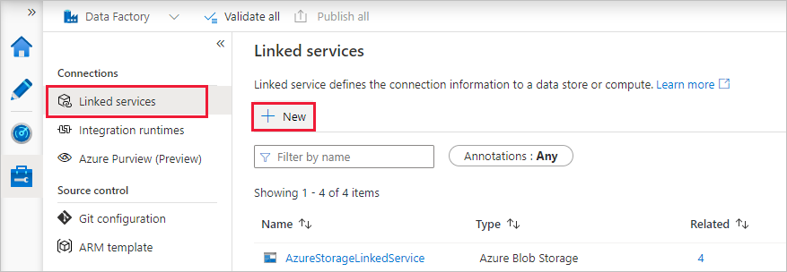
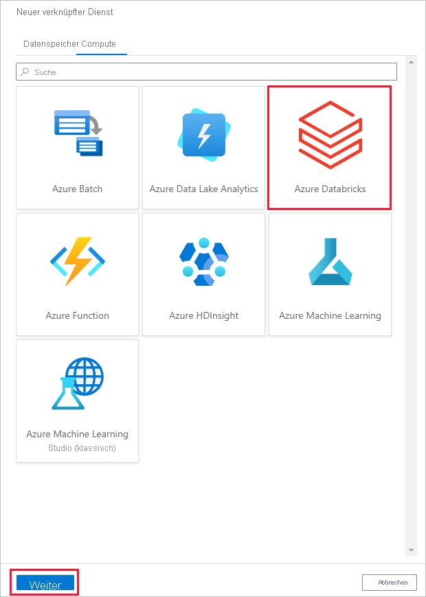
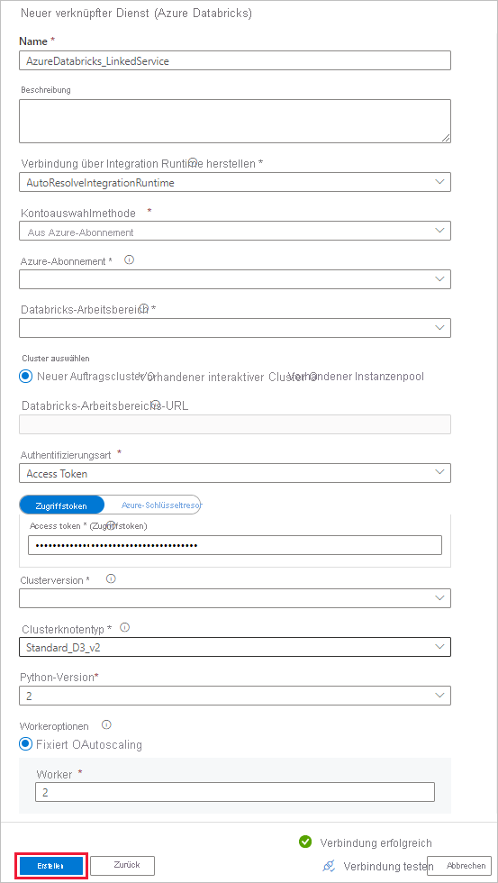
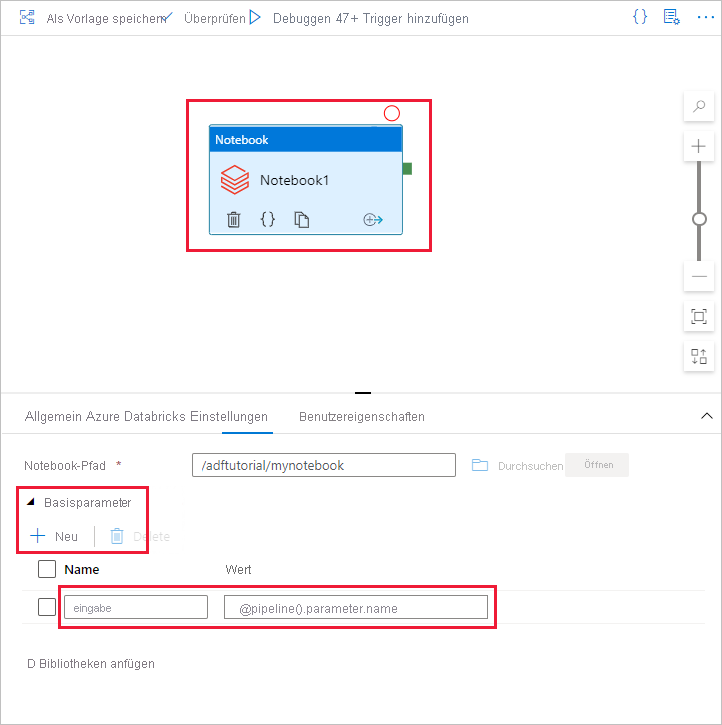
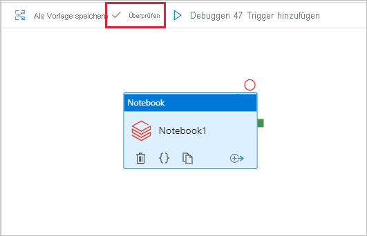
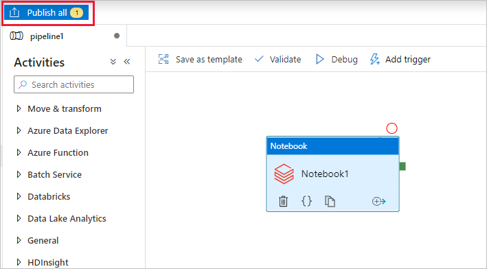
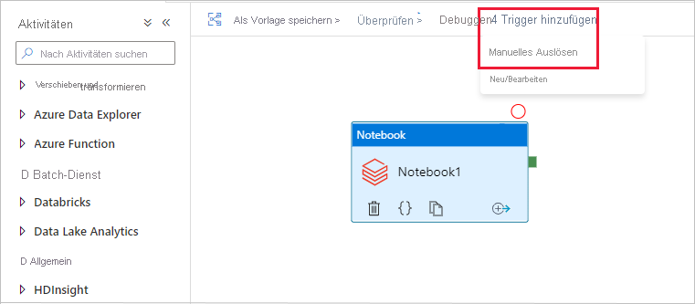
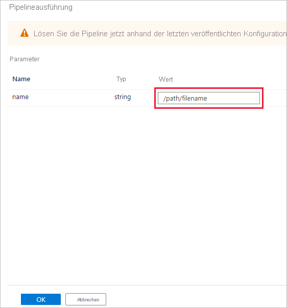

# <a name="run-a-databricks-notebook-with-the-databricks-notebook-activity-in-azure-data-factory"></a>Ausführen eines Databricks-Notebooks mit der Databricks-Notebook-Aktivität in Azure Data Factory

[!INCLUDE[appliesto-adf-xxx-md](includes/appliesto-adf-xxx-md.md)]

In diesem Tutorial verwenden Sie das Azure-Portal, um eine Azure Data Factory-Pipeline zu erstellen, die ein Databricks-Notebook für den Cluster mit den Databricks-Aufträgen ausführt. Außerdem übergibt sie während der Ausführung Azure Data Factory-Parameter an das Databricks-Notebook.

In diesem Tutorial führen Sie die folgenden Schritte aus:

  - Erstellen einer Data Factory.

  - Erstellen einer Pipeline mit Databricks-Notebook-Aktivität

  - Auslösen einer Pipelineausführung

  - Überwachen der Pipelineausführung.

Wenn Sie kein Azure-Abonnement besitzen, können Sie ein [kostenloses Konto](https://azure.microsoft.com/free/) erstellen, bevor Sie beginnen.

Das folgende Video enthält eine 11-minütige Einführung und Demonstration dieses Features:

> [!VIDEO https://channel9.msdn.com/Shows/Azure-Friday/ingest-prepare-and-transform-using-azure-databricks-and-data-factory/player]

## <a name="prerequisites"></a>Voraussetzungen

  - **Azure Databricks-Arbeitsbereich** [Erstellen Sie einen Databricks-Arbeitsbereich](/azure/databricks/scenarios/quickstart-create-databricks-workspace-portal), oder verwenden Sie einen vorhandenen Arbeitsbereich. Sie erstellen ein Python-Notebook in Ihrem Azure Databricks-Arbeitsbereich. Anschließend führen Sie das Notebook aus und übergeben Parameter mit Azure Data Factory.

## <a name="create-a-data-factory"></a>Erstellen einer Data Factory

1. Starten Sie den Webbrowser **Microsoft Edge** oder **Google Chrome**. Die Data Factory-Benutzeroberfläche wird zurzeit nur in den Webbrowsern Microsoft Edge und Google Chrome unterstützt.

1. Wählen Sie im Azure-Portalmenü die Option **Ressource erstellen** und dann **Integration** und **Data Factory** aus.

    :::image type="content" source="./media/doc-common-process/new-azure-data-factory-menu.png" alt-text="Screenshot: Auswahl der Data Factory im Bereich „Neu“":::

1. Wählen Sie auf der Seite **Data Factory erstellen** auf der Registerkarte **Grundlagen** Ihr Azure-**Abonnement** aus, in dem Sie die Data Factory erstellen möchten.

1. Führen Sie unter **Ressourcengruppe** einen der folgenden Schritte aus:
    
    1. Wählen Sie in der Dropdownliste eine vorhandene Ressourcengruppe aus.
    
    1. Wählen Sie **Neu erstellen** aus, und geben Sie den Namen einer neuen Ressourcengruppe ein.

    Weitere Informationen über Ressourcengruppen finden Sie unter [Verwenden von Ressourcengruppen zum Verwalten von Azure-Ressourcen](../azure-resource-manager/management/overview.md).

1. Wählen Sie unter **Region** den Standort für die Data Factory aus.

    In der Liste werden nur Standorte angezeigt, die von Data Factory unterstützt werden und an denen Ihre Azure Data Factory-Metadaten gespeichert werden. Die von Data Factory verwendeten zugeordneten Datenspeicher (z. B. Azure Storage und Azure SQL-Datenbank) und Computedienste (z. B. Azure HDInsight) können in anderen Regionen ausgeführt werden.

1. Geben Sie unter **Name** den Namen **ADFTutorialDataFactory** ein.
    
    Der Name der Azure Data Factory muss *global eindeutig* sein. Sollte der folgende Fehler auftreten, ändern Sie den Namen der Data Factory. (Verwenden Sie beispielsweise **&lt;IhrName&gt;ADFTutorialDataFactory**.) Benennungsregeln für Data Factory-Artefakte finden Sie im Artikel [Azure Data Factory – Benennungsregeln](./naming-rules.md).

    :::image type="content" source="./media/doc-common-process/name-not-available-error.png" alt-text="Screenshot: Fehler, wenn kein Name verfügbar ist":::

1. Wählen Sie **V2** als **Version** aus.

1. Klicken Sie auf **Weiter: Git-Konfiguration**, und aktivieren Sie das Kontrollkästchen **Git später konfigurieren**.

1. Wählen Sie **Überprüfen und erstellen** und nach erfolgreicher Prüfung **Erstellen** aus. 

1. Wählen Sie nach der Erstellung **Zu Ressource wechseln** aus, um zur Seite **Data Factory** zu navigieren. Wählen Sie die Kachel **Azure Data Factory Studio öffnen** aus, um die Anwendung für die Azure Data Factory-Benutzeroberfläche (User Interface, UI) auf einer separaten Registerkarte des Browsers zu starten.

    :::image type="content" source="./media/doc-common-process/data-factory-home-page.png" alt-text="Screenshot: Startseite für die Azure Data Factory mit der Kachel „Azure Data Factory öffnen“":::

## <a name="create-linked-services"></a>Erstellen von verknüpften Diensten

In diesem Abschnitt erstellen Sie einen verknüpften Databricks-Dienst. Dieser verknüpfte Dienst enthält die Verbindungsinformationen für den Databricks-Cluster:

### <a name="create-an-azure-databricks-linked-service"></a>Erstellen eines verknüpften Azure Databricks-Diensts

1.  Wechseln Sie auf der Startseite im linken Bereich zur Registerkarte **Verwalten**.

    

1.  Wählen Sie unter **Verbindungen** die Option **Verknüpfte Dienste** und dann **+ Neu** aus.
    
    

1.  Wählen Sie im Fenster **Neuer verknüpfter Dienst**  die Option **Compute** &gt; **Azure Databricks** und dann **Weiter** aus.
    
    

1.  Führen Sie im Fenster **Neuer verknüpfter Dienst** die folgenden Schritte aus:
    
    1.  Geben Sie unter **Name** den Namen **_AzureDatabricks\_LinkedService_** ein.
    
    1.  Wählen Sie den richtigen **Databricks-Arbeitsbereich** aus, in dem Sie Ihr Notebook ausführen möchten.

    1.  Wählen Sie unter **Cluster auswählen** die Option **Neuer Auftragscluster** aus.
    
    1.  Für **Databricks-Arbeitsbereichs-URL** sollten die entsprechenden Informationen automatisch aufgefüllt werden.

    1.  Führen Sie für **Zugriffstoken** die Generierung über den Azure Databricks-Arbeitsbereich durch. Die Schritte finden Sie [hier](https://docs.databricks.com/api/latest/authentication.html#generate-token).

    1.  Wählen Sie als **Clusterversion** die Option **4.2** (mit Apache Spark 2.3.1, Scala 2.11) aus.

    1.  Wählen Sie für dieses Tutorial unter **General Purpose (HDD)** (Universell (HDD)) für **Cluster node type** (Clusterknotentyp) die Option **Standard\_D3\_v2**. 
    
    1.  Geben Sie für **Workers** die Zahl **2** ein.
    
    1.  Klicken Sie auf **Erstellen**.

        

## <a name="create-a-pipeline"></a>Erstellen einer Pipeline

1.  Klicken Sie auf die Schaltfläche **+** (Pluszeichen), und wählen Sie im Menü dann die Option **Pipeline**.

    

1.  Erstellen Sie einen **Parameter** für die Verwendung in der **Pipeline**. Diesen Parameter übergeben Sie später an die Databricks-Notebook-Aktivität. Wählen Sie in der leeren Pipeline die Registerkarte **Parameter** und dann **+ Neu** aus, und geben Sie als Namen **name** ein.

    

    

1.  Erweitern Sie in der Toolbox **Aktivitäten** die Option **Databricks**. Ziehen Sie die **Notebook**-Aktivität aus der Toolbox **Aktivitäten** auf die Oberfläche des Pipeline-Designers.

    

1.  Führen Sie in den Eigenschaften im unteren Bereich des Fensters für das **Databricks-** **Notebook** die folgenden Schritte aus:

    1. Wechseln Sie zur Registerkarte **Azure Databricks**.

    1. Wählen Sie **AzureDatabricks\_LinkedService** aus (wie oben erstellt).

    1. Wechseln Sie zur Registerkarte **Einstellungen**.

    1. Wählen Sie einen **Notebook-Pfad** für Databricks aus. Wir erstellen ein Notebook und geben den Pfad hier an. Sie erhalten den Notebook-Pfad, indem Sie die nächsten Schritte ausführen.

       1. Starten Sie Ihren Azure Databricks-Arbeitsbereich.

       1. Erstellen Sie im Arbeitsbereich unter **Neuer Ordner** einen neuen Ordner, und geben Sie ihm den Namen **adftutorial**.

          

       1. [Screenshot: Erstellen eines neuen Notebooks](https://docs.databricks.com/user-guide/notebooks/index.html#creating-a-notebook) (Python) Geben Sie dem Notebook den Namen **mynotebook**, und klicken Sie im Ordner **adftutorial** auf **Erstellen**.

          

          

       1. Fügen Sie im neu erstellten Notebook „mynotebook“ den folgenden Code hinzu:

           ```
           # Creating widgets for leveraging parameters, and printing the parameters

           dbutils.widgets.text("input", "","")
           y = dbutils.widgets.get("input")
           print ("Param -\'input':")
           print (y)
           ```

           

       1. Der **Notebook-Pfad** lautet hier **/adftutorial/mynotebook**.

1.  Wechseln Sie zurück zum **Erstellungstool für die Data Factory-Benutzeroberfläche**. Navigieren Sie unter der Aktivität **Notebook1** zur Registerkarte **Einstellungen**.

    a.  Fügen Sie der Notebook-Aktivität einen **Parameter** hinzu. Verwenden Sie den Parameter, den Sie der **Pipeline** zuvor hinzugefügt haben.

       

    b.  Geben Sie dem Parameter den Namen **input**, und geben Sie den Wert als Ausdruck **\@pipeline().parameters.name** an.

1.  Wählen Sie zum Überprüfen der Pipeline in der Symbolleiste die Schaltfläche **Überprüfen**. Wählen Sie die Schaltfläche **Schließen** aus, um das Überprüfungsfenster zu schließen.

    

1.  Wählen Sie **Alle veröffentlichen** aus. Die Data Factory-Benutzeroberfläche veröffentlicht Entitäten (verknüpfte Dienste und Pipeline) für den Azure Data Factory-Dienst.

    

## <a name="trigger-a-pipeline-run"></a>Auslösen einer Pipelineausführung

Wählen Sie auf der Symbolleiste die Option **Trigger hinzufügen** und dann **Trigger now** (Jetzt auslösen) aus.



Im Dialogfeld **Pipelineausführung** wird nach dem Parameter **name** gefragt. Verwenden Sie hier **/path/filename** als Parameter. Klicken Sie auf **OK**.



## <a name="monitor-the-pipeline-run"></a>Überwachen der Pipelineausführung

1.  Wechseln Sie zur Registerkarte **Überwachen**. Vergewissern Sie sich, dass eine Pipelineausführung angezeigt wird. Die Erstellung eines Databricks-Auftragsclusters, in dem das Notebook ausgeführt wird, dauert ca. fünf bis acht Minuten.

    

1.  Wählen Sie von Zeit zu Zeit die Option **Aktualisieren**, um den Status der Pipelineausführung zu überprüfen.

1.  Wenn Sie mit der Pipelineausführung verknüpfte Aktivitätsausführungen anzeigen möchten, wählen Sie in der Spalte **Aktionen** die Optionen **View Activity Runs** (Aktivitätsausführungen anzeigen).

    

Durch Wählen des Links **Pipelines** im oberen Bereich können Sie zur Ansicht mit den Pipelineausführungen zurückkehren.

## <a name="verify-the-output"></a>Überprüfen der Ausgabe

Sie können sich im **Azure Databricks-Arbeitsbereich** anmelden und zu **Cluster** navigieren. Unter **Auftrag** wird der Status *„Ausstehende Ausführung“, „Wird ausgeführt“ oder „Beendet“* angezeigt.


Sie können auf den **Auftragsnamen** klicken und weitere Details anzeigen. Bei einer erfolgreichen Ausführung können Sie die übergebenen Parameter und die Ausgabe des Python-Notebooks überprüfen.


## <a name="next-steps"></a>Nächste Schritte

Die Pipeline in diesem Beispiel löst eine Databricks-Notebook-Aktivität aus und übergibt einen Parameter. Sie haben Folgendes gelernt:

  - Erstellen einer Data Factory.

  - Erstellen einer Pipeline, für die die Databricks-Notebook-Aktivität verwendet wird

  - Auslösen einer Pipelineausführung

  - Überwachen der Pipelineausführung.