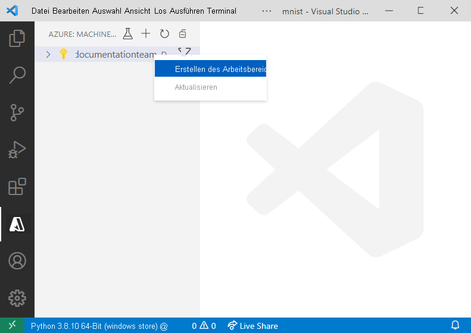
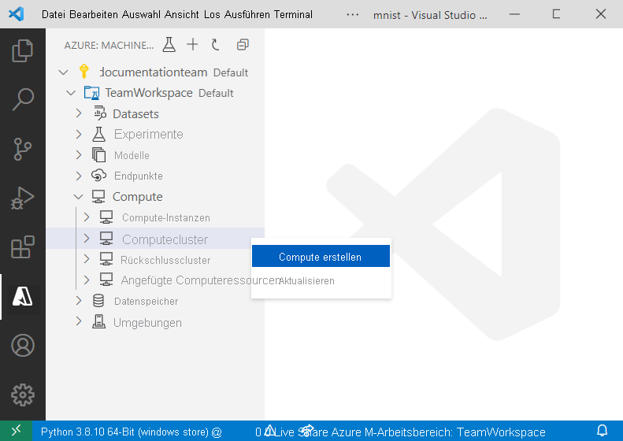

# <a name="train-an-image-classification-tensorflow-model-using-the-azure-machine-learning-visual-studio-code-extension-preview"></a>Trainieren eines TensorFlow-Modells für die Bildklassifizierung mit der Azure Machine Learning-Erweiterung für Visual Studio Code (Vorschau)

Hier erfahren Sie, wie Sie mit TensorFlow und der Azure Machine Learning-Erweiterung für Visual Studio Code ein Bildklassifizierungsmodell für die Erkennung handgeschriebener Ziffern trainieren.

In diesem Tutorial lernen Sie Folgendes:

> [!div class="checklist"]
> * Grundlegendes zum Code
> * Erstellen eines Arbeitsbereichs
> * Erstellen eines GPU-Clusters für das Training
> * Trainieren eines Modells

## <a name="prerequisites"></a>Voraussetzungen

- Azure-Abonnement. Wenn Sie keins besitzen, können Sie sich für die [kostenlose oder kostenpflichtige Version von Azure Machine Learning](https://azure.microsoft.com/free/t.com/free/) registrieren.
- Installieren Sie [Visual Studio Code](https://code.visualstudio.com/docs/setup/setup-overview). Hierbei handelt es sich um einen einfachen plattformübergreifenden Code-Editor.
- Azure Machine Learning Studio-Erweiterung für Visual Studio Code. Eine Installationsanleitung finden Sie in der Anleitung zum [Einrichten der Azure Machine Learning-Erweiterung für Visual Studio Code](./how-to-setup-vs-code.md).
- CLI (v2) (Vorschau). Eine Anleitung zur Installation finden Sie unter [Installieren, Einrichten und Verwenden der CLI (v2) (Vorschau)](how-to-configure-cli.md).

## <a name="understand-the-code"></a>Grundlegendes zum Code

Der Code für dieses Tutorial verwendet TensorFlow zum Trainieren eines Machine Learning-Modells für die Bildklassifizierung, das handgeschriebene Ziffern von 0 bis 9 kategorisiert. Dazu wird ein neuronales Netzwerk erstellt, das die Pixelwerte eines Bilds mit 28 px × 28 px als Eingabe verwendet und eine Liste mit zehn Wahrscheinlichkeiten ausgibt, eine für jede der zu klassifizierenden Ziffern. Im Folgenden finden Sie ein Beispiel dafür, wie diese Daten aussehen:  


Rufen Sie den Code für dieses Tutorial ab, indem Sie das [Repository mit Azure ML-Beispielen](https://github.com/Azure/azureml-examples/archive/refs/heads/main.zip) herunterladen und an einem beliebigen Speicherort auf Ihrem Computer entpacken.

## <a name="create-a-workspace"></a>Erstellen eines Arbeitsbereichs

Als Erstes müssen Sie einen Arbeitsbereich erstellen, damit Sie eine Anwendung in Azure Machine Learning erstellen können. Ein Arbeitsbereich enthält die Ressourcen zum Trainieren von Modellen sowie die trainierten Modelle selbst. Weitere Informationen finden Sie unter [Was ist ein Arbeitsbereich?](./concept-workspace.md).

1. Öffnen Sie das Verzeichnis *azureml-examples-main/cli/jobs/train/tensorflow/mnist* in Visual Studio Code.
1. Wählen Sie auf der Aktivitätsleiste von Visual Studio Code das **Azure**-Symbol aus, um die Azure Machine Learning-Ansicht zu öffnen.
1. Klicken Sie in der Azure Machine Learning-Ansicht mit der rechten Maustaste auf Ihren Abonnementknoten, und wählen Sie **Arbeitsbereich erstellen** aus.

    > [!div class="mx-imgBorder"]
    > 

1. Eine Spezifikationsdatei wird angezeigt. Konfigurieren Sie die Spezifikationsdatei mit den folgenden Optionen. 

    ```yml
    $schema: https://azuremlschemas.azureedge.net/latest/workspace.schema.json
    name: TeamWorkspace
    location: WestUS2
    friendly_name: team-ml-workspace
    description: A workspace for training machine learning models
    tags:
      purpose: training
      team: ml-team
    ```

    Die Spezifikationsdatei erstellt einen Arbeitsbereich namens `TeamWorkspace` in der Region `WestUS2`. Mit den restlichen Optionen, die in der Spezifikationsdatei definiert sind, werden benutzerfreundliche Namen, Beschreibungen und Tags für den Arbeitsbereich angegeben.

1. Klicken Sie mit der rechten Maustaste auf die Spezifikationsdatei, und wählen Sie **Azure ML: Ressource erstellen** aus. Beim Erstellen einer Ressource werden die Konfigurationsoptionen verwendet, die in der YAML-Spezifikationsdatei definiert sind, und über die CLI (v2) wird ein Auftrag übermittelt. An diesem Punkt wird eine Anforderung zum Erstellen eines neuen Arbeitsbereichs und der abhängigen Ressourcen in Ihrem Konto an Azure gesendet. Nach einigen Minuten wird der neue Arbeitsbereich in Ihrem Abonnementknoten angezeigt.
1. Wählen Sie `TeamWorkspace` als Standardarbeitsbereich aus. Die von Ihnen erstellten Ressourcen und Aufträge werden dann standardmäßig im Arbeitsbereich platziert. Wählen Sie in der Visual Studio Code-Statusleiste die Schaltfläche **Set Azure ML Workspace** (Azure ML-Arbeitsbereich festlegen) aus, und befolgen Sie die Anweisungen zum Festlegen von `TeamWorkspace` als Standardarbeitsbereich.

Weitere Informationen zu Arbeitsbereichen finden Sie im Artikel zum [Verwalten von Ressourcen in VS Code](how-to-manage-resources-vscode.md).

## <a name="create-a-gpu-cluster-for-training"></a>Erstellen eines GPU-Clusters für das Training

Bei einem Computeziel handelt es sich um die Computeressource oder -Umgebung, in der Sie Trainingsaufträge ausführen. Weitere Informationen finden Sie in der Dokumentation zu [Azure Machine Learning-Computezielen](./concept-compute-target.md).

1. Erweitern Sie in der Azure Machine Learning-Ansicht Ihren Arbeitsbereichsknoten.
1. Klicken Sie mit der rechten Maustaste auf den Knoten **Computecluster**, der sich auf dem **Compute**-Knoten Ihres Arbeitsbereichs befindet, und wählen Sie die Option **Computeressource erstellen** aus.

    > [!div class="mx-imgBorder"]
    > 

1. Eine Spezifikationsdatei wird angezeigt. Konfigurieren Sie die Spezifikationsdatei mit den folgenden Optionen.

    ```yml
    $schema: https://azuremlschemas.azureedge.net/latest/compute.schema.json
    name: gpu-cluster
    type: amlcompute
    size: Standard_NC12
    
    min_instances: 0
    max_instances: 3
    idle_time_before_scale_down: 120
    ```

    Mit der Spezifikationsdatei wird ein GPU-Cluster mit dem Namen `gpu-cluster` und mindestens drei „Standard_NC12“-VM-Knoten erstellt. Der Cluster wird nach 120 Sekunden der Inaktivität automatisch auf 0 Knoten herunterskaliert.

    Weitere Informationen zu VM-Größen finden Sie unter [Größen für virtuelle Linux-Computer in Azure](../virtual-machines/sizes.md).

1. Klicken Sie mit der rechten Maustaste auf die Spezifikationsdatei, und wählen Sie **Azure ML: Ressource erstellen** aus.

Nach einigen Minuten wird das neue Computeziel auf dem Knoten *Compute > Computecluster* Ihres Arbeitsbereichs angezeigt.

## <a name="train-image-classification-model"></a><a name="train-the-model"></a> Trainieren eines Bildklassifizierungsmodells

Während des Trainingsprozesses wird ein TensorFlow-Modell trainiert, indem die darin eingebetteten Trainingsdaten und Lernmuster für die einzelnen zu klassifizierenden Ziffern verarbeitet werden.

Trainingsaufträge werden mit Ressourcenvorlagen definiert, wie dies auch bei Arbeitsbereichen und Computezielen der Fall ist. Bei diesem Beispiel wird die Spezifikation in der Datei *job.yml* definiert, die wie folgt aussieht:

```yml
$schema: https://azuremlschemas.azureedge.net/latest/commandJob.schema.json
code: 
    local_path: src
command: >
    python train.py
environment: azureml:AzureML-TensorFlow2.4-Cuda11-OpenMpi4.1.0-py36:1
compute:
    target: azureml:gpu-cluster
experiment_name: tensorflow-mnist-example
description: Train a basic neural network with TensorFlow on the MNIST dataset.
```

Mit dieser Spezifikationsdatei wird ein Trainingsauftrag mit dem Namen `tensorflow-mnist-example` an das vor Kurzem erstellte Computeziel `gpu-cluster` übermittelt, das den Code im Python-Skript *train.py* ausführt. Hierbei wird eine der zusammengestellten Umgebungen verwendet, die von Azure Machine Learning bereitgestellt werden. Sie enthält TensorFlow und andere Softwareabhängigkeiten, die zum Ausführen des Trainingsskripts erforderlich sind. Weitere Informationen zu zusammengestellten Umgebungen finden Sie unter [Azure Machine Learning – Zusammengestellte Umgebungen](resource-curated-environments.md).

Übermitteln Sie den Trainingsauftrag wie folgt:

1. Öffnen Sie die Datei *job.yml*.
1. Klicken Sie im Text-Editor mit der rechten Maustaste auf die Datei, und wählen Sie **Azure ML: Ressource erstellen** aus.

> [!div class="mx-imgBorder"]
> 

Jetzt wird eine Anforderung zum Ausführen Ihres Experiments auf dem ausgewählten Computeziel in Ihrem Arbeitsbereich an Azure gesendet. Dieser Vorgang dauert einige Minuten. Die Zeitspanne für die Ausführung des Trainingsauftrags ist von mehreren Faktoren abhängig, wie z. B. dem Computetyp und der Größe der Trainingsdaten. Wenn Sie den Status des Experiments nachverfolgen möchten, klicken Sie mit der rechten Maustaste auf den aktuellen Ausführungsknoten, und wählen Sie **View Run in Azure portal** (Ausführung im Azure-Portal anzeigen) aus.

Wenn das Dialogfeld mit der Anforderung zum Öffnen einer externen Website angezeigt wird, wählen Sie **Öffnen** aus.

> [!div class="mx-imgBorder"]
> 

Wenn das Modell mit dem Training fertig ist, wird die Statusbezeichnung neben dem Ausführungsknoten in „Abgeschlossen“ geändert.

## <a name="next-steps"></a>Nächste Schritte

In diesem Tutorial lernen Sie Folgendes:

> [!div class="checklist"]
> * Grundlegendes zum Code
> * Erstellen eines Arbeitsbereichs
> * Erstellen eines GPU-Clusters für das Training
> * Trainieren eines Modells

Informationen zu den nächsten Schritten:

* [Erstellen und Verwalten von Azure Machine Learning-Ressourcen mit Visual Studio Code](how-to-set-up-vs-code-remote.md)
* Informationen zu einer vollständigen Entwicklungsumgebung finden Sie unter [Verbinden von Visual Studio Code mit einer Compute-Instanz](how-to-set-up-vs-code-remote.md).
* Eine exemplarische Vorgehensweise zum lokalen Bearbeiten, Ausführen und Debuggen von Code finden Sie im [Python-Hello World-Tutorial](https://code.visualstudio.com/docs/Python/Python-tutorial).
* [Ausführen von Jupyter Notebooks in Visual Studio Code](how-to-manage-resources-vscode.md) über einen Jupyter-Remoteserver
* Eine exemplarische Vorgehensweise zum Trainieren mit Azure Machine Learning außerhalb von Visual Studio Code finden Sie in [Tutorial: Trainieren von Modellen mit Azure Machine Learning](tutorial-train-models-with-aml.md).