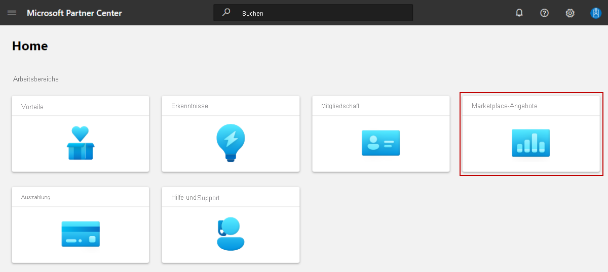

# Erstellen eines IoT Edge-Modulangebots

In diesem Artikel wird beschrieben, wie Sie ein IoT Edge-Modulangebot (IoT steht für Internet der Dinge) erstellen. Alle Angebote durchlaufen unseren Zertifizierungsprozess, der Ihre Lösung auf Standardanforderungen, Kompatibilität und korrekte Praktiken prüft.

Erstellen Sie, bevor Sie beginnen, ein Konto für den kommerziellen Marketplace in [Partner Center](./create-account.md), und stellen Sie sicher, dass es für das kommerzielle Marketplace-Programm registriert ist.

## Voraussetzungen

Lesen Sie zunächst den Artikel [Planen eines IoT Edge-Modulangebots](marketplace-iot-edge.md). Dort werden die technischen Anforderungen für dieses Angebot erläutert sowie die Informationen und Assets aufgelistet, die Sie bei der Erstellung des Angebots benötigen.

## Erstellen eines neuen Angebots

#### [Ansicht „Arbeitsbereiche“](#tab/workspaces-view)

1. Melden Sie sich bei [Partner Center](https://go.microsoft.com/fwlink/?linkid=2166002) an.

1. Wählen Sie auf der Startseite die Kachel **Marketplace offers** (Marketplace-Angebote) aus.

    

1. Klicken Sie auf der Seite „Marketplace offers“ (Marketplace-Angebote) auf **+ Neues Angebot** > **IoT Edge-Modul**.

    

> [!IMPORTANT]
> Nachdem Ihr Angebot veröffentlicht wurde, werden Änderungen, die Sie in Partner Center vornehmen, im Azure Marketplace erst angezeigt, nachdem Sie das Angebot erneut veröffentlicht haben. Achten Sie darauf, ein Angebot nach einer Änderung stets neu zu veröffentlichen.

#### [Aktuelle Ansicht](#tab/current-view)

1. Melden Sie sich bei [Partner Center](https://partner.microsoft.com/dashboard/home) an.
2. Wählen Sie im linken Navigationsmenü **Kommerzieller Marketplace** > **Übersicht** aus.
3. Wählen Sie auf der Übersichtsseite die Option **+ Neues Angebot** > **IoT Edge-Modul** aus.

    :::image type="content" source="media/iot-edge/new-offer-iot-edge.png" alt-text="Die Menüoptionen im linken Fensterbereich und die Schaltfläche „Neues Angebot“.":::

> [!IMPORTANT]
> Nachdem Ihr Angebot veröffentlicht wurde, werden Änderungen, die Sie in Partner Center vornehmen, im Azure Marketplace erst angezeigt, nachdem Sie das Angebot erneut veröffentlicht haben. Achten Sie darauf, ein Angebot nach einer Änderung stets neu zu veröffentlichen.

---

## Neues Angebot

Geben Sie eine **Angebots-ID** ein. Dies ist ein eindeutiger Bezeichner für jedes Angebot in Ihrem Konto.

- Diese ID ist in der Webadresse für das Angebot und in Azure Resource Manager-Vorlagen für Kunden sichtbar, falls zutreffend.
- Verwenden Sie nur Kleinbuchstaben und Zahlen. Die ID kann Bindestriche und Unterstriche enthalten, jedoch keine Leerzeichen, und ist auf 50 Zeichen beschränkt. Wenn die Herausgeber-ID z. B. `testpublisherid` lautet und Sie **test-offer-1** eingeben, lautet die Webadresse für das Angebot `https://appsource.microsoft.com/product/dynamics-365/testpublisherid.test-offer-1`.
<!--- The Offer ID combined with the Publisher ID must be under 50 characters in length.-->
- Nachdem Sie **Erstellen** ausgewählt haben, kann die Angebots-ID nicht mehr geändert werden.

Geben Sie einen **Angebotsalias** ein. Dies ist der Name, der für das Angebot im Partner Center verwendet wird.

- Dieser Name wird bei AppSource nicht verwendet. Er unterscheidet sich vom Angebotsnamen und anderen Werten, die Kunden präsentiert werden.
- Dieser Name kann nach der Auswahl von **Erstellen** nicht mehr geändert werden.

Wählen Sie **Erstellen** aus, um das Angebot zu generieren. In Partner Center wird die Seite **Angebotseinrichtung** geöffnet.

## Alias

Geben Sie einen beschreibenden Namen ein, mit dem ausschließlich in Partner Center auf dieses Angebot verwiesen wird. Der Angebotsalias (vorausgefüllt mit dem, was Sie beim Erstellen des Angebots eingegeben haben) wird auf dem Marktplatz nicht verwendet und unterscheidet sich von dem Angebotsnamen, der den Kunden angezeigt wird. Wenn Sie den Angebotsnamen später ändern möchten, wechseln Sie zur Seite [Angebotsliste](iot-edge-offer-listing.md).

## Kundenleads

[!INCLUDE [Connect lead management](includes/customer-leads.md)]

Weitere Informationen finden Sie unter [Kundenleads aus Ihrem Marketplace-Angebot](partner-center-portal/commercial-marketplace-get-customer-leads.md).

Wählen Sie **Entwurf speichern** aus, bevor Sie mit der nächsten Registerkarte im linken Navigationsmenü (**Eigenschaften**) fortfahren.

## Nächste Schritte

- [Konfigurieren von Angebotseigenschaften](iot-edge-properties.md)
- [Bewährte Methoden für Angebotslistung](gtm-offer-listing-best-practices.md)
