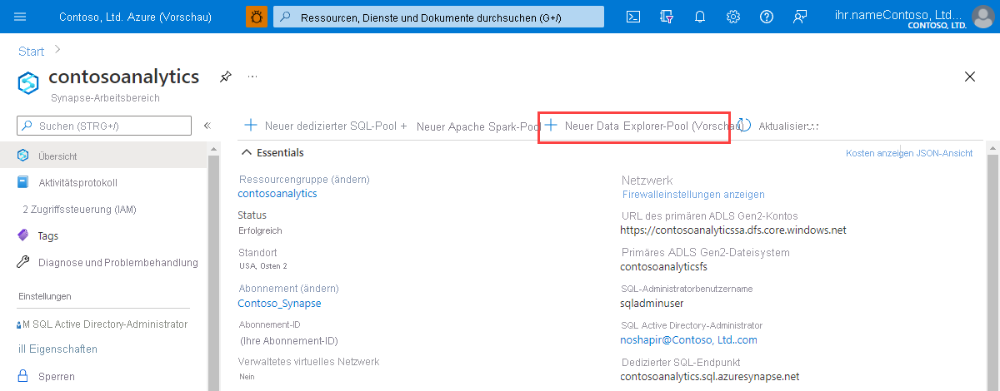
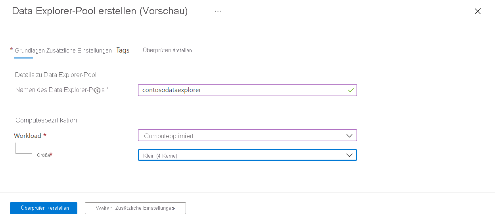
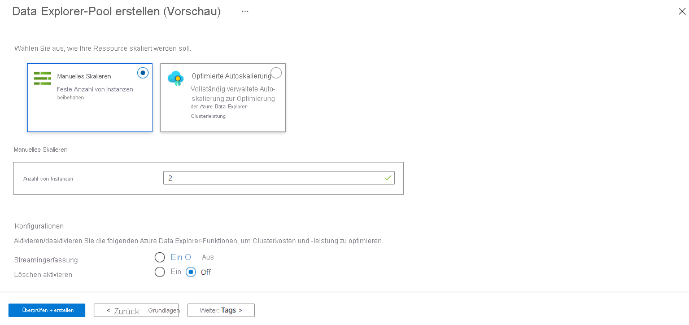

# Schnellstart: Erstellen eines Data Explorer-Pools im Azure-Portal (Vorschauversion)

Azure Synapse Data Explorer ist ein schneller, vollständig verwalteter Datenanalysedienst für die Echtzeitanalyse großer Datenmengen, die von Anwendungen, Websites, IoT-Geräten usw. gestreamt werden. Um Daten-Explorer verwenden zu können, müssen Sie zunächst einen Data Explorer-Pool erstellen.

In diesem Artikel werden die Schritte zum Erstellen eines Data Explorer-Pools in einem Synapse-Arbeitsbereich im Azure-Portal beschrieben.

> [!IMPORTANT]
> Die Abrechnung für Data Explorer-Instanzen erfolgt anteilsmäßig auf Minutenbasis und ist unabhängig von ihrer tatsächlichen Nutzung. Fahren Sie daher Ihre Data Explorer-Instanz herunter, wenn Sie sie nicht mehr benötigen, oder legen Sie ein kurzes Timeout fest. Weitere Informationen finden Sie unter **Bereinigen von Ressourcen**.

Wenn Sie kein Azure-Abonnement besitzen, können Sie ein [kostenloses Konto](https://azure.microsoft.com/free/) erstellen, bevor Sie beginnen.

## Voraussetzungen

- Azure-Abonnement – [Erstellen eines kostenlosen Kontos](https://azure.microsoft.com/free/)
- [Synapse-Arbeitsbereich](../quickstart-create-workspace.md)

## Melden Sie sich auf dem Azure-Portal an.

Melden Sie sich beim [Azure-Portal](https://portal.azure.com/)

## Navigieren zum Synapse-Arbeitsbereich

1. Navigieren Sie zum Synapse-Arbeitsbereich, in dem der Data Explorer-Pool erstellt werden soll, indem Sie den Dienstnamen (oder direkt den Ressourcennamen) in die Suchleiste eingeben.

    

1. Geben Sie in der Liste der Arbeitsbereiche den Namen (oder einen Teil des Namens) des zu öffnenden Arbeitsbereichs ein. In diesem Beispiel verwenden wir einen Arbeitsbereich namens **contosoanalytics**.

    

## Erstellen eines neuen Data Explorer-Pools

1. Wählen Sie im Synapse-Arbeitsbereich, in dem Sie den Data Explorer-Pool erstellen möchten, **Neuer Data Explorer-Pool** aus.

    

1. Geben Sie auf der Registerkarte **Grundeinstellungen** die folgenden Informationen ein:

    | Einstellung | Vorgeschlagener Wert | Beschreibung |
    |--|--|--|
    | Name des Data Explorer-Pools | contosodataexplorer | Dies ist der Name des Data Explorer-Pools. |
    | Workload | Computeoptimiert | Diese Workload bietet ein höheres CPU-zu-SSD-Speicherverhältnis. |
    | Knotengröße | Klein (4 Kerne) | Legen Sie diese Einstellung auf die kleinste Größe fest, um die Kosten für diesen Schnellstart zu senken. |

    

    > [!IMPORTANT]
    > Beachten Sie, dass für die Namen, die für Data Explorer-Pools verwendet werden können, bestimmte Einschränkungen gelten. Namen dürfen nur aus Kleinbuchstaben und Zahlen bestehen, müssen 4 bis 15 Zeichen lang sein und mit einem Buchstaben beginnen.

1. Wählen Sie **Weiter: Zusätzliche Einstellungen**. Übernehmen Sie die folgenden Einstellungen, und belassen Sie bei den übrigen Einstellungen die Standardwerte.

    | Einstellung | Vorgeschlagener Wert | BESCHREIBUNG |
    |--|--|--|
    | Skalierung | Manuelles Skalieren | Für diesen Schnellstart ist keine Autoskalierung erforderlich. |
    | Anzahl der Zahlen | 2 | Legen Sie diese Einstellung auf die kleinste Größe fest, um die Kosten für diesen Schnellstart zu senken. |

    

1. Wählen Sie **Weiter: Tags** aus. Fügen Sie keine Tags hinzu.
1. Klicken Sie auf **Überprüfen und erstellen**.
1. Überprüfen Sie die Angaben auf Richtigkeit, und wählen Sie dann **Erstellen** aus.

    Der Data Explorer-Pool startet den Bereitstellungsprozess.

    

1. Navigieren Sie nach Abschluss der Bereitstellung zurück zur Seite **Übersicht** des Arbeitsbereichs, und stellen Sie sicher, dass die Begrüßungsseite des neuen Data Explorer-Pools angezeigt wird.

    

## Bereinigen der Ressourcen des Data Explorer-Pools im Azure-Portal

Gehen Sie wie folgt vor, um den Data Explorer-Pool mithilfe des Azure-Portals aus dem Arbeitsbereich zu löschen.

> [!WARNING]
> Wenn Sie einen Data Explorer-Pool löschen, wird das Analysemodul aus dem Arbeitsbereich entfernt. Sie können keine Verbindung mehr mit dem Pool herstellen, und Abfragen, Pipelines und Notebooks, die diesen gelöschten Pool verwenden, funktionieren nicht mehr.

### Löschen des Daten-Explorer-Pools

1. Navigieren Sie im Arbeitsbereich zu den Data Explorer-Pools.
1. Um den Data Explorer-Pool (in diesem Fall **contosodataexplorer**) zu entfernen, wählen Sie **Mehr [...]**  > **Löschen** aus.

    

1. Um den Löschvorgang zu bestätigen, geben Sie den Namen des zu löschenden Pools ein, und wählen dann **Löschen** aus.

    

1. Vergewissern Sie sich nach erfolgreichem Abschluss des Vorgangs, dass der Pool nicht mehr in der Liste enthalten ist.

## Nächste Schritte

[Schnellstart: Erstellen eines Data Explorer-Pools mit Synapse Studio](data-explorer-create-pool-studio.md)
