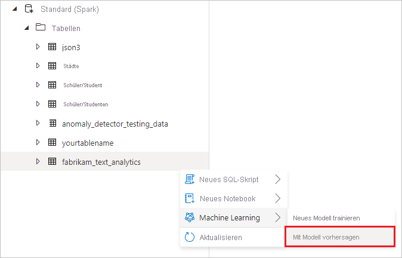
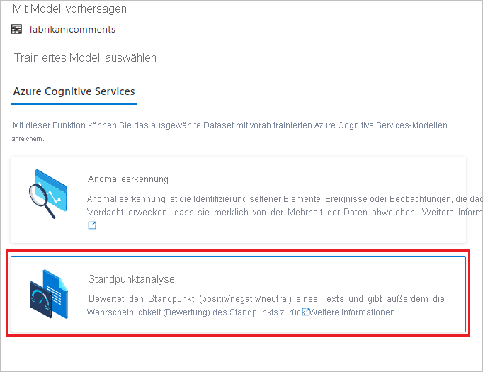

# <a name="tutorial-sentiment-analysis-with-cognitive-services"></a>Tutorial: Stimmungsanalyse mit Cognitive Services

In diesem Tutorial erfahren Sie, wie Sie Ihre Daten in Azure Synapse Analytics problemlos mit [Azure Cognitive Services](../../cognitive-services/index.yml) anreichern können. Hier werden die Funktionen der [Textanalyse](../../cognitive-services/text-analytics/index.yml) für eine Stimmungsanalyse verwendet. 

Ein Benutzer in Azure Synapse kann einfach eine Tabelle mit einer Textspalte auswählen, um sie mit Stimmungen anzureichern. Diese Stimmungen können positiv, negativ, gemischt oder neutral sein. Auch eine Wahrscheinlichkeit wird zurückgegeben.

In diesem Lernprogramm wird Folgendes behandelt:

> [!div class="checklist"]
> - Schritte zum Abrufen eines Spark-Tabellendatasets mit einer Textspalte für die Stimmungsanalyse
> - Verwenden eines Assistenten in Azure Synapse, um Daten mithilfe der Textanalyse in Cognitive Services anzureichern

Wenn Sie kein Azure-Abonnement besitzen, können Sie ein [kostenloses Konto](https://azure.microsoft.com/free/) erstellen, bevor Sie beginnen.

## <a name="prerequisites"></a>Voraussetzungen

- [Azure Synapse Analytics-Arbeitsbereich](../get-started-create-workspace.md) mit einem als Standardspeicher konfigurierten Azure Data Lake Storage Gen2-Speicherkonto. Für das hier verwendete Data Lake Storage Gen2-Dateisystem müssen Sie über die Rolle *Mitwirkender an Storage-Blobdaten* verfügen.
- Spark-Pool in Ihrem Azure Synapse Analytics-Arbeitsbereich. Ausführliche Informationen finden Sie unter [Erstellen eines Spark-Pools in Azure Synapse](../quickstart-create-sql-pool-studio.md).
- Vorkonfigurationsschritte im Tutorial [Konfigurieren von Cognitive Services in Azure Synapse](tutorial-configure-cognitive-services-synapse.md)

## <a name="sign-in-to-the-azure-portal"></a>Melden Sie sich auf dem Azure-Portal an.

Melden Sie sich beim [Azure-Portal](https://portal.azure.com/) an.

## <a name="create-a-spark-table"></a>Erstellen einer Spark-Tabelle

Für dieses Tutorial wird eine Spark-Tabelle benötigt.

1. Laden Sie die Datei [FabrikamComments.csv](https://github.com/Kaiqb/KaiqbRepo0731190208/blob/master/CognitiveServices/TextAnalytics/FabrikamComments.csv) herunter. Sie enthält ein Dataset für die Textanalyse. 

1. Laden Sie die Datei in Ihr Azure Synapse-Speicherkonto in Data Lake Storage Gen2 hoch.
  
   

1. Erstellen Sie auf der Grundlage der CSV-Datei eine Spark-Tabelle. Klicken Sie hierzu mit der rechten Maustaste auf die Datei, und wählen Sie **Neues Notebook**  > **Spark-Tabelle erstellen** aus.

   

1. Benennen Sie die Tabelle in der Codezelle, und führen Sie das Notebook in einem Spark-Pool aus. Vergessen Sie nicht, `header=True` festzulegen.

   

   ```python
   %%pyspark
   df = spark.read.load('abfss://default@azuresynapsesa.dfs.core.windows.net/data/FabrikamComments.csv', format='csv'
   ## If a header exists, uncomment the line below
   , header=True
   )
   df.write.mode("overwrite").saveAsTable("default.YourTableName")
   ```

## <a name="open-the-cognitive-services-wizard"></a>Öffnen des Cognitive Services-Assistenten

1. Klicken Sie mit der rechten Maustaste auf die im vorherigen Verfahren erstellte Spark-Tabelle. Wählen Sie **Machine Learning** > **Mit Modell vorhersagen** aus, um den Assistenten zu öffnen.

   

2. Ein Konfigurationsbereich wird angezeigt, und Sie werden aufgefordert, ein Cognitive Services-Modell auszuwählen. Wählen Sie **Gefühlsanalyse**.

   

## <a name="configure-sentiment-analysis"></a>Konfigurieren der Stimmungsanalyse

Konfigurieren Sie als Nächstes die Stimmungsanalyse. Wählen Sie die folgenden Details aus:
- **Azure Cognitive Services verknüpfter Dienst**: Als Teil der vorausgesetzten Schritte haben Sie einen verknüpften Dienst zu Ihren [Cognitive Services](tutorial-configure-cognitive-services-synapse.md) erstellt. Wählen Sie ihn hier aus.
- **Sprache:** Wählen Sie **Englisch** als Sprache des Texts aus, für den Sie eine Stimmungsanalyse durchführen möchten.
- **Textspalte**: Wählen Sie die Spalte **comment (string)** (Kommentar (Zeichenfolge)) als die Textspalte in Ihrem Dataset aus, die Sie analysieren möchten, um die Stimmung zu ermitteln.

Wenn Sie fertig sind, wählen Sie **Notebook öffnen** aus. Dadurch wird ein Notebook mit PySpark-Code generiert, der die Stimmungsanalyse mithilfe von Azure Cognitive Services durchführt.


## <a name="run-the-notebook"></a>Ausführen des Notebooks

Das soeben geöffnete Notizbuch verwendet die [MMLSpark-Bibliothek](https://github.com/microsoft/SynapseML), um eine Verbindung zu Cognitive Services herzustellen. Der mit Azure Cognitive Services verknüpfte Dienst, den Sie bereitgestellt haben, ermöglicht es Ihnen, Ihren kognitiven Dienst aus dieser Erfahrung heraus sicher zu referenzieren, ohne irgendwelche Geheimnisse preiszugeben.

 Nun können Sie alle Zellen ausführen, um Ihre Daten mit Stimmungen anzureichern. Wählen Sie **Alle ausführen** aus. 

Die Stimmungen werden als **positive** (positiv), **negative** (negativ), **neutral** (neutral) oder **mixed** (gemischt) zurückgegeben. Des Weiteren erhalten Sie Wahrscheinlichkeiten pro Stimmung. Weitere Informationen zur Stimmungsanalyse in Cognitive Services finden Sie [hier](../../cognitive-services/text-analytics/how-tos/text-analytics-how-to-sentiment-analysis.md).


## <a name="next-steps"></a>Nächste Schritte
- [Tutorial: Anomalieerkennung mit Azure Cognitive Services](tutorial-cognitive-services-anomaly.md)
- [Tutorial: Assistent für die Modellbewertung in dedizierten SQL-Pools von Azure Synapse](tutorial-sql-pool-model-scoring-wizard.md)
- [Machine Learning-Funktionen in Azure Synapse Analytics](what-is-machine-learning.md)
