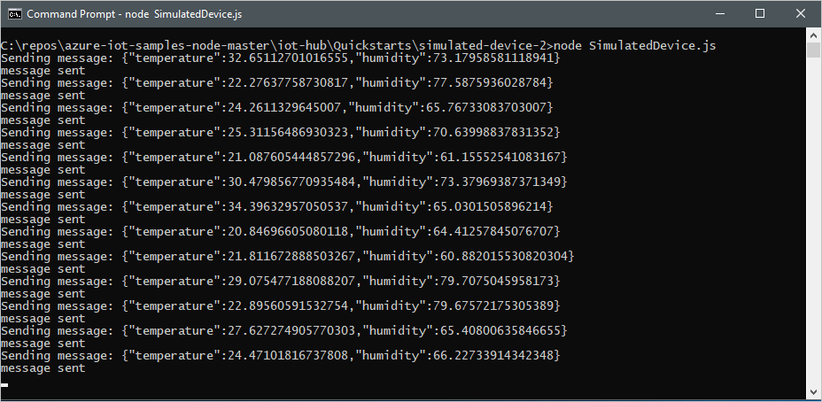
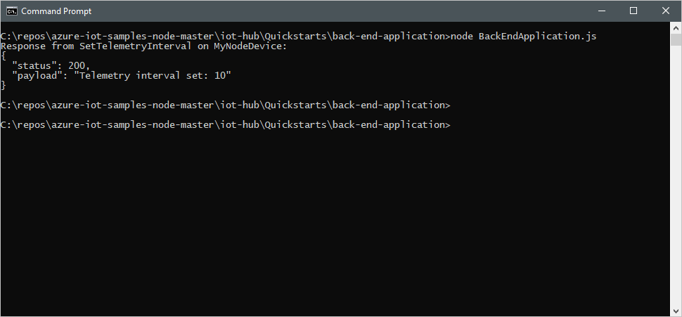
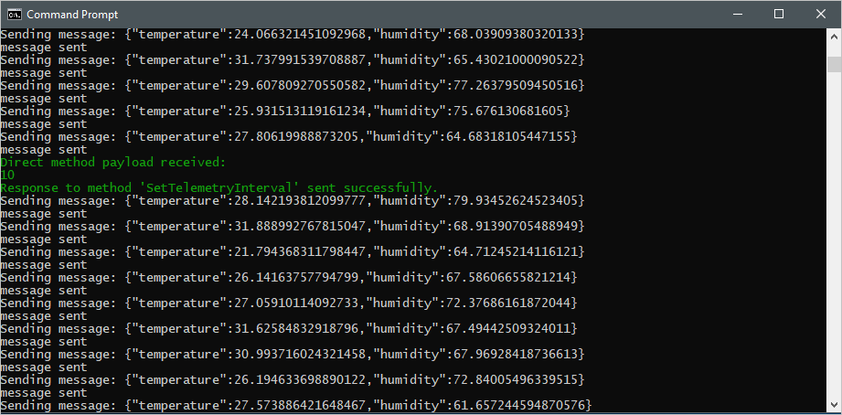

In dieser Schnellstartanleitung werden zwei Node.js-Anwendungen verwendet: eine simulierte Geräteanwendung, die auf direkte Methoden reagiert, die von einer Back-End-Anwendung aufgerufen werden, und eine Back-End-Anwendung, die die direkten Methoden auf dem simulierten Gerät aufruft.

## <a name="prerequisites"></a>Voraussetzungen

* Ein Azure-Konto mit einem aktiven Abonnement. [Erstellen Sie ein kostenloses Konto.](https://azure.microsoft.com/free/?ref=microsoft.com&utm_source=microsoft.com&utm_medium=docs&utm_campaign=visualstudio)

* [Node.js 10 oder höher](https://nodejs.org)

    Mit dem folgenden Befehl können Sie die aktuelle Node.js-Version auf Ihrem Entwicklungscomputer überprüfen:

    ```cmd/sh
    node --version
    ```

* [Ein Node.js-Beispielprojekt](https://github.com/Azure-Samples/azure-iot-samples-node/archive/master.zip)

* Der Port 8883 muss in Ihrer Firewall geöffnet sein. Für das Beispielgerät in dieser Schnellstartanleitung wird das MQTT-Protokoll verwendet, das über den Port 8883 kommuniziert. In einigen Netzwerkumgebungen von Unternehmen oder Bildungseinrichtungen ist dieser Port unter Umständen blockiert. Weitere Informationen und Problemumgehungen finden Sie unter [Herstellen einer Verbindung mit IoT Hub (MQTT)](../articles/iot-hub/iot-hub-mqtt-support.md#connecting-to-iot-hub).

[!INCLUDE [azure-cli-prepare-your-environment.md](azure-cli-prepare-your-environment-no-header.md)]

[!INCLUDE [iot-hub-cli-version-info](iot-hub-cli-version-info.md)]

## <a name="create-an-iot-hub"></a>Erstellen eines IoT-Hubs

Wenn Sie das vorherige Tutorial [Schnellstart: Senden von Telemetriedaten von einem Gerät an eine IoT Hub-Instanz](../articles/iot-develop/quickstart-send-telemetry-iot-hub.md?pivots=programming-language-nodejs) abgeschlossen haben, können Sie diesen Schritt überspringen.

[!INCLUDE [iot-hub-include-create-hub](iot-hub-include-create-hub.md)]

## <a name="register-a-device"></a>Registrieren eines Geräts

Wenn Sie das vorherige Tutorial [Schnellstart: Senden von Telemetriedaten von einem Gerät an eine IoT Hub-Instanz](../articles/iot-develop/quickstart-send-telemetry-iot-hub.md?pivots=programming-language-nodejs) abgeschlossen haben, können Sie diesen Schritt überspringen.

Ein Gerät muss bei Ihrer IoT Hub-Instanz registriert sein, um eine Verbindung herstellen zu können. In dieser Schnellstartanleitung verwenden Sie Azure Cloud Shell, um ein simuliertes Gerät zu registrieren.

1. Führen Sie in Azure Cloud Shell den folgenden Befehl aus, um die Geräteidentität zu erstellen.

   **YourIoTHubName**: Ersetzen Sie diesen Platzhalter unten durch den Namen, den Sie für Ihren IoT-Hub ausgewählt haben.

   **MyNodeDevice**: Der Name des Geräts, das Sie registrieren. Es empfiehlt sich, **MyNodeDevice** wie gezeigt zu verwenden. Wenn Sie für Ihr Gerät einen anderen Namen auswählen, müssen Sie diesen innerhalb des gesamten Artikels verwenden und den Gerätenamen in den Beispielanwendungen aktualisieren, bevor Sie sie ausführen.

    ```azurecli-interactive
    az iot hub device-identity create \
      --hub-name {YourIoTHubName} --device-id MyNodeDevice
    ```

2. Führen Sie die folgenden Befehle in Azure Cloud Shell aus, um die _Geräteverbindungszeichenfolge_ für das soeben registrierte Gerät abzurufen:

    **YourIoTHubName**: Ersetzen Sie diesen Platzhalter unten durch den Namen, den Sie für Ihren IoT-Hub ausgewählt haben.

    ```azurecli-interactive
    az iot hub device-identity connection-string show \
      --hub-name {YourIoTHubName} \
      --device-id MyNodeDevice \
      --output table
    ```

    Notieren Sie sich die Geräteverbindungszeichenfolge, die wie folgt aussieht:

   `HostName={YourIoTHubName}.azure-devices.net;DeviceId=MyNodeDevice;SharedAccessKey={YourSharedAccessKey}`

    Dieser Wert wird später in der Schnellstartanleitung benötigt.

3. Darüber hinaus benötigen Sie eine _Dienstverbindungszeichenfolge_, damit die Back-End-Anwendung eine Verbindung mit Ihrer IoT Hub-Instanz herstellen und die Nachrichten abrufen kann. Der folgende Befehl ruft die Dienstverbindungszeichenfolge für Ihre IoT Hub-Instanz ab:

    **YourIoTHubName**: Ersetzen Sie diesen Platzhalter unten durch den Namen, den Sie für Ihren IoT-Hub ausgewählt haben.

    ```azurecli-interactive
    az iot hub connection-string show \
      --policy-name service --name {YourIoTHubName} --output table

    ```

    Notieren Sie sich die Dienstverbindungszeichenfolge, die wie folgt aussieht:

   `HostName={YourIoTHubName}.azure-devices.net;SharedAccessKeyName=service;SharedAccessKey={YourSharedAccessKey}`

    Dieser Wert wird später in der Schnellstartanleitung benötigt. Die Dienstverbindungszeichenfolge unterscheidet sich von der Geräteverbindungszeichenfolge, die Sie sich im vorherigen Schritt notiert haben.

## <a name="listen-for-direct-method-calls"></a>Lauschen auf Aufrufe direkter Methoden

Die simulierte Geräteanwendung stellt eine Verbindung mit einem gerätespezifischen Endpunkt in Ihrer IoT Hub-Instanz her, sendet simulierte Telemetriedaten und lauscht auf Aufrufe direkter Methoden aus Ihrem Hub. In dieser Schnellstartanleitung weist der Aufruf einer direkten Methode aus dem Hub das Gerät an, das Intervall zu ändern, in dem es Telemetriedaten sendet. Das simulierte Gerät sendet eine Bestätigung an Ihren Hub, nachdem es die direkte Methode ausgeführt hat.

1. Navigieren Sie in einem lokalen Terminalfenster zum Stammordner des Node.js-Beispielprojekts. Navigieren Sie anschließend zum Ordner **iot-hub\Quickstarts\simulated-device-2**.

2. Öffnen Sie die Datei **SimulatedDevice.js** in einem Text-Editor Ihrer Wahl.

    Ersetzen Sie den Wert der Variablen `connectionString` durch die Geräteverbindungszeichenfolge, die Sie sich zuvor notiert haben. Speichern Sie dann die Änderungen an der Datei **SimulatedDevice.js**.

3. Führen Sie im lokalen Terminalfenster die folgenden Befehle aus, um die erforderlichen Bibliotheken zu installieren und die Anwendung zur Simulation eines Geräts auszuführen:

    ```cmd/sh
    npm install
    node SimulatedDevice.js
    ```

    Der folgende Screenshot zeigt die Ausgabe, während die Anwendung zur Simulation eines Geräts Telemetriedaten an Ihre IoT Hub-Instanz sendet:

    

## <a name="call-the-direct-method"></a>Aufrufen der direkten Methode

Die Back-End-Anwendung stellt eine Verbindung mit einem dienstseitigen Endpunkt in Ihrer IoT Hub-Instanz her. Die Anwendung sendet über Ihren IoT-Hub Aufrufe direkter Methoden an ein Gerät und lauscht auf Bestätigungen. Eine IoT Hub-Back-End-Anwendung wird in der Regel in der Cloud ausgeführt.

1. Navigieren Sie in einem weiteren lokalen Terminalfenster zum Stammordner des Node.js-Beispielprojekts. Navigieren Sie anschließend zum Ordner **iot-hub\Quickstarts\back-end-application**.

2. Öffnen Sie die Datei **BackEndApplication.js** in einem Text-Editor Ihrer Wahl.

    Ersetzen Sie den Wert der Variablen `connectionString` durch die Dienstverbindungszeichenfolge, die Sie sich zuvor notiert haben. Speichern Sie dann Ihre Änderungen an der Datei **BackEndApplication.js**.

3. Führen Sie im lokalen Terminalfenster die folgenden Befehle aus, um die erforderlichen Bibliotheken zu installieren und die Back-End-Anwendung auszuführen:

    ```cmd/sh
    npm install
    node BackEndApplication.js
    ```

    Der folgende Screenshot zeigt die Ausgabe, nachdem die Anwendung einen Aufruf einer direkten Methode an das Gerät gerichtet und eine Bestätigung empfangen hat:

    

    Nachdem Sie die Back-End-Anwendung ausgeführt haben, sehen Sie eine Nachricht im Konsolenfenster, in dem das simulierte Gerät ausgeführt wird, und die Häufigkeit, mit der das Gerät Nachrichten sendet, ändert sich:

    
